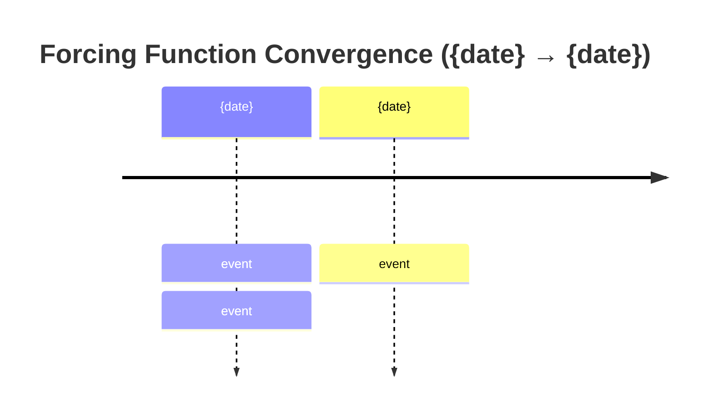

# Iran 2026 — Daily SITREP Composer

Composes the daily annex update to the base synthesis. Output is a delta document, not a rewrite.

---

## Pre-flight

Load in order before drafting. All paths are relative to the repo root.

1. **Strategic trends baseline:** read `reference/strategic-trends.md` FIRST. The trend state table
   anchors the SITREP's Central Thesis Check sub-block and disciplines every Section-3 mechanism
   revision claim against the multi-week reference baseline.
2. **Anchor:** read highest-versioned file in `synthesis/`
   (e.g. `synthesis-v4-0.md`). This is the delta target. Do not rewrite.
3. **Last annex:** read highest day-number file in `sitreps/`
   (e.g. `day-81.md`). Establishes rolling baseline.
4. **Probe sweep:** read most recent file in `probes/sweeps/`
   (e.g. `sweep-2026-05-20.json`). Primary input for sections 2-4. The sweep's
   `reference_trends` field carries trend cross-check results from the sweep step; consume those
   directly rather than re-classifying.
   If no sweep exists for current cycle, flag at top of SITREP and proceed with reduced confidence. Do not silently skip.
5. **Appendix B:** read `appendix/appendix-b-blind-spots.md`
   for section 6 probe status.
6. **Output schema:** read `probes/probe-schema.md`
   for probe-to-framework variable mapping.

After drafting, write output directly to `sitreps/day-{N}.md` using the Write tool.
Confirm write succeeded before reporting completion.

---

## Search before writing

Targeted searches for developments since the last SITREP. Cap at 8-12 total. Chase signal that moves framework variables, not comprehensiveness.

Priority sources:

- CENTCOM operational announcements
- Iranian government statements (Araghchi, Ghalibaf, Vahidi, Pezeshkian)
- Oil tape (Brent, WTI, backwardation curve)
- War Powers / congressional developments (Lawfare, Vladeck/One First for constitutional track)
- ISW, ICG/Vaez, HCR Letters from an American (daily)
- Haaretz/Harel (Israeli operational and IDF institutional signals)
- Meduza (Russian internal — BS-9 siloviki dynamics)
- Iran Wire (Iranian civil society and economic-pressure transmission — BS-1b)
- Sinocism/Bishop (Chinese policy signals — 24-48h ahead of international press)
- logicofwar.com, mind-war.com, foreignaffairs.com, foreignpolicy.com for structural framing

---

## Document structure

Output filename: `day-{N}.md`

Header block:

```
# Iran 2026 Operational SITREP — Daily Update
**Day {N} | {Weekday}, {Month} {DD}, {YYYY}**
*Annex/Update to Iran 2026 Operational SITREP and Strategic Synthesis (base report v{X.Y})*
```

---

### Executive Summary

Written last, placed first. New format (DELTASITREP-2026-05): one tight lede paragraph plus a **Cycle at a Glance** table plus a one-line cumulative-escalation read. No multi-paragraph framing. No background. No restating the base framework. A reader dark for 24 hours should know exactly where things stand after this block.

**Lede paragraph.** 4-6 sentences max. Covers the cycle's defining finding and ends with the supersede line on a new line:

```
Supersedes `day-{N-2}` · {top-2-or-3 vectors with direction, e.g. Decapitation ↑ · Fork A ↑ · Fork B ↓}
```

**Cycle at a Glance table.** Mandatory. Placed immediately after the supersede line. Schema:

```
| Vector | Direction | Driver |
```

Rows: 6-10. One row per dimension that moved this cycle. Direction column uses `NEW`, `↑`, `↓`, `HELD`, `stable`, or specific numeric ranges (e.g. `18-25% → 10-18%`). Driver column ≤ 12 words.

**Leading-primitive read.** One line immediately after the table. Carries the two highest-probability primitives by direction (escalation-leading and non-escalation-leading), not a composite. Format:

> Leading primitives: Fork A {X-Y% / 30d}, Fork D' {X-Y% / 30d}. Highest-delta this cycle: {fork name} {direction}. None-of-above floor: {Z%}.

The Kinetic Escalation Composite is no longer reported in the Executive Summary (added 2026-05-22 via /premortem; composite was becoming the analytical object and obscuring primitive movement). The composite is computed in Section 5 as a footnote line for continuity with prior SITREPs.

No prose section between the leading-primitive read and Section 1.

---

### Section 1 — Operational Update

Developments since the last SITREP. **Bold-lead bullet pattern only.** No `##` or `###` subsection headers inside Section 1. Each domain item opens with a single bold sentence stating the finding, ending in a period (not a colon); 2-4 short sentences follow. Domain order preserved:

- **Diplomatic track** — proposals, rejections, mediator activity
- **Trump posture** — statements, framing, principal-access signal
- **Maritime / Military / CENTCOM** — vessel counts, ROE changes, carrier posture
- **Iranian internal** — Vahidi/Mojtaba/Ghalibaf signals, rial, inflation
- **Israel** — IDF, Knesset, religious-bloc, operational tempo
- **Lebanon / proxy fronts** — Hezbollah, Houthi posture (if active this cycle)
- **Cyber** — CISA advisories, stage progression, attribution (if active this cycle)
- **Markets** — Brent, WTI, S&P, VIX, gold, 10Y, gas price. Table format (existing schema, unchanged).
- **US domestic** — polling, War Powers, congressional, supplemental
- **International** — Russia, China, Gulf, European coalition

Factual, source-attributed. No editorializing. Flag confidence (H/M/L) for contested claims. Distinguish tape action from statement.

**Maritime / Military posture table required.** Schema:

```
| Asset / signal | Day {N-2} baseline | Day {N} read | Implication |
```

Rows as needed (carriers, ROE, missile sites, launcher posture, proxy connectivity, C2 state, IDF readiness, etc.). The table is the section; the surrounding prose contextualizes contested or bivalent readings only.

**Markets table** keeps the existing schema unchanged.

---

### Mandatory Visualizations (apply across sections)

Three mermaid chart classes. Generate each when the underlying condition is present; omit when not. If a chart would be empty or single-node, omit it. Quality over completeness. Use ` ```mermaid ` fence (not bare ` ``` `) so Hugo renders correctly.

**Chart A — Forcing functions timeline.** Generate when at least two distinct forcing functions are operative in a ≤ 30-day window. Place after Operational Update, before Section 2 (Framework Validation). Format:



**Chart B — Entry mechanism / pathway flowchart.** Generate when Section 3 (Revisions) or Section 4 (Additions) introduces a new structural pathway, mechanism, or actor. Place inside the relevant section. Use `flowchart TD`. Show: parent concept → child mechanisms → constraints / properties → cluster signals. Use dotted arrows (`-.->`) for "dominant under joint constraints" or "drives" relationships. Do not use these arrows to attribute selection to the substrate; they connect signals to dominance reads, not architectures to outcomes.

**Chart C — Forking decision tree.** Always generate in Section 7 (Conclusion). Place between "Central Thesis Check" and "Operative Judgment" sub-blocks. Use `flowchart TD` with `{Question}` nodes (curly braces) for decision points and `[Outcome]` nodes for terminal states. Include probabilities on terminal nodes. Forks should name the actor whose selection is contingent at each branch.

---

### Compression target

Output word count: target 2,000-2,800 words. Hard ceiling 3,200. Compression is achieved by:

- Replacing prose enumeration with tables (decapitation properties, lock-in stack, military posture, decap properties all become tables).
- Single-paragraph bold-lead findings instead of three-paragraph elaborations.
- Removing analytical restatement that already appears in the anchor synthesis.
- Pulling structural arguments into mermaid where the structure is the argument.

Where prose still earns its place: Central Thesis Check, Operative Judgment, downside-risk enumeration when not naturally tabular. The compression range is a ceiling, not a floor; a low-signal cycle can produce a shorter annex.

---

### Tables required where applicable

| Section | Table required when |
|---|---|
| Executive Summary (lede) | Always (Cycle at a Glance) |
| Section 1 — Maritime / Military | Always (posture table) |
| Section 1 — Markets | Always (existing schema) |
| Section 4 — Framework Additions | When new mechanism has ≥ 4 enumerable properties |
| Section 4 — Framework Additions | When lock-in stack updated this cycle |
| Section 5 — Probability Matrix | Always (existing delta schema) |

Tables start at 3+ rows. A 2-row "table" is a sentence with bad formatting.

---

### Section 2 — Framework Validation

Which assumptions held this cycle. Format:

- **A{N} ({assumption name}):** one sentence on what validated it. Cite specific event.

Only list assumptions with confirming evidence this cycle. Do not re-list stable assumptions with no new signal.

---

### Section 3 — Framework Revisions Required

Where data forced changes. For each revision:

- Prior assumption/probability
- What data broke it
- Revised position
- **Trend cross-check (MANDATORY):** name which trend in `reference/strategic-trends.md` the
  revision aligns with or contradicts. If a proposed mechanism revision contradicts a VALIDATED
  trend on single-cycle evidence alone, downgrade to "FLAG (NEXT AUDIT)" pending multi-cycle
  confirmation; do not flag as TRIGGER FIRED. The Day 77 BS-12 apex-veto over-read against T3 is
  the canonical failure case; this rule blocks recurrence.

If the probe trigger digest contains immediate-urgency items, they go here, flagged **TRIGGER FIRED** with probe source. The sweep step 7 will have already classified each trigger against the trend table; carry that classification forward.

If nothing requires revision, state so explicitly. Do not invent revisions.

---

### Section 4 — Framework Additions

New dynamics not in the base synthesis or prior annexes. Threshold: structural (repeating mechanism, new actor, new constraint layer), not one-off events. One-off events belong in Section 1.

If nothing new meets the threshold, omit this section.

---

### Section 5 — Revised Probability Matrix

Two matrices, separately maintained on different cadences. The discipline is added 2026-05-22 via /premortem to prevent long-horizon drift via cycle-level updating.

**5a. 30-day matrix (cycle-Bayesian; updates every SITREP).** Table format. Include only rows where probability moved this cycle or where a new outcome was added. Always include a delta column.

```
| Outcome | 30 days | vs. last SITREP | Driver |
|---------|---------|-----------------|--------|
| ...     | X-Y%    | up/down/stable  | one line |
```

**5b. 6/12-month matrix (structural-prior-driven; updates only on trend-state transitions or constraint-layer shifts).** Do NOT update on operational events. Reprint the most recent values unchanged with a footnote stating the date of last structural update. Update conditions: (a) any trend in `reference/strategic-trends.md` transitions state; (b) any L1-L5 constraint mechanism shifts; (c) any synthesis major-version increment.

```
| Outcome | 6 months | 12 months | Last updated | Driver |
|---------|----------|-----------|--------------|--------|
| ...     | X-Y%     | X-Y%      | YYYY-MM-DD   | one line |
```

**Range-width discipline.** Probability ranges in either matrix are hard-capped at 15 percentage points width (e.g., 20-35%, not 18-40%). A range wider than 15pp is either undecomposed (the fork contains multiple distinguishable sub-outcomes that should each carry their own range) or a hedge. Either tighten the range or split the row. The widening-as-epistemic-humility anti-pattern is not permitted.

**"None of the above" row.** Every probability matrix carries a mandatory row labeled "None of the above (unmodeled outcome space)" with a non-zero floor (5-10% on 30-day; 10-15% on 6/12-month). The framework's named forks do not span the outcome space; this row enforces acknowledgment of the gap.

**Fork D' decomposition rule.** If Fork D' (structured deferral / gray zone) exceeds 30% on the 30-day matrix sustained over 4+ cycles, decompose at the next SITREP. "Deferral" is not a primitive at that probability mass; the question is "deferred how, by whom, for how long, with what mechanism." Each named variant gets its own row with its own range. The fork retires as an analytical primitive when decomposed; it remains as a category label only.

**Composite reporting.** If a primitive (Fork A, Fork C, or any conflict-leading tail component) moved this cycle, recompute the Kinetic Escalation Composite. **The composite no longer leads the Executive Summary.** It is reported as a footnote line at the end of Section 5, prefixed `[DERIVED]`, with the construction formula. Primitives lead; composites trail. Do not aggregate Fork D' into the composite; the framework's most operative distinction is preserved by exclusion.

---

### Section 6 — Probe Status Table

Pull directly from probe sweep output, formatted per `probes/probe-schema.md` sweep summary table. If probes were not run, insert: `*Probe sweep not executed this cycle — see pre-flight note.*`

---

### Section 7 — Conclusion and Forking Analysis

Four H3 sub-blocks, in fixed order:

```
### Central Thesis Check
### Forking Tree (72-Hour Decision Path)
### Operative Judgment
### Signals That Force Immediate Revision
```

- **Central Thesis Check.** One short paragraph on whether the v4.0 central thesis (materialist bargaining model: layered constraints conditioning principals' decision sets; Bayesian updates over signal clusters tightening priors on dominant strategies) is holding, holding with structural elaboration, drifting, or breaking. Constrained-agent voice only. **MANDATORY trend-state lines:** name which trends in `reference/strategic-trends.md` this cycle advanced, held, contradicted, or closed-as-pending-gap. If no trend moved, state so explicitly. Cite trend by ID (T1-T7) and direction; the sweep's `reference_trends` field carries the per-trigger classifications and aggregates to the SITREP-level summary here.
- **Forking Tree (72-Hour Decision Path).** The mermaid Chart C. Decision-point nodes use `{Question}`; terminal-outcome nodes use `[Outcome]` with probabilities. Each fork names the actor whose selection is contingent.
- **Operative Judgment.** Prose. 2-4 paragraphs. This is where prose earns its place; do not compress it to bullets. Single most important thing the framework reads about the next 48-72 hours: which signal clusters tightened or loosened which priors, and which option moved from sub-dominant to dominant for which named actor under which joint constraints.
- **Signals That Force Immediate Revision.** Bulleted list, terminal. 5-10 named signals (specific events, not categories) that would force the next SITREP to materially revise the matrix.

Footer: `*Compiled {date} | Day {N} | Subject to revision as data updates*`

---

## Tone and style discipline

- Factual, terse, no hedging filler.
- Discount Trump statements to near-zero unless corroborated. Note explicitly when relevant.
- Distinguish tape action from statement in market references.
- When sources conflict, name both sides and adjudicate. Do not average.
- No section longer than it needs to be. Compress or omit empty sections.
- **No em-dashes.** No `—` character anywhere in output. Use comma, semicolon, colon, or sentence break.
- Bold-lead findings open paragraphs in Sections 1-4. Lead sentence ends with a period before continuation, not a colon.
- Mermaid code blocks use ` ```mermaid ` fence (not bare ` ``` `) so Hugo renders correctly.
- Direction arrows in tables: use `↑ ↓ → ←` literals, not ASCII (`->`).
- En-dash (`–`) only inside probability ranges (`28–38%`) and date ranges (`May 24–29`).

### Methodological discipline (from DELTASITREP, 2026-05)

**This is a correction, not a refinement.** Prior outputs drifted into teleological framing where the constraint architecture itself becomes the subject of choice verbs. This is psychohistory voice and it falsifies the model. The framework is a materialist substrate that imposes constraints and weights decision pathways via Bayesian priors in a game-theoretic setting. Agents under the framework remain choosers. The framework predicts the relative ranking of options under the constraint surface; it does not predict selection. Selection remains an event.

**Forbidden constructions (substrate-as-agent / psychohistory voice):**

- "The architecture selected / composed / innovated / closed / opened / chose..."
- "The constraint set composed / produced / engineered..."
- "No principal chose this; X did it instead..."
- "The framework constructs / builds / resolves..."
- "The architecture is composing toward..."
- "What the architecture selected as resolution mechanism..."
- Any verb of intention or agency whose subject is the substrate, the architecture, the constraint set, the framework, or the system.

**Required constructions (constrained-agent / game-theoretic voice):**

- "Under constraint X, the relative cost-benefit of pathway Y improves against Z..."
- "Constraints compress the principal choice set; principals select within it..."
- "Pathway Y becomes the dominant strategy under joint constraints (A, B, C); selection by {actor} remains contingent..."
- "The framework predicts the ranking of options under the constraint surface; it does not predict selection."
- "Option Y moves from sub-dominant to dominant when constraint Z binds..."
- "Signal cluster X tightens the prior that selection of Y is being weighted..."

**Distinguishing valid from invalid uses of "architecture":**

- Valid (noun, describing a structure): "the alliance architecture," "the principal-access architecture," "the constraint architecture is reinforced."
- Invalid (subject of intention verb): "the architecture selected," "the architecture composes," "the architecture innovates exits."

**Valid epistemic verbs whose subject is the framework:** `reads`, `predicts`, `ranks`, `weights`, `names`, `maps`. Never choice verbs.

**Invalid:** "The framework reads as the architecture composing..." (smuggles agency back into the substrate via the indirect clause).

When in doubt: can the sentence be rewritten with the agent (Trump executive, Vahidi, Netanyahu, IDF leadership) as the subject and the constraint as the modifier? If yes, that rewrite is required. The framework names the choice set and its weights; the actor selects.

---

## Anti-patterns

- Do not rewrite the base synthesis. Annex equals delta.
- Do not pad Sections 2-4 by repeating Section 1 data.
- Do not produce probability point estimates. Ranges only.
- Do not let Section 7 become a news summary. It is forward-looking judgment.
- Do not omit Section 3 because revisions are uncomfortable. If data broke an assumption, say so.
- Do not synthesize new probe findings inside the composer. The composer consumes probe output; it does not re-run probes.
- Do not report the Kinetic Escalation Composite without the underlying primitives. The composite is derived; primitives drive analysis.
- Do not aggregate Fork D' into the composite. Fork D' is the deferred-kinetic / gray-zone path; aggregating it collapses the framework's most operative distinction.
- **Do not update the 6/12-month matrix on operational events.** The long-horizon matrix updates only on trend-state transitions, constraint-layer shifts, or synthesis major-version increments. Cycle-Bayesian updating produces sharp short-horizon estimates and miscalibrated long-horizon ones. Daily SITREPs touch 5a only.
- **Do not let probability ranges exceed 15pp width.** Wider ranges are either undecomposed (split the row) or hedge (tighten with justification). Widening as epistemic humility is not permitted.
- **Do not omit the "None of the above" row.** The named forks do not span the outcome space; the row enforces acknowledgment of the gap with a non-zero floor.
- **Do not lead the Executive Summary with the Kinetic Escalation Composite.** The composite is a Section-5 footnote, not a headline. Primitives lead.

### Methodological discipline (from DELTASITREP, 2026-05)

1. Do not generate mermaid for decoration. A chart that only restates a sentence is noise.
2. Do not over-table. If a finding has 2 properties, write a sentence. Tables start at 3+ rows.
3. Do not move analytical depth into bullets. Operative Judgment stays prose.
4. Do not break the seven-section skeleton (Exec → Op → Validation → Revisions → Additions → Probability → Conclusion; Probe Status is integrated where probes ran). Format changes inside sections; section count is fixed.
5. Do not import the redrafted format wholesale on a low-signal day. If the cycle has minimal movement, the annex can be shorter than 2,000 words. The compression range is a ceiling, not a floor.
6. **Do not make the substrate the subject of a choice verb.** The architecture does not select, compose, innovate, close paths, or open them. Actors do, under constraints the framework maps. Falling into this voice is the single highest-priority failure mode in this directive; it falsifies the methodological frame.
7. **Do not predict selection.** The framework ranks options under the constraint surface and identifies dominant strategies. It does not say "X will be selected." It says "Y becomes the dominant strategy under joint constraints (A, B, C); selection by {actor} remains contingent and tightens / loosens conditional on signal cluster Z."
8. **Do not use "convergence" or "cluster" as causal verbs.** Signal clusters tighten priors. They do not cause outcomes. The grammar of probabilistic updating, not the grammar of teleology, governs.
