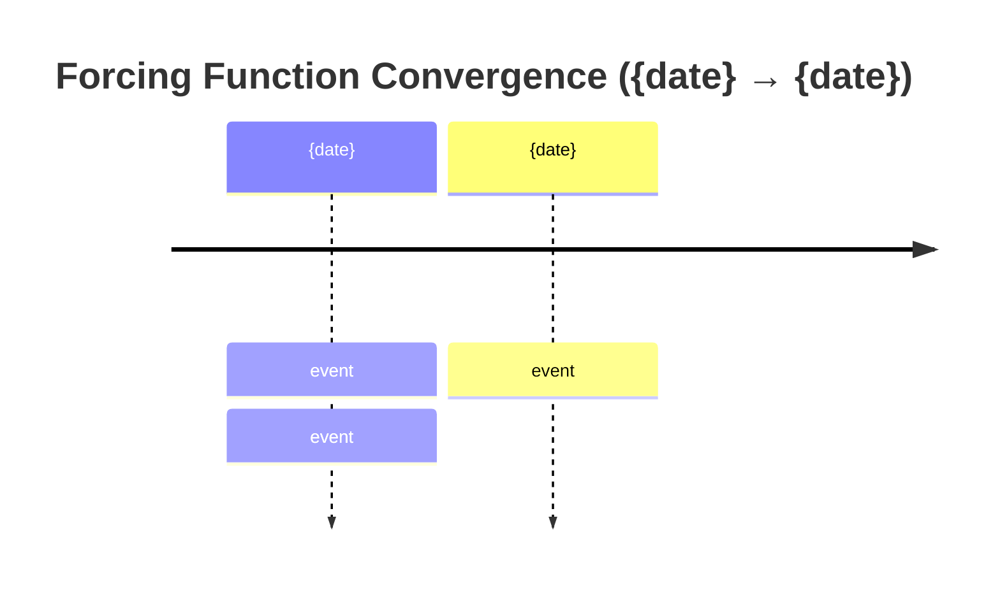

# Iran 2026 — Daily SITREP Composer

Composes the daily annex update to the base synthesis. Output is a delta document, not a rewrite.

---

## Pre-flight

Load in order before drafting. All paths are relative to the repo root.

1. **Strategic trends baseline:** read `reference/strategic-trends.md` FIRST. Read the summary
   table in full; read in full only the trend entries changed since the last SITREP
   (`git diff <last-sitrep-commit>..HEAD -- reference/strategic-trends.md`). Weekly full-read
   floor per CLAUDE.md. The trend state table anchors the SITREP's Central Thesis Check sub-block
   and disciplines every Section-3 mechanism revision claim against the multi-week reference baseline.
2. **Anchor:** read highest-versioned file in `synthesis/`
   (e.g. `synthesis-v4-0.md`). This is the delta target. Do not rewrite. Full re-read on version
   change; otherwise the probability-matrix and assumption-register sections suffice (weekly
   full-read floor).
3. **Last annex:** read highest day-number file in `sitreps/`
   (e.g. `day-81.md`). Establishes rolling baseline.
4. **Probe sweep:** read most recent file in `probes/sweeps/`
   (e.g. `sweep-2026-05-20.json`). Primary input for sections 2-4. The sweep's
   `reference_trends` field carries trend cross-check results from the sweep step; consume those
   directly rather than re-classifying.
   If no sweep exists for current cycle, flag at top of SITREP and proceed with reduced confidence. Do not silently skip.
5. **Appendix B:** consult `appendix/appendix-b-blind-spots.md` only for the entries the day's
   sweep flagged (fired/partial probes; any BS named in the trigger digest). Section 6 pulls from
   the sweep JSON; a full Appendix B read is not required (weekly full-read floor).
6. **Output schema:** read `probes/probe-schema.md`
   for probe-to-framework variable mapping.
7. **Prediction ledger:** read `calibration/prediction-ledger.md` Open-predictions and
   Fork-snapshots tables. Note every row due or overdue by this SITREP's date; these resolve in
   Section 2 (see Prediction Resolution).

After drafting, write output directly to `sitreps/day-{N}.md` using the Write tool.
Confirm write succeeded before reporting completion.

**Post-write ledger upkeep (mandatory).** After the SITREP is written: (a) append this SITREP's
Section-7 signals to the ledger as new rows (or advance `carried-to` on verbatim re-listings);
(b) record the resolutions made in Section 2 in the Resolved log; (c) update the Scorecard counts;
(d) on the first SITREP of a calendar month or a synthesis version increment, log the 30-day
matrix as a fork snapshot with its expiry date, and score any snapshot whose expiry has passed.
The ledger commit rides with the SITREP commit.

---

## Search before writing

Targeted searches for developments since the last SITREP. Cap at 8-12 total. Chase signal that moves framework variables, not comprehensiveness.

**Sweep dedup.** When a sweep ran this cycle, do not re-search probe target signals; consume the
finding cards. New searches cover (a) developments after the sweep's timestamp and (b) domains the
sweep does not carry (markets tape, polling, HCR/structural framing). A same-cycle sweep typically
cuts the search budget to the low end of the cap.

Priority sources:

- CENTCOM operational announcements
- Iranian government statements (Araghchi, Ghalibaf, Vahidi, Pezeshkian)
- Oil tape (Brent, WTI, backwardation curve)
- War Powers / congressional developments (Lawfare, Vladeck/One First for constitutional track)
- ISW, ICG/Vaez, HCR Letters from an American (daily)
- Haaretz/Harel (Israeli operational and IDF institutional signals)
- Meduza (Russian internal — BS-9 siloviki dynamics)
- Iran Wire (Iranian civil society and economic-pressure transmission — BS-1b)
- Sinocism/Bishop (Chinese policy signals — 24-48h ahead of international press)
- logicofwar.com, mind-war.com, foreignaffairs.com, foreignpolicy.com for structural framing

---

## Document structure

Output filename: `day-{N}.md`

Header block:

```
# Iran 2026 Operational SITREP — Daily Update
**Day {N} | {Weekday}, {Month} {DD}, {YYYY}**
*Annex/Update to Iran 2026 Operational SITREP and Strategic Synthesis (base report v{X.Y})*
```

---

### Executive Summary

Written last, placed first. New format (DELTASITREP-2026-05): one tight lede paragraph plus a **Cycle at a Glance** table plus a one-line cumulative-escalation read. No multi-paragraph framing. No background. No restating the base framework. A reader dark for 24 hours should know exactly where things stand after this block.

**Lede paragraph.** 4-6 sentences max. Covers the cycle's defining finding and ends with the supersede line on a new line:

```
Supersedes `day-{N-2}` · {top-2-or-3 vectors with direction, e.g. Decapitation ↑ · Fork A ↑ · Fork B ↓}
```

**Cycle at a Glance table.** Mandatory. Placed immediately after the supersede line. Schema:

```
| Vector | Direction | Driver |
```

Rows: 6-10. One row per dimension that moved this cycle. Direction column uses `NEW`, `↑`, `↓`, `HELD`, `stable`, or specific numeric ranges (e.g. `18-25% → 10-18%`). Driver column ≤ 12 words.

**Leading-primitive read.** One line immediately after the table. Carries the two highest-probability primitives by direction (escalation-leading and non-escalation-leading), not a composite. Format:

> Leading primitives: Fork A {X-Y% / 30d}, Fork D' {X-Y% / 30d}. Highest-delta this cycle: {fork name} {direction}. None-of-above floor: {Z%}.

The Kinetic Escalation Composite is no longer reported in the Executive Summary (added 2026-05-22 via /premortem; composite was becoming the analytical object and obscuring primitive movement). The composite is computed in Section 5 as a footnote line for continuity with prior SITREPs.

No prose section between the leading-primitive read and Section 1.

---

### Section 1 — Operational Update

Developments since the last SITREP. **Bold-lead bullet pattern only.** No `##` or `###` subsection headers inside Section 1. Each domain item opens with a single bold sentence stating the finding, ending in a period (not a colon); 2-4 short sentences follow. Domain order preserved:

- **Diplomatic track** — proposals, rejections, mediator activity
- **Trump posture** — statements, framing, principal-access signal
- **Maritime / Military / CENTCOM** — vessel counts, ROE changes, carrier posture
- **Iranian internal** — Vahidi/Mojtaba/Ghalibaf signals, rial, inflation
- **Israel** — IDF, Knesset, religious-bloc, operational tempo
- **Lebanon / proxy fronts** — Hezbollah, Houthi posture (if active this cycle)
- **Cyber** — CISA advisories, stage progression, attribution (if active this cycle)
- **Markets** — Brent, WTI, S&P, VIX, gold, 10Y, gas price. Table format (existing schema, unchanged).
- **US domestic** — polling, War Powers, congressional, supplemental
- **International** — Russia, China, Gulf, European coalition

Factual, source-attributed. No editorializing. Flag confidence (H/M/L) for contested claims. Distinguish tape action from statement.

**Maritime / Military posture table required.** Schema:

```
| Asset / signal | Day {N-2} baseline | Day {N} read | Implication |
```

Rows as needed (carriers, ROE, missile sites, launcher posture, proxy connectivity, C2 state, IDF readiness, etc.). The table is the section; the surrounding prose contextualizes contested or bivalent readings only.

**Markets table** keeps the existing schema unchanged.

---

### Mandatory Visualizations (apply across sections)

Three mermaid chart classes. Generate each when the underlying condition is present; omit when not. If a chart would be empty or single-node, omit it. Quality over completeness. Use ` ```mermaid ` fence (not bare ` ``` `) so Hugo renders correctly.

**Chart A — Forcing functions timeline.** Generate when at least two distinct forcing functions are operative in a ≤ 30-day window. Place after Operational Update, before Section 2 (Framework Validation). Format:



**Chart B — Entry mechanism / pathway flowchart.** Generate when Section 3 (Revisions) or Section 4 (Additions) introduces a new structural pathway, mechanism, or actor. Place inside the relevant section. Use `flowchart TD`. Show: parent concept → child mechanisms → constraints / properties → cluster signals. Use dotted arrows (`-.->`) for "dominant under joint constraints" or "drives" relationships. Do not use these arrows to attribute selection to the substrate; they connect signals to dominance reads, not architectures to outcomes.

**Chart C — Forking decision tree.** Always generate in Section 7 (Conclusion). Place between "Central Thesis Check" and "Operative Judgment" sub-blocks. Use `flowchart TD` with `{Question}` nodes (curly braces) for decision points and `[Outcome]` nodes for terminal states. Include probabilities on terminal nodes. Forks should name the actor whose selection is contingent at each branch.

---

### Compression target

Output word count: target 2,000-2,800 words. Hard ceiling 3,200. Compression is achieved by:

- Replacing prose enumeration with tables (decapitation properties, lock-in stack, military posture, decap properties all become tables).
- Single-paragraph bold-lead findings instead of three-paragraph elaborations.
- Removing analytical restatement that already appears in the anchor synthesis.
- Pulling structural arguments into mermaid where the structure is the argument.

Where prose still earns its place: Central Thesis Check, Operative Judgment, downside-risk enumeration when not naturally tabular. The compression range is a ceiling, not a floor; a low-signal cycle can produce a shorter annex.

---

### Tables required where applicable

| Section | Table required when |
|---|---|
| Executive Summary (lede) | Always (Cycle at a Glance) |
| Section 1 — Maritime / Military | Always (posture table) |
| Section 1 — Markets | Always (existing schema) |
| Section 4 — Framework Additions | When new mechanism has ≥ 4 enumerable properties |
| Section 4 — Framework Additions | When lock-in stack updated this cycle |
| Section 5 — Probability Matrix | Always (existing delta schema) |

Tables start at 3+ rows. A 2-row "table" is a sentence with bad formatting.

---

### Section 2 — Framework Validation

Which assumptions held this cycle. Format:

- **A{N} ({assumption name}):** one sentence on what validated it. Cite specific event.

Only list assumptions with confirming evidence this cycle. Do not re-list stable assumptions with no new signal.

**Prediction Resolution (mandatory sub-block; closes Section 2).** Resolve every ledger row due or
overdue by this SITREP's date, one line per row:

```
- {ID} {claim, compressed}: {fired | fired-partial | did-not-fire | expired-unresolved | superseded}. {one-clause evidence}. Matrix-followed: {y | partial | n | n.a.}
```

Rules:

- **Fired rows.** State whether the pre-committed move is applied in Section 5 this cycle. Holding
  a pre-committed move is permitted only with explicit justification here (the T9 House-passage
  hold, Day 97, is the canonical correct override). Silent non-application is a discipline breach.
- **Misses route forward.** A did-not-fire on a window the framework weighted heavily, and every
  surprise (a material Section-3 revision driven by an event no prior watchlist carried), gets one
  line stating what the watchlist lacked. Surprises also append to the ledger's Surprise register.
- **Expired-unresolved** rows are instrumentation failures, not non-events; flag for the audit gap
  log. Second consecutive expiry on the same signal escalates to `/audit` source-ladder review.
- If no rows are due, state so in one line. Do not skip the sub-block.

---

### Section 3 — Framework Revisions Required

Where data forced changes. For each revision:

- Prior assumption/probability
- What data broke it
- Revised position
- **Trend cross-check (MANDATORY):** name which trend in `reference/strategic-trends.md` the
  revision aligns with or contradicts. If a proposed mechanism revision contradicts a VALIDATED
  trend on single-cycle evidence alone, downgrade to "FLAG (NEXT AUDIT)" pending multi-cycle
  confirmation; do not flag as TRIGGER FIRED. The Day 77 BS-12 apex-veto over-read against T3 is
  the canonical failure case; this rule blocks recurrence.

If the probe trigger digest contains immediate-urgency items, they go here, flagged **TRIGGER FIRED** with probe source. The sweep step 7 will have already classified each trigger against the trend table; carry that classification forward.

If nothing requires revision, state so explicitly. Do not invent revisions.

---

### Section 4 — Framework Additions

New dynamics not in the base synthesis or prior annexes. Threshold: structural (repeating mechanism, new actor, new constraint layer), not one-off events. One-off events belong in Section 1.

If nothing new meets the threshold, omit this section.

---

### Section 5 — Revised Probability Matrix

Two matrices, separate cadences (v4.2 split).

**5a. 30-day matrix (cycle-Bayesian; every SITREP).** Deltas only — rows that moved this cycle or new outcomes.

```
| Outcome | 30 days | vs. last SITREP | Driver |
```

**5b. 6/12-month matrix (structural-prior; updates only on trend-state transitions, L1-L5 constraint shifts, or major-version increments — never on operational events).** Reprint unchanged with last-updated date.

```
| Outcome | 6 months | 12 months | Last updated | Driver |
```

**Rules:**
- **15pp range cap.** Wider = undecompose (split row) or hedge (tighten). No widening as epistemic humility.
- **Range-width justification.** When a fork's range width changes vs. the prior cycle (not just its
  level), the Driver column states why in one clause (evidence density rose/fell, decomposition,
  source-cluster resolution). Width changes without a stated driver are hedging.
- **Overlap forces a re-cut, not width (added 2026-06-11 via /premortem; Day 105 Mitigation 2).**
  When two primitives are declared partially overlapping or their boundary "less resolvable" this
  cycle (e.g., a Fork A/Fork C convergence as the self-defense-vs-resumed-operations discriminator
  degrades), the cycle must NOT widen one primitive toward the other. A declared overlap is an
  undecomposed boundary: either (a) re-cut the forks at the new operational reality, or (b) report a
  named joint cell ("Fork A/C convergence, X-Y%") alongside the two primitives. Mirror the PROBE-7
  two-axis nominal/operational register in the matrix: when the operational axis says one fork and
  the nominal axis says another, that is a convergence cell, not range width on either fork.
  Absorbing an overlap as width is the width-as-hedge failure the 15pp cap exists to prevent.
  Canonical case: Day 105 Fork C widened to 12pp citing "Fork A/C boundary less resolvable"; under
  this rule that cycle reports a convergence cell instead.
- **Primitive oscillation forces a standing floor (added 2026-06-29 via /premortem; Day 123 Failure 1).**
  The multi-cycle-confirmation, symmetric-demotion, disc-ratio, and reading-swing rules discipline the
  *trend* layer against recency bias; they have no analog at the *probability-primitive* layer, where
  the SITREP re-cuts the 30d matrix every cycle by mandate. When a primitive's level reverses direction
  on 3+ of the last 5 cycles **without a structural driver** (a constraint-layer L1-L5 shift or a trend
  state transition), the cycle must NOT re-zero or re-spike it on the latest operational headline.
  Instead, state and hold a **standing floor** for that primitive, the persistent-live-surface base
  rate; single-cycle events move the band *within* the floor, not through it. Log the oscillation in
  the SITREP Section-3 trend cross-check and route it to /audit and /premortem (the trend-layer
  reading-swing counter's fork-layer twin). Canonical case: the BS-7/BS-11 Fork C sub-read oscillated
  four cycles (D110 settled -> D115 re-arm 16-26 -> D119 de-arm 14-22 -> D123 live-exchange 18-28);
  under this rule Fork C carries a stated standing floor and is not zeroed on a quiet cycle.
- **"None of the above" row mandatory.** Non-zero floor: 5-10% on 30d; 10-15% on 6/12m.
- **Fork D' decomposition.** If >30% on 30d sustained 4+ cycles, decompose into named variants at next SITREP. "Deferral" is not a primitive at that mass.
- **Fork D' pre-staging (added 2026-05-27 via /premortem; Mitigation 4).** When the Fork D' midpoint has crossed 30% on 2 of the last 4 cycles (i.e., the decomposition trigger is in approach but not yet fired), the SITREP must include, immediately after the 30-day matrix table, a **Candidate decomposition** sub-block listing 3-5 named Fork D' variants the framework would adopt if the trigger fires next cycle. Format: bulleted list, one line per candidate, each naming (a) the deferral mechanism, (b) the named principal whose selection makes it the operative variant, (c) the discriminating signal that would pick this variant over the others. The candidates are not adopted as the primitive yet; they are pre-thought so that the next firing can adopt rather than improvise under cycle pressure. Once decomposition fires, the adopted variant table replaces the candidate sub-block. Canonical case: Day 90 Fork D' 32% midpoint (3 of 4 cycles above 30%; Day 87 below) approached the trigger; pre-staging would have produced candidates such as (i) LOI signed within 7d with Lebanon clause deferred, (ii) LOI signed with Lebanon clause bridged via post-caretaker Zamir baseline, (iii) LOI deferral via Iranian non-acceptance with talks continuing past 7d, (iv) LOI signed with Lebanon clause unresolved and breaks within 30d, (v) LOI deferral via diplomatic-spoiler collapse into Variant B.
- **KEC = Section-5 footnote**, never Executive Summary headline. Prefix `[DERIVED]` + construction formula. Never aggregate Fork D' into KEC.

---

### Section 6 — Probe Status Table

Pull directly from probe sweep output, formatted per `probes/probe-schema.md` sweep summary table. If probes were not run, insert: `*Probe sweep not executed this cycle — see pre-flight note.*`

---

### Section 7 — Conclusion and Forking Analysis

Four H3 sub-blocks, in fixed order:

```
### Central Thesis Check
### Forking Tree (72-Hour Decision Path)
### Operative Judgment
### Signals That Force Immediate Revision
```

- **Central Thesis Check.** One short paragraph on whether the v4.0 central thesis (materialist bargaining model: layered constraints conditioning principals' decision sets; Bayesian updates over signal clusters tightening priors on dominant strategies) is holding, holding with structural elaboration, drifting, or breaking. Constrained-agent voice only. **MANDATORY trend-state lines:** name which trends in `reference/strategic-trends.md` this cycle advanced, held, contradicted, or closed-as-pending-gap. If no trend moved, state so explicitly. Cite trend by ID (T1-T7) and direction; the sweep's `reference_trends` field carries the per-trigger classifications and aggregates to the SITREP-level summary here.
- **Forking Tree (72-Hour Decision Path).** The mermaid Chart C. Decision-point nodes use `{Question}`; terminal-outcome nodes use `[Outcome]` with probabilities. Each fork names the actor whose selection is contingent.
- **Operative Judgment.** Prose. 2-4 paragraphs. This is where prose earns its place; do not compress it to bullets. Single most important thing the framework reads about the next 48-72 hours: which signal clusters tightened or loosened which priors, and which option moved from sub-dominant to dominant for which named actor under which joint constraints.
- **Signals That Force Immediate Revision.** Bulleted list, terminal. 5-10 named signals (specific events, not categories) that would force the next SITREP to materially revise the matrix. **Every signal must be ledger-ready:** (a) a named observable a future cycle can score fired/did-not-fire, (b) a resolve-by window where one exists (explicit date, "next 1-2 cycles", or "standing"), (c) the pre-committed matrix move or trend consequence. These rows are appended to `calibration/prediction-ledger.md` at post-write. **Balance check:** before finalizing, ask which adversary option-generation vectors (new collision classes, new kinetic axes, third-party demands) the list omits; the Days 84-102 surprise register shows misses cluster there, not on resolution-side discriminators.

Footer: `*Compiled {date} | Day {N} | Subject to revision as data updates*`

---

## Tone and style discipline

- Factual, terse, no hedging filler.
- Discount Trump statements to near-zero unless corroborated. Note explicitly when relevant.
- Distinguish tape action from statement in market references.
- When sources conflict, name both sides and adjudicate. Do not average.
- No section longer than it needs to be. Compress or omit empty sections.
- **No em-dashes.** No `—` character anywhere in output. Use comma, semicolon, colon, or sentence break.
- Bold-lead findings open paragraphs in Sections 1-4. Lead sentence ends with a period before continuation, not a colon.
- Mermaid code blocks use ` ```mermaid ` fence (not bare ` ``` `) so Hugo renders correctly.
- Direction arrows in tables: use `↑ ↓ → ←` literals, not ASCII (`->`).
- En-dash (`–`) only inside probability ranges (`28–38%`) and date ranges (`May 24–29`).

### Methodological voice discipline

The framework is a materialist substrate that ranks options under constraints; actors select. Substrate-as-agent voice (the architecture / constraint set / framework / substrate as subject of choice verbs) falsifies the model. The framework does NOT predict selection.

**Forbidden:** "the architecture selected/composed/innovated/closed/opened/chose"; "the constraint set produced/engineered"; "the framework constructs/builds/resolves"; "no principal chose this; X did it instead"; any verb of intention/agency where subject = substrate/architecture/constraint set/framework/system.

**Required:** "Under constraint X, the relative cost-benefit of pathway Y improves..."; "Constraints compress the choice set; {actor} selects within it"; "Y becomes dominant under joint constraints (A, B, C); selection by {actor} remains contingent"; "Signal cluster X tightens the prior on Y."

**"Architecture" as noun is valid** ("alliance architecture," "principal-access architecture"). As subject of intention verb is forbidden.

**Valid framework verbs:** `reads`, `predicts`, `ranks`, `weights`, `names`, `maps`. Never choice verbs. Watch indirect clauses: "the framework reads as the architecture composing..." smuggles agency back in.

**Test:** can the sentence be rewritten with a named actor (Trump, Vahidi, Netanyahu, IDF) as subject and constraint as modifier? If yes, the rewrite is required.

---

## Anti-patterns

**Structure & content.** Don't rewrite the base synthesis (annex = delta). Don't pad Sections 2-4 by repeating Section 1. Don't omit Section 3 because revisions are uncomfortable. Don't let Section 7 become a news summary; it is forward-looking judgment. Don't break the seven-section skeleton. Don't synthesize new probe findings inside the composer.

**Format discipline.** Don't generate mermaid for decoration (charts that restate a sentence are noise). Don't over-table (2-row "tables" are sentences with bad formatting; tables start at 3+ rows). Don't move analytical depth into bullets; Operative Judgment stays prose. Don't import the redrafted format on a low-signal day; the compression range is a ceiling, not a floor.

**Probability discipline.** Ranges only, never point estimates. 15pp range cap (wider = decompose or tighten). "None of the above" row mandatory with non-zero floor. KEC is a Section-5 footnote, never the Executive Summary headline; report primitives, not the composite alone. Never aggregate Fork D' into KEC. Don't update the 6/12-month matrix on operational events (only on trend transitions, constraint shifts, or major-version increments).

**Voice (highest-priority failure mode).** Don't make the substrate the subject of a choice verb. The architecture does not select/compose/innovate/close/open. Actors do, under constraints the framework maps. See Methodological voice discipline above.
7. **Do not predict selection.** The framework ranks options under the constraint surface and identifies dominant strategies. It does not say "X will be selected." It says "Y becomes the dominant strategy under joint constraints (A, B, C); selection by {actor} remains contingent and tightens / loosens conditional on signal cluster Z."
8. **Do not use "convergence" or "cluster" as causal verbs.** Signal clusters tighten priors. They do not cause outcomes. The grammar of probabilistic updating, not the grammar of teleology, governs.
