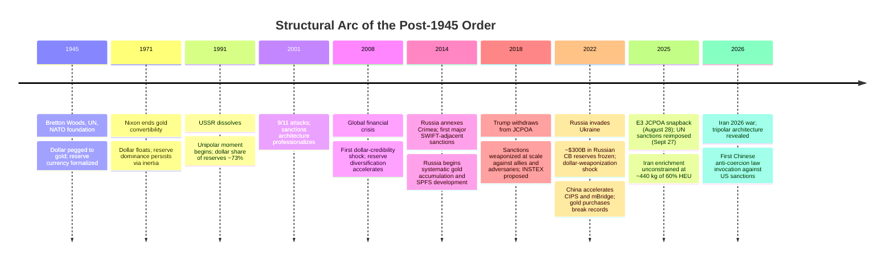
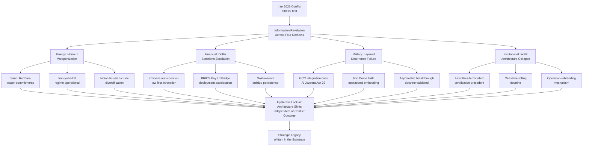
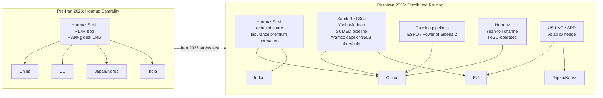
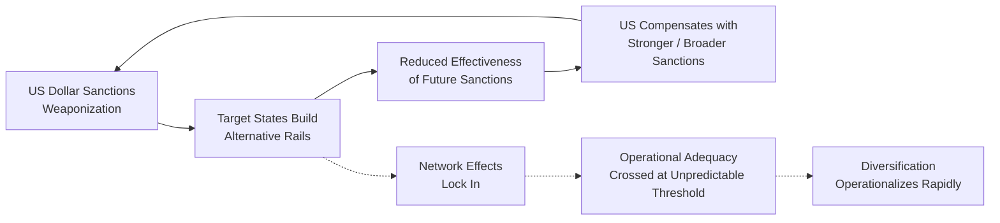
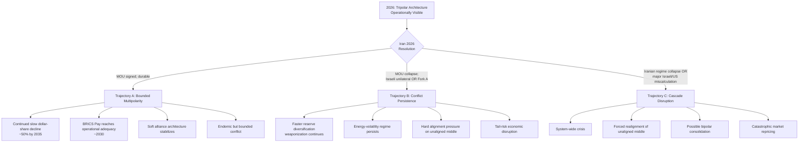

# The Reordering Nobody Is Choosing

## A Whitepaper on Tripolar Realignment and the Iran 2026 Stress Test

*May 8, 2026. The post-1945 international order is no longer functioning as a coherent system. The architecture replacing it is not bipolar US-China, as commonly framed; it is tripolar, with a structurally significant unaligned middle. The Iran 2026 war is the stress test that revealed the new architecture, not the event that produced it. This whitepaper extracts the structural transformation thesis from the operational framework and argues it as a standalone analytical work.*

> **TL;DR.** Three poles are now operationally distinct: a US-Israel pole anchored on dollar dominance and alliance density; a China-centered pole anchored on manufacturing centrality, alternative payment rails, and Belt and Road infrastructure; a Russia-adjacent pole anchored on energy, arms, and UNSC veto leverage. Between them sits an unaligned middle (India, Gulf states, Turkey, Brazil, Indonesia, South Africa) whose pivot capacity is itself the diagnostic that the unipolar moment has ended. The Iran 2026 conflict accelerates lock-in across four domains: energy geography (Saudi Red Sea pivot, Iranian yuan-toll regime, BRICS payment capex), financial architecture (first invocation of Chinese anti-coercion law, mBridge deployment, gold-reserve buildup), military and security (GCC integration calls, Iron Dome operational embedding in UAE, layered deterrence breakdown), and institutional residue (WPR "hostilities terminated" precedent, ceasefire-tolling doctrine, operation-rebranding mechanism). Each domain crosses an irreversibility threshold via capex commitment, institutional commitment with switching costs, or network effects. The architecture chooses; the principals navigate within what it leaves available. The reordering nobody is choosing remains the architecture choosing for them.

---

## 1. Frame: The System, Not the Conflict

Most analytical writing on Iran 2026 treats the conflict as the central object and the international system as background. This whitepaper inverts that ordering. The conflict is the stress test; the system is the subject. The conflict's strategic legacy will not be measured primarily in casualties, oil prices, or even nuclear-program status. It will be measured in which institutional reorganizations the conflict locked in, which alternative architectures crossed irreversibility thresholds during it, and which alliance commitments became sunk costs that subsequent crises will defend rather than dismantle.

This is a Polanyi-style reading of the conflict's significance. Markets and the political institutions that constitute them are co-produced. Coercive deployment of financial dominance generates a counter-movement: target states build alternative network infrastructure that, once operational, is itself a coercive instrument. The US dollar's weaponization is producing the very alternative architecture that erodes its weaponization capacity. This is not a paradox; it is the predictable second-order effect of treating financial centrality as a foreign-policy tool.

The realist reading reaches the same conclusion through a different mechanism. The post-1945 order rested on a hegemonic stability bargain in which the United States provided public goods (security, reserve currency, open trade architecture, institutional rule-setting) in exchange for system-wide deference and dollar-denominated reserve accumulation. That bargain has been unwinding for roughly fifteen years. The Iran 2026 conflict is the moment at which the unwinding became operationally legible across multiple domains simultaneously.

The Marxist-dialectical reading reaches it through a third mechanism. Capital must find returns. Each pole's internal contradiction (state weaponization vs. capital mobility in the US; state-directed industrial policy vs. private capital efficiency in China; state extraction vs. siloviki rentier capture in Russia) drives institutional bifurcation. The world economy is decomposing into multiple incompletely-overlapping circuits because the contradiction between the political logic of poles and the economic logic of capital cannot be resolved within a single architecture.

Three readings, one conclusion: the system is reorganizing structurally, the Iran 2026 conflict is its current visible expression, and the analytical task is to map the architecture rather than chase the operational tape.

---

## 2. From Unipolar to Tripolar: The Historical Arc

The post-1945 order was built around three mutually-reinforcing structures: a security architecture (NATO, US bilateral alliances, Bretton Woods institutions), a financial architecture (dollar reserve dominance, IMF/World Bank conditionality, SWIFT messaging, OFAC enforcement), and an ideological architecture (liberal-democratic legitimacy, human-rights universalism, market-economy convergence). The 1991 collapse of the Soviet Union removed the only systemic challenger and inaugurated what observers from Charles Krauthammer to Francis Fukuyama variously labeled the unipolar moment, the end of history, or the indispensable nation era.

The unipolar moment was always a historical anomaly rather than an equilibrium. By 2008, the global financial crisis had generated the first serious dollar-credibility shock. The US-led system had to print itself out of insolvency; the cost was a partial loss of moral authority over financial-system stewardship. Reserve diversification accelerated, central-bank gold accumulation began the secular trend that would run through 2024-2025 at over 1,000 tonnes per year.

The 2014 Crimea annexation produced the first major sanctions episode of the post-2008 period. Russia, faced with sanctions exposure, began the systematic build-out of an alternative architecture: SPFS (System for Transfer of Financial Messages) as SWIFT alternative, gold accumulation, BRICS-bank development, energy-export reorientation toward China. None of this was new in 2022; the Ukraine war merely accelerated infrastructure that had been under construction for nearly a decade.

The 2018 JCPOA withdrawal was the inflection point that targets and observers most often miss. The US imposed sanctions on Iran over the explicit objections of European allies and against the multilateral architecture the US itself had constructed. Allies discovered that the cost of US-led financial centrality was unilateral exposure to US foreign-policy preferences they did not share. The European Union created INSTEX (Instrument in Support of Trade Exchanges) as an alternative payment mechanism for Iran-Europe trade. INSTEX failed operationally but established the precedent: even US allies were now incentivized to build alternative rails.

The 2022 Russia sanctions package crossed a different threshold. The freezing of approximately $300 billion in Russian central bank reserves established that *reserve assets denominated in dollars or euros could be seized by the issuing central bank* in a sufficient political emergency. This is a structural fact about the asset class, not a contingent risk. Every central bank holding dollar reserves now operates with a non-zero probability of seizure conditional on political conflict with the United States. That probability does not have to be high; it merely has to be non-zero to change the optimization problem. Reserve-currency status survives convenience and inertia until alternatives reach operational adequacy. The Iran 2026 episode is the test of how fast adequacy is being reached.

By August 2025 the JCPOA had formally died via the E3 snapback mechanism. By February 2026 the United States had launched Operation Roaring Lion / Epic Fury against Iranian nuclear infrastructure. By May 2026 the Iran 2026 war had been the catalyst for: Chinese anti-coercion law invocation against US sanctions on Chinese refineries (first use), UAE OPEC exit (May 1, 2026), Saudi Red Sea pivot announcement, GCC calls for "deeper military integration," Iron Dome operational embedding in UAE air defense, and visible BRICS Pay / mBridge capex commitments. None of these were uniquely caused by Iran 2026. All of them were accelerated and rendered operationally legible by it.

---

## 3. The Three Poles

Bipolar (US-China) framings of the contemporary system miss two structural features. First, Russia is not merely a degraded great power within the China-centered pole; it is a separate pole with distinctive capabilities (energy, arms exports, UNSC veto, civilizational ideology) that neither the US-Israel pole nor the China-centered pole can substitute for. Second, the unaligned middle is structurally significant in tripolar configurations in ways it was not in either unipolar or bipolar. Tripolar systems have more available equilibria; pivot capacity becomes a strategic asset rather than a structural anomaly.

### 3.1 Composition

The US-Israel pole comprises the Anglosphere security architecture (Five Eyes plus AUKUS), Western European NATO core, Japan, South Korea, Australia, Israel. Its alliance density is the highest of the three poles. Its internal ideological coherence is the lowest of the three poles in the current period: the Trump-era US is structurally divergent from the European liberal-democratic tradition, the Israel-EU relationship is under acute strain over Gaza and Iran, and the Anglosphere itself is internally bifurcated between a US executive operating outside post-1945 institutional norms and US institutions still partially anchored to those norms. The pole holds together via dollar dominance, security dependency, and tech-stack lock-in (semiconductors, AI infrastructure, cloud), not via shared ideology.

The China-centered pole is anchored on Chinese manufacturing centrality (~30% of global manufacturing value-added), Belt and Road infrastructure investments (~$1 trillion cumulative since 2013), CIPS payment infrastructure (currently processing roughly RMB 100 trillion in annual settlement, growing), and the SCO security framework. Member-state alignment is more transactional than ideological: Pakistan operates within the pole on a debt-and-infrastructure basis, Cambodia and Laos via direct economic dependency, several African states via BRI lock-in. The pole's internal contradiction is that China itself faces structural headwinds (demographic decline, real-estate-debt overhang, declining marginal return on capital, export-market saturation under tariff regime) that limit its capacity to extend the model further without compromising domestic priorities.

The Russia-adjacent pole is the smallest of the three economically (~$2 trillion GDP nominal, comparable to Italy) but retains structural significance through three asymmetric instruments: energy commodities (oil, gas, fertilizer, grain in different periods), arms exports (legacy customer base across Asia, Africa, Middle East), and UNSC veto. Iran joined the pole materially in 2022-2025 via the drone-supply relationship with Russia and as a junior partner in the China-Russia anti-Western coordination. The Iran 2026 war's outcome will substantially reshape this pole: a deal that survives reduces Iran's marginal commitment; a regime collapse reduces Russian-pole capacity to project Middle East presence.

The unaligned middle is the structural innovation of the current configuration. India, Turkey, Brazil, Indonesia, Saudi Arabia, the UAE, Qatar, South Africa, Vietnam, Nigeria, and a long tail of smaller states operate via opportunistic pivot. India runs a defense relationship with Russia, an economic relationship with China, a technology relationship with the US, and a strategic relationship with Israel simultaneously. Saudi Arabia maintains the petrodollar relationship with the US while accepting yuan-denominated oil contracts from China and conducting parallel diplomacy with Iran via Pakistani and Omani channels. The UAE's May 2026 OPEC exit is the cleanest expression of the pattern: economic divergence from one bloc (Saudi-led OPEC, US-anchored petrodollar) executed simultaneously with deeper military integration into another (Iron Dome operational embedding, US-Israel security coalition).

This is what tripolar plus structurally-significant-unaligned looks like. It is not the bipolar Cold War architecture and analyses applying that template miss the dynamics.

### 3.2 Capabilities Matrix

| Domain | US-Israel pole | China-centered pole | Russia-adjacent pole |
|---|---|---|---|
| Reserve-currency share (2025) | USD ~58% | RMB ~3-4% | RUB negligible |
| Payment messaging | SWIFT, CHIPS | CIPS (~$15T annual) | SPFS (limited; mostly domestic) |
| Cross-border wholesale CBDC | none operational | mBridge (production deployment 2024-) | none |
| Manufacturing value-added share | ~22% | ~30% | <2% |
| Frontier-semiconductor capability | TSMC, Samsung, Intel, ASML | SMIC (catching up; sanctions-constrained) | none |
| Alliance density (treaty allies) | 60+ | 8-12 (CSTO/SCO partial) | 5-6 (CSTO; degraded) |
| Nuclear arsenal | ~5,500 (US), ~100 (Israel undeclared) | ~500 | ~5,800 |
| Energy: oil + gas production share | ~25% (US dominant) | ~5-6% | ~15% |
| Critical minerals processing | minority | dominant (rare earths, lithium, cobalt) | minor |
| Space launch capacity | dominant (SpaceX) | strong (rapid growth) | degraded but operational |
| AI compute capacity | overwhelming | catching up; sanctions-constrained | minimal |
| Demographics (working-age trend, 2025-2050) | aging; immigration partially offsets | aging; no immigration; severe contraction | severe decline; war losses compound |
| Sovereign-debt sustainability | high gross debt; reserve-currency immunity | rising; quasi-sovereign opacity | low debt; sanctions exposure |

The matrix reveals that no single pole dominates all domains. The US-Israel pole leads in alliance density, frontier semiconductors, AI compute, and reserve-currency status. The China-centered pole leads in manufacturing, critical-minerals processing, and BRI infrastructure footprint. The Russia-adjacent pole leads in nuclear arsenal size and energy-commodity export volumes. None of the three is positioned to displace the others across the full set of domains within the next decade. This is the structural claim: tripolar is not a transition state; it is the stable configuration the system is reorganizing toward.

### 3.3 The Internal Contradictions

Each pole carries an internal contradiction that constrains its trajectory and explains the partial paralysis observable in each.

**US-Israel pole.** The contradiction is between the political logic of weaponized dollar centrality and the economic logic of capital mobility. Treating the dollar as a foreign-policy instrument generates predictable counter-movement: target states diversify reserves, build alternative rails, accept inferior payment infrastructure in exchange for sovereignty insurance. US capital, by contrast, requires global mobility to find returns. The two objectives are in direct tension. The current resolution is a partial bifurcation in which sanctioned actors operate on alternative rails while non-sanctioned global capital continues using dollar infrastructure. Whether this resolution is stable depends on whether the alternative rails reach operational adequacy for non-sanctioned capital, at which point dollar dominance would face genuine competitive pressure rather than sanctioned-actor migration.

**China-centered pole.** The contradiction is between state-directed industrial policy (which has driven the manufacturing miracle) and private-capital efficiency (which generates the marginal returns that justify continued capital deepening). Xi-era China has resolved this in favor of state direction, accepting declining return on capital, real-estate sector contraction, private-sector withdrawal, and slower growth as the price of political control. The pole's external projection capacity is constrained by this resolution: Belt and Road infrastructure investments are increasingly defensive (debt restructuring, equity conversion, write-downs) rather than expansionary. The mBridge and CIPS infrastructure is more sophisticated than 2014 SPFS but still requires partner-state acceptance of Chinese governance norms in payment-system rule-setting, which limits adoption among the unaligned middle.

**Russia-adjacent pole.** The contradiction is between state extractive logic (the Kremlin's claim on resource-rents) and siloviki rentier capture (the security-services' claim on the same rents). Wartime mobilization has temporarily aligned the two, but the underlying competition for rent share has not been resolved. The pole's pole-level project (civilizational sovereignty, multipolarity, post-Western order) is genuine at the level of stated ideology but operationally constrained by the rentier-capture dynamic, which produces resource-extraction priorities rather than productive-capacity build-out. This is why Russia can sustain a war indefinitely without either winning it or being defeated by it: the war economy is the rentier economy in the wartime configuration.

The unaligned middle, by contrast, faces no comparable internal contradiction *because* their pole-non-membership status grants them strategic flexibility. India can run defense relationships with Russia, technology relationships with the US, and economic relationships with China simultaneously precisely because no pole can demand exclusivity from a state large enough to refuse. This is the structural source of the unaligned middle's bargaining leverage and the reason the pivot dynamic is durable rather than transitional.

---

## 4. Why Iran 2026 Is a Trigger, Not a Cause

The trap most analyses fall into is treating Iran 2026 as the cause of tripolar realignment. The conflict is the trigger, not the cause. The mechanism is information-revelation: the conflict forces previously-latent capabilities and commitments into operational visibility, which then produces capex and institutional commitments that lock in the architectural shift.

The information shocks are not minor. Each of the four domains delivered confirmations that previously rested on theory or single-data-point evidence:

**Energy domain.** Pre-Iran 2026 it was theoretically known that approximately 17 million barrels per day of oil and roughly one third of LNG transit flowed through the Strait of Hormuz, that this was a strategic chokepoint, and that disruption would produce supply shocks. The Iran 2026 war converted this from theoretical to demonstrated. The IRGC's capacity to execute partial blockade with mining and small-craft denial operations was demonstrated. The yuan-toll alternative-channel architecture (north of Larak Island, $2 million per transit per documented case) was implemented under fire. Hapag-Lloyd's "transit not possible" assessment after Project Freedom on May 4 confirmed that even with US naval escort, commercial confidence does not restore quickly. Saudi Arabia's existing Red Sea infrastructure (SUMED pipeline, Yanbu refining complex, Jeddah port) became visible as the partial work-around. The Iran-Hormuz dependency is now politically intolerable for major importers, which forces capex commitments at the Saudi end and demand-diversification at the Indian and Chinese end.

**Financial domain.** Pre-Iran 2026 it was theoretically known that dollar weaponization generated counter-incentive for diversification. The Iran 2026 sanctions regime, particularly the OFAC second-wave designations against Chinese entities (Hengli, Qingdao Haiye), forced China to invoke its 2021 anti-coercion law for the first time. This is not a minor procedural step. It establishes precedent that Chinese entities under US sanctions can and will receive Chinese-state legal cover and counter-pressure. It also lowers the political cost for other states to follow with their own counter-coercion regimes. The mBridge cross-border CBDC system, in production deployment since 2024, became the operational fallback infrastructure during the Iran 2026 sanctions escalation. BRICS Pay, theoretically planned for years, accelerated capex commitments observably during the conflict.

**Military and security domain.** Pre-Iran 2026 it was theoretically known that asymmetric capability could deter conventional superiority via cost-imposition arithmetic. The Iran 2026 conflict demonstrated this operationally: Iranian inputs (drones, missiles, mines, small craft) ran roughly 1:50 to 1:200 cost-per-engagement vs. US interceptors. The US Patriot stockpile was depleted with reconstitution timeline of up to four years. Magazine breadth (Pettyjohn, CNAS) became the binding ceiling on sustained conventional kinetic operations. The Iron Dome operational embedding in UAE air defense, disclosed under fire on May 4, formalized Israeli operational stake in Gulf air defense in a way that had previously been theoretical or denied. GCC calls for "deeper military integration" (Al Jazeera April 29) signaled that Gulf states have now operationally absorbed the lesson that US extended deterrence is conditional on US domestic political coherence, which is itself contingent.

**Institutional residue.** Pre-Iran 2026 the War Powers Resolution had been substantively unenforced for decades but never formally circumvented via the specific mechanisms now operational. The Trump administration's May 1 "hostilities terminated" certification while operations continued, the ceasefire-tolling doctrine deployed by Hegseth, the Cooper "defensive engagement" framing under existing Operation Epic Fury authority during the May 4 kinetic exchange, the Rubio May 5 formal "concluded" declaration of an operation under which strikes continued on May 7: each is a procedural innovation that, if unchallenged judicially or legislatively, becomes available to all future executives. The constitutional retrogression is not a single event; it is a precedent stack that compounds across each successful deployment.

Each of these information shocks forces capex or institutional commitments. Capex and institutional commitments do not unwind cleanly. This is the hysteresis mechanism, and it is the structural reason Iran 2026 will be remembered for what it locked in rather than for what it resolved.

---

## 5. Domain-by-Domain Reordering

### 5.1 Energy Geography

The Hormuz-centric oil-export architecture of the post-1945 period was the physical infrastructure of the petrodollar system. It assumed: a stable Gulf, US Fifth Fleet primacy in the Arabian Gulf, OPEC coordination on supply, Saudi swing-producer status, and global buyer dependency on the Strait. Each of these assumptions has now been stress-tested.

The post-Iran 2026 energy geography is observably more distributed than the pre-war geography. Saudi Arabia's Red Sea pivot is the largest capex commitment of the reorganization. Aramco's planned terminal expansion at Yanbu and Jeddah, combined with the existing SUMED pipeline (Egypt) bypassing Bab al-Mandeb, creates a Hormuz-independent export channel for Saudi crude. If Aramco capex commitments cross approximately $50 billion (the rough threshold for hysteretic lock-in given typical infrastructure payback periods), Hormuz dependency for Saudi exports is structurally reduced regardless of Iran 2026's resolution.

The Iran-operated yuan-toll regime north of Larak Island is the smaller but more diagnostically interesting change. The IRGC charged foreign-flagged ships in yuan via Lloyd's-tracked payments during the Hormuz closure period (one documented case at $2 million per transit). The toll regime itself was fragile and operationally limited, but the precedent is durable: the IRGC demonstrated it could capture chokepoint rents directly during the conflict, and Iranian-state actors have institutional memory and incentive to preserve any version of the mechanism that survives the formal Hormuz reopening. If the Iran Hormuz law (currently in parliamentary process) passes, the toll regime acquires statutory codification, which raises future-reversal political cost substantially.

Indian energy diversification during the Hormuz closure (raised Russian-crude purchases, partial substitution from Indonesian and Nigerian sources) created supplier-relationships that may persist as long-term contract architecture rather than reverting to Gulf dependency. Each long-term contract signed during the war is a hysteretic increment.

The structural result is that Hormuz returns from being *the* strategic chokepoint to being *a* strategic chokepoint among several, with permanent insurance-rate premia on Hormuz transit and structural alternatives for major importers. The petrodollar architecture rested on Hormuz centrality. The architecture's substrate is being eroded.

### 5.2 Financial Architecture

The dollar's reserve-currency share has been declining slowly since approximately 2001. The trend pre-dates Iran 2026, but the conflict is a discrete accelerant.

| Year | USD share of global reserves (IMF COFER) | Notes |
|---|---|---|
| 2001 | ~73% | Peak unipolar moment |
| 2008 | ~64% | Post-GFC diversification begins |
| 2014 | ~63% | Crimea / first major sanctions episode |
| 2020 | ~59% | COVID; peak fiscal unilateralism |
| 2022 | ~58% | Russia reserves frozen; weaponization shock |
| 2024-2025 | ~54-58% | Continued slow decline; gold accumulation accelerating |

The slow trajectory is the diagnostically relevant feature. Reserve-currency status is sticky; it persists through inertia, network effects, and the absence of operationally adequate alternatives. The mechanism by which it could collapse is non-linear: each weaponization episode adds an increment to diversification incentive; alternatives reach operational adequacy at unpredictable thresholds; once an alternative crosses adequacy, the diversification incentive operationalizes quickly.

Three mechanisms are now operating on the alternative-rail buildout simultaneously. First, the Chinese cross-border RMB system (CIPS) is processing growing volumes (estimated RMB 100 trillion+ annually by 2025, up roughly 30% year-on-year). Second, the mBridge multi-CBDC platform, in production deployment since 2024 with the People's Bank of China, Hong Kong Monetary Authority, Bank of Thailand, Central Bank of UAE, and Saudi Central Bank, has begun executing real cross-border wholesale settlement. Third, BRICS Pay (longer-stalled) has accelerated commitments observably during the Iran 2026 conflict.

This is a positive feedback loop in the dynamical-systems sense: the more the US weaponizes financial centrality, the faster the alternative architecture is built, the lower the marginal effectiveness of additional weaponization, and the higher the political pressure within the US to compensate by escalating weaponization further. The loop runs as long as there is no equilibrium-restoring mechanism, and the only equilibrium-restoring mechanism would be either (a) US restraint in financial weaponization, which is politically unavailable given the bipartisan consensus on sanctions as foreign-policy primary instrument, or (b) alternative-rail competitive dominance, which would terminate the loop by making sanctions operationally moot.

The Chinese May 6 invocation of the anti-coercion law (against US sanctions on Hengli and Qingdao Haiye) is the move that confirms the loop is now operating actively. China has institutional infrastructure to defend against future sanctions; the cost of additional US sanctions on Chinese entities now includes Chinese counter-pressure on US firms operating in China. This is exactly the dynamic Farrell and Newman predicted as the "reverse form" of weaponized interdependence: jurisdictional control over network nodes can be inverted when sufficiently large counterparties build their own nodes.

Gold-reserve buildup is the third leg of the financial-architecture diversification. Central-bank gold purchases ran at 1,045 tonnes in 2024 (World Gold Council), the third consecutive year above 1,000 tonnes. Russia, China, India, Turkey, Poland, and Singapore have been the largest sustained accumulators. Gold cannot be frozen by an issuing central bank; it requires no payment-network infrastructure. It is the analytically simplest diversification instrument and the one most directly responsive to seizure risk. Its sustained accumulation is the cleanest signal that central banks globally are pricing the seizure risk as non-trivial.

### 5.3 Military and Security

The Iran 2026 conflict has produced the most consequential security-architecture stress test since the 2022 Russia-Ukraine war. The asymmetric breakthrough thesis (Iran achieves sea denial via shore-launched assets at far lower cost than US sea control via destroyers and carriers) is now operationally validated. The cost-imposition arithmetic of approximately 1:50 to 1:200 Iranian-favorable per engagement, combined with the Patriot reconstitution timeline of up to four years, establishes magazine-breadth as the binding constraint on sustained US conventional kinetic operations against capable adversaries.

This finding has implications well beyond the Iran case. Taiwan, Korean peninsula, Eastern European, and South China Sea contingencies all rely implicitly on US extended-deterrence capability. If extended deterrence is ceiling-constrained by munitions reconstitution timelines that run multi-year, allied calculations should shift toward greater self-reliance. This is observable in real time. South Korean and Japanese discussions of indigenous nuclear capability, German rearmament announcements (Zeitenwende continuing post-Scholz), Polish military buildup at a scale not seen in decades, and Australian AUKUS submarine commitments all post-date the cumulative weight of US-extended-deterrence credibility erosion.

The GCC integration calls (Al Jazeera April 29) and the Iron Dome operational embedding in UAE air defense are the Gulf-region instantiations. The UAE OPEC exit on May 1, 2026, cannot be cleanly separated from the security-coalition reformulation that the Iran 2026 conflict has produced. UAE economic divergence from Saudi-led OPEC is occurring simultaneously with deeper military integration into the US-Israel-led security coalition. This is not contradiction; it is calibrated multi-dimensional positioning made possible by the unaligned-middle's pivot capacity in tripolar configurations.

Russia's role in the Iran-conflict security configuration has been strikingly limited. Putin's April 27 St. Petersburg meeting with Araghchi delivered rhetorical solidarity ("courageously and heroically fighting") and zero concrete commitments. The April 29 Trump-Putin call (in which Putin reportedly offered HEU custody as part of a deal architecture) was rejected by Trump. Peskov publicly walked back the offer. Russian active support to Iran (drone purchases, sanctions-evasion expertise, BeiDou-coordinated intelligence, UNSC veto coordination) has held at the calibrated level it occupied pre-conflict but has not expanded. This is consistent with the Russia-adjacent-pole's capability profile: meaningful asymmetric instruments, limited capacity for proximate force projection.

China's role has been more consequential. Wang Yi's May 6 Beijing meeting with Araghchi included explicit Chinese demands for Hormuz reopening and comprehensive ceasefire. The Chinese readout emphasized these demands; the Iranian readout omitted them. The divergence in readouts is itself intelligence. China has now publicly invested authority in Iran climbing down, which conditions Iranian options going forward. Combined with the May 14-15 Trump-Xi summit becoming the highest-salience focal point in the conflict's resolution architecture, China has positioned itself as the only major power with structural convening capacity for an Iran 2026 settlement. This is a meaningful upgrade of China's Middle East positioning, achieved without committing Chinese forces to any kinetic role.

### 5.4 Technology and Critical Infrastructure

Tech-stack decoupling has been under way since approximately 2018 (Trump-administration semiconductor export controls; Biden-administration controls expansions; Chinese counter-investment in SMIC and the broader semiconductor stack). The Iran 2026 conflict adds two specific accelerants. First, Chinese supply of dual-use technology to Iran (BeiDou-3 satellite navigation, sodium perchlorate, MizarVision and Jing'an geospatial intelligence, SMIC chipmaking tool components) became visible in operational reporting during the conflict. Second, US OFAC second-wave designations against Chinese entities forced the Chinese counter-coercion-law invocation discussed above.

The deeper structural finding is that critical-infrastructure dependency runs in directions both poles want to reduce but neither can reduce quickly. The US-Israel pole's dependency on Chinese-processed critical minerals (rare earths approximately 70-80% Chinese-processed, lithium and cobalt similarly concentrated despite mining diversification) is not closeable on a sub-decade timeline. The China-centered pole's dependency on US/Western frontier-semiconductor capability is similarly persistent, despite the SMIC progress, until Chinese-domestic EUV lithography is developed (timeline unclear, possibly 5-10 years). The Russia-adjacent pole's dependency on imported components for its high-end weapons systems was demonstrated in the Ukraine war (Western-component sourcing in Russian missiles continued via gray-market channels).

Each of these dependencies is a hysteretic substrate variable. Decoupling produces capex commitments that don't unwind. The Inflation Reduction Act, CHIPS Act, and European Critical Raw Materials Act on the US-Israel-pole side; Made in China 2025 and the Big Fund semiconductor investments on the China-centered-pole side; Russian import-substitution programs (with limited success) on the Russia-adjacent-pole side; all are commitments that, once made, must be defended politically because their abandonment would represent acknowledgment of strategic error.

The unaligned middle is positioned to benefit from the decoupling: Vietnam, Mexico, India, and Indonesia are the principal beneficiaries of "China plus one" supply-chain diversification. This is not pole-affiliation but pole-utilization, and it strengthens the unaligned middle's structural position rather than forcing alignment with either of the two principal poles.

---

## 6. The Hysteresis Question

The analytical core of the tripolar realignment thesis is hysteresis. Systems that change state under increasing stress often exhibit hysteresis: the path back requires far more reversal than the path that produced the change. The system has memory; restoring the input variable to its pre-shift value does not restore the output state.

The diagnostic question for each 2026 reorganization: did the change require (a) infrastructure capex, (b) institutional commitment with switching costs, (c) network effects with positive returns to scale? Affirmative on any of these, the change is likely hysteretic. Affirmative on multiple, near-certain hysteretic.

| Reorganization | Capex | Institutional commitment | Network effects | Verdict |
|---|---|---|---|---|
| UAE OPEC exit | Low | High (treaty exit) | Medium | Likely locked-in |
| Saudi Red Sea pivot | High (terminal expansion) | Medium | Medium | Locked-in if capex >$50B |
| BRICS Pay / mBridge capex | High | High | High | Locked-in if 4+ CBs deploy |
| Yuan oil-settlement share | Low | Medium | High | Locked-in if >12% sustained |
| Gold-reserve buildup | Medium | Low | Low | Reversible if dollar normalizes |
| Iranian Mojtaba succession | n/a | High (Assembly precedent) | Medium | Locked-in absent regime shock |
| Iranian Hormuz toll regime | Low | Medium | Low | Reverts unless legislated |
| WPR "hostilities terminated" precedent | n/a | High (executive) | Medium | Locked-in absent challenge |
| Ceasefire-tolling doctrine | n/a | High | Medium | Locked-in absent litigation |
| Operation rebranding mechanism | n/a | High | Medium | Locked-in absent litigation |
| Insider-trading reflexive coupling | n/a | High (CFTC disposition) | High | Locked-in if no criminal referral |
| GCC military integration | High | Medium | Medium | Locked-in if joint procurement |
| Iron Dome UAE embedding | High | High | Medium | Locked-in (capex sunk) |
| Defense-tech consolidation | High | High | Medium | Locked-in via multi-year contracts |
| Indian Russian-crude diversification | Low | Medium | Low | Partial lock-in via long-term contracts |
| Republican Senate defection coalition | n/a | Low | Low | Reverts post-ceasefire |

The most diagnostically important entries are at the top. UAE OPEC exit is durable for institutional reasons: the treaty exit itself is the cost; reversal requires re-applying for membership, which is politically more costly than holding the exit position. The Saudi Red Sea pivot's verdict depends on whether Aramco capex commitments cross the operational-adequacy threshold; if Aramco commits more than approximately $50 billion to Yanbu and Jeddah expansion at scale that requires 5-10 year payback, the dependency on Hormuz is structurally reduced. BRICS Pay and mBridge cross hysteretic threshold once 4-plus central banks deploy in production, because at that point the network has the participants needed for self-sustaining flow without further central-bank-of-China subsidy.

The institutional-residue entries are the underpriced ones. The "hostilities terminated" certification, the ceasefire-tolling doctrine, the operation-rebranding mechanism, and the Cooper "defensive engagement" framing under existing operation authority are all executive-branch innovations that work because nobody is challenging them in real time. If they remain unchallenged through the end of the next quarter, they graduate from "contested wartime maneuvers" to "available executive tools" usable in any future conflict by any future executive. This is the constitutional retrogression substrate; it is at least as consequential as any specific kinetic outcome.

The reflexive-coupling entry deserves separate attention. Three FT-documented oil-futures insider-trading episodes (March 24, April 7, April 17) totaling roughly $2.28 billion in notional value preceded major Trump-administration foreign-policy announcements. The CFTC investigation and CME/ICE subpoenas are proceeding. The disposition of those investigations is the operative lock-in indicator: if criminal referral is declined or prosecution does not proceed, the political-financial reflexive coupling becomes a structural feature of the market, with implied-volatility term structure on oil options pricing political risk premium beyond fundamental supply/demand. This is a quiet but important structural change: the US oil-futures market would have institutionalized a political-information asymmetry that benefits insiders and prices political signaling into the curve.

---

## 7. The Unaligned Middle and Pivot Dynamics

The unaligned middle is the structural innovation of the tripolar configuration. In the unipolar moment, unaligned status was an anomaly maintained at cost (sanctions exposure, institutional exclusion, capital-market access constraints). In the tripolar configuration, unaligned status is a strategic asset maintained at relatively low cost because each pole has incentive to court the unaligned middle rather than punish defection from a non-existent prior alignment.

India is the largest and analytically clearest case. Indian foreign policy now runs:
- Defense relationship with Russia (Sukhoi platforms, S-400 air defense, BrahMos cruise missile co-development with TransMashHolding)
- Technology relationship with the US (Quad participation, GE jet-engine technology transfer agreement, semiconductor packaging investments)
- Economic relationship with China (largest bilateral trade partner; persistent border tension does not break the trade pattern)
- Strategic relationship with Israel (defense exports, Phalcon AWACS, surveillance technology)
- Energy relationship with Russia (post-2022 discount-crude purchases at scale; refinery throughput increased substantially)
- Energy relationship with Gulf states (sustained but reduced Hormuz dependency via Russian and other diversification)
- Coalition participation in the US-Israel pole's military exercises (Malabar) while declining to join AUKUS-style commitments

This is not non-alignment in the Cold War sense (formal neutrality, NAM membership, principled distance from blocs). It is multi-alignment, a more sophisticated posture in which alignment with each pole on specific dimensions is calibrated to maximum extraction without any one pole acquiring veto over Indian options.

Saudi Arabia is the second clearest case. The petrodollar relationship with the US is preserved at the level of crude pricing convention but accompanied by:
- Yuan-denominated oil contracts with China (currently estimated 25-30% of Saudi-China crude trade; growing)
- Saudi-China nuclear cooperation discussions
- Saudi-Pakistan defense relationship deepening (potentially including nuclear umbrella)
- Saudi-Iran diplomatic resumption (post-2023 China-mediated agreement; durable through Iran 2026 conflict)
- Saudi participation in BRICS-plus structures
- Continued Saudi US weapons purchases at scale
- Saudi Red Sea pivot reducing Hormuz dependency

Turkey, Brazil, Indonesia, South Africa, Vietnam, and Nigeria operate variations of the same multi-alignment pattern. The aggregate effect is that the unaligned middle now constitutes approximately 35-45% of global GDP at PPP, a non-trivial economic mass that no single pole can absorb or compel. This mass is the primary structural reason the system is stably tripolar rather than bipolar (which would require unaligned-middle absorption into one of the two principal poles).

The pivot dynamic itself produces second-order effects. Each pole, observing the unaligned middle's pivot capacity, has incentive to lower the cost of partial alignment rather than demand full alignment. This produces softer alliance architectures (the US-led "minilateral" structures: Quad, AUKUS, IPEF; the China-led structures: SCO, BRI, BRICS+; the Russia-led structures: SCO partial overlap, EAEU) rather than the hard alliance architectures of the Cold War. Soft alliance architectures are easier to enter, easier to exit, less ideologically loaded, and structurally less binding on member-state foreign policy. They are also less effective at deterring adversary behavior, which produces the layered-deterrence-breakdown dynamic the Iran 2026 conflict exposed.

---

## 8. Theoretical Apparatus

The framework's analytical core integrates several distinct theoretical traditions. They are not in conflict; each illuminates a different facet of the same structural transformation.

**Weaponized interdependence (Farrell-Newman, 2019).** States with jurisdictional control over central network nodes (SWIFT, dollar clearing, semiconductor design, undersea cables) use those nodes for coercion via two mechanisms: the *panopticon effect* (extracting information by observing flows) and the *chokepoint effect* (denying adversaries access to flows). The reverse form: targets build alternative network infrastructure that, once operational, is itself a coercive instrument. Iran 2026 is the case study for the reverse form's first major operational deployment.

**Hegemonic stability theory (Kindleberger 1973, Gilpin 1981).** Stable international economic orders require a hegemon willing and able to bear disproportionate costs of public-good provision. Hegemonic decline produces system instability. The US has been visibly transitioning from cost-bearer to cost-extractor since approximately 2018; the consequent system instability is the substrate the tripolar reordering is occurring on. The hegemonic stability thesis predicts the reordering's necessity but cannot specify which alternative architecture emerges; that depends on capabilities, network effects, and contingent political choices among the alternatives.

**Polanyi's double movement (Polanyi 1944).** Markets and the political institutions that constitute them are co-produced; coercive market expansion produces society's defensive counter-movement. The dollar weaponization regime is Polanyian market-coercion at the level of the international financial system; the alternative-rail buildout is the counter-movement. This framing predicts that the counter-movement will continue regardless of immediate economic incentive because the political demand for sovereignty insurance is independent of, and frequently dominant over, the economic preference for liquidity in the deepest market.

**Adam Tooze's polycrisis (Tooze 2022-).** Multiple crises (climate, demographic, debt, geopolitical, technological) interact non-additively. The Iran 2026 conflict cannot be analyzed in isolation because its effects compound with: ongoing energy-transition fiscal costs, demographic-aging fiscal costs across all three poles, sovereign-debt sustainability concerns particularly in the US-Israel pole, AI-disruption labor-market effects, and climate-cost backloading. The polycrisis frame predicts that any one of these dimensions resolving favorably is insufficient to stabilize the overall system; the system is in a configuration where multiple stabilizers must hold simultaneously.

**Powell's commitment problem under shifting power (Powell 1999, 2004).** Even under complete information, large/rapid shifts in power produce war: the rising power cannot credibly commit not to revise the bargain after gaining strength; the declining power may prefer war today to a worse bargain tomorrow. Israel's perception of Iran as in a uniquely weak window now that will close (per Ajorlou, Al Jazeera Centre, April 30: the campaign was premised on "Iran weakened at home and abroad") is the operative instantiation. This is why dispositional readings of the opponent (Weisiger 2013) produce unlimited rather than limited war aims: they convert information-driven negotiable conflicts into commitment-driven non-negotiable ones.

**Aggregation theory (Thompson, Stratechery).** Platform economics in business strategy generalizes to network-infrastructure economics in international political economy. The party that aggregates demand wins; switching costs accumulate; network effects make the aggregator's position increasingly dominant within its network even as the network's share of total activity stabilizes or declines. Applied to international financial architecture: the dollar-clearing system aggregates global financial demand and continues to do so even as its share declines, while the alternative rails aggregate sanctioned and sanction-adjacent demand and grow within that segment. The structural prediction is bifurcation rather than substitution: two networks operating in parallel with limited cross-flow, rather than one network displacing the other.

**Marxist dialectical materialism.** Capital must find returns; the contradiction between political logic (state weaponization) and economic logic (capital mobility) drives institutional bifurcation. The contradiction between states needing to project power (which requires sanctions instruments) and capital needing to access global markets (which requires neutral payment infrastructure) is unresolvable at the level of any single state. The resolution at the system level is multiple parallel circuits, each with its own state-political logic, with capital flowing between them according to risk-adjusted returns. This is precisely what is now under construction.

These traditions converge on the same structural prediction: a tripolar architecture with structurally significant unaligned middle, characterized by parallel financial circuits, distributed energy geography, soft alliance structures, and persistent low-intensity competition rather than catastrophic conflict. The architecture is stable in the sense that no single pole can dominate, but it is not stable in the sense of being conflict-free; rather, conflict is endemic but bounded.

---

## 9. Strategic Implications

### 9.1 For the US-Israel Pole

The pole's strategic problem is that its dominant instrument (financial weaponization) is the instrument most likely to accelerate the pole's relative decline. Continued sanctions deployment generates continued counter-architecture buildout. Restraint in sanctions deployment generates domestic political costs that are politically unavailable to incumbent administrations. The pole therefore continues to deploy the instrument while it still has marginal effectiveness, knowing that effectiveness declines with each deployment.

Three strategic options are theoretically available: (a) strategic restraint and gradual reduction in sanctions deployment to preserve the dollar architecture's network effects, (b) acceleration of the alternative architecture's competition by allowing dollar-architecture competition (de-weaponization), (c) hardening of the dollar architecture via secondary sanctions regimes that punish third-party adoption of alternatives. Option (a) is politically unavailable given the bipartisan consensus on sanctions. Option (b) is ideologically incoherent for any administration that views financial centrality as foreign-policy power. Option (c) is the actual operational direction (OFAC second-wave Chinese designations being the current example), which produces the feedback-loop dynamic described above. The pole has no exit from the loop without changing the political-economic preferences of its principal state.

A secondary strategic problem is alliance management. The pole's alliance density is its strongest asset; it depends on credible US extended deterrence. The Iran 2026 conflict has demonstrated that extended deterrence is magazine-breadth-constrained and politically conditional. Allies must therefore hedge, which they are doing. The pole will not collapse from alliance defection in the next decade; it will fray at the edges (UAE multi-alignment, German strategic-autonomy positioning, South Korean nuclear-capability discussions) while its core (Anglosphere, Japan, Israel) holds.

### 9.2 For the China-centered Pole

The pole's strategic problem is internal-contradictions-driven slowdown. Demographic decline, debt overhang, declining return on capital, and export-market saturation under tariff regime are constraining the pole's external-projection capacity at the moment when the architectural opportunity is greatest. Belt and Road is in defensive mode (debt restructuring) rather than expansionary mode. mBridge and CIPS continue to grow but require partner-state acceptance of Chinese governance norms in payment-system rule-setting, which limits adoption among the unaligned middle.

The pole has two strategic options: (a) acceleration of the alternative-architecture buildout while the window is open, accepting the domestic costs of subsidizing partner-state participation (mBridge transaction-cost subsidies; BRI restructuring concessions; export-credit subsidies); (b) consolidation around the current architecture's gains, accepting slower diversification but greater domestic political stability. Xi-era China appears to be choosing (b) more often than (a), which is consistent with the broader Xi-era pattern of accepting slower growth in exchange for political control. This means the China-centered pole's expansion is slower than the maximum theoretical rate the architecture window permits.

A secondary strategic problem is Taiwan. A Taiwan contingency would simultaneously test US extended deterrence, reveal Chinese amphibious capability, and impose semiconductor-stack disruption costs that would propagate globally. The Iran 2026 conflict's lesson for the Taiwan question is mixed: US magazine-breadth constraints suggest extended deterrence may be more conditional than allies assumed, but the same magazine-breadth constraints suggest US would be hesitant to engage Chinese conventional forces directly given the cost-imposition arithmetic. The Chinese strategic calculation on Taiwan is unchanged in the long term but conditioned in the short term by the demonstration that asymmetric defense can constrain conventional offense, which favors Taiwan if Taiwan invests appropriately in asymmetric capabilities.

### 9.3 For the Russia-adjacent Pole

The pole's strategic situation is paradoxically the most stable of the three. Russia cannot lose the war it is fighting in Ukraine in any conventional sense; it can only fail to win. The war economy has stabilized around the rentier-extraction logic. The pole's external-projection capacity is limited but its asymmetric instruments (energy commodities, arms exports, UNSC veto, ideological positioning) are sustainable indefinitely.

The pole's principal strategic vulnerability is succession. Putin's eventual departure (whether by mortality, removal, or transition) is the single largest source of pole-instability risk. The siloviki coalition's capacity to manage post-Putin succession is unknown and structurally opaque. The Iran 2026 conflict's resolution will affect this only marginally; the Russia-adjacent pole's trajectory is dominated by internal Russian-state dynamics rather than external coalition management.

A secondary strategic problem is the pole's dependency on the China-centered pole for trade access (post-2022 sanctions left China as Russia's largest non-sanctioned trade partner) and component access (Russian high-end weapons systems require components Russia cannot manufacture domestically). This dependency is partially mutual (China benefits from Russian energy), but the dependency-asymmetry favors China. Over a decade, this could produce Russian-pole structural absorption into the China-centered pole as a junior partner. The current configuration (separate poles with coordination) is contingent on Russian state capacity to maintain pole-independence; this capacity is itself contingent on Putin-era continuity.

### 9.4 For the Unaligned Middle

The unaligned middle's strategic position is the strongest in approximately 60 years. Pivot capacity is structurally enabled by tripolar architecture. Each major unaligned state can extract concessions from each pole on different dimensions. The cost of unaligned status (sanctions exposure, institutional exclusion) has declined as alternative architectures have become operational; the benefit (multi-pole leverage) has increased.

The principal strategic risk for unaligned states is over-extraction inviting consolidation pressure. India, Saudi Arabia, Turkey, Brazil could each conceivably push pivot dynamics far enough to provoke one pole to demand harder alignment. This has not happened yet because each pole values partial alignment over no alignment, and demanding hard alignment risks pushing the unaligned state toward the competing pole. But the equilibrium is not infinitely stable; specific provocations (Indian arms-sales to Russia at scale; Saudi yuan-denomination crossing 50% of Saudi-China crude; Turkish Russian-S400 expansion) could trigger US retaliation that converts soft-alignment incentives into hard-alignment pressure.

The unaligned middle's collective interest is in preserving the tripolar configuration rather than allowing it to collapse into bipolar. A bipolar US-China configuration would compress the pivot capacity that grants the unaligned middle its strategic flexibility. Therefore, unaligned-middle policy should be expected to support continued multi-pole architecture, including support for Russian-pole survival (modest direct support; refusal to enforce sanctions extraterritorially; participation in BRICS-plus structures that include Russia). This is not pro-Russia ideology; it is unaligned-middle structural preference for multipolarity.

### 9.5 For Markets

The market-implications of tripolar realignment are persistent rather than punctuated. A small set of structural trades persist:

| Trade | Mechanism | Horizon |
|---|---|---|
| Long gold | Reserve diversification continues; central-bank purchases sustained | 5-10 years |
| Long defense (Western primes + select Asian) | Allied rearmament; magazine-breadth catchup; multi-year contracts | 5-10 years |
| Long energy infrastructure (Saudi Aramco; non-Hormuz routes) | Hormuz dependency reduction capex | 5-10 years |
| Long BRICS-rail-adjacent (Chinese fintech; mBridge participants) | Alternative-rail buildout | 5-10 years |
| Long volatility (oil; equity tail) | Endemic but bounded conflict; reflexive coupling | 3-7 years |
| Short long-duration USD assets (selective) | Reserve-share decline trend; not directional collapse | 10-20 years |
| Long critical-minerals processors (ex-China) | Decoupling capex; CHIPS-Act-adjacent | 5-10 years |

These are persistent rather than directional trades. The underlying thesis is structural reorganization producing a new equilibrium, not collapse. Catastrophic-scenario trades (USD collapse; Chinese hard landing; Russian disintegration) are tail-risk-only and should be sized accordingly.

The most underpriced market risk is the institutional-residue lock-in of executive-branch retrogression in the US. If the WPR "hostilities terminated" precedent and the operation-rebranding mechanism become baseline executive tools available to future administrations, the political-risk premium on US assets should expand. This is a slow-moving repricing rather than a sharp event; markets are systematically poor at pricing institutional decay because the indicators are not in the standard quantitative apparatus.

---

## 10. The Decade Ahead: Three Trajectories

**Trajectory A (most likely, ~50%): Bounded Multipolarity.** The Iran 2026 MOU is signed in some form; the conflict ends in a managed equilibrium (possibly with the nuclear question deferred indefinitely per the Hamas/Hezbollah pattern). Tripolar architecture stabilizes. Dollar share continues slow decline toward roughly 50% of reserves by 2035. BRICS Pay reaches operational adequacy around 2030. mBridge becomes the de facto cross-border CBDC standard for non-dollar transactions. Soft alliance architectures (Quad, AUKUS, SCO, BRI, BRICS-plus) coexist. The unaligned middle's pivot capacity is preserved. Conflict is endemic at the edges (Taiwan tensions, Russian frozen-conflict in Ukraine, Iran proxy networks, African Sahel instability) but no major-power war occurs. Markets reprice gradually over the decade; structural trades (long gold, long defense, long alternative-rail-adjacent) deliver compound returns. This is the best-case trajectory and remains the most probable.

**Trajectory B (significant, ~30%): Conflict Persistence.** The Iran 2026 MOU collapses (most likely via Israeli unilateral strike during the MOU window; secondarily via principal-agent ratification gap producing Fork D' deferral pattern; tertiarily via Iranian Hatami/Abdollahi doctrine producing Fork C miscalculation). Conflict continues at varying intensity. Energy-volatility regime persists; Brent oscillates in a $90-150 range. US sanctions intensify; counter-coercion infrastructure deploys faster; alternative rails reach operational adequacy roughly 2-3 years earlier than Trajectory A. The unaligned middle faces hard-alignment pressure from both poles, particularly the US-Israel pole demanding sanctions enforcement and the China-centered pole demanding sanctions evasion. Pivot capacity erodes at the margin. This is the trajectory in which tripolar architecture deepens and stabilizes faster, paradoxically, because the conflict accelerates the decoupling.

**Trajectory C (low but non-trivial, ~15-20%): Cascade Disruption.** A specific high-impact event triggers system-wide crisis. Candidates include: Iranian regime collapse with succession crisis and possible nuclear-material loose-control; Israeli first nuclear use against Iranian reconstitution facilities; US-China direct military confrontation over Taiwan during Iran 2026's tail; US sovereign-debt crisis exacerbated by war-cost compounding; Chinese hard landing accelerated by export-market collapse. Any of these would produce forced realignment of the unaligned middle and possible bipolar consolidation (US-Israel-pole versus everyone else; or China-centered-pole gaining unaligned-middle absorption under crisis pressure). Market repricing would be catastrophic (S&P 30%+ drawdown; gold $7,000+; oil $200+ intraday; sovereign-debt yield blowouts). This trajectory is the tail risk; most analytical bandwidth should not be allocated to it but its non-zero probability conditions risk-management decisions.

**The base case is Trajectory A.** The tripolar architecture is structurally favored because all three poles have institutional incentive to preserve it, the unaligned middle prefers it, and no actor has the capability to force consolidation. The conflict-persistence trajectory is more probable than the cascade-disruption trajectory because endemic-but-bounded conflict is the historical norm in tripolar systems (the long Cold War; the 19th-century concert; the Westphalian period). The cascade-disruption trajectory requires specific high-impact events, none of which is individually high-probability though their cumulative probability is non-trivial.

---

## 11. What Would Falsify the Thesis

A serious analytical thesis must specify its falsification conditions. The tripolar realignment thesis would be falsified by:

**A return to dollar-share dominance (>70% of global reserves) sustained over multiple years.** This would indicate that the post-2008 diversification trend has reversed and that dollar weaponization is not generating meaningful counter-architecture. Probability of this in the next decade: very low; reserve composition is sticky and the network-effect substrate would have to be re-established, which would require a US restoration of credibility-as-financial-steward that is politically unavailable.

**Operational collapse of BRICS Pay / mBridge / CIPS infrastructure.** This would indicate the alternative architecture is non-viable rather than merely slow-developing. Probability: low; Chinese state has demonstrated capacity to subsidize the infrastructure indefinitely, and partner-state participation has accelerated rather than reversed.

**Russian state collapse without succession.** This would remove one pole entirely, producing bipolar configuration. Probability: moderate over a decade given Putin succession dynamics, but Russian state capacity is more durable than Western analyses generally assume; even succession crises have historically produced new authoritarian consolidation rather than state collapse.

**Iranian regime collapse with subsequent integration into US-Israel-aligned regional architecture.** This would remove a key Russia-adjacent-pole partner and reorganize the Middle East geometry. Probability: low to moderate; Iranian regime has demonstrated brittleness and extraction-capacity simultaneously, but external observers consistently underestimate regime-survival capacity.

**Major-power direct military conflict (US-China; US-Russia).** This would terminate the tripolar configuration via consolidation pressure. Probability: low; the cost-imposition arithmetic and magazine-breadth constraints that emerged from Iran 2026 are observable to all parties and discipline conflict initiation. The Taiwan question is the principal channel; even there, the asymmetric defense lesson favors restraint.

**US institutional restoration.** Federal-court ruling overturning the WPR "hostilities terminated" precedent; bipartisan AUMF reform with binding executive constraints; Republican-Senate confirmation patterns reversing toward institutional independence; DOJ depoliticization. Probability: low in the 30-day horizon; moderate over a decade depending on political-cycle dynamics. This would not falsify the tripolar thesis directly but would weaken the institutional-residue component of it.

The thesis is robust to most observable disconfirmations because it rests on structural rather than punctuated mechanisms. Capex commitments don't unwind; network effects compound; institutional precedents accumulate. The thesis would be definitively wrong only if multiple disconfirmations co-occurred, which is improbable.

---

## 12. Conclusion

The post-1945 international order is no longer functioning as a coherent system. The architecture replacing it is tripolar with a structurally significant unaligned middle. The Iran 2026 war is the stress test that revealed the new architecture; it accelerates the lock-in but did not cause it. Underlying processes were already in motion: dollar weaponization fatigue since 2008, alternative-rail buildout since 2014, alliance-density erosion since 2018, constitutional retrogression since 2017. The conflict's strategic legacy will be measured in the hysteretic substrate it locks in rather than in the kinetic events that occupy current attention.

The architecture's signature property is that it is no actor's preferred outcome. The US-Israel pole would prefer continued dollar dominance and unipolar primacy; it cannot have these because its own preferred instruments (financial weaponization) generate the counter-architecture that erodes them. The China-centered pole would prefer faster diversification and accelerated displacement; it cannot have these because its internal contradictions slow its external-projection capacity. The Russia-adjacent pole would prefer recognized parity in a multipolar system; it cannot have these because its capability profile is too narrow. The unaligned middle would prefer indefinite preservation of pivot capacity; it cannot guarantee this because pole-level pressure can compress pivot space.

Each pole therefore navigates within constraints it did not choose. Faction misalignment and improvisational principal dynamics determine style and timing; the architecture determines trajectory. The structural reordering proceeds through compounding capex commitments, accumulating institutional precedents, and network-effect lock-in mechanisms that are independent of any single decision-maker's preferences.

The historical analog the framework continues to invoke is July 1914. The mobilization timetables of 2026 include WPA clocks, carrier rotations, deployment timing, storage saturation curves, depreciation rates, ideological closure thresholds, demand-pain points, and reserve-currency network effects. None of these were recognized as binding in the planning horizons of the actors at the conflict's onset; they are now binding and producing real-time architecture rotation through doctrinal interaction, costly signaling, and bargaining-geometry innovation rather than explicit decision. The Slantchev Principle of Convergence operates: warfare loses informational content; states settle before clear military victory; the durability of settlement depends on principal-agent ratification capacity and Schelling focal-point coordination, not on battlefield outcome.

The tripolar reordering is the architectural artifact of these dynamics. It is not the conflict's purpose, its planned outcome, or any actor's strategic aim. It is the substrate the conflict is being fought on, the substrate the conflict is depositing its sediment into, and the substrate from which the next cycle will be conducted. The strategic legacy is being written in the substrate, not in the foreground.

The reordering nobody is choosing is the architecture choosing for them.

---

## Indicators to Monitor (Aggregated)

For analysts and operators seeking observable signals of the reordering's progression, the following indicators are the most diagnostically useful at structural rather than operational horizon.

**Energy domain.**
- Aramco capex commitments to Yanbu and Jeddah expansion (threshold: >$50B confirmed)
- UAE OPEC exit durability at 6-month and 12-month horizons
- SUMED pipeline throughput vs Hormuz throughput ratio
- Indian Russian-crude purchases sustained vs reverting
- Iranian Hormuz-law passage (codifying toll regime)
- China SPR build-rate signals expectation of renewed crisis

**Financial domain.**
- USD share of global reserves (IMF COFER quarterly)
- CIPS daily settlement volume vs SWIFT settlement volume in select corridors
- mBridge transaction volume in production deployment
- BRICS Pay operational deployment by central banks (threshold: 4+ in production)
- Yuan share of oil settlement (threshold: >12% sustained two quarters)
- Central-bank gold purchases sustained above 1,000 tonnes annually
- Chinese anti-coercion law follow-on invocations
- US Treasury foreign-holder composition (Chinese, Saudi, Japanese trends)

**Military and security domain.**
- GCC integrated air-defense network with non-US C2 architecture
- UAE-Saudi joint procurement programs outside US-supplier channels
- South Korean / Japanese indigenous nuclear-capability discussions
- German rearmament budget execution
- Polish military buildup trajectory
- Australian AUKUS submarine timeline
- US Patriot / SM-6 / PAC-3 production rate vs consumption rate

**Institutional residue.**
- Federal-court ruling on WPR "hostilities terminated" (timeline: by July 1)
- AUMF passage explicitly addressing operation-rebranding mechanism
- CFTC criminal referral disposition on $2.28B+ aggregate insider trading
- DOJ pattern enforcement against Trump critics with national-security framings
- Title 50 expansions against domestic actors surviving judicial review
- IG removals and confirmation patterns

**Pivot dynamics.**
- Indian alignment signals across defense, technology, economic, energy dimensions
- Saudi yuan-denominated crude share sustained vs reverting
- Turkish Russian-S400 expansion or contraction
- Brazilian BRICS-plus engagement depth
- Vietnamese semiconductor-packaging investments by US firms
- South African BRICS chairmanship policy direction

These indicators are jointly observable. Their aggregate movement is the diagnostic for the tripolar realignment thesis. No single indicator is sufficient; the pattern of movement across the full set is the structural signal.

---

*Architecture is destiny when actors do not perceive it as binding.*

*Compiled May 8, 2026. The framework continues to update via daily SITREP annexes; this whitepaper represents the structural-thesis extraction at the v3.0 synthesis horizon. Subsequent revisions will be issued as material framework drift accumulates.*
