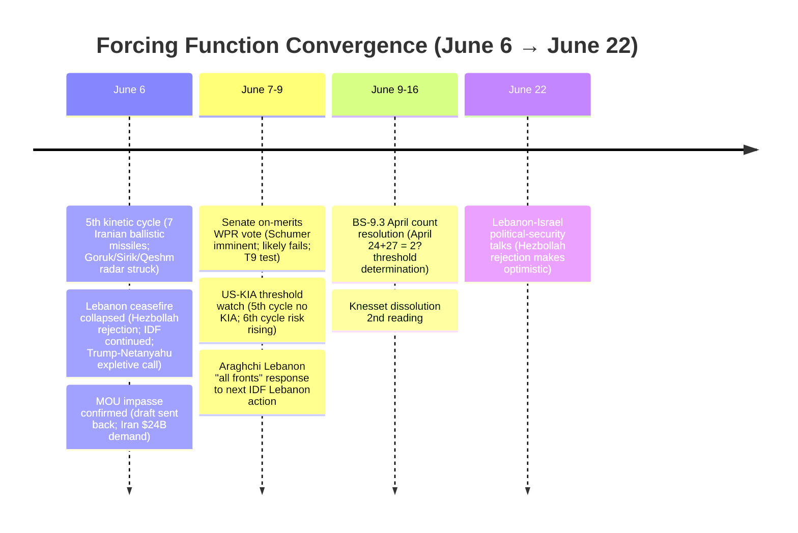
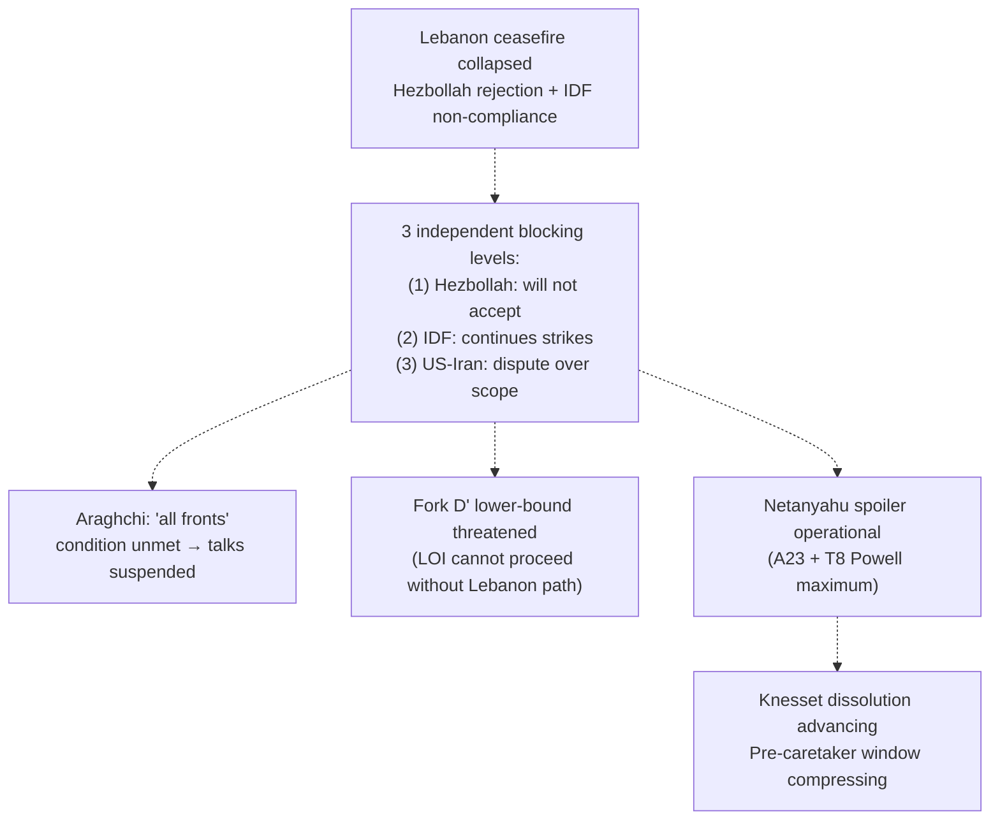
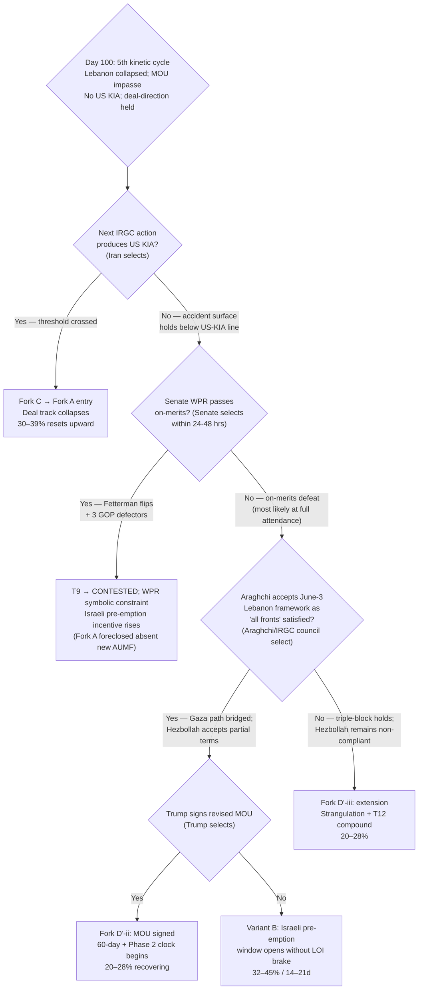

# Iran 2026 Operational SITREP — Daily Update
**Day 100 | Saturday, June 6, 2026**
*Annex/Update to Iran 2026 Operational SITREP and Strategic Synthesis (base report v4.2)*

## Executive Summary

Day 100 produced a 5th consecutive kinetic cycle, the collapse of the Lebanon ceasefire, and a confirmed MOU impasse — simultaneously and without crossing any single fork-resolution threshold. US forces struck Iranian coastal radar sites at Goruk, Sirik, and Qeshm after shooting down four Iranian drones fired toward the Strait; Iran retaliated with seven ballistic missiles at Kuwait and Bahrain (six intercepted, one failed). No US KIA. Lebanon: Israel-Lebanon agreed a US-brokered ceasefire; Hezbollah rejected it outright; IDF continued strikes killing 20-plus in Lebanon; Trump called Netanyahu an expletive in a heated call over Beirut orders. On the diplomatic track, Trump's "final determination" Situation Room meeting ended without a decision; the MOU draft was sent back to Iran with amendments on nuclear timing and Hormuz immediacy; Iran countered with a $24B frozen-asset demand; Araghchi re-stated Lebanon as a genuine ceasefire condition. Saudi Arabia issued its strongest public condemnation of Iran in the conflict's window, with MBS pledging solidarity with Kuwait and Bahrain and supporting "any measures they take." Senate Minority Leader Schumer announced an imminent on-merits WPR vote.

Supersedes `day-97` · Fork C ↑ · Lebanon clause COLLAPSED · Fork D' ↓

| Vector | Direction | Driver |
|---|---|---|
| 5th kinetic cycle | NEW | US Goruk/Sirik/Qeshm radar strikes; Iran 7 ballistic missiles Kuwait+Bahrain; 6 intercepted; no US KIA |
| Fork C (30d) | 28–36% → 30–39% ↑ | Largest single-cycle Iranian launch; ballistic missiles at two GCC states simultaneously |
| Lebanon ceasefire | COLLAPSED | Hezbollah rejection + IDF continued strikes; Trump-Netanyahu expletive call |
| Fork D' (30d) | 22–30% → 20–28% ↓ | Lebanon clause double-blocked; LOI impasse; lower-bound threatened |
| MOU status | IMPASSE CONFIRMED | Final-determination meeting no decision; draft sent back; Iran $24B demand |
| BS-18 Gulf troika | STRAINED | MBS "any measures" language — strongest Iran condemnation yet; brake not fractured |
| Senate WPR | IMMINENT VOTE | Schumer "imminent" announcement; on-merits Senate vote likely June 7–9 |
| Brent crude | $97.81 → ~$93–95 ↓ | Market pricing 5th cycle as self-defense; Chinese demand destruction |
| BS-9.3 | NOT TRIGGERED | Putin SPIEF June 4 confirmed; June count ≥1 |

> Leading primitives: Fork C 30–39% / 30d, Fork A 18–28% / 30d. Highest-delta this cycle: Fork C ↑. None-of-above floor: 5%.

---

## Section 1 — Operational Update

**The diplomatic track confirmed impasse on two axes.** Trump's Situation Room "final determination" meeting ended without a decision; the MOU draft was sent back to Iran demanding that Iran specify the timing and extent of its nuclear commitments and stipulate immediate end to Hormuz control upon signing (CNBC/CBS News, T2 multi-outlet). Iran's lead demand: $24B in frozen assets released as part of any deal (CNN, T2 unnamed Iranian official; -30% on figure, direction corroborated). Araghchi (T1, June 5): "no formal negotiation process underway; messages continue." He separately rejected Lebanese President Aoun's claim that Iran was using Lebanon as a bargaining chip: "Had Lebanon been bargaining chip for Iran, we'd have a deal long ago." The LOI architecture remains conceptually alive but unsigned; the Lebanon clause is now the binding blocking obstacle at two independent levels (see Section 3).

**Trump held deal-direction through Lebanon collapse.** Trump did not abandon MOU negotiations despite the Lebanon ceasefire failure and the Netanyahu defiance. He sent the draft back with amendments rather than withdrawing. Discount Trump's concurrent diplomatic optimism ("MOU within a week") to near-zero without tape action; the operative tape is the impasse-confirming Araghchi T1. A1 oscillation: deal-leaning, strained, holding as of June 6 (three-plus days post-Lebanon-collapse without direction reversal — the longest post-crisis hold of the conflict).

**A 5th kinetic cycle produced the largest single-session Iranian ballistic-missile launch of the conflict.** US forces shot down four Iranian one-way attack drones fired toward the Strait of Hormuz, then struck coastal surveillance radar sites at Goruk and Sirik (new sites, not previously struck) and Qeshm Island. Iran fired seven ballistic missiles in response: four at Kuwait, three at Bahrain. Six were intercepted by US and allied air defenses; one failed to reach its target. Kuwait's military confirmed engagement with no reported casualties; CENTCOM confirmed no US casualties; Iranian claim of damaging the 5th Fleet's Bahrain headquarters is false (CENTCOM T1 denial). The PROBE-7 self-defense-vs-resumed-operations discriminator applies: CENTCOM framing is self-defense (reactive to Strait drone provocation), no new operation name, no offensive ROE shift, Trump deal-direction non-reversing. Scored as Fork C inadvertent-escalation signal, NOT Fork A resumption.

**Lebanese ceasefire collapsed within 48 hours of the June 3 framework text.** Israel and Lebanon's governments agreed the US-brokered framework; Hezbollah leader Naim Qassem rejected it as "a roadmap to annihilate part of the Lebanese people" and pledged continued attacks until full IDF withdrawal from southern Lebanon. IDF continued striking Lebanon June 4–5; 20-plus killed June 5. Trump announced a ceasefire; Netanyahu denied it and ordered the IDF to continue "as planned"; Defense Minister Katz separately denied any ceasefire. Trump called Netanyahu an expletive in a heated call over Netanyahu ordering the Beirut operation that threatened the Iran-US negotiating track (Axios/NPR/CBC, T2 multi-outlet). Iran's position: Araghchi re-stated that the Iran-US ceasefire unequivocally covers Lebanon; "its violation on one front is a violation across all fronts." The Lebanon clause is now blocked at three independent levels: IDF non-compliance, Hezbollah non-compliance, and the Iran-US definitional dispute over whether Lebanon was ever included.

**Iranian internal economic stress continued at M confidence.** Day 97's first BS-1b transmission signal (bazaar closures, rial pressure, oil revenue at 5% of budget) carries into Day 100 without T1/T2 upgrade. No new named-source June 4–6 confirmation of bazaar activity beyond Iran International's Day 97 reporting. Structural corroboration: oil revenue at 5% of the 2026–27 budget (vs 32% pre-war) is confirmed across multiple sources and does not require the -50% discount; it confirms the economic-pressure substrate without rising to the BS-1b trigger threshold. Pezeshkian's public IRGC-takeover warning (Day 97 carry-forward) and Vahidi's confirmed blocking of presidential appointments remain operative for A4 governance-axis discrimination.

**Israel advanced Knesset dissolution through the readings cycle; Netanyahu's Lebanon defiance is the dominant near-term spoiler dynamic.** First plenary reading 106-0 (June 3, carry-forward); second and third readings pending; September 2026 elections on track. Netanyahu's Lebanon defiance against Trump represents the diplomatic-spoiler mode of the Powell pre-emption mechanism: blocking the deal from within the US-Iran framework without requiring an IDF strike order. Netanyahu routed the strike decision explicitly to Trump ("Israel is ready and US forces are ready; decision is up to Trump"), sustaining pre-caretaker operational authority while keeping deal-track responsibility with the US executive.

**Saudi Arabia issued its strongest public condemnation of Iran in the conflict.** Saudi FM condemned Iranian attacks on Kuwait and Bahrain, citing sovereignty violation and regional security threat. MBS stated full solidarity with Kuwait and Bahrain and readiness to support "any measures they take." MBZ and MBS issued a joint warning that continued Iranian attacks on GCC members risk regional escalation. UAE presidential adviser Gargash called for "firm, unified, cohesive Gulf stance." This language exceeds any prior Saudi Iran-condemnation in the conflict (see Section 3 / PROBE-20 trigger).

**Military posture table:**

| Asset / Signal | Day 97 baseline | Day 100 read | Implication |
|---|---|---|---|
| CENTCOM Iran kinetic | 4th cycle; Qeshm self-defense | 5th cycle; Goruk/Sirik/Qeshm radar struck | Radar-degradation campaign expanding; discriminator holds |
| Iranian ballistic missiles | 3 toward Bahrain (intercepted) | 7 toward Kuwait+Bahrain (6 intercepted, 1 failed) | Largest single-cycle launch; 2-GCC-state targeting |
| US/allied intercept performance | 3-for-3 Day 97 | 6-for-7 (1 failure) | Intercept layer holding; 1 failure is residual risk |
| IRGC operational claim | "Prepared for all scenarios" (June 2) | Capabilities "increased during ceasefire" (IRGC) | T12 advance through use; T3 feigning-weakness confirmed |
| IDF Lebanon posture | Rhetorical readiness | Active strikes (20+ killed June 5) | Lebanon clause collapsed; Powell amplifier active |
| Knesset dissolution | 1st reading 106-0 | Advancing through readings | September elections on track; pre-caretaker window compressing |
| USS Eisenhower | Pre-deployment preparations | No deployment order | Fork B indicator holds |
| Putin public appearances | May: 1–2 confirmed | SPIEF June 4 confirmed | BS-9.3 June sequence: ≥1; 3-month threshold not triggered |

**Markets:**

| Asset | Pre-war (Feb 28) | Day 97 (June 3) | Day 100 (June 6) | Δ vs pre-war |
|---|---|---|---|---|
| Brent crude | $73 | $97.81 | ~$93–95 (June 5) | +27–30% |
| WTI crude | $70 | $96.02 | ~$90–92 est | +29–31% |
| Brent backwardation (Jul26–Jul27) | flat | ~$29/bbl | ~$29/bbl (est) | Physical tightness holds |
| Iranian rial parallel | ~960k/USD | under pressure | under pressure | –44%+ |
| US gas / gallon | $3.27 | ~$4.15 est | ~$4.10 est | +25% |

Brent fell $97.81 → $92–95 on the 5th kinetic cycle despite the Iranian ballistic-missile barrage. The market is pricing the 5th cycle as ceasefire-edge attrition (consistent with the PROBE-7 discriminator), not a Fork A restart. Partial offset from Chinese crude imports falling to a 10-year low (demand destruction). No Kharg saturation event; no commercial restoration announcement.

**US domestic: Senate WPR on-merits vote imminent.** Senate Minority Leader Schumer and Senators Kaine and Schiff announced a Senate vote on the Iran war powers resolution "tomorrow," indicating scheduling around June 6–7. This is the first announced on-merits vote scheduling post the May 20 50-47 discharge advance. On current count, the vote likely fails: Fetterman remains the operative swing; absent Fetterman plus 3-plus additional GOP defectors at full attendance, the math is 49-50 against (T9 history). White House constitutional challenge (1983 Chadha precedent) on concurrent-resolution enforceability holds. See Section 3.

---

## Section 2 — Framework Validation

- **A9 (constraints precede; actors select; T-anchor T7):** Lebanon diplomatic collapse and the 5th kinetic cycle unfolded simultaneously in the same window. No actor designed their conjunction; each is the dominant strategy under its own constraint layer. L4 faction dynamics (Netanyahu Lebanon spoiler) and L1/L2 maritime self-defense spiral operated independently, producing a single-cycle compound stress with no shared cause. Materialist multi-layer prediction confirmed.
- **A4 (IRGC functional apex; T-anchor T3):** Vahidi blocked Pezeshkian intelligence-minister appointments; IRGC "prepared for all scenarios" statement June 2; Pezeshkian Day 97 IRGC-takeover warning holds. Two-level pattern intact: IRGC-council apex maintains opacity while Araghchi-channel mid-tier messages continue.
- **A23 (diplomatic-spoiler as Netanyahu dominant strategy; T-anchor T8):** Netanyahu defied Trump on Lebanon, continued IDF strikes, publicly denied the announced ceasefire, and routed any further Iran strike decision to Trump. Pre-caretaker authority exercised on the spoiler vector. Behavioral pattern fully consistent with A23.

---

## Section 3 — Framework Revisions Required

**TRIGGER FIRED — 5th kinetic cycle; Fork C advances (PROBE-7 / PROBE-14, H, immediate).** Prior (Day 97): Fork C 28–36% / 30d; 4th kinetic cycle on record. New: 5th cycle June 5–6; Iran fired seven ballistic missiles at two GCC states simultaneously, the largest single-session launch. Six intercepted; one failed. No US KIA; PROBE-7 discriminator applies (self-defense, no new operation name, deal-direction non-reversing). Revised: **Fork C 28–36% → 30–39% / 30d.** Driver: accident surface extends to ballistic-missile-range targeting of multiple sovereign GCC states; intercept-layer gaps (1 of 7 failed to intercept) are a residual risk; each cycle without US KIA sustains the Fork C accumulation rather than resolving it upward or downward. Trend cross-check: **T2 ADVANCE** (Iran fires ballistic missiles and simultaneously manages narrative via "self-defense" framing; Mosaic-Octopus calibration); **T12 ADVANCE** (5th use of demonstrated ballistic-missile capability against Gulf targets; reconstitution-speed amplifier operating).

**TRIGGER FIRED — Lebanon ceasefire collapsed; Lebanon clause double-blocked (PROBE-9, H, immediate).** Prior (Day 97): Lebanon clause "conditional framework text exists; partially bridged; next talks June 22." New: Hezbollah outright rejected the US-brokered Israel-Lebanon framework; IDF continued strikes (20+ killed June 5); Trump-Netanyahu heated call; Araghchi re-stated that Lebanon is a genuine ceasefire condition ("no bargaining chip"). Revised: Lebanon clause status **COLLAPSED — blocked at three independent levels:** (1) Hezbollah non-compliance; (2) IDF non-compliance; (3) US-Iran definitional dispute over whether Lebanon was ever included in the original ceasefire. June 22 Lebanon-Israel talks remain scheduled but the Hezbollah rejection makes that timeline aspirational. **Fork D' (30d): 22–30% → 20–28% ↓** (lower bound under active threat; Lebanon collapse removes the most viable near-term path to LOI signing). Trend cross-check: **T8 ADVANCE** (Lebanon ceasefire collapse confirms diplomatic-spoiler mechanism operational; Powell amplifier at maximum; Knesset advancing compounds the window-closing perception); **T4 ADVANCE** (Trump expletive call = deal-faction at maximum friction with maximalist, 10th-plus cycle without §5.20 counter-mobilization).

**TRIGGER FIRED — MOU impasse; LOI architecture stalled (PROBE-12', M, immediate).** Prior (Day 97): LOI architecture "conceptually alive; Iran not-yet-responded; deal-direction held." New: Trump's Situation Room meeting ended without a decision; draft sent back to Iran with nuclear-timing and Hormuz-immediacy amendments; Iran countered with $24B frozen-asset demand; Araghchi confirmed "no formal process." Revised: LOI architecture is at **confirmed impasse** rather than active-draft circulation. The LOI's deferral function (defer HEU + Hormuz collisions into a 30-day negotiation period) cannot operate if the framework text itself is in amendment-cycle. Lebanon collapse compounds: Araghchi cannot authorize a LOI text while the "all fronts" condition remains unmet and the Lebanon clause is three-level blocked. **Fork D' lower bound further pressured.** Trend cross-check: **T3 ADVANCE** (mid-tier "messages continue" framing = two-level structure intact despite impasse; apex maintains opacity while Araghchi-channel functions).

**TRIGGER FIRED — Senate WPR on-merits vote imminent; T9 test (PROBE-10, M, immediate).** Prior (Day 97): T9 disc-ratio 4:10; Senate had not scheduled an on-merits vote. New: Schumer/Kaine/Schiff announced Senate WPR vote "tomorrow" (around June 5–6). This is the first announced on-merits scheduling since the May 20 50-47 discharge advance. On current count (49 Dem + Paul + occasional Collins/Murkowski; Fetterman is the operative swing), the vote likely fails at full attendance. The **White House constitutional framing** (1983 Chadha precedent, concurrent resolutions as unconstitutional legislative vetoes) adds a Stage-2 executive-assertion layer regardless of the vote outcome: a Senate failure validates the executive's constitutionality claim; a Senate passage forces the Chadha argument into the enforcement phase. T9 VALIDATED holds; if Senate fails on-merits, the disc-ratio does NOT increment (T9 predicts the executive path holds; Senate failure is the T9 outcome). If Senate passes on-merits, the disc-ratio increments and T9 approaches CONTESTED at the next /audit. Trend cross-check: **T9 advance/contradict pending** (dependent on vote outcome within 24–48 hours of this SITREP).

**FLAG (NEXT AUDIT) — BS-18 MBS accommodation pathway decay signal.** Saudi FM condemnation plus MBS "full solidarity / any measures" language is the strongest Saudi public Iran-condemnation of the conflict. Single-cycle; not a brake-fracture trigger (no explicit support for US offensive military action; Kuwait's "measures" are diplomatic). Do not revise BS-18 on single-cycle evidence. Flag for /audit: whether the Saudi-Iran backchannel (Hajj-context and subsequent) remains operational post-Kuwait attacks; whether MBS "any measures" language constitutes a coercive signal to Iran to rebuild accommodation reciprocity, or a structural fracture in the accommodation logic. June 22 Lebanon talks window is the next discriminating event.

---

## Section 4 — Framework Additions

**Hezbollah as an independent blocking actor in the ceasefire architecture.** Prior synthesis models the Lebanon ceasefire clause as a bilateral Israel-Iran dispute: Netanyahu demands operational freedom in Lebanon; Iran insists on sustainable ceasefire. The June 3–5 sequence reveals a third structural blocker: Hezbollah itself. Even when Israel-Lebanon state-level agreement is reached, Hezbollah can veto implementation. This is not a one-off; it is a structural property of the Lebanon ceasefire problem.

| Property | Reading |
|---|---|
| Decision authority | Hezbollah is not bound by Lebanese government decisions; Qassem exercises independent veto |
| Blocking condition | Full IDF withdrawal from south Lebanon required; not achievable under current Israeli-US posture |
| Iran-Hezbollah alignment | Araghchi and Hezbollah publicly aligned on "all fronts" condition; Iran cannot cede Lebanon without Hezbollah's consent absent a principal-level direction |
| Discriminating signal | A Hezbollah acceptance of partial IDF withdrawal (south Litani) would be the key change; Nasrallah-successor Qassem has stated a harder position than prior ceasefire language |
| Fork D' implication | Signed LOI requires Lebanon clause bridged; Lebanon clause bridging requires Hezbollah consent; Hezbollah has publicly set a bar the current framework does not meet |

This mechanism is structural, not news-driven. It extends the BS-15 joint first-mover architecture: the set of actors whose consent is required for Fork D' to fire now includes Hezbollah in addition to Iran, US, Israel, and the Gulf troika.

---

## Section 5 — Revised Probability Matrix

### 5a. 30-Day Matrix (cycle-Bayesian)

| Outcome | 30 days | vs. Day 97 | Driver |
|---|---|---|---|
| **Fork C: Miscalculation cascade** | **30–39%** | 28–36% → 30–39% ↑ | 5th kinetic cycle; 7 ballistic missiles at 2 GCC states; accident surface widens; no US KIA |
| **Fork D': Structured deferral** | **20–28%** | 22–30% → 20–28% ↓ | Lebanon clause collapsed (triple-blocked); LOI impasse confirmed; Lebanon June 22 aspirational |
| **Fork A: Kinetic resumption (composite)** | **18–28%** | HELD | 5th cycle = self-defense per discriminator; deal-direction held; no US KIA |
| · Israeli pre-emption (14–21d) | 32–45% | 30–43% → 32–45% ↑ | Lebanon ceasefire collapse + Knesset advancing + Powell maximum; rhetoric not operational |
| · US Vahidi decapitation (standalone) | 5–12% | HELD | A4 target framing holds; no principal-targeting signal |
| **Fork B-bilateral** | **7–12%** | 8–13% → 7–12% ↓ | Lebanon blocking; LOI impasse; HEU + Hormuz collisions unresolved |
| **Fork B-multilateral via Gulf** | **8–12%** | HELD | Gulf brake strained but not fractured; MBS condemnation does not equal brake withdrawal |
| **Combined Fork B** | **15–24%** | 16–25% → 15–24% ↓ | LOI impasse reduces near-term bilateral path; multilateral path intact |
| **None of the above** | **5%** | HELD | Mandatory non-zero floor |

**Fork D' decomposition status.** Midpoint ~24% (below 30%). Decomposition trigger not in approach; no pre-staging required this cycle. Candidate variants carried from Day 97 without adoption.

> **KEC [DERIVED]:** ~50–69% (30d). Fork A 18–28% + Fork C 30–39% + tail (<2%). Up from ~48–66% on the second consecutive Fork C up-move. Raw width (19pp) reflects compounding uncertainty in both primitives; no decomposition opportunity available (Fork A and Fork C are already primitives). Primitives lead; composite is a continuity footnote.

### 5b. 6/12-Month Matrix (structural-prior; no update this cycle)

| Outcome | 6 months | 12 months | Last updated | Driver |
|---|---|---|---|---|
| Fork A composite | 38–48% | 43–53% | v4.1 (Day 84) | Time arithmetic; T12 amplifier |
| Fork B-bilateral | 12–18% | 12–18% | v4.1 (Day 84) | Apex PA-gap constraint |
| Fork B-multilateral | 12–20% | 14–22% | v4.1 (Day 84) | Gulf pathway institutionalizing |
| Fork D' structured deferral | 18–24% | 12–18% | v4.1 (Day 84) | LOI expiration compresses |
| Fork C miscalculation cascade | 16–22% | 16–22% | v4.1 (Day 84) | Structural accident pathway |
| None-of-above | 10–15% | 10–15% | v4.2 (Day 88) | Mandatory non-zero floor |

---

## Section 6 — Probe Status Table

| PROBE | Status | Conf | Trigger | Variable Moved |
|---|---|---|---|---|
| 1 Mojtaba | null | L | no | No visual/death confirmation |
| 2 IRGC Factional | partial | M | no | Day 97 governance-axis holds; no HEU-axis signal |
| 3 Bazaari/Bonyad | partial | M | no | Day 97 first signal holds; no T1/T2 June upgrade |
| 6 Chinese Support | null | L | no | No GL-V/Hengli cascade; BS-4 retirement window open |
| **7 CENTCOM Posture** | **fired** | **H** | **yes** | Fork C 28–36% → 30–39%; T12 advance (5th use) |
| 8 Oil Markets | partial | M | no | Brent $92–95 (declining despite 5th kinetic cycle) |
| **9 Israeli Internal** | **fired** | **H** | **yes** | Lebanon clause COLLAPSED; Fork D' ↓; T8 advance |
| **10 War Powers** | **fired** | **M** | **yes** | Senate on-merits vote imminent (Schumer); T9 test pending |
| **12' MOU Framework** | **fired** | **M** | **yes** | LOI impasse confirmed; Lebanon triple-blocked |
| **13 PA-Gap** | **fired** | **M** | **yes** | Trump expletive call; A1 strained/held; T4 advance |
| **14 Iranian Residual** | **fired** | **H** | **yes** | T12 advance; 7 ballistic missiles; IRGC capabilities "increased" |
| 15 Dispositional | partial | M | no | T8 maximum; no Israeli operational graduation |
| **16 First-Mover** | **fired** | **H** | **yes** | Fork C 30–39%; multiple thresholds advancing; accident surface expanding |
| 17 Russian Siloviki | partial | M | no | Putin SPIEF June 4; BS-9.3 not triggered |
| 18 Eschatological | null | L | no | No Tier-1/2 events; T5 PENDING holds |
| **20 Gulf Troika** | **fired** | **M** | **yes** | BS-18 decay signal: MBS "any measures"; single-cycle |
| 21 Paine Death-Ground | partial | M | no | P-INFO advancing; P-AIM limited-aims holds |

*Fired: 7 | Partial: 8 | Null: 2 | Gap: 0. Note: PROBE-10 upgraded to fired this SITREP on Schumer imminent-vote announcement (post-sweep development).*

---

## Section 7 — Conclusion and Forking Analysis

### Central Thesis Check

The v4.0 central thesis holds with deepening structural elaboration. Day 100's defining feature is multi-layer simultaneous stress without threshold crossing: Lebanon collapse (L4 faction-channel), the 5th kinetic cycle (L1/L2 maritime self-defense spiral), and MOU impasse (L3 time arithmetic + L4 PA-gap) materialized in the same 72-hour window without any actor designing their conjunction. Under each layer's constraint set, the dominant strategy is unchanged: Netanyahu's Lebanon defiance is the lowest-cost spoiler option available to him under pre-caretaker authority compression; Iran's "messages continue" posture is the lowest-cost preservation of bargaining position under strangulation pressure; Trump's draft-return is the lowest-cost path for an executive that cannot politically abandon negotiations while holding military options in reserve. Nobody selected a threshold-crossing action. The accident surface is expanding on its own logic: each self-defense kinetic exchange compounds Fork C without requiring a principal decision.

Trend-state lines: **T1 advance** (Gulf troika: Saudi condemnation of Iran + joint MBZ-MBS warning = pivot-capacity operating at GCC-solidarity level); **T2 advance** (7 ballistic missiles fired while framing as Strait self-defense; Mosaic-Octopus calibration managing Gulf relationship); **T3 advance** (two-level pattern intact — Araghchi "messages continue" while IRGC-council apex blocks via Lebanon clause); **T4 advance** (Trump expletive call = deal-faction resistance to maximalist at maximum; 10th-plus cycle without §5.20 counter-mobilization); **T5 hold** (no Tier-1 eschatological event; Hajj closed); **T6 hold** (Putin SPIEF confirmed June 4; BS-9.3 June sequence not triggered); **T7 hold** (voice discipline); **T8 advance** (Lebanon ceasefire collapse + Knesset advancing + Netanyahu routing decision to Trump = Powell amplifier at maximum loading); **T9 advance/contradict pending** (Senate on-merits vote imminent; outcome within 24–48 hours determines disc-ratio increment or T9-validated advance); **T10 hold PENDING**; **T11 hold** (Lebanon multilateral collapse reflects multiplex complexity, not multiplex failure); **T12 advance** (5th kinetic use; IRGC capabilities "increased").

### Forking Tree (72-Hour Decision Path)

### Operative Judgment

The dominant read for the next 72 hours is a conflict in a compressed holding pattern: three simultaneous stressors (5th kinetic cycle, Lebanon collapse, MOU impasse) did not resolve any fork but tightened all priors toward Fork C as the accumulating default. Fork C is now the highest-ranked 30-day primitive at 30–39%, above Fork D' (20–28%) and Fork A composite (18–28%). The ratchet logic is clear: each kinetic cycle without US KIA raises the absolute Fork C prior without resetting the Fork A trigger; the accident surface (neutral shipping, GCC-member airports and airbases, now ballistic missiles at two Gulf states simultaneously) expands the range of inadvertent paths to Fork A entry that do not require any principal to order a campaign.

The Lebanon collapse is the most consequential structural development of Day 100 and its implications extend beyond the near-term diplomatic track. Hezbollah is now visible as an independent structural blocking actor: even state-level Israel-Lebanon agreement is insufficient to satisfy Iran's "all fronts" condition when Hezbollah refuses. This forecloses the fastest LOI path and forces any Fork D' signing into a more complex multi-party architecture: Trump-Iran LOI plus a separate Israel-Hezbollah arrangement that Hezbollah has already publicly rejected. Under current constraints, the likelihood of bridging all three blocking levels before any of the five convergent forcing functions fires (kinetic cycle producing US KIA; Senate WPR passage; Knesset dissolution completing; Brent breakout above $115; Tehran Grand Bazaar T1/T2 closure) is low and declining.

Iran's posture is the most analytically ambiguous element of Day 100. Araghchi's "messages continue" framing combined with his "Had Lebanon been bargaining chip, we'd have a deal long ago" statement is double-edged: it is simultaneously a refusal to abandon the Lebanon condition and a grievance signal directed at the Lebanese-Hezbollah dynamic that is blocking Iran's own deal path. Iran cannot satisfy the "all fronts" condition while Hezbollah refuses, and Hezbollah's refusal is not directly under Iranian control in the short term. Iran's optimal play — maintaining the Lebanon condition as leverage while quietly applying pressure on Hezbollah to accept a workable formula — is precisely the play that is hardest to observe and nearly impossible to confirm from open sources.

The Senate WPR on-merits vote is the binding observable within 24–48 hours. A defeat (most likely on current count) validates T9 VALIDATED and advances the Stage-2 hysteresis architecture. A passage (requires Fetterman plus three-plus additional GOP; unlikely but non-zero given House momentum) fires the T9 disc-ratio increment (5:10), approaching CONTESTED at next /audit, and simultaneously foreclosed the US Fork A path and elevated the Israeli pre-emption variant — the symmetric-impact dynamic the framework has predicted for Stage-2 WPR passage.

### Signals That Force Immediate Revision

- IRGC kinetic action producing US KIA: Fork C resolves into Fork A entry; deal track collapses; matrix resets upward on all escalation primitives.
- Senate WPR passes on-merits (Fetterman pivot + 3-plus GOP): T9 disc-ratio 5:10; T9 → CONTESTED at next /audit; Fork A foreclosed without new AUMF; Israeli pre-emption incentive rises sharply.
- Araghchi T1 names June 3 Lebanon framework as satisfying "all fronts" plus a Gaza-halt path: Fork D' recovers toward 25–35%; D'-ii opens.
- A second Iranian ballistic-missile strike with Gulf-state civilian casualties (MBS-MBZ-Tamim territory): BS-18 brake-fracture test fires; Fork A re-elevates 24–48h on Gulf hardening.
- IDF air-refueling tempo or F-35/F-15 forward-positioning escalation: Israeli pre-emption moves from rhetorical to operational; Variant B re-prices toward 35–48%.
- Vahidi direct named statement on HEU disposition: A4 HEU-axis resolved; synthesis revision candidate.
- Tehran Grand Bazaar confirmed closure at T1/T2: BS-1b activates; BS-15 Iran-side first-mover threshold breached; strangulation timeline compresses.
- MBS or MBZ explicit support for US military action against Iran: BS-18 fractures; Fork A re-elevates; Fork B-multilateral collapses below 5%.
- Hezbollah accepts south-Litani withdrawal framework: Lebanon triple-block partially resolves; Fork D' lower-bound recovers; LOI path reopens.
- BS-9.3 fires (April confirmed <2 appearances, + May <2, + June ends <2): emergency synthesis review; M3 incapacity cascade elevated above 30%.

---

*Compiled June 6, 2026 | Day 100 | Subject to revision as data updates*
*Next SITREP: Day 101 (June 7); monitoring: Senate WPR on-merits vote and count (Fetterman + GOP defectors); Iran response to Lebanon-collapse framework (Araghchi "all fronts" test); next IRGC kinetic action and US-KIA line; MBS/Saudi backchannel status post-Kuwait attacks; Brent direction on Senate vote outcome; April Putin appearance count resolution (BS-9.3); Hezbollah response to June 22 talks invitation.*
*Companion: sweep-2026-06-06.json; synthesis-v4-2.md.*
