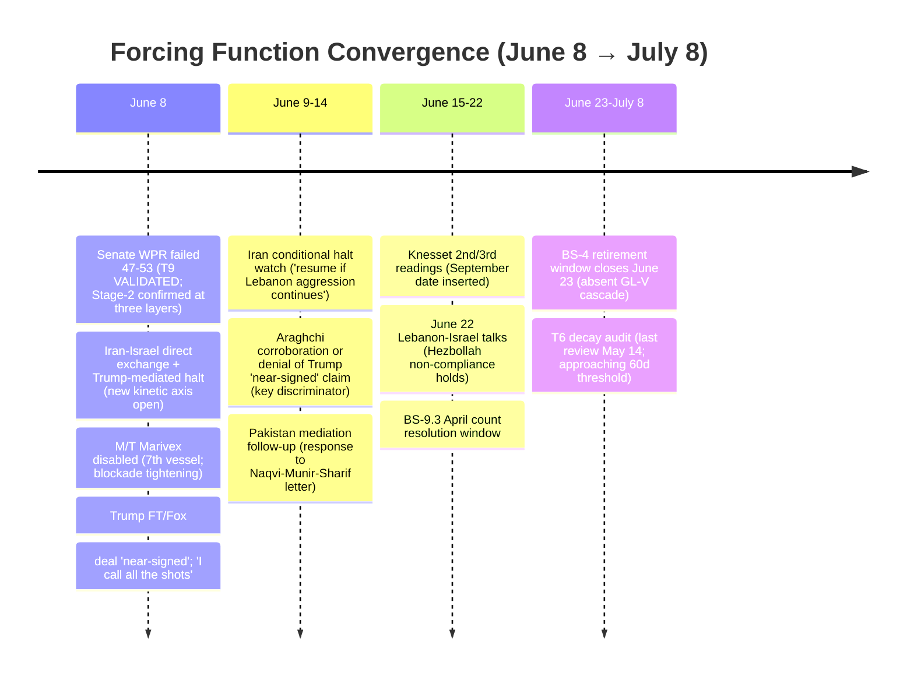
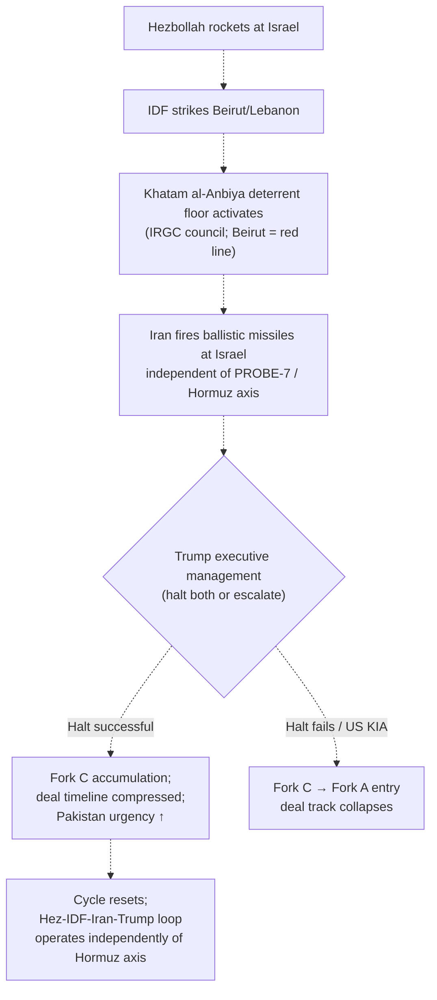
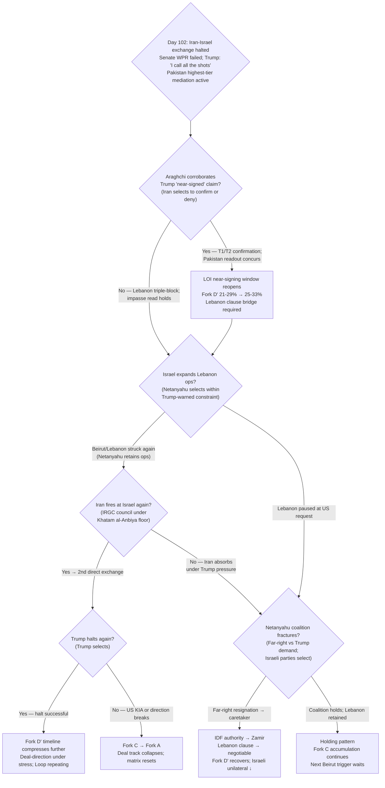

# Iran 2026 Operational SITREP — Daily Update
**Day 102 | Monday, June 8, 2026**
*Annex/Update to Iran 2026 Operational SITREP and Strategic Synthesis (base report v4.2)*
*Note: Covers Days 101-102 (June 7-8). Day 101 annex not produced separately.*

## Executive Summary

Iran and Israel exchanged direct ballistic-missile fire June 7 — IDF struck Beirut's Dahieh; Khatam al-Anbiya Headquarters launched 20+ missiles at Israel in 7 barrages — and both halted under Trump pressure within hours. The Senate rejected the on-merits war powers resolution 47-53, completing the first full bicameral floor test and confirming T9 Stage-2 hysteresis architecture. Pakistan elevated its mediation to the highest tier in the conflict (Interior Minister Naqvi delivered a joint Munir+Sharif letter to Mojtaba Khamenei). The cycle's defining analytical signal: Trump told the Financial Times the deal "would have been signed Monday, Tuesday or Wednesday" before the exchange, that he "calls all the shots" on any Iran agreement, and that Netanyahu "won't have any choice" but to accept whatever Washington negotiates — corroborated by Netanyahu's capitulation after Trump threatened isolation.

Supersedes `day-100` · T9 VALIDATED confirmed ↑ · Iran-Israel kinetic axis NEW · Fork D' lower bound stabilizing

| Vector | Direction | Driver |
|---|---|---|
| Iran-Israel direct exchange | NEW | IDF Beirut Dahieh; 20+ Iran missiles at Israel; 7 barrages; both halted after Trump pressure |
| Senate WPR on-merits | FAILED 47-53 | Fetterman with Republicans; T9 VALIDATED; Stage-2 architecture confirmed at three layers |
| Trump: "I call all the shots" | ↑ T4 behavioral confirmed | FT interview; Netanyahu warned of isolation; Netanyahu capitulated (tape action) |
| Trump: deal "near-signed" | DISCOUNTED / directionally positive | "Would have been signed Mon/Tue/Wed" — near-zero on precision; Pakistan escalation independent corroboration |
| Pakistan mediation | ↑ highest tier | Naqvi delivers joint Munir+Sharif letter to Mojtaba; second Naqvi visit in <7 days |
| Netanyahu spoiler modality | REVISED | Coordinated (informed Trump before Beirut; halted Iran at Trump request); Lebanon operations retained |
| Brent crude | $94 close | Spiked +4% to $97+ intraday on exchange; eased to $94 after halt; confirms deal-direction pricing |
| BS-15 first-mover | Third axis added | Iran-Israel direct kinetic pathway independent of PROBE-7 US-CENTCOM discriminator |

> Leading primitives: Fork C 30–39% / 30d, Fork D' 21–29% / 30d. Highest-delta this cycle: T9 VALIDATED confirmed; Iran-Israel third accident surface. None-of-above floor: 5%.

---

## Section 1 — Operational Update

**Trump's Financial Times interview produced the strongest deal-direction signal of the conflict.** On record, Trump stated the Iran deal "would have been signed on Monday, Tuesday or Wednesday" before the exchange; "I call the shots — I call all the shots, he doesn't call the shots"; Netanyahu "won't have any choice" but to accept any Washington-negotiated agreement; and the exchange "won't have any impact on the deal." Sources: FT interview + Fox News (T2, multi-outlet: Haaretz, Times of Israel, The Hill). Discount: near-signing precision discounted near-zero; deal-direction and Netanyahu-constraint assertions are corroborated by behavioral tape action (Netanyahu complied). Araghchi "messages continue" framing from Day 100 T1 carries.

**The Iran-Israel direct exchange June 7 is the first Iranian ballistic-missile barrage at Israel in this conflict window.** IDF struck Beirut's Dahieh district (Hezbollah headquarters) after Hezbollah fired rockets at northern Israel; 2 killed, 11 wounded. Khatam al-Anbiya Central Headquarters (General Abollahi, named statement) declared this "crossed all red lines" and launched 20+ ballistic missiles in 7 barrages at northern, central, and southern Israel. Iran announced a halt June 8 afternoon but warned attacks "would resume if Israel carries out further acts of aggression and hostility, including in Lebanon." Israeli media then confirmed a halt at Trump's request.

**Trump's constraint on Netanyahu operated through explicit isolation threat.** Times of Israel (T2): Israel was preparing a significant Tehran strike when Trump called Netanyahu and ordered a halt; Netanyahu resisted in the first call; Trump warned he would "isolate himself" if he continued. Netanyahu then halted Iran strikes. Internal Israeli disagreement emerged between Netanyahu and far-right security cabinet. Key Israeli official confirmed: "the decision to halt strikes on Iran was made at Trump's request — Israel will not stop its offensive against Hezbollah in Lebanon." Behavioral sequence (resistance → isolation threat → compliance) is tape action beyond statement.

**Pakistan elevated to highest diplomatic tier in the conflict.** Interior Minister Naqvi delivered a joint "special letter" from Army Chief Munir AND Prime Minister Sharif to Supreme Leader Mojtaba Khamenei through Araghchi, June 7-8. This is the first time Pakistan has committed both the military apex (Munir) and civilian PM on the same diplomatic communication. Second Naqvi visit in less than a week. Araghchi met Naqvi; "messages continue" from Day 100 holds.

**Military/maritime posture:**

| Asset / Signal | Day 100 baseline | Day 102 read | Implication |
|---|---|---|---|
| US-CENTCOM Hormuz axis | 5th kinetic cycle; Goruk/Sirik/Qeshm | Quiet June 7; M/T Marivex disabled June 8 (Gulf of Oman; 7th vessel) | Discriminator holds: blockade enforcement, not resumed ops |
| Iran-Israel axis | No prior direct ballistic launch at Israel in this window | 20+ ballistic missiles; 7 barrages at northern/central/southern Israel | T12 advance; third accident surface open |
| IRGC posture | "Capabilities increased" (June 2) | Khatam al-Anbiya HQ: Beirut = "red line"; Abollahi named public statement | Apex deterrent floor on Israel axis stated; IRGC-council authorization |
| Netanyahu spoiler | Active-defiant (Day 100: denied ceasefire; ordered strikes) | Active-coordinated: informed Trump before Beirut; halted Iran at Trump request; retained Lebanon | Modality shift; Powell mechanism constrained but active |
| Knesset dissolution | 2nd and 3rd readings pending | Advancing through readings; September elections on track | Pre-caretaker window compressing |
| USS Eisenhower | No deployment order | No deployment order | Fork B indicator holds |
| Saudi Arabia | MBS "any measures" (June 6) | Air sirens near US base during exchange; "danger passed" | Collateral air-defense activation; no fracture; no public condemnation of Iran-Israel exchange |

**Markets:**

| Asset | Pre-war (Feb 28) | Day 100 (June 6) | Day 102 (June 8) | Δ vs pre-war |
|---|---|---|---|---|
| Brent crude | $73 | ~$93–95 | ~$94 close ($97+ intraday) | +29% |
| WTI crude | $70 | ~$90–92 | ~$91 est | +30% |
| Brent backwardation (Jul26–Jul27) | flat | ~$29/bbl | ~$29/bbl (held) | Physical tightness persistent |
| Iranian rial parallel | ~960k/USD | under pressure | under pressure | –44%+ |
| US gas / gallon | $3.27 | ~$4.10 | ~$4.10 est | +25% |

Brent spiked +4% (above $97) on the Iran-Israel exchange, then eased to ~$94 close after Iran announced the halt and Trump confirmed deal-direction. The intraday reversal is market pricing the exchange as temporary, consistent with the Trump-managed halt. No Kharg saturation event; no commercial restoration.

**US domestic: Senate WPR failed 47-53; full bicameral floor test complete.** Senate rejected H.Con.Res.38 47-53: Fetterman voted with Republicans; Paul voted for the resolution. The House had passed a similar resolution June 3 (215-208; Day 97; four Republicans joining Democrats), the first House passage in the conflict window. With the Senate now failing on-merits, the bicameral test is complete: House passed; Senate rejected. T9 VALIDATED. White House Chadha-precedent challenge (concurrent-resolution unconstitutionality) holds as a second legal layer; no Federal court WPA challenge filed.

**International: Pakistan dominant; Gulf troika silent; Russia absent.** Pakistan is the operative mediation actor this cycle. Gulf troika: no MBS/MBZ/Tamim statement on the Iran-Israel exchange (contrast with Day 100 Kuwait/Bahrain attacks which produced immediate condemnations). Saudi Arabia sounded air defense sirens near a US base during the exchange; said "danger passed" shortly after. Russia entirely absent from June 7-8 activity; consistent with T10.

---

## Section 2 — Framework Validation

- **A9 (constraints precede; T-anchor T7):** Iran-Israel exchange, Senate WPR failure, and Pakistan mediation escalation materialized simultaneously without joint design. Each actor selected the dominant option under its own constraint layer: IRGC deterrent floor (Iran fires when Beirut crossed); Powell spoiler logic (Netanyahu strikes Lebanon while routing to Trump); deal-faction constraint (Trump halts both). Multi-layer simultaneous prediction confirmed.

- **A4 (IRGC functional apex; T-anchor T3):** Khatam al-Anbiya HQ (Abollahi, named statement) is the apex deterrent-floor voice on the Israel axis — consistent with IRGC-council authority, not Mojtaba direct. Pakistan letter addressed to Mojtaba (nominal apex) delivered through Araghchi (mid-tier). Pezeshkian still blocked from intelligence appointments. Two-level structure intact on two independent axes.

- **A23 (Netanyahu spoiler; T-anchor T8) — modality revised.** Prior (Day 100): active-defiant. New: active-coordinated. Netanyahu informed Trump before the Beirut strike and halted Iran strikes under Trump's isolation threat. Lebanon operations explicitly retained. The Powell mechanism is active — Netanyahu is pursuing Lebanon-axis compression of the deal window while routing through the Trump framework rather than acting against it.

- **T4 (deal-faction) — strongest behavioral confirmation of the conflict.** "I call all the shots" + Netanyahu complied + Iran halted after Trump pressure = deal-faction exercising operational authority on both the US-Iran and Iran-Israel axes simultaneously. This is multi-outlet T2 tape action, not statement-only.

---

## Section 3 — Framework Revisions Required

**TRIGGER FIRED — Lebanon triple-block deepening; A23 modality revised (PROBE-9, H, immediate).** Prior: Lebanon clause three-level blocked; Netanyahu active-defiant. New: Iran fired 20+ missiles at Israel after Beirut strike; halted under Trump pressure; Netanyahu informed Trump before striking and halted Iran strikes at Trump's request while retaining Lebanon. Revised: **A23 assumption — spoiler modality: active-defiant → active-coordinated.** Mechanism unchanged (Powell pre-emption; Lebanon clause blocking Fork D'). Modality shifts: Netanyahu routes Israel-facing decisions through Trump framework rather than against it. Lebanon triple-block remains fully operative. **Iranian conditional halt establishes a Beirut/Lebanon deterrent floor on the Israel axis explicitly:** Iran will fire directly at Israel if Lebanon/Beirut is violated, independent of the US-CENTCOM Hormuz axis. Trend: **T8 advance** (Powell mechanism constrained but compounding; IDF Lebanon ops continuing = window closing); **T3 advance** (apex deterrent floor stated on Israel axis; mid-tier continues); **T4 advance** (deal-faction constraining Netanyahu operationally for the first time with explicit tape action).

**TRIGGER FIRED — Senate WPR failed 47-53; T9 VALIDATED confirmed at bicameral floor (PROBE-10, H, immediate).** Prior: T9 disc-ratio 4:10; on-merits vote pending. New: Senate rejected 47-53 (Fetterman with Republicans); House had passed 215-208 June 3 (Day 97); bicameral floor test complete with Senate failure. Revised: **T9 VALIDATED — Stage-2 hysteresis at three layers: (1) "hostilities terminated" certification; (2) Chadha concurrent-resolution unconstitutionality claim; (3) Senate on-merits defeat.** Disc-ratio holds 4:10 (Senate failure = T9 supporting cycle). /premortem flag from Day 97 partially released: T9 in confirming-cycle streak. Re-evaluate at next /audit whether 30-day decay clause applies. Trend: **T9 advance** (full bicameral test passed; executive path confirmed).

**TRIGGER FIRED — Trump behavioral authority over Netanyahu; A1 confirmed (PROBE-13, H, immediate).** Prior: A1 deal-leaning, strained (Trump expletive call). New: Trump warned Netanyahu isolation; Netanyahu resistant then complied; Iran halted after Trump pressure; both publicly cited Trump; Trump FT interview confirmed deal-direction. Revised: **A1 oscillation: deal-leaning, behaviorally confirmed.** Tape action confirmed across three actors (Netanyahu halted; Iran halted; both named Trump). The near-signing claim ("Monday/Tuesday/Wednesday") is discounted near-zero on precision; the deal-direction confirmation carries at M. Trend: **T4 advance** (deal-faction authority explicit and operational); **T3 advance** (two-level structure intact; Pakistan mid-tier and IRGC-council apex continuing).

**TRIGGER FIRED — 20+ missiles at Israel; T12 advance on Israel axis (PROBE-14, H, immediate).** Prior: T12 VALIDATED (GCC axis). New: largest Iran-Israel direct ballistic-missile barrage in the conflict window; 7 barrages; northern/central/southern Israel simultaneously. Revised: **T12 advances on the Israel axis independently** — sustained offensive ballistic-missile capacity on two distinct target axes (GCC: Day 100; Israel: Day 101) confirmed in successive cycles. Trend: **T12 advance** (Israel-axis demonstration); **T2 advance** (Mosaic-Octopus multi-axis calibration: direct strike and diplomatic tracks operating simultaneously).

**TRIGGER FIRED — Third accident surface; BS-15 architecture expanded (PROBE-16, H, immediate).** Prior: accident surface on US-Iran Hormuz + Lebanon-ceasefire axes. New: Iran-Israel direct ballistic-missile exchange is now a structurally operational third axis, independent of the PROBE-7 self-defense discriminator. Revised: **BS-15 joint first-mover architecture expanded.** See Section 4 for structural addition. Trend: **T8 advance** (Powell amplifier on Israel axis: Israeli pre-emption incentive driven by Iran demonstrating direct Israeli-territory strike capacity during the ceasefire, independent of deal-credibility state).

**FLAG (NEXT CYCLE) — Trump "near-signed" claim requires Araghchi/Iran-side corroboration.** Trump stated the deal "would have been signed Monday/Tuesday/Wednesday" (Fox News, FT, T2 multi-outlet). Discount: near-zero on precision without non-Trump corroboration. Pakistan dual-principal escalation (Munir+Sharif same letter) is independent of Trump statement and is consistent with a near-signing push. Discriminating signal: Araghchi T1 or Pakistan T1/T2 readout confirming deal-text proximity. Assign NEXT CYCLE urgency (signal could arrive within 24-48 hours). Do not revise Fork D' upward on Trump statement alone; move on corroboration.

---

## Section 4 — Framework Additions

**Iran-Israel direct kinetic axis as independent structural accident pathway.** Prior synthesis models Iran-Israel conflict as: (1) Israeli pre-emption against Iranian nuclear/military sites; (2) proxy escalation through Hezbollah/Lebanon. The June 7 sequence adds a third entry path: Iran fires ballistic missiles directly at Israel in response to IDF strikes in Lebanon, independent of any US-CENTCOM involvement. This does not activate PROBE-7. It is governed by: (a) Khatam al-Anbiya deterrent floor (Lebanon/Beirut = Iranian red line); (b) Trump executive management on the Israel side; (c) Iran's explicit conditional halt framing.

| Property | Reading |
|---|---|
| Trigger condition | IDF strikes Beirut/Lebanon (not US-Iran Hormuz provocation) |
| Iranian decision unit | Khatam al-Anbiya HQ (IRGC-council authorized; Abollahi communicating) |
| Trump management | Active; halted both sides June 7; Israel complied under isolation threat |
| Iran halt conditionality | "Resume if further aggression including in Lebanon" — Lebanon is the explicit activator |
| PROBE-7 applicability | NOT applicable — Iran-Israel direct exchange, not US-CENTCOM inside Iran |
| Fork C implication | New independent accident surface; any future Beirut/Lebanon IDF strike could trigger |
| Fork D' implication | Each activation compresses deal timeline; strains Trump deal-direction durability |
| Discriminating signal | Second exchange within 14 days without Trump halt = structural escalation; Trump fails to halt one party = Fork C → Fork A threshold |

This pathway is structurally operational as of Day 101. The four-step cycle (Hezbollah rockets → IDF Beirut → Iran missiles at Israel → Trump halt) will recur unless Lebanon is resolved. Each iteration consumes executive bandwidth and compounds Fork C accumulation.

---

## Section 5 — Revised Probability Matrix

### 5a. 30-Day Matrix (cycle-Bayesian)

| Outcome | 30 days | vs. Day 100 | Driver |
|---|---|---|---|
| **Fork C: Miscalculation cascade** | **30–39%** | HELD | New Iran-Israel axis (↑) offset by Trump-managed halt (↓); third surface adds tail risk |
| **Fork D': Structured deferral** | **21–29%** | 20–28% → 21–29% ↑ slim | Pakistan highest-tier escalation + Trump near-signing (discounted) firm lower bound; Lebanon triple-block still operative |
| **Fork A: Kinetic resumption (composite)** | **18–28%** | HELD | WPR failed = no foreclosure; Netanyahu coordinated-spoiler = slightly less unilateral |
| · Israeli pre-emption (14–21d) | **32–45%** | HELD | T12 Israel-axis advance + Powell loading; Trump coordination constraint partially offsets unilateral sub-path |
| · US Vahidi decapitation (standalone) | **5–12%** | HELD | A4 target framing holds; no principal-targeting signal |
| **Fork B-bilateral** | **7–12%** | HELD | Lebanon triple-block holds; Trump near-signing discounted without Araghchi corroboration |
| **Fork B-multilateral via Gulf** | **8–12%** | HELD | Gulf troika silent but intact; Pakistan dominant; Saudi sirens contained |
| **Combined Fork B** | **15–24%** | HELD | |
| **None of the above** | **5%** | HELD | Mandatory non-zero floor |

**Fork D' candidate decomposition (pre-staging; midpoint 25%, below 30% threshold).** If decomposition trigger fires next cycle: D'-i (LOI signed; Lebanon deferred via Hezbollah partial South Litani withdrawal + Araghchi conditional ceasefire language); D'-ii (LOI signed; Lebanon bridged via post-caretaker Zamir baseline after Netanyahu coalition fractures); D'-iii (strangulation-driven forced sign; BS-1b bazaar signal triggers; IRGC accepts imperfect LOI); D'-iv (LOI signed; Lebanon bracketed as Phase-2 separate track; US explicitly separates Lebanon from Iran-US deal scope); D'-v (LOI aborted; second unmanaged Iran-Israel exchange breaks Trump deal-direction before signature).

> **KEC [DERIVED]:** ~50–68% (30d). Fork A 18–28% + Fork C 30–39% + tail (<2%). Held from Day 100. Primitives lead.

### 5b. 6/12-Month Matrix (structural-prior; no update this cycle)

| Outcome | 6 months | 12 months | Last updated | Driver |
|---|---|---|---|---|
| Fork A composite | 38–48% | 43–53% | v4.1 (Day 84) | Time arithmetic; T12 amplifier |
| Fork B-bilateral | 12–18% | 12–18% | v4.1 (Day 84) | Apex PA-gap constraint |
| Fork B-multilateral | 12–20% | 14–22% | v4.1 (Day 84) | Gulf pathway institutionalizing |
| Fork D' structured deferral | 18–24% | 12–18% | v4.1 (Day 84) | LOI expiration compresses |
| Fork C miscalculation cascade | 16–22% | 16–22% | v4.1 (Day 84) | Structural accident pathway |
| None-of-above | 10–15% | 10–15% | v4.2 (Day 88) | Mandatory non-zero floor |

---

## Section 6 — Probe Status Table

| PROBE | Status | Conf | Trigger | Variable Moved |
|---|---|---|---|---|
| 1 Mojtaba | null | L | no | Pakistan letter addressed to Mojtaba (nominal apex); no visual/death |
| 2 IRGC Factional | partial | M | no | Khatam al-Anbiya HQ Abollahi named statement (military command, not Aliabadi economic); Aliabadi still silent |
| 3 Bazaari/Bonyad | partial | M | no | Day 97 signal carries; rial data quality issue; no T1/T2 upgrade |
| 6 Chinese Support | null | L | no | BS-4 retirement window continues through June 23 |
| 7 CENTCOM Posture | partial | M | no | Hormuz axis quiet June 7; M/T Marivex disabled June 8 (blockade; not Fork C) |
| 8 Oil Markets | partial | M | no | Brent $94 close; $97+ intraday; no Kharg event; no restoration |
| **9 Israeli Internal** | **fired** | **H** | **yes** | Lebanon triple-block deepening; A23 modality revised; T8 advance |
| **10 War Powers** | **fired** | **H** | **yes** | Senate WPR failed 47-53; T9 VALIDATED; bicameral test complete |
| 12' MOU Framework | partial | M | no | Iran suspended June 1 (resumed); Naqvi letter; "messages continue"; LOI not signed |
| **13 PA-Gap** | **fired** | **H** | **yes** | Trump: "I call all the shots"; Netanyahu complied; Iran halted; A1 behavioral confirmation |
| **14 Iranian Residual** | **fired** | **H** | **yes** | 20+ missiles at Israel; T12 Israel-axis advance; multi-axis capability confirmed |
| 15 Dispositional | partial | M | no | Netanyahu coordinating before Beirut; Iran cites Trump in halt; T8 at maximum |
| **16 First-Mover** | **fired** | **H** | **yes** | Third accident surface; BS-15 architecture expanded; Iran-Israel axis independent of PROBE-7 |
| 17 Russian Siloviki | null | L | no | SPIEF June 5 carry-forward; Russia absent from all June 7-8 activity |
| 18 Eschatological | null | L | no | No Tier-1/2 events; T5 PENDING holds |
| 20 Gulf Troika | partial | M | no | Troika silent on Iran-Israel exchange; Saudi air sirens near US base (contained); no fracture |
| 21 Paine Death-Ground | partial | M | no | P-AIM limited-aims holds (no demand hardening post-June 7); P-INFO continuing |

*Fired: 5 | Partial: 9 | Null: 3 | Gap: 0.*

---

## Section 7 — Conclusion and Forking Analysis

### Central Thesis Check

The v4.0 central thesis holds at the strongest structural-confirmation level of the conflict. Days 101-102 are the clearest single-cycle illustration of the materialist bargaining prediction: Iran fired at Israel (IRGC deterrent floor on Beirut red line; dominant strategy under L1/L2); Netanyahu struck Beirut (Powell window-closing logic; dominant strategy under L3/L4 compression); Trump halted both (deal-faction constraint; dominant strategy under Gulf-brake + strangulation + electoral pressure); Pakistan escalated mediation (unaligned-middle pivot capacity at maximum). Nobody designed the conjunction; each actor selected within their constraint surface. The accident surface expanded while all three actors preserved optionality.

Trend-state lines: **T1 advance** (Pakistan highest-tier mediation; unaligned middle driving final push alongside Gulf brake); **T2 advance** (Iran fires 20+ missiles at Israel while maintaining Pakistan/Araghchi diplomatic track; Mosaic-Octopus multi-axis calibration); **T3 advance** (Khatam al-Anbiya HQ = apex deterrent floor on Israel axis; Pakistan/Araghchi mid-tier = deal track same day; two-level structure on two independent axes simultaneously); **T4 advance** (Trump "I call all the shots" — deal-faction exercising operational authority on US-Iran and Iran-Israel axes simultaneously; strongest behavioral T4 confirmation in conflict window); **T5 hold PENDING** (no Tier-1/2 events); **T6 hold** (Russia absent; April count unresolved); **T7 hold** (voice discipline); **T8 advance** (Powell at maximum: Netanyahu coordinating with Trump = constrained but compounding; T12 Israel-axis demonstration = pre-emption incentive rising independently of deal-credibility); **T9 advance, VALIDATED confirmed** (Senate on-merits defeat; disc-ratio 4:10 held; Stage-2 architecture at three layers); **T10 hold PENDING** (Russia/China both absent from June 7-8 mediation); **T11 hold PENDING**; **T12 advance** (20+ missiles at Israel = Israel-axis demonstration; multi-axis offensive capacity confirmed during ceasefire).

### Forking Tree (72-Hour Decision Path)

### Operative Judgment

The most analytically significant feature of Days 101-102 is a tension between two independent readings: the Day 100 "confirmed impasse" reading and the emerging multi-signal cluster suggesting the deal was structurally closer to signature than that read implied. The cluster: Trump's "would have been signed" claim (discounted on precision, directionally credible); Pakistan escalating to both military and civilian principals on the same communication simultaneously (independent of Trump statement); Trump's behavioral authority over Netanyahu confirmed through tape action (resistant → isolated threat → complied); and Iran's conditional halt framing (not a hard exit, but a deterrent-floor statement with a resumption condition). These four signals — particularly the Pakistan escalation and the behavioral Netanyahu compliance — are more consistent with a deal at the signature stage, disrupted by the Lebanon/Beirut provocation, than with a deal structurally blocked.

The structural tension is that the Lebanon triple-block remains fully operative and did not soften this cycle. Iran fired at Israel over the same Beirut provocation that is blocking the deal. The gap between "Iran-US bilateral terms near-agreed" and "deal impossible to sign" is precisely the Lebanon clause: both sides may be close on the bilateral terms (HEU custody, Hormuz architecture, sanctions relief, frozen assets) while the Lebanon clause — which requires Hezbollah consent and Israeli operational restraint — remains three-level blocked. If Trump's claim is accurate, the LOI text was approaching the signature stage on the bilateral terms, and the Lebanon clause was either being deferred or was about to be bracketed. The Iran-Israel exchange disrupted the signing ceremony without necessarily breaking the bilateral text.

The key discriminating signal for the next 72 hours: does Araghchi confirm deal-text proximity, or does he hold to the "no formal process" framing? A confirmation by a T1 Iranian source would be the single largest Fork D' positive signal of the conflict and would warrant a probability revision. A denial or continued "messages continue" holding pattern means the Trump statement is discounted and the impasse read prevails.

The Iran-Israel kinetic axis will recur. The four-step cycle (Hezbollah rockets → IDF Beirut → Iran missiles at Israel → Trump halt) is now structurally operational and will activate again with the next significant Lebanese provocation. Trump managed it successfully June 7-8, but each iteration compresses the deal timeline, strains executive bandwidth, and raises the probability that one exchange will produce the event that breaks the deal-direction: a US KIA, a Trump oscillation toward maximalism, or a Netanyahu-Trump break on Lebanon. The holding pattern is sustainable in the short term; it is not sustainable indefinitely.

### Signals That Force Immediate Revision

- Araghchi T1 corroboration of Trump "near-signed" claim: Fork D' 21-29% → 24-33%; LOI architecture from "impasse" to "near-signing"; synthesis revision candidate
- Second Iran-Israel direct exchange without successful Trump halt: Fork C → 34-44%; deal-direction breaking signal; synthesis revision required
- Netanyahu coalition fracture (far-right resignation over Trump "won't have any choice"): caretaker accelerates; Lebanon clause → IDF Zamir authority; Fork D' recovery conditional on Zamir posture
- US KIA in any kinetic exchange: Fork C resolves into Fork A; deal track collapses; matrix resets
- Hezbollah accepts South Litani withdrawal: Lebanon triple-block partially resolves; Fork D' lower bound recovers toward 26-34%
- IDF air-refueling tempo or F-35/F-15 forward-positioning signals: Israeli pre-emption operational; Variant B reprices toward 38-50%
- Vahidi direct named statement on HEU: A4 HEU-axis resolved; synthesis revision candidate
- Iran hard exit from talks (SNSC or Araghchi T1 refusing Pakistan channel): Fork D' collapses below 15%; synthesis revision required
- Saudi public support for US military action against Iran: BS-18 fractures; Fork A re-elevates; Fork B-multilateral collapses
- BS-9.3 fires (April <2 confirmed + May ≤1 + June ends ≤1): Russia emergency synthesis review

---

*Compiled June 8, 2026 | Day 102 | Subject to revision as data updates*
*Companion: sweep-2026-06-08.json; synthesis-v4-2.md.*
*Next SITREP: Day 103 (June 9); monitor: Araghchi statement on deal proximity (Trump "near-signed" discriminator); Iran conditional halt (Lebanon operations watch); Pakistan readout on Naqvi-Mojtaba letter; Brent direction on deal-direction signals; Knesset dissolution next reading; BS-9.3 April count.*
