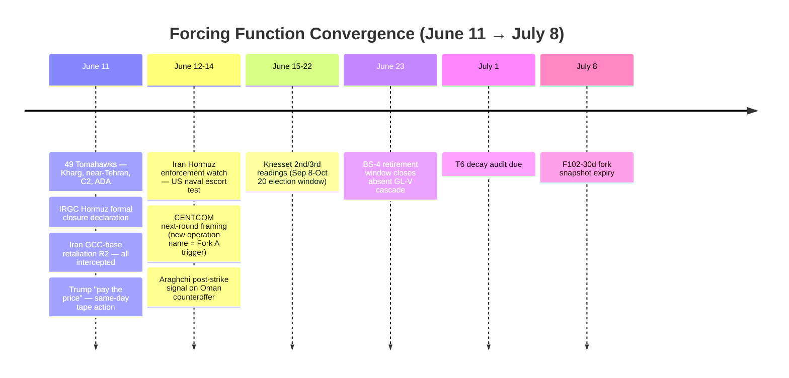
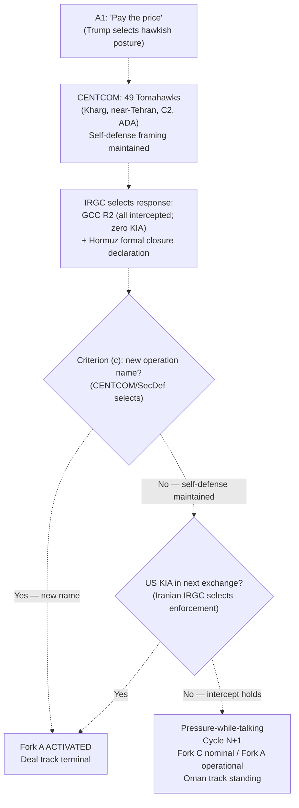
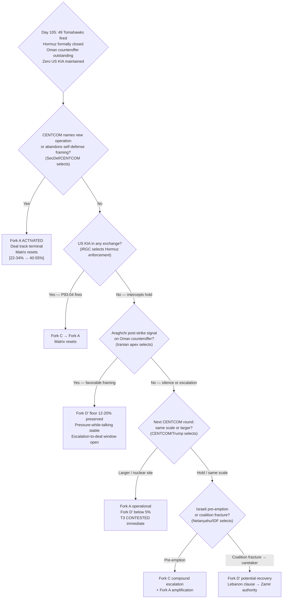

# Iran 2026 Operational SITREP — Daily Update
**Day 105 | Thursday, June 11, 2026**
*Annex/Update to Iran 2026 Operational SITREP and Strategic Synthesis (base report v4.2)*

## Executive Summary

CENTCOM launched 49 Tomahawk cruise missiles on June 11, striking targets within 40 miles of Tehran, Kharg Island, command-and-control nodes, ammunition depots, radar, and air defense systems across Iran — the largest single CENTCOM strike package since the ceasefire. Iran's IRGC formally declared the Strait of Hormuz closed to all vessels and threatened to target any transit attempt; a second GCC-base retaliation round (Bahrain, Kuwait, Jordan) was fully intercepted with zero US KIA. Trump advanced from "final throes" (June 9) to "bridge and power" (June 10) to "pay the price" (June 11), now accompanied by same-day tape action. The PROBE-7 self-defense discriminator has collapsed at criteria (d) proportionality and (e) deal-direction non-reversing; Fork C and Fork A have converged operationally even as CENTCOM maintains nominal self-defense framing. Markets price a "long grind" ($92-94 Brent; Goldman Sachs: $100+ average H2 2026 if Hormuz stays closed; $120 Q3 worst case).

Supersedes `day-102` · Fork C/Fork A converging ↑ · Fork D' collapsing ↓ · PROBE-7 discriminator breakdown · Hormuz formal closure NEW

| Vector | Direction | Driver |
|---|---|---|
| CENTCOM strike scale | ↑ MAJOR | 49 Tomahawks; within 40mi Tehran; Kharg Island; C2/ADA |
| IRGC Hormuz formal closure | NEW | "Closed to all vessels"; transit = targeting |
| PROBE-7 discriminator | BREAKING | Criteria (d) proportionality + (e) deal-direction both failed |
| Fork C / Fork A convergence | ↑ | Nominal self-defense label cannot contain 49-Tomahawk operational scope |
| Fork D' deal track | ↓ MAJOR | Iran rejected proposal June 9; Hormuz formally staked June 11 |
| A1 Trump posture | HAWKISH MAX | "Pay the price" June 11; +48h from "final throes" June 9; same-day tape |
| Kharg Island | STRUCK | First oil-infrastructure hit; PROBE-8 fires |
| Brent crude | $92-94 | "Long grind" market read; Goldman $100+/H2 threshold |
| US CPI (May) | 4.2% | Up from 3.8% April; energy-cost transmission accelerating |

Leading primitives: Fork C 35–47% / 30d, Fork A 22–34% / 30d. Highest-delta this cycle: Fork D' ↓ (Hormuz staked; LOI hardened); Fork A ↑ (PROBE-7 breakdown). None-of-above floor: 5%.

---

## Section 1 — Operational Update

**CENTCOM struck 49 Tomahawk targets across Iran including within 40 miles of Tehran and Kharg Island, the largest post-ceasefire US strike package.** Starting 5:15 PM ET Wednesday, strikes confirmed at Sirik, Bandar Abbas, Qeshm, Hengam Island, Kharg Island. Explosions in cities near Tehran: Abyek, Qarchak, Nazarabad, Karaj. Targets: military surveillance, communications, air defense systems, ammunition depots, command-and-control nodes. CENTCOM maintained "self-defense in response to Iran's unwarranted and continued aggression" framing throughout; no new operation name declared. Trump confirmed the Tomahawk count to Fox News.

**Iran's IRGC formally declared the Strait of Hormuz closed to all vessels, explicitly threatening to target any transit attempt.** The formal declaration was announced June 11 post-strikes (Business Standard, RFERL; T2 confirmed). Context: de facto >90% traffic reduction has been in effect since February 28; this declaration formalizes Iran's legal-operational posture. The Hormuz clause is now a publicly staked sovereign-security position. Any deal addressing Hormuz access must provide Iran face-saving framing of a concession or the declaration cannot be walked back without regime-prestige cost.

**Iran conducted a second GCC-base retaliation round; all intercepts successful; zero US KIA.** Ballistic missiles and drones at Bahrain, Kuwait, Jordan US bases (NBC News). All intercepted per DoD. Pattern continues from June 9-10 first round.

**Trump: "Tehran will pay the price" / "will hit Iran very hard."** Social media confirmed by CBS News and multiple T2 outlets. A1 arc: June 9 "final throes" → June 10 "bomb the bridge and power" → June 11 "pay the price." Near-zero informational value on commitment per discipline. However, the 49-Tomahawk tape action has followed each statement within 12-24 hours, compressing the prior 48-72h statement-to-action gap.

**Diplomatic track: Iran rejected current proposal June 9; Oman counteroffer outstanding; no Araghchi post-strike statement retrieved.** Full timeline: May 28 deal-ready scoop → May 31 Trump HEU+Hormuz edits → June 1 Iran suspension → June 9 Iran rejected proposal + Oman counteroffer tabled → June 10 Araghchi "ceasefire practically meaningless" → June 11 Hormuz formal closure. P102-01 (72h Araghchi corroboration window) expired without corroboration; see Section 2.

| Asset / Signal | Day 102 baseline | Day 105 read | Implication |
|---|---|---|---|
| CENTCOM strike scope | Goruk/Sirik/Qeshm (3-target range) | 49 Tomahawks; Kharg + near-Tehran + Hormuz area | Criterion (d) proportionality broken; Fork A scale reached |
| Iran retaliation pattern | GCC R1 (June 9-10; all intercepted) | GCC R2 (June 11; all intercepted; zero KIA) | Pattern stable; no KIA; nominal Fork C |
| Hormuz status | De facto >90% traffic reduction | IRGC formal closure declaration; transit = targeting | LOI Hormuz clause hardened as sovereign position |
| Kharg Island | Intact through Day 102 | Struck June 11 | PROBE-8 fires; oil-infrastructure escalation |
| A1 statement-to-action gap | "Bridge/power" June 10; strikes June 9-10 | "Pay the price" June 11; Tomahawks same-day | Gap compressing; A1 hawkish posture driving tape action |
| USS Eisenhower | No deployment order | No deployment order | No change |
| BS-9.3 (Putin count) | April count unresolved | Meduza: 60+ events April+May; NOT triggered | T6 holds VALIDATED |

| Asset | Pre-war (Feb 28) | Day 102 (Jun 8) | Day 105 (Jun 11) | Δ vs pre-war |
|---|---|---|---|---|
| Brent crude | $73 | $94 | $92-94 | +26-29% |
| WTI crude | $70 | ~$91 | $86-92 | +23-31% |
| Brent backwardation (Jul26-Jul27) | flat | $29/bbl | $29/bbl | Physical tightness persistent |
| Iranian rial (parallel) | ~960k/USD | under pressure | 1,790,000 | -53% |
| US gas / gallon | $3.27 | ~$4.10 | ~$4.10-4.20 | +25-29% |
| US CPI annualized | -- | 3.8% (Apr) | 4.2% (May) | Accelerating |

Brent response to 49 Tomahawks and Hormuz formal closure: contained at $92-94. Market pricing prolonged conflict over immediate catastrophe; de facto blockade already priced since February 28. Goldman Sachs: $100+ average Brent H2 2026 if Hormuz closure continues; $120 Q3 worst case (OilPrice.com T3). CNBC June 11: "Investors brace for a 'long grind' as Iran war escalation dims hopes of an early end."

**US domestic: No WPR challenge to Tomahawk expansion; CPI 4.2%.** No Congressional response to June 11 strikes retrieved. May CPI 4.2% (Reuters; HCR June 10 newsletter). Energy-cost transmission from $93+ Brent and $4.10+ gas is the primary driver. Domestic pressure on Trump to resolve the conflict is accelerating; A1 "pay the price" posture reflects a simultaneous escalation-to-deal logic rather than resolution.

---

## Section 2 — Framework Validation

- **T9 (Congressional non-intervention):** No WPR challenge to 49-Tomahawk expansion. T9 Stage-2 architecture validated a third straight cycle after bicameral floor test.
- **T12 (Iranian reconstitution speed):** GCC R2 executed under 49-Tomahawk pressure. Hormuz formal closure declared from retained capacity (30/33 Hormuz sites operational per PROBE-14). Offensive posture maintained.
- **A4 (IRGC two-level structure):** Hormuz formal closure via IRGC channel; GCC retaliation via Aerospace Force. Two-level structure functioning across two independent Iranian escalation axes simultaneously.

**Prediction Resolution:**

- **P102-01** (Araghchi T1 corroboration of Trump "near-signed"; resolve-by 72h / Day 105): **did-not-fire**. June 9 Iran rejected proposal; June 10 Araghchi "ceasefire meaningless"; June 11 Hormuz formally closed. Anti-corroboration arrived on all three axes. Matrix-followed: y (Fork D' declining applied this cycle; inverse of pre-committed 24-33% upward move; impasse read confirmed).

- **P90-04** (BS-9.3 fires; April count): **did-not-fire**. Meduza confirmed 60+ public events April+May combined; <2/month threshold not reached; T6 holds. Matrix-followed: n.a.

- **P90-04a** (BS-9.3 April count retrieval; expired-unresolved as of Day 102): **resolved-late**. Data retrieved via Meduza June 9 before second /audit escalation threshold was reached. Removes from expired-unresolved log; no /audit escalation required.

All other open rows (P84-07, P87-01, P85-02, P86-03, P93-01, P93-04, P97-02, P100-09, P102-02, P102-03, P102-08, P102-09) carried forward. P93-04 (US KIA) remains open; zero confirmed KIA through Day 105 despite three consecutive kinetic exchange cycles.

---

## Section 3 — Framework Revisions Required

**TRIGGER FIRED — PROBE-7 self-defense discriminator collapse (H, immediate).** Prior (Day 105 sweep): Fork C self-defense arc; criterion (e) strained. New signal: 49 Tomahawks within 40 miles of Tehran + Kharg Island. Criterion (d) proportionality: broken — 49 Tomahawks responding to an Apache downing is not proportionate by any standard. Criterion (e) deal-direction non-reversing: broken — Kharg + near-Tehran targets constitute active deal-direction reversal in tape action. Criterion (c) no new operation name: technically intact. Revised: **The Fork C/Fork A discriminator is no longer operationally reliable.** Both forks must be treated as elevated and partially overlapping until CENTCOM either (a) names a new operation (Fork A activated) or (b) returns to proportionate-self-defense scales (Fork C reset). Next /audit must recalibrate PROBE-7 criteria or retire the binary discriminator. Matrix: Fork C 30-39% → 35-47%; Fork A 18-28% → 22-34%. **Trend: T3 flag for CONTESTED** — near-Tehran targeting within 40 miles compresses the principal-targeting buffer; single cycle only, not sufficient for demotion; flag for multi-cycle check. **T8 advance** confirmed.

**TRIGGER FIRED — Kharg Island struck; PROBE-8 fires (H, immediate).** Prior: Kharg intact through Day 102; PROBE-8 partial. New: CBS News/NBC confirmed Kharg Island in CENTCOM target list. First oil-infrastructure hit. Brent reaction modest (+2-3%) because de facto blockade already priced. Goldman forward-curve: $100+ Brent H2 2026 if Hormuz closure continues; $120 Q3 worst case. Revised: **BS-13 Hormuz/oil escalation arm operative at infrastructure level.** Trend: **T12 advance** (Iran escalation-ladder matches US oil-infrastructure targeting with Hormuz formal closure; both sides advancing oil-dimension escalation simultaneously).

**TRIGGER FIRED — Hormuz formal closure declaration (H, immediate).** Prior: de facto >90% traffic reduction. New: IRGC formal declaration June 11 — Hormuz closed to all vessels; transit = targeting. New elements: (1) formal stance changes LOI Hormuz clause dynamics; (2) Lloyd's war-risk recalculation triggered; (3) sovereign-prestige staking makes Hormuz concession politically costly for Iranian apex. **LOI Hormuz clause has hardened from a negotiating item to a staked sovereign-security position.** Deal-path requiring Hormuz access concession must now offer Iran a face-saving win large enough to justify formal-declaration retraction. Trend: **T12 advance**; **T4 single-cycle strain** (Hormuz closure = Iranian apex moving against deal-faction constraint; insufficient for T4 CONTESTED on single cycle; flag).

**Trend cross-check summary:** T3 CONTESTED flag (single cycle; not promoted); T4 single-cycle strain (not demoted); T8 advance (multi-cycle confirmed); T12 advance (multi-cycle confirmed). No VALIDATED trend broken on multi-cycle basis this cycle.

---

## Section 4 — Framework Additions

**"Pressure-while-talking" simultaneity as a repeating operational pattern.** Three consecutive CENTCOM rounds (June 9, 10, 11) share a stable architecture: "self-defense" framing; no new operation name; Iranian retaliation fully intercepted; zero US KIA; Oman track nominally alive. This is a distinct operational mechanism — not the initial Fork A campaign and not simple proportionate self-defense. It is generating escalation at Fork A scale while maintaining Fork D' nominal viability.

| Property | Reading |
|---|---|
| CENTCOM framing | "Self-defense" maintained across all three rounds |
| Operational scale trajectory | 3-target → multi-position → 49 Tomahawks/Kharg (escalating) |
| Iranian retaliation | GCC-base strikes, fully intercepted, zero US KIA maintained |
| Deal-track status | Oman counteroffer outstanding; no formal Iranian exit from talks |
| Fork classification | Fork C nominally; Fork A operationally; discriminator degraded |
| Fork A activation trigger | CENTCOM names new operation OR US KIA in any exchange |
| Fork D' revival trigger | Iranian apex publicly engages Oman counteroffer in favorable terms |
| Duration constraint | Stable only while zero-KIA intercept pattern holds |

---

## Section 5 — Revised Probability Matrix

### 5a. 30-Day Matrix (cycle-Bayesian)

| Outcome | 30 days | vs. Day 102 | Driver |
|---|---|---|---|
| **Fork C: Miscalculation cascade** | **35–47%** | 30–39% → 35–47% ↑ | 49 Tomahawks + Kharg + Hormuz formal closure; PROBE-7 discriminator broken; three escalating CENTCOM rounds |
| **Fork A: Kinetic resumption** | **22–34%** | 18–28% → 22–34% ↑ | Tomahawk scale at resumed-operations threshold; Kharg = infrastructure escalation; Fork A/C convergence |
| **Fork D': Structured deferral** | **12–20%** | 21–29% → 12–20% ↓ | Iran rejected proposal June 9; Hormuz staked June 11; LOI clause structurally hardened; Oman counteroffer outstanding but structurally impassed |
| · Israeli pre-emption (14–21d) | **32–45%** | HELD | T12 Israel-axis capability; T8 Powell loading; Trump coordination constraint partially offsets |
| · US Vahidi decapitation (standalone) | **5–12%** | HELD | No principal-targeting signal; T3 nominally intact (single-cycle flag only) |
| **Fork B combined** | **8–13%** | 15–24% → 8–13% ↓ | Active kinetics; dual-side maximalist postures; Hormuz formally staked |
| **None of the above** | **5%** | HELD | Mandatory non-zero floor |

**Fork D' candidate decomposition (pre-staging; midpoint 16%, below 30% threshold).** Candidates from Day 102 retained. Under current conditions, D'-iii (strangulation-forced sign; BS-1b triggers) and D'-v (LOI aborted; pressure-while-talking breaks deal-direction before signature) are the most proximate candidates.

> **KEC [DERIVED]:** ~57–81% (30d). Fork A 22–34% + Fork C 35–47% + tail (<2%). Up from ~50–68% (Day 102). Primitives lead.

### 5b. 6/12-Month Matrix (structural-prior; no update this cycle)

| Outcome | 6 months | 12 months | Last updated | Driver |
|---|---|---|---|---|
| Fork A composite | 38–48% | 43–53% | v4.1 (Day 84) | Time arithmetic; T12 amplifier |
| Fork B-bilateral | 12–18% | 12–18% | v4.1 (Day 84) | Apex PA-gap constraint |
| Fork B-multilateral | 12–20% | 14–22% | v4.1 (Day 84) | Gulf pathway institutionalizing |
| Fork D' structured deferral | 18–24% | 12–18% | v4.1 (Day 84) | LOI expiration compresses |
| Fork C miscalculation cascade | 16–22% | 16–22% | v4.1 (Day 84) | Structural accident pathway |
| None-of-above | 10–15% | 10–15% | v4.2 (Day 88) | Mandatory non-zero floor |

*No update this cycle: no trend state transition, no L1-L5 structural shift, no major-version increment. Note: 6/12m matrix is materially stale given Day 105 developments; flag for update at next /revise.*

---

## Section 6 — Probe Status Table

| PROBE | Status | Conf | Trigger | Variable moved |
|---|---|---|---|---|
| 1 Mojtaba / apex | partial | L | no | A4 provisional; no Mojtaba visual; Pakistan letter mid-tier |
| 2 Vahidi HEU | partial | M | no | 6th cycle without Vahidi direct; IRGC-channel inference only |
| 3 Iranian economy | partial | L | no | IRR 1,790,000; below 20%/wk threshold; bazaar opaque |
| 6 Secondary sanctions | partial | L | no | NFRA warning; Bessent letters (cluster unverified); GL-V not triggered |
| **7 CENTCOM discriminator** | **fired (upgraded)** | **H** | **yes** | Criteria (d)(e) broken; Fork C/Fork A convergence; see Sec 3 |
| **8 Oil / Hormuz** | **fired (post-sweep)** | **H** | **yes** | Kharg Island struck; Hormuz formal closure declared |
| **9 Israeli internal** | **fired** | **H** | **yes** | Knesset 1st reading 106-0; Trump "on your own"; T8 advance |
| 10 War Powers | partial | M | no | No WPR challenge to June 11 expansion; T9 holds |
| **12' MOU framework** | **fired** | **H** | **yes** | Iran rejected proposal June 9; Hormuz staked June 11; LOI impasse structural |
| **13 PA-Gap / A1** | **fired** | **H** | **yes** | A1 hawkish max; 48h oscillation arc; statement-action gap compressed |
| **14 Iranian residual** | **fired** | **H** | **yes** | GCC R2; Hormuz formal closure; T12 multi-cycle advance |
| **15 Dispositional** | **fired** | **M** | **yes** | Both-sides maximalist; Weisiger asymmetry at peak |
| **16 First-mover** | **fired** | **H** | **yes** | 4th accident surface (Iran-GCC US-base); BS-15 expanded |
| 17 Russian siloviki | partial | M | no | BS-9.3 NOT triggered; T6 holds; decay audit due June 14 |
| 19 Eschatological | null | L | no | No activation |
| **20 Gulf troika** | **fired** | **M** | **yes** | UAE pro-escalation drift; BS-18 MBZ-pathway decay |
| 21 Paine death-ground | partial | M | no | P-DG2 candidate (FM hardening post-strike); P-AIM limited-aims holds |

*Fired: 10 | Partial: 6 | Null: 1 | Gap: 0. Post-sweep upgrades: PROBE-8 partial → fired (Kharg confirmed); PROBE-7 fired → fired-upgraded (criteria d/e collapsed).*

---

## Section 7 — Conclusion and Forking Analysis

### Central Thesis Check

The v4.0 materialist bargaining framework is **holding structurally but drifting toward Fork A/Fork C operational convergence**. The Day 105 sequence follows the materialist prediction: CENTCOM executes escalation logic under Apache-provocation chain constraints (L1/L2); Iran executes Hormuz deterrence-floor logic under L2 asymmetric-conflict constraint; Trump's "pay the price" posture reflects domestic pressure (CPI 4.2%, gas $4.10+) and deal-frustration under L3 time arithmetic. No actor designed the 49-Tomahawk/Hormuz-closure conjunction. The constraint surface is compressing choice sets toward kinetic continuation rather than deal resumption across all principal directions simultaneously.

Trend-state lines: **T2 advance** (GCC R2 + Hormuz formal closure + Oman track nominally alive = multi-axis calibration under 49-Tomahawk pressure); **T3 flag for CONTESTED** (near-Tehran strikes within 40 miles compress principal-targeting buffer; single cycle, not promoted; flag for second cycle); **T4 single-cycle strain** (both US and Iranian apex moving against deal-faction constraint simultaneously; flag, not demoted); **T8 advance** (CENTCOM scale + Knesset dissolution advancing = Powell shifting-power mechanism at maximum observable intensity); **T9 hold** (no WPR challenge); **T12 advance** (Kharg struck + GCC R2 maintained + Hormuz formal closure = Iranian offensive capacity sustained under peak CENTCOM pressure). T5, T6, T7, T10, T11 held.

### Forking Tree (72-Hour Decision Path)

### Operative Judgment

The Day 105 crux is the PROBE-7 discriminator collapse. CENTCOM has conducted 49-Tomahawk strikes targeting command-and-control, ammunition depots, air defense systems, and Kharg Island within 40 miles of Tehran while maintaining "self-defense" framing. The operational content matches Fork A (infrastructure, capital environs, oil terminal); the nominal label matches Fork C (no operation name, reactive framing). This ambiguity is the signal, not the noise: Trump appears to be pursuing escalation-to-deal — maximum operational pressure while preserving nominal deal-track framing, betting that Iranian capitulation arrives before US KIA or Iranian Hormuz enforcement closes the deal window.

The Hormuz formal closure declaration is analytically more significant than the Tomahawk count. Before June 11, the LOI Hormuz clause was a structural impasse: hard, but negotiable as a second collision. After June 11, any deal addressing Hormuz access requires Iran to publicly retract a formal IRGC military declaration. Regime-prestige cost of retraction requires a countervailing win large enough to justify it — specifically, some form of US force-posture commitment on Gulf access that Iran can characterize as a sovereignty-preservation outcome. The bilateral terms (HEU custody, sanctions relief, frozen assets) do not supply that win on their own. Fork D' at 12-20% reflects this structural hardening: the path is narrower, not closed, because the Oman counteroffer is outstanding and markets are pricing deal-resumption as possible.

The domestic US constraint is accelerating independently. CPI 4.2%, gas $4.10+, Goldman $100+ Brent if Hormuz stays closed — the economic consequences of a "long grind" are arriving. The escalation-to-deal logic has a short window before it crosses two terminal thresholds: US KIA (collapses deal track irreversibly via P93-04) or Iranian Hormuz enforcement against a US vessel (same outcome). The next 48-72 hours are high-variance: either an Iranian signal of capitulation (Araghchi favorable statement on Oman terms), or another CENTCOM round, or Hormuz enforcement — each producing materially different fork distributions.

### Signals That Force Immediate Revision

- CENTCOM names a new operation (any name beyond "self-defense strikes"): Fork A ACTIVATED; deal track terminal; 30d Fork A 22-34% → 40-55%; Fork D' < 5% (pre-committed; resolve-by: standing)
- US KIA in any kinetic exchange: P93-04 fires; Fork C → Fork A; deal track collapses; matrix resets (resolve-by: standing)
- Iran enforces Hormuz formal closure against US naval escort — fires on US vessel: same as US KIA pathway (resolve-by: standing)
- Araghchi T1 statement engaging Oman counteroffer in favorable terms post-strikes: Fork D' floor 12-20% preserved; "pressure-while-talking" stable; no upward matrix revision without LOI text movement (resolve-by: next 1-2 cycles)
- CENTCOM strike round explicitly targeting Iranian nuclear sites: T3 CONTESTED immediate; Fork A operational; synthesis revision required (resolve-by: next cycle)
- Second Iran-Israel direct exchange without Trump halt: P102-02 fires; Fork C → 38-50%+; deal-direction breaking; synthesis revision required (resolve-by: next Lebanese provocation)
- Netanyahu coalition fractures (far-right resignation): P102-03 fires; caretaker accelerates; Lebanon clause → Zamir authority; Fork D' potential recovery (resolve-by: standing)
- Brent exceeds $100/bbl sustained: Goldman threshold scenario active; oil-price-geostrategy trigger-read activated; domestic US pressure inflection (resolve-by: standing)
- Vahidi direct named HEU statement: P84-07 fires; A4 apex-identity discriminator resolved; synthesis revision candidate (resolve-by: standing)
- Saudi or UAE public endorsement of US military action against Iran: BS-18 fractured; P102-09 fires; Fork A re-elevates; Fork B-multilateral collapses (resolve-by: standing)

---

*Compiled June 11, 2026 | Day 105 | Subject to revision as data updates*
*Companion: sweep-2026-06-11.json; synthesis-v4-2.md.*
*Next SITREP: Day 106 (June 12); monitor: CENTCOM next-round framing (new operation name = Fork A trigger); Hormuz enforcement against US vessels; Araghchi post-strike statement on Oman counteroffer; Brent direction (Goldman $100 threshold); T3 CONTESTED flag (second cycle of near-Tehran strikes).*
