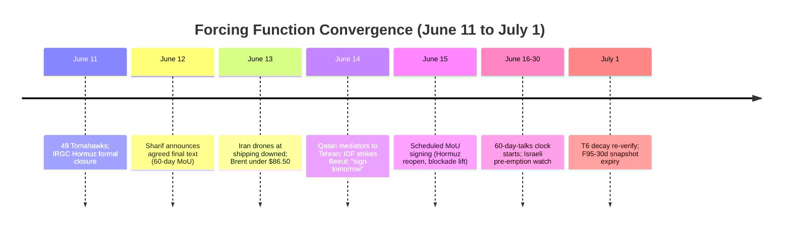
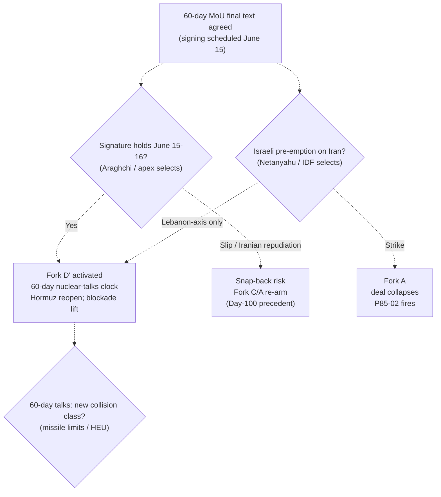
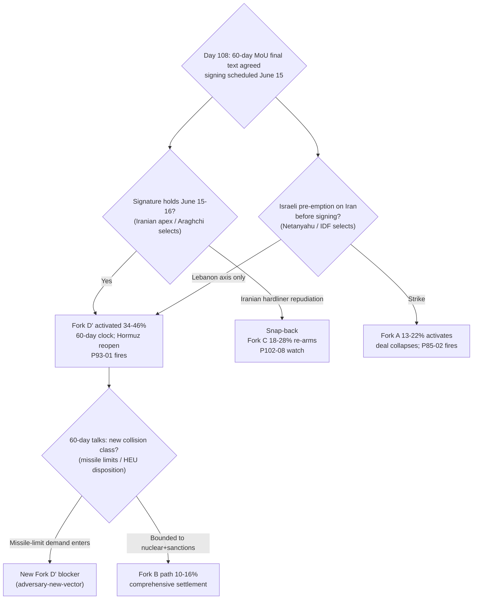

# Iran 2026 Operational SITREP — Daily Update
**Day 108 | Sunday, June 14, 2026**
*Annex/Update to Iran 2026 Operational SITREP and Strategic Synthesis (base report v4.3)*

## Executive Summary

The Day 105 escalation peak reversed into deal-convergence within three days. The US and Iran agreed the final text of a 60-day extension memorandum (Pakistan PM Sharif, June 12; FT/Axios corroborated); Qatari mediators traveled to Tehran June 14 to finalize, and Trump and Pakistan both stated a signing is scheduled for Sunday, June 15, reopening the Strait of Hormuz and lifting the naval blockade. The instrument is a structured deferral, not a settlement: it extends the ceasefire and opens ~60 days of talks on the nuclear file, deferring the HEU question rather than resolving it. Brent fell more than 4% to below $86.50 (lowest since March) on deal pricing; Iran walked its June 11 formal Hormuz closure back to "service fees under negotiation" and reopening within 30 days, and its June 13 drones at commercial shipping were all downed with transit unimpeded. Zero new US KIA; no new operation name (Epic Fury and the standing blockade carry); T6 holds on the Meduza Putin count.

Supersedes `day-105` · Fork D' ↑ MAJOR (lead) · Fork C ↓ · Fork A ↓ · Hormuz closure unwinding · deal-wording agreed, signing scheduled June 15

| Vector | Direction | Driver |
|---|---|---|
| 60-day MoU final text | NEW | Sharif June 12; signing scheduled Sun June 15 |
| Fork D' structured deferral | 12–20% → 34–46% | LOI/MoU instrument being signed; 60-day clock |
| Fork C / Fork A | ↓ | De-escalation; no new operation; ceasefire extension |
| Hormuz formal closure | UNWINDING | Araghchi "service fees"; reopen-30d; blockade lift in MoU |
| Brent crude | ↓ <$86.50 | Deal pricing; -4%, lowest since March |
| A1 Trump posture | DEAL-LEANING | "Pay the price" (Jun 11) → "great deal / signed tomorrow" (Jun 14) |
| Israeli Lebanon axis | ACTIVE | IDF struck Beirut Dahiyeh June 14 amid deal run-up |
| US KIA / new op name | UNFIRED | Zero new KIA; no new operation declared |
| T6 Russian siloviki | HELD | Meduza: 60 Putin events Apr+May; decay re-verify satisfied |

Leading primitives: Fork D' 34–46% / 30d, Fork C 18–28% / 30d. Highest-delta this cycle: Fork D' ↑ (60-day MoU at signing). None-of-above floor: 5%.

---

## Section 1 — Operational Update

**Diplomatic track: the US and Iran agreed the final text of a 60-day extension MoU; signing scheduled Sunday June 15.** Pakistan PM Sharif announced the agreed final text June 12 (lead-mediator tier); FT and Axios reported a finalized 60-day extension framework. Qatari mediators traveled to Tehran June 14 to finalize; Bessent said a deal could come "this weekend or Monday"; Araghchi said the agreement would be "signed remotely by both sides and then formally announced." The MoU extends the ceasefire, lifts the blockade, reopens Hormuz, and opens ~60 days of talks on the nuclear file; Iranian state media (Mehr) listed a 14-point draft including a $24B blocked-funds release. Analysts (ms.now, Arab Center) assess the draft does not meet the war's stated goals: no permanent bomb-prevention; HEU deferred. Confidence H on the agreed-text and signing-scheduled facts; the signature itself is pending.

**Trump posture: deal-claiming, corroborated beyond rhetoric this cycle.** Trump asserted a "great deal," that "Tehran would not obtain nuclear weapons," and that the deal is "scheduled to be signed tomorrow," reopening Hormuz; Starmer welcomed progress in a Saturday call. Trump-statement commitment value remains near-zero per discipline, but this cycle Bessent, Araghchi, Sharif, and the Qatari shuttle corroborate the underlying track, the first cycle where A1 deal-rhetoric aligns with a corroborated instrument. The June 11 "pay the price" to June 14 "signed tomorrow" arc is the sharpest single-arc reversal of the conflict.

**Maritime / CENTCOM: de-escalation; no new operation; blockade lift in the MoU.** June 13 Iranian one-way attack drones at commercial shipping were all downed (CENTCOM), transit unimpeded; no new offensive strike package since the June 11 49-Tomahawk round. The CENTCOM chief's "will not stop" is standing blockade-enforcement rhetoric, not a new-operation declaration. The MoU would lift the Day-57 naval blockade and reopen Hormuz.

| Asset / signal | Day 105 baseline | Day 108 read | Implication |
|---|---|---|---|
| CENTCOM strike scope | 49 Tomahawks; Kharg; near-Tehran | Defensive drone intercepts only | Operational axis de-escalated; Fork A activation unfired |
| Operation name | Epic Fury + self-defense framing | No new name | P105-01 did-not-fire; no Fork A activation |
| Hormuz status | IRGC formal closure; transit = targeting | "Service fees"; reopen-30d; blockade lift in MoU | §5.26 staking unwinding; PROBE-8 deal-pricing |
| Iran retaliation | GCC R2 (intercepted) | Drones at commercial shipping (downed) | Zero new US KIA; P105-02 did-not-fire |
| Deal instrument | Impasse; Hormuz staked | 60-day MoU final text; sign Jun 15 | Fork D' surges to lead |
| Israeli Lebanon axis | Deepening incursion | IDF Beirut Dahiyeh strike Jun 14 | A23 spoiler live during deal run-up |

**Iranian internal: apex still opaque; hardliner ratification friction surfaced.** No Vahidi-direct HEU statement (7th absence; P84-07). Mainstream framing names Mojtaba supreme leader and "more radical," in tension with an advancing deal; the "signed remotely" modality lets the apex avoid public ownership, consistent with the IRGC-council / diffuse / incapacitated-Mojtaba reading. Iranian hardliners intensified criticism of the memorandum as terms emerged. Rial parallel ~1,790,000/USD (carry; PROBE-3 monthly, internal transmission opaque).

**Israel: Lebanon-axis compression continues during the deal window.** IDF struck Beirut's Dahiyeh June 14 targeting Hezbollah infrastructure. No new Knesset dissolution reading (1st reading 106-0 was June 2; 2nd/3rd pending; window Sep 8–Oct 20). Israeli-aligned criticism intensified that the MoU lacks missile limits and does not prevent an Iranian bomb. No Israeli pre-emption strike on Iran this cycle.

**Markets: deal-pricing repricing.**

| Asset | Pre-war (Feb 28) | Day 105 (Jun 11) | Day 108 (Jun 14) | Δ vs pre-war |
|---|---|---|---|---|
| Brent crude | $73 | $92–94 | <$86.50 | +18–19% |
| WTI crude | $70 | $86–92 | falling | + |
| Brent backwardation | flat | ~$29/bbl | easing (deal) | tightness unwinding on deal |
| Iranian rial (parallel) | ~960k/USD | 1,790,000 | ~1,790,000 (carry) | -53% |
| US CPI annualized | — | 4.2% (May) | 4.2% (carry) | elevated |

Brent's drop to a three-month low tracks the MoU's Hormuz-reopening and blockade-lift terms; the EIA June-9 $105 Jun–Jul outlook (closure-assumed) is superseded by deal pricing. Reversal is symmetric: a signing slip re-prices closure risk immediately.

**US domestic: no WPR challenge; deal would resolve via executive path.** No new war-powers vote; the MoU as an executive instrument keeps the T9 Stage-2 architecture intact. CPI 4.2% energy transmission carries as the domestic-cost driver that the deal partially relieves.

**International: multi-mediator unaligned-middle architecture delivered.** Pakistan (Sharif/Munir) at lead-mediator tier; Qatar at finalization (Tehran shuttle); Oman as counteroffer venue. Russia absent from the entire track. China the pressured pole (June 10 Treasury 9-entity procurement action, no bank designation; NFRA loan pause; no cascade).

---

## Section 2 — Framework Validation

- **A1 (Trump improvisational/oscillating principal):** June 11 "pay the price" to June 14 "signed tomorrow" is the sharpest A1 arc of the conflict; oscillation confirmed, deal-leaning at close.
- **A10 (Slantchev feigning-weakness / brinkmanship):** the June-11 escalation peak extracting an agreed final text within three days vindicates the escalate-to-extract reading; capability demonstrated as leverage (June 13 drones), then traded.
- **A15 (Principal-Access Channel Architecture):** Pakistan at lead-mediator tier (Sharif announces final text; Munir channel) confirmed.
- **A21 (Gulf / unaligned-middle pivot capacity):** Qatar finalization shuttle plus Pakistan lead delivered the instrument; T1 advance.
- **A22 (structured deferral as Trump dominant strategy under apex collision):** reasserts. The 60-day MoU is the structured-deferral instrument; the Day-105 reweighting toward escalation-while-talking resolves back to deferral as the dominant Trump strategy under L3 cost constraint.
- **A24 (escalation-while-talking, betting on capitulation before terminal threshold):** the bet produced an agreed text without crossing the US-KIA threshold; A24 convergence outcome this cycle.

**Prediction Resolution.**

- **P105-03** (Araghchi favorable engagement on Oman counteroffer post-strikes; resolve-by 1–2 cycles): **fired**. Araghchi "sign remotely"; agreed 60-day MoU final text; exceeded the pre-committed floor-preservation move. Matrix-followed: y (LOI text moved, so the stated upward-revision condition is met; Fork D' surge applied this cycle).
- **P105-01** (CENTCOM names a new operation): **did-not-fire**. Epic Fury and self-defense framing held; no new name. Matrix-followed: n.a.
- **P105-02** (Iran fires on a US vessel enforcing Hormuz closure): **did-not-fire**. June 13 drones targeted commercial shipping, all downed; no US-vessel engagement; MoU reopens Hormuz. Matrix-followed: n.a.
- **P105-04** (CENTCOM strike on Iranian nuclear sites): **did-not-fire**. De-escalation cycle; no nuclear-site strike. Matrix-followed: n.a.
- **P105-05** (Brent sustained close >$100): **did-not-fire**. Brent fell to <$86.50 (inverse). Matrix-followed: n.a.
- **P102-08** (Iran hard exit from talks): **did-not-fire**. Strongly inverse, Iran engaged and agreed final text. Matrix-followed: n.a.
- **P93-01** (Trump signs 60-day MOU/LOI; Fork D' activates, 60-day clock): **open, at the cusp**. Final text agreed; signing scheduled June 15; not yet signed. Carried; primary resolution candidate next 1–2 cycles.
- **P102-02** (second Iran-Israel direct exchange without Trump halt): **did-not-fire** this window. IDF Beirut strike June 14 is IDF-Hezbollah, not Iran-Israel direct. Carried (next Lebanese provocation).
- **P84-07** (Vahidi direct HEU statement), **P87-01** (White House "full dismantlement" readout), **P85-02**, **P86-03**, **P93-04**, **P97-02**, **P100-09**, **P102-03**, **P102-09**: carried (standing/open). Note P87-01: the MoU defers rather than removes HEU, accumulating evidence against the Netanyahu "full dismantlement" relay (A2 demotion support).

No surprise registered this cycle: the deal-side mover was pre-listed (P105-03), a positive coverage result on the diplomatic vector the Days 84–102 surprise register flagged as weak.

---

## Section 3 — Framework Revisions Required

**TRIGGER FIRED — 60-day MoU final text agreed; Fork D' surges to lead (H, immediate; PROBE-12' + post-sweep).** Prior (Day 105): deal structurally impassed; Fork D' 12–20%. New: agreed final text (Sharif June 12; FT/Axios); signing scheduled June 15; Hormuz reopen + blockade lift + 60-day nuclear-talks clock. Revised: the dominant primitive rotates back to **Fork D' structured deferral at 34–46% (30d)**. The sweep proposed this mass as Fork B; the SITREP refines it to Fork D', because the instrument is a 60-day deferral LOI that opens rather than resolves the nuclear file, the canonical Fork D' object, not a comprehensive settlement. Fork B (comprehensive) rises only modestly. **Trend cross-check:** aligns with T1 (unaligned-middle mediator architecture delivering) and T3 (mid-tier negotiates the instrument while the apex floor stays reserved); A22 reasserts. VALIDATED-trend-aligned; no contradiction.

**TRIGGER FIRED — Hormuz formal-closure unwinding; Brent to a three-month low (H, immediate; PROBE-8).** Prior: IRGC formal closure (June 11), transit = targeting; synthesis v4.3 §5.26 read this as "hardened from negotiable to staked sovereign position." New: within three days, Araghchi reframed to "service fees under negotiation" and reopening within 30 days, the MoU lifts the blockade, and Brent fell >4% to <$86.50. **Trend cross-check / FLAG (NEXT AUDIT):** the §5.26 "staked sovereign position" claim is contradicted on single-cycle evidence. Per the D77 over-read discipline, this is not enacted as a structural reversal in the SITREP; it is routed to /audit as a candidate escalation-peak over-read. The disciplined reading is that the June-11 closure was a Slantchev brinkmanship move within the bargaining range, not a staked position; a signed MoU reopening Hormuz would confirm this at /audit.

**TRIGGER FIRED — CENTCOM posture de-escalated; Fork A/C convergence cell relaxes (M, immediate; PROBE-7).** The recalibrated two-axis discriminator reads nominal-unchanged (no new operation) and operational-down (defensive intercepts only). The Day-105 Fork A/Fork C convergence cell relaxes: the forks re-separate as the operational axis falls. Fork C 35–47% → 18–28%; Fork A 22–34% → 13–22%. No convergence cell required this cycle (overlap resolved by de-escalation, not absorbed as width).

**FLAG (NEXT AUDIT) — Day-105 single-cycle flags stand down.** The T3 CONTESTED flag's armed second-cycle trigger (a second near-Tehran/nuclear-site round, or confirmed principal targeting) did not fire; de-escalation reasserts the apex-deterrent floor. The T4 single-cycle strain (Hormuz-closure-vs-deal-faction) reversed as the deal-faction reasserted. Both recommended for stand-down at /audit; symmetric-discipline application, both correctly held-not-promoted at Day 105.

---

## Section 5 — Revised Probability Matrix

### 5a. 30-Day Matrix (cycle-Bayesian)

| Outcome | 30 days | vs. Day 105 | Driver |
|---|---|---|---|
| **Fork D': Structured deferral (60-day MoU)** | **34–46%** | 12–20% ↑ | Agreed final text; signing scheduled Jun 15; Hormuz reopen + blockade lift + 60-day clock. Width 12pp on agreed-not-signed dispersion (slip/spoiler risk live) |
| **Fork C: Miscalculation cascade** | **18–28%** | 35–47% ↓ | De-escalation; ceasefire extension; four accident surfaces and Lebanon axis remain live until signature |
| **Fork A: Kinetic resumption (composite)** | **13–22%** | 22–34% ↓ | No new operation; zero new KIA; ceasefire extension. Israeli pre-emption sub-path holds the floor |
| · Israeli pre-emption (14–21d, pre-caretaker) | 32–45% | HELD | T8 Powell maximal: MoU defers nuclear 60d; Beirut strikes ongoing; top deal-spoiler |
| · US Vahidi decapitation (standalone) | 5–12% | HELD | No principal-targeting signal |
| **Fork B combined (comprehensive settlement)** | **10–16%** | 8–13% ↑ | 60-day talks could yield it, but nuclear deferred; bilateral-led if so |
| **None of the above** | **5%** | HELD | Mandatory non-zero floor |

**Candidate decomposition (pre-staging; Fork D' midpoint ~40%, first cycle above 30%).** Adopted as the variant table next cycle if signing holds:
- **D'-i (operative):** 60-day MoU signed June 15, Hormuz reopened, blockade lifted, nuclear deferred. Principal: Trump/Araghchi. Discriminator: signed text June 15–16.
- **D'-v:** MoU signed but pressure-while-talking or an Israeli spoiler breaks deal-direction inside the 60-day window before a comprehensive deal. Principal: Netanyahu / Trump. Discriminator: Israeli pre-emption or CENTCOM resumption during the window.
- **D'-vi (NEW):** signing slips at the line (Day-100 precedent); Iranian hardliner bloc forces apex repudiation of the final draft. Principal: Iranian apex / hardliner bloc. Discriminator: no signature by June 17, or a named apex repudiation.

> **KEC [DERIVED]:** ~31–52% (30d). Fork A 13–22% + Fork C 18–28% + tail (<2%). Down from ~57–81% (Day 105). Primitives lead.

### 5b. 6/12-Month Matrix (structural-prior; no update this cycle)

| Outcome | 6 months | 12 months | Last updated | Driver |
|---|---|---|---|---|
| Fork A composite | 38–48% | 43–53% | v4.1 (Day 84) | Time arithmetic; T12 amplifier |
| Fork B-bilateral | 12–18% | 12–18% | v4.1 (Day 84) | Apex PA-gap constraint |
| Fork B-multilateral | 12–20% | 14–22% | v4.1 (Day 84) | Gulf pathway institutionalizing |
| Fork D' structured deferral | 18–24% | 12–18% | v4.1 (Day 84) | LOI expiration compresses |
| Fork C miscalculation cascade | 16–22% | 16–22% | v4.1 (Day 84) | Structural accident pathway |
| None-of-above | 10–15% | 10–15% | v4.2 (Day 88) | Mandatory non-zero floor |

*No update this cycle: no enacted trend-state transition, no L1–L5 shift, no major-version increment. Staleness acute and now bidirectional (Day-105 escalation peak and Day-108 deal both exceed the prior's ranges). A signed MoU is a structural event that triggers /revise and a 6/12m re-base; flag.*

---

## Section 6 — Probe Status Table

| PROBE | Status | Conf | Trigger | Variable moved |
|---|---|---|---|---|
| 1 Apex/Mojtaba | partial | L | no | A4 provisional; "sign remotely" leans delegated/opaque |
| 2 Vahidi HEU | partial | L | no | 7th absence; MoU defers HEU |
| 6 Sanctions | partial | L | partial | June 10 9-entity action; no bank designation; BS-4 June-23 on track |
| **7 CENTCOM** | **fired** | M | yes | De-escalation; no new op; Fork C/A ↓ |
| **8 Oil/Hormuz** | **fired** | H | yes | Brent <$86.50; closure unwinding; §5.26 flag |
| 9 Israeli | partial | M | next-cyc | T8 pre-emption pressure maximal; Beirut strike |
| **12' Diplomacy** | **fired** | H | yes | 60-day MoU final text; Fork D' surge |
| **13 A1 Trump** | **fired** | H | yes | "Pay the price" → "signed tomorrow" |
| 14 Reconstitution | partial | L | no | T12 hold; capability as leverage |
| **15 Dispositional** | **fired** | M | next-cyc | Asymmetry eases; ratification friction binding |
| 16 First-mover | partial | M | no | 4 surfaces carry; zero new KIA |
| 17 Russia/T6 | partial | M | no | Meduza 60 events; T6 decay re-verify satisfied |
| 19 Eschatological | null | L | no | No maximalist veto on capability-retaining deal |
| 20 Gulf | partial | M | no | Deal damage-control; Day-105 UAE-drift not reinforced |
| 21 Paine | partial | M | no | P-DG2 candidate dissipated (Iran softened) |

*Fired: 5 | Partial: 9 | Null: 1 | Gap: 0. Sweep: `sweep-2026-06-14.json`.*

---

## Section 7 — Conclusion and Forking Analysis

### Central Thesis Check

The v4.0 materialist bargaining thesis is **holding**, and the Day 105 to Day 108 whipsaw reinforces it rather than straining it. Under joint constraints (US domestic cost via CPI 4.2% and $4+ gasoline; Iranian strangulation under the blockade; a deal-faction frustrated by impasse but bounded by the US-KIA threshold), the relative cost-benefit of trading an agreed 60-day deferral outranked both further escalation for the Trump executive and a hard exit for the Iranian functional apex. The June-11 escalation peak and the June-14 agreed text are the escalate-to-extract-then-settle sequence the Fearon/Slantchev model predicts; no actor designed the conjunction. The framework ranked the options; the actors selected. **Trend lines:** T1 advance (Pakistan/Qatar/Oman delivered the instrument); T3 advance (mid-tier negotiates while the apex floor is reserved); T4 advance (deal-faction held, no maximalist counter-mobilization, PROBE-19 null); T8 advance, reinforced (Powell pre-emption pressure maximal as the MoU defers nuclear); T6 hold (decay re-verify satisfied); T2, T7, T9, T10, T11, T12 hold. T3 CONTESTED flag and T4 strain stand down (next /audit). Reading-swing flag logged: the v4.3 §5.26 Hormuz-staked mechanism is a candidate escalation-peak over-read, routed to /audit, not reversed here.

### Forking Tree (72-Hour Decision Path)

### Operative Judgment

The crux of the next 48–72 hours is the scheduled Sunday June 15 signature, and the binding question is whether it holds against three named risks rather than whether the text exists. The text is the strongest near-deal evidence of the conflict (agreed final text per the lead mediator, a fixed signing date, market repricing to a three-month Brent low), materially stronger than the Day-100 "near-signed" claim that did not convert. But P102-01 and the Day-100 precedent establish that an agreed draft in this conflict has a real failure-to-sign base rate, which is why Fork D' enters at 34–46% with a 12pp band rather than higher: signing-scheduled is not signed.

The analytically important shift this cycle is that the dominant deal risk migrated from dispositional asymmetry, which eased as both principals moved to deal posture, to two-level ratification, which is now binding. On the Iranian side, the hardliner bloc is criticizing a memorandum that defers rather than removes HEU, and the "signed remotely" modality suggests the apex is avoiding public ownership, which keeps the ratification-capacity question (A13) live. On the Israeli side, the Powell mechanism is at maximal loading precisely because the MoU defers the nuclear file 60 days: a deferral instrument is the configuration Netanyahu reads as the window closing, and the June 14 Beirut strike shows the Lebanon-axis spoiler running through the deal window. Israeli pre-emption on Iran is therefore the single highest-probability deal-spoiler over the next two cycles, held at 32–45% within the 14–21-day pre-caretaker window even as composite Fork A falls.

If the signature holds, Fork D' decomposes next cycle into the signed-MoU variant (D'-i), and the framework's attention moves to the 60-day talks, where the next collision class to watch is a missile-program-limit demand, the adversary-new-vector the war's stated aims and Israeli criticism both point toward. The constraint surface compressed both principals toward a deferral they each prefer to the alternative; selection by the Iranian apex at signature and by Netanyahu at the spoiler branch remains contingent.

### Signals That Force Immediate Revision

- 60-day MoU signed June 15–16 (Hormuz reopen, blockade lift): Fork D' activates; 60-day clock starts; P93-01 fires; decompose Fork D' to D'-i next cycle (resolve-by: next 1–2 cycles).
- Signing slips past June 17 without Iranian acceptance: Fork D' reverts toward 20–28%; snap-back; P102-08 watch (resolve-by: June 17).
- Israeli pre-emption strike on an Iranian nuclear/military site during the signing window: P85-02 fires; Fork A activates; deal collapses; synthesis revision (resolve-by: standing).
- US KIA in any exchange, or Iran fires on a US vessel: P93-04 / P105-02 fire; Fork C to Fork A; matrix resets (resolve-by: standing).
- Iranian apex (Mojtaba or Vahidi) named public statement owning or repudiating the MoU: A4 discriminator resolves; P84-07 adjacent; synthesis revision candidate (resolve-by: next 1–2 cycles).
- Missile-program-limit clause enters the 60-day-talks text (adversary-new-vector): new Fork D' collision class; reprices the post-signing deferral path (resolve-by: first 1–2 cycles of the talks window).
- Second Iran-Israel direct exchange without a successful Trump halt: P102-02 fires; Fork C to 30–40%; deal-direction breaking (resolve-by: next Lebanese provocation).
- Brent closes back above $92 on a signing failure: deal-pricing reversal confirms snap-back (resolve-by: standing).
- Netanyahu coalition fracture (far-right resignation over the MoU): P102-03 fires; caretaker accelerates; Lebanon to Zamir authority (resolve-by: standing).

---

*Compiled June 14, 2026 | Day 108 | Subject to revision as data updates*
*Companion: `sweep-2026-06-14.json`; base `synthesis-v4-3.md`. Next SITREP monitors: the June 15 signature; Israeli pre-emption window; Iranian apex ratification signal; Brent direction.*
