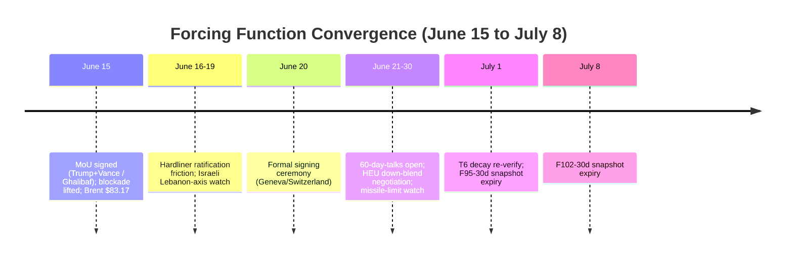
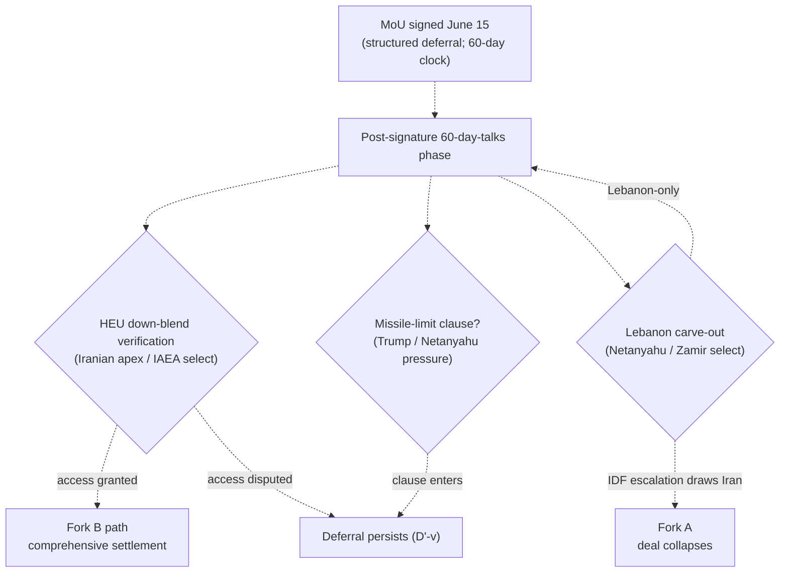
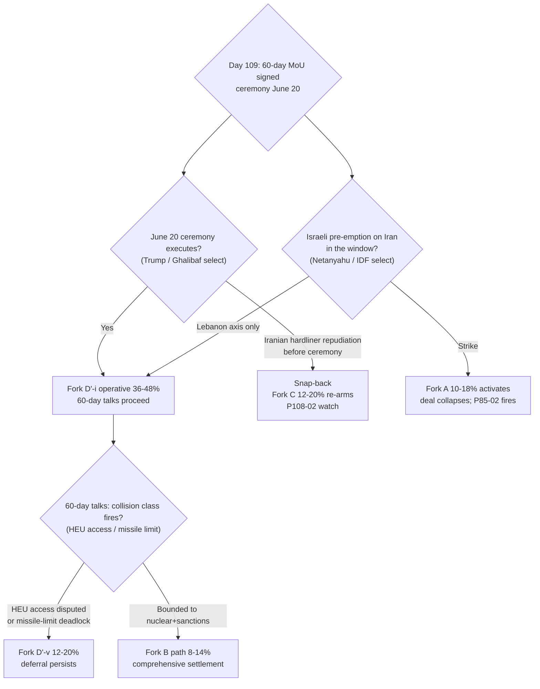

# Iran 2026 Operational SITREP — Daily Update
**Day 109 | Monday, June 15, 2026**
*Annex/Update to Iran 2026 Operational SITREP and Strategic Synthesis (base report v4.3)*

## Executive Summary

The scheduled signature held. The US and Iran digitally signed the 60-day extension MoU on June 15: Trump and VP Vance signed for the US, Parliament Speaker Mohammad-Bagher Ghalibaf for Iran, with a formal ceremony set for Friday June 20 in Switzerland. The instrument declares a permanent ceasefire on all fronts, lifts the US naval blockade, and reopens the Strait of Hormuz within 30 days, while leaving Iran's 440kg 60%-HEU stockpile in Tehran for the 60-day technical talks. P93-01 fires; Fork D' activates as a signed structured deferral and decomposes into named variants. Israel withheld a strike at the maximal-incentive signature moment, declined to criticize the deal, and reserved freedom of action on Lebanon; Brent fell 4.7% to $83.17, the lowest since early March. The instrument is a deferral, not a settlement: the nuclear file is pushed into the window, not resolved in the text.

Supersedes `day-108` · Fork D' ↑ MAJOR (signed, decomposed) · Fork C ↓ · Fork A ↓ · Hormuz/blockade lift in signed text · HEU deferred to 60-day talks

| Vector | Direction | Driver |
|---|---|---|
| 60-day MoU | SIGNED | Trump+Vance / Ghalibaf, digital; ceremony June 20 Geneva |
| Fork D' structured deferral | 34–46% → 50–64% | Signed; 60-day clock; decomposed to D'-i/D'-v |
| Fork C / Fork A | ↓ | Blockade lifted; ceasefire all fronts; zero new KIA |
| Hormuz / naval blockade | LIFTED | In signed text; reopen 30d; CENTCOM Bahrain coordination |
| Iranian signatory | Ghalibaf (mid-tier) | Apex did not publicly own; Mojtaba unity repost only |
| HEU 440kg | DEFERRED | Stays in Tehran; down-blend a goal of the 60-day talks |
| Israeli pre-emption | WITHHELD | No strike at signature; Lebanon axis reserved (Katz) |
| A1 Trump | REALIZED | "Pay the price" → signed deal, announced at G7 |
| Brent crude | ↓ $83.17 | -4.7%; lowest since early March; deal pricing |

Leading primitives: Fork D' 50–64% / 30d, Fork C 12–20% / 30d. Highest-delta this cycle: Fork D' ↑ (signed). None-of-above floor: 5%.

---

## Section 1 — Operational Update

**Diplomatic track: the 60-day MoU is signed.** The US and Iran digitally signed the extension memorandum June 15 (CBS/NBC/NPR/Axios, H). Vance led the US delegation and signed with Trump; Ghalibaf led the Iranian delegation and signed. Pakistan ("Islamabad Declaration"), Qatar (Tehran finalization shuttle June 14), and Oman (counteroffer venue) are the mediator stack. A formal signing ceremony is scheduled Friday June 20 in Switzerland/Geneva. Terms: permanent ceasefire on all fronts including Lebanon (per Iran FM); Hormuz reopens within 30 days; US naval blockade lifted; 60 days of technical talks on the nuclear file. The 440kg 60%-HEU stockpile stays in Tehran during the window; HEU down-blend/destruction with the IAEA is a stated goal of the talks, not a signed term (TechTimes/Bloomberg, H). The $24B frozen-funds release is disputed: Vance says the figure "doesn't appear in any of the texts," US officials say no funds until compliance, the IRGC claims half before talks begin.

**Trump posture: deal-claim realized in action.** Trump signed and announced the deal at the G7 summit. The June-11 "pay the price" to June-15 signature is the sharpest A1 arc of the conflict and, unlike the Day-100 "near-signed" claim, it converted to an instrument. Trump-statement commitment value remains near-zero by discipline; this cycle the signature plus Vance/Ghalibaf/Pakistan/Qatar corroboration is the higher-quality data, and A1's deal-rhetoric is vindicated by a verifiable text for the first time in the window.

**Maritime / CENTCOM: blockade lifted; posture terminates.** Trump declared the Strait open and the naval blockade lifted immediately; a CENTCOM maritime-coordination mechanism in Bahrain is restoring commercial navigation, estimated ~30 days to normal given mine-clearing. No new operation name; the Epic Fury / blockade-enforcement posture winds down rather than rebrands. The cumulative blockade ledger closes at 8 vessels disabled, 134 diverted, 42 humanitarian passages; ~20,000 seafarers on ~2,000 vessels remain stranded pending clearance.

| Asset / signal | Day 108 baseline | Day 109 read | Implication |
|---|---|---|---|
| MoU status | Final text agreed; sign scheduled | SIGNED (digital); ceremony June 20 | P93-01 fires; Fork D' activates |
| Iranian signatory | "Signed remotely"; apex opaque | Ghalibaf (mid-tier Speaker) | Apex unowned; two-level structure (T3) |
| Naval blockade | Standing; Day-57 enforcement | LIFTED in signed text | Fork A/C de-escalate; Surface 1 closing |
| Hormuz | "Service fees"; reopen-30d | Reopen 30d in text; CENTCOM Bahrain coord | §5.26 staked-read contradicted (2nd cycle) |
| HEU 440kg | Deferred (MoU defers) | Stays Tehran; down-blend = talks goal | Confirms Fork D' (deferral) over Fork B |
| Israeli posture | Beirut strike; pre-emption pressure | No Iran strike; Lebanon reserved (Katz) | Spoiler is window-risk, not signature-risk |

**Iranian internal: mid-tier signs, apex manages dissent.** Ghalibaf, not Mojtaba or Vahidi, signed for Iran; no Vahidi-direct HEU statement (8th absence, P84-07). Mojtaba's only attributable signal was a social-media repost of a March message urging media to "refrain from focusing on weaknesses," read as indirect apex pushback on hardliner critics. Hardliners held demonstrations targeting Ghalibaf and Araghchi; an IRGC-close paper (Javan) accused rally speakers of sowing "schism" against Khamenei's line. CNN assessed "the regime is likely to have the final say." Rial parallel carries ~1,790,000/USD (PROBE-3 monthly; internal transmission opaque, BS-1b).

**Israel: stood down at signature, reserved on Lebanon.** Netanyahu declined to criticize the MoU, said he did not know its exact details, and claimed the war's main goals were achieved, while stating he is "not limiting" himself on preventing an Iranian bomb or on Hezbollah. Defense Minister Katz: the IDF stays in the security zones in Lebanon, Syria, and Gaza with no time limit, Israel is not bound by the deal on Lebanon, and "if Iran strikes, it will be hit with full force." No Israeli pre-emption strike on Iran this cycle. Domestic backlash rose: opposition castigated Netanyahu's "absolute failure." No new Knesset dissolution reading (1st reading 106-0 was June 2; 2nd/3rd pending; window Sep 8–Oct 20).

**Markets: deal pricing deepens.**

| Asset | Pre-war (Feb 28) | Day 108 (Jun 14) | Day 109 (Jun 15) | Δ vs pre-war |
|---|---|---|---|---|
| Brent crude | $73 | <$86.50 | $83.17 | +14% |
| Brent move | — | -4% | -4.7% | lowest since early March |
| Iranian rial (parallel) | ~960k/USD | ~1,790,000 | ~1,790,000 (carry) | -53% |
| US CPI annualized | — | 4.2% (May) | 4.2% (carry) | elevated |

Brent's drop tracks the signed blockade-lift and 30-day Hormuz reopening. Floor under prices is questioned (NBC): mine-clearing, idled-field restart, and damaged-facility repair cap the downside. Reversal is now asymmetric and higher-barred than Day 108: a signed ceasefire raises the re-escalation threshold above the standing-blockade baseline, but a 60-day-window breakdown re-prices closure risk.

**US domestic: executive path intact.** The MoU is an executive instrument; no Congressional ratification, no WPR vote, no court action this cycle. T9 Stage-2 lock-in holds. CPI 4.2% energy transmission carries as the domestic-cost driver the deal partially relieves as Brent falls.

**International: unaligned-middle delivered a signed settlement.** Pakistan (Sharif/Munir) at lead-mediator tier; Qatar at finalization; Oman as venue. At the G7, Macron invited Qatar, the UAE, and Egypt to the June-15 Middle East session; the watch signal for broad regional backing is whether Saudi Arabia and the UAE send Cabinet-level representatives. Russia is absent from the entire track. China is the consulted/pressured pole: no new OFAC Chinese-FI action this cycle, and the deal's oil-sanctions relief would moot the GL-V cascade.

---

## Section 2 — Framework Validation

- **A1 (Trump improvisational/oscillating principal):** the June-11 "pay the price" to June-15 signature is the sharpest A1 arc of the conflict, resolved deal-ward and converted to a signed text; oscillation confirmed, attractor this arc was signature.
- **A10 (Slantchev feigning-weakness / brinkmanship):** the June-11 escalation peak extracting a signed deferral within four days completes the escalate-to-extract-then-settle sequence; capability demonstrated as leverage, then traded.
- **A15 (Principal-Access Channel Architecture):** Pakistan lead + Qatar finalization + Oman venue delivered a signed instrument; the mediator stack functioned end to end.
- **A21 (unaligned-middle pivot capacity):** the troika/Pakistan architecture produced a settlement, not just a brake; G7 Mideast session institutionalizes the channel. T1 advance.
- **A22 (structured deferral as Trump dominant strategy under apex collision):** the signed instrument is a 60-day deferral that opens rather than resolves the nuclear file, the canonical Fork D' object; A22 realized.
- **A24 (escalation-while-talking, betting on capitulation before terminal threshold):** the bet produced a signed text without crossing the US-KIA threshold; A24 convergence outcome confirmed.

**Prediction Resolution.**

- **P93-01** (Trump signs 60-day MOU/LOI; Fork D' activates, 60-day clock): **fired**. Digitally signed June 15 (Trump+Vance / Ghalibaf); blockade lift + Hormuz reopen + 60-day talks. Matrix-followed: y (Fork D' 34–46% → 50–64% applied; decomposed to variant table; A2 demotion supported).
- **P108-01** (signing slips past June 17 without Iranian acceptance): **did-not-fire**. Signature occurred June 15, ahead of the window; inverse of the slip condition. Matrix-followed: n.a.
- **P108-02** (Iranian apex named public statement owning or repudiating the MoU): **did-not-fire** this cycle, partial discriminator. Mid-tier Ghalibaf signed; Mojtaba issued only an indirect unity repost; no named apex statement owning the terms. Carried (resolve-by next 1–2 cycles); the delegated-signing modality narrows A4 toward delegated/opaque.
- **P85-02** (Israeli unilateral strike on Iran nuclear/military site): **did-not-fire** this cycle. Israel withheld at the signature window; reserved Lebanon. Standing tail-watch; carried.
- **P87-01** (White House "full dismantlement" readout): **did-not-fire**, evidence-against. Signed text leaves 440kg HEU in Tehran; Vance says $24B not in texts; no dismantlement readout. Accumulates against the A2 Netanyahu relay; carried.
- **P93-04** (US KIA in any exchange): **did-not-fire**. Zero new KIA. Standing; carried.
- **P105-01** (CENTCOM names a new operation): **did-not-fire**. Blockade lifted; no new name. Standing; carried (now less live on de-escalation).
- **P105-02** (Iran fires on a US vessel): **did-not-fire**. Hormuz reopening; no engagement. Standing; carried.
- **P105-05** (Brent sustained close >$100): **did-not-fire**. Brent $83.17 (inverse). Standing; carried.
- **P102-02** (second Iran-Israel direct exchange without Trump halt): **did-not-fire** this window. No Iran-Israel direct exchange; Israel reserved Lebanon. Carried (next Lebanese provocation).
- **P102-03** (Netanyahu coalition fracture): **did-not-fire**, watch rising. Opposition "absolute failure" attacks but no far-right resignation. Carried.
- **P84-07** (Vahidi direct HEU statement), **P97-02**, **P100-09**, **P102-09**, **P108-03**, **P108-04**: carried (standing/open). No surprise registered this cycle: the cycle's defining mover (signature) was pre-listed (P93-01).

---

## Section 3 — Framework Revisions Required

**TRIGGER FIRED — 60-day MoU signed; Fork D' activates and decomposes (H, immediate; PROBE-12' + P93-01).** Prior (Day 108): final text agreed, signing scheduled, Fork D' 34–46%. New: digitally signed June 15; blockade lifted; Hormuz reopen 30d; HEU 440kg deferred to the 60-day talks. Revised: **Fork D' 50–64% (30d)** as a signed structured deferral, now decomposed into variants (Section 5a). **Classification discipline holds:** the signed instrument is Fork D' (deferral), not Fork B (comprehensive settlement), because the 440kg HEU stockpile stays in Tehran and down-blend is a talks goal, not a signed term. **Trend cross-check:** aligns with T1 (unaligned-middle delivered the settlement), T3 (mid-tier signs while apex floor reserved), A22 realized. VALIDATED-trend-aligned; no contradiction.

**TRIGGER FIRED — Hormuz blockade lifted in signed text; §5.26 "staked position" multi-cycle contradicted (H, immediate; PROBE-8).** Prior: synthesis v4.3 §5.26 read the June-11 IRGC formal closure as "hardened from negotiable to staked sovereign position." New: the signed MoU lifts the blockade and reopens Hormuz within 30 days; Brent $83.17. **Trend cross-check / ROUTE TO /revise:** the §5.26 staked-position claim is now contradicted across two cycles (Day 108 "service fees" reframe + Day 109 signed blockade-lift), meeting the multi-cycle bar the Day-108 single-cycle flag did not. The disciplined reading is confirmed: the June-11 closure was a Slantchev brinkmanship move within the bargaining range, not a staked position. Correct the §5.26 mechanism at the increment.

**TRIGGER FIRED — CENTCOM posture terminates; Fork A/C de-escalate (M, immediate; PROBE-7).** Blockade lifted; ceasefire all fronts; no new operation; Fork A activation watch (new operation OR US KIA) unfired. Fork C 18–28% → 12–20%; Fork A composite 13–22% → 10–18%. The recalibrated two-axis PROBE-7 (Day 105) tracked the full arc from peak (49 Tomahawks, near-Tehran) to termination (blockade lift) without a false read at either end.

**FLAG (NEXT AUDIT) — T3 and T4 Day-105 flags stand down on second cycle.** The T3 CONTESTED flag's armed second-cycle trigger (a second near-Tehran/nuclear-site round, or confirmed principal targeting) did not fire across Days 108–109; de-escalation and signature reassert the apex-deterrent floor. The T4 single-cycle strain reversed and stays reversed (deal-faction signed over maximalist). Both recommended for stand-down at /audit.

**FLAG (NEXT AUDIT) — T8 advance-watch: incentive maximal, action withheld.** Powell pre-emption incentive reached theoretical maximum on a signed deferral leaving 440kg HEU, yet Israel withheld the strike at the single most-predicted moment and reserved freedom of action on Lebanon instead. This is consistent with T8 (incentive predicted, actor selects), not a contradiction. Logged as a reading-refinement: the Israeli-pre-emption spoiler is a 60-day-window risk, not a signature-moment risk; do not re-decide the spoiler timing each cycle without flagging the swing.

**STRUCTURAL — /revise armed.** A signed MoU is a structural event that triggers /revise and a 6/12m re-base (Day 108 flagged this as armed-on-signature). The 6/12m matrix (v4.1/v4.2) is acutely and bidirectionally stale. Recommend /revise this cycle.

---

## Section 4 — Framework Additions

**The post-signature 60-day-talks phase is a new constraint configuration.** The deferral is now operative rather than prospective, which moves the binding question from "does the instrument exist" to "what collision classes govern the 60-day window." Three named collision classes structure the phase, each with a different principal whose selection is contingent:

| Collision class | Mechanism | Principal whose selection is contingent | Discriminating signal |
|---|---|---|---|
| HEU down-blend verification | 440kg stays; down-blend is a talks goal; US "observer or active role" disputed | Iranian apex / IAEA / Trump | IAEA access terms; a named US "active role" claim Iran rejects |
| Missile-program limit | War's stated aims and Israeli criticism point at a missile cap entering the text | Trump / Netanyahu (via pressure) | Missile-limit clause language in the talks draft (P108-03) |
| Lebanon carve-out | Israel reserves freedom of action; ceasefire "all fronts" claim collides with Katz "not bound" | Netanyahu / Zamir (post-caretaker) | IDF Lebanon escalation that draws an Iranian response (P102-02) |

---

## Section 5 — Revised Probability Matrix

### 5a. 30-Day Matrix (cycle-Bayesian)

| Outcome | 30 days | vs. Day 108 | Driver |
|---|---|---|---|
| **Fork D': Structured deferral (signed MoU)** | **50–64%** | 34–46% ↑ | Signed June 15; blockade lift + Hormuz reopen + 60-day clock. Width 14pp on window-breakdown dispersion; decomposed below |
| **Fork C: Miscalculation cascade** | **12–20%** | 18–28% ↓ | Blockade lifted; ceasefire all fronts; residual surfaces (stranded vessels, mine-clearing, reserved Lebanon axis) |
| **Fork A: Kinetic resumption (composite)** | **10–18%** | 13–22% ↓ | No new operation; zero new KIA; signed ceasefire. Israeli pre-emption sub-path holds the floor |
| · Israeli pre-emption (60-day window) | 28–40% | 32–45% ↓ | T8 maximal (deferral leaves 440kg HEU); strike withheld at signature trims top of band |
| · US Vahidi decapitation (standalone) | 4–10% | 5–12% ↓ | No principal-targeting signal; de-escalation |
| **Fork B combined (comprehensive settlement)** | **8–14%** | 10–16% ↓ | The signed instrument is Fork D' deferral; B is now the 60-day-talks-success path; nuclear deferred caps it |
| **None of the above** | **5%** | HELD | Mandatory non-zero floor |

**Fork D' decomposition (adopted; replaces the Day-108 candidate sub-block).** Decomposition fires: midpoint ~57% above 30% on 2 of the last 4 cycles, and the signing converted D'-i from prospective to operative.
- **D'-i (operative): 36–48%.** MoU signed, Hormuz reopening, blockade lifted, nuclear deferred, talks proceed through the near term. Principal: Trump / Ghalibaf-Araghchi. Discriminator: June-20 ceremony executes; no within-window collapse.
- **D'-v (signed-but-stalls): 12–20%.** MoU signed but the 60-day talks stall or pressure-while-talking erodes deal-direction without a comprehensive deal and short of full kinetic resumption; the deferral persists as deferral. Principal: Netanyahu (diplomatic spoiler) / Iranian apex (HEU-access refusal). Discriminator: HEU-access dispute or missile-limit deadlock without a strike.
- **D'-vi (signing slip): MOOT.** Resolved did-not-fire; signature occurred June 15.

> **KEC [DERIVED]:** ~22–40% (30d). Fork A 10–18% + Fork C 12–20% + tail (<2%). Down from ~31–52% (Day 108). Primitives lead.

### 5b. 6/12-Month Matrix (structural-prior; no update this cycle)

| Outcome | 6 months | 12 months | Last updated | Driver |
|---|---|---|---|---|
| Fork A composite | 38–48% | 43–53% | v4.1 (Day 84) | Time arithmetic; T12 amplifier |
| Fork B-bilateral | 12–18% | 12–18% | v4.1 (Day 84) | Apex PA-gap constraint |
| Fork B-multilateral | 12–20% | 14–22% | v4.1 (Day 84) | Gulf pathway institutionalizing |
| Fork D' structured deferral | 18–24% | 12–18% | v4.1 (Day 84) | LOI expiration compresses |
| Fork C miscalculation cascade | 16–22% | 16–22% | v4.1 (Day 84) | Structural accident pathway |
| None-of-above | 10–15% | 10–15% | v4.2 (Day 88) | Mandatory non-zero floor |

*No update this cycle: the sweep does not move the structural prior. But the signed MoU is the armed /revise trigger; the re-base belongs to /revise, not the SITREP. Staleness acute and bidirectional (Day-105 escalation peak and Day-109 signed deferral both exceed the prior's ranges).*

---

## Section 6 — Probe Status Table

| PROBE | Status | Conf | Trigger | Variable moved |
|---|---|---|---|---|
| 1 Apex/Mojtaba | partial | M | no | A4 narrows to delegated/opaque; Ghalibaf signed |
| 2 Vahidi HEU | partial | L | no | 8th absence; HEU 440kg deferred |
| 6 Sanctions | partial | L | partial | No Chinese-FI action; deal moots GL-V; BS-4 June-23 |
| **7 CENTCOM** | **fired** | M | yes | Blockade lifted; posture terminates; Fork C/A ↓ |
| **8 Oil/Hormuz** | **fired** | H | yes | Brent $83.17; blockade-lift; §5.26 multi-cycle flag |
| **9 Israeli** | **fired** | M | next-cyc | Strike withheld at signature; Lebanon reserved |
| **12' Diplomacy** | **fired** | H | yes | MoU SIGNED; Fork D' activates/decomposes |
| **13 A1 Trump** | **fired** | H | yes | Deal realized; signed at G7 |
| 14 Reconstitution | partial | L | no | T12 hold; capability frozen pending down-blend |
| **15 Dispositional** | **fired** | M | next-cyc | Asymmetry resolved; ratification now binding |
| 16 First-mover | partial | M | no | Surfaces closing; Lebanon reserved live |
| 20 Gulf | partial | M | no | Qatar finalization; UAE-drift not reinforced (2nd cyc) |
| 21 Paine | partial | M | no | Off-ramp realized; no death-ground |

*Fired: 6 | Partial: 7 | Null: 0 | Gap: 0. Skipped (tier/activation): PROBE-3, -10, -11, -17, -18, -19. Sweep: `sweep-2026-06-15.json`.*

---

## Section 7 — Conclusion and Forking Analysis

### Central Thesis Check

The v4.0 materialist bargaining thesis is **holding, strongly reinforced.** The escalate-to-extract-then-settle sequence completed: the June-11 49-Tomahawk/Hormuz-closure peak resolved into a digitally signed 60-day deferral by June 15. Under joint constraints (US domestic cost via CPI 4.2% and gasoline; Iranian strangulation under the blockade; a deal-faction bounded by the US-KIA threshold; an Iranian apex bounded by hardliner ratification but managing it via the Mojtaba unity signal), the relative cost-benefit of a signed deferral outranked both further escalation for Trump and a hard exit for the Iranian functional apex. The framework ranked the deferral as dominant; Ghalibaf signed and Netanyahu withheld, both selections contingent and both realized this cycle. **Trend lines:** T1 advance (Pakistan/Qatar/Oman delivered a signed settlement); T3 advance (mid-tier Ghalibaf signs while the apex floor stays reserved and unowned); T4 advance (deal-faction signed over maximalist, no eschatological counter-mobilization, PROBE-19 skipped on non-activation); T8 advance-watch (incentive maximal, action withheld); T6, T2, T9, T10, T11, T12 hold. T3 CONTESTED flag and T4 strain stand down (next /audit). The §5.26 Hormuz-staked mechanism is now multi-cycle contradicted and routed to /revise.

### Forking Tree (72-Hour Decision Path)

### Operative Judgment

The crux of the next 48–72 hours is no longer whether a deal exists but whether the signed deferral survives ratification friction into the June-20 ceremony and the first days of the talks window. The signature is the strongest deal evidence of the conflict: a digital MoU with named signatories on both sides, a fixed ceremony date, a lifted blockade, and a three-month Brent low. It is materially stronger than the Day-100 "near-signed" claim that never converted, which is why Fork D' enters at 50–64% rather than higher: the conflict retains a real near-deal-failure base rate, the ceremony is five days out, and the Iranian hardliner bloc is demonstrating against the signatory while the apex manages it indirectly. The signing did not end the analytical problem; it relocated it into the 60-day window.

Two clusters tightened priors this cycle. First, the Ghalibaf signature plus the Mojtaba unity repost narrowed the A4 apex question toward delegated/opaque: the functional apex consented to negotiation but did not publicly own the terms, which is the two-level structure T3 predicts and which keeps the ratification-capacity question live without resolving the principal identity. The discriminating signal remains a named Mojtaba or Vahidi statement owning or repudiating the text, with the June-20 ceremony as the next opportunity. Second, Israel's restraint at the maximal-incentive moment loosened the prior that an Israeli strike was the imminent signature-window spoiler and tightened the prior that the spoiler is a 60-day-window risk routed through Lebanon. Netanyahu declined to criticize, claimed the war's goals achieved, and reserved freedom of action; Katz fixed the IDF in southern Lebanon with no time limit. The Powell mechanism remains at maximal loading because the deal defers the nuclear file for 60 days, so the pre-emption sub-path holds at 28–40% within the window even as composite Fork A falls; the dominant deal-spoiler is now an Israeli Lebanon-axis escalation that drags Iran back into a direct exchange, not a bolt-from-the-blue strike on Iranian nuclear sites.

If the ceremony executes and the talks open without an immediate collision-class fire, Fork D'-i is the operative state and the framework's attention moves to the three named collision classes: HEU down-blend verification (the disputed US "active role" and IAEA access terms), a missile-program-limit clause (the adversary-new-vector the war's stated aims and Israeli criticism both point toward), and the Lebanon carve-out where Israel has already reserved. The constraint surface compressed both principals toward a deferral each prefers to the alternative; selection by the Iranian apex at the ceremony and by Netanyahu at the spoiler branch remains contingent.

### Signals That Force Immediate Revision

- 60-day MoU formal ceremony executes June 20 (Geneva): Fork D'-i confirmed operative; P93-01 close-out adjacent; talks-window clock starts (resolve-by: June 20).
- Ceremony slips or an Iranian hardliner bloc forces apex repudiation of the signed text before June 20: Fork D' reverts toward 30–40%; snap-back; P108-02 adjacent (resolve-by: June 20).
- Israeli pre-emption strike on an Iranian nuclear/military site during the window: P85-02 fires; Fork A activates; deal collapses; synthesis revision (resolve-by: standing).
- IDF Lebanon-axis escalation that draws a direct Iranian response (adversary-new-vector): P102-02 fires; Fork C to 22–32%; D'-v or Fork A depending on US-KIA sub-condition (resolve-by: next Lebanese provocation).
- Iranian apex (Mojtaba or Vahidi) named public statement owning or repudiating the MoU: A4 discriminator resolves; P108-02 / P84-07 adjacent; synthesis revision candidate (resolve-by: next 1–2 cycles).
- HEU down-blend verification dispute: Iran refuses IAEA access or rejects a named US "active role" in the talks text (adversary-new-vector): new Fork D' collision class; reprices D'-v upward (resolve-by: first 1–2 cycles of the talks window).
- Missile-program-limit clause enters the 60-day-talks text: P108-03 fires; new collision class; reprices the post-signing deferral path (resolve-by: first 1–2 cycles of the talks window).
- US KIA in any exchange, or Iran fires on a US vessel: P93-04 / P105-02 fire; Fork C to Fork A; matrix resets (resolve-by: standing).
- Brent closes back above $92 on a ceremony failure: deal-pricing reversal confirms snap-back; P108-04 fires (resolve-by: standing).

---

*Compiled June 15, 2026 | Day 109 | Subject to revision as data updates*
*Companion: `sweep-2026-06-15.json`; base `synthesis-v4-3.md`. Next SITREP monitors: the June 20 ceremony; Israeli Lebanon-axis spoiler; Iranian apex ratification signal; HEU down-blend verification terms; Brent direction.*
