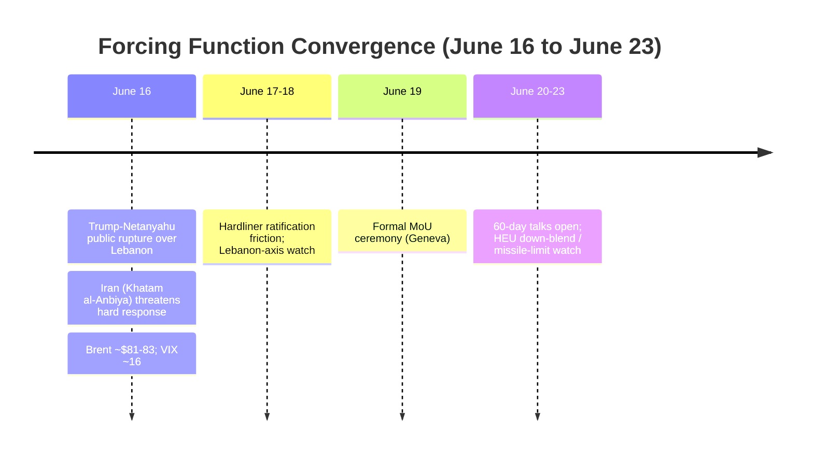
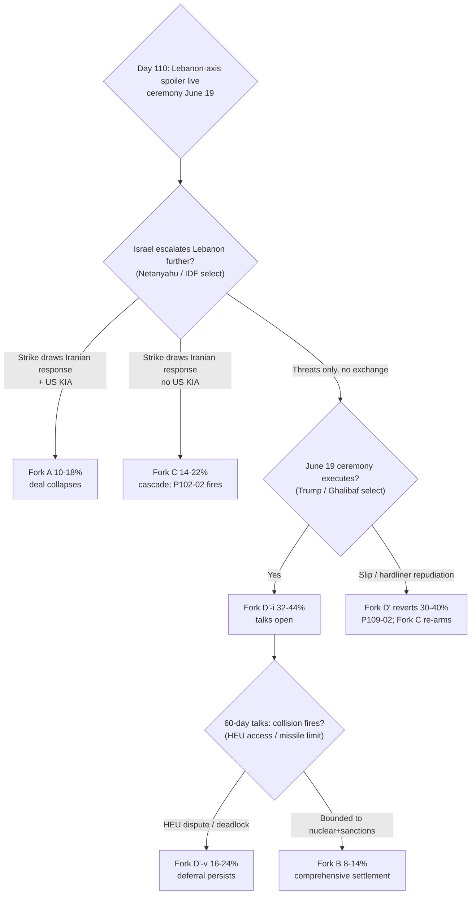

# Iran 2026 Operational SITREP — Daily Update
**Day 110 | Tuesday, June 16, 2026**
*Annex/Update to Iran 2026 Operational SITREP and Strategic Synthesis (base report v4.4)*

## Executive Summary

One cycle after signature, the deferral's predicted residual surface went live. Israel committed to occupying south Lebanon ("Trump's agreement does not bind us"); Iran's Top Joint Military Command (Khatam al-Anbiya) called continued Israeli Lebanon operations an MoU violation and threatened a "hard response," with Tehran signaling readiness to abandon talks if the Lebanon ceasefire is breached; and Trump publicly rebuked Netanyahu, the sharpest documented principal-level US-Israel divergence of the conflict. No new Iran-Israel direct exchange occurred this cycle: the axis is at the threat-and-rhetoric stage, not a fired cascade. The signature itself holds, with the formal ceremony confirmed for Friday June 19 in Geneva (correcting the Day-109 "June 20"). The framework predicted this exact vector at v4.4 §5.30; the actors are now selecting within the Lebanon carve-out.

Supersedes `day-109` · Fork D'-v ↑ · Fork C ↑ · T4 advance (Trump-Netanyahu rupture) · ceremony June 19

| Vector | Direction | Driver |
|---|---|---|
| Lebanon-axis spoiler | NEW/LIVE | Israel to occupy S. Lebanon; Iran "hard response" threat |
| Trump-Netanyahu split | ↑ sharpest | Trump "not happy," rebuke at G7; "throws negative light on big deal" |
| Fork D'-i (operative) | 36–48% → 32–44% | Lebanon re-entanglement + "differing versions" friction |
| Fork D'-v (signed-but-stalls) | 12–20% → 16–24% | Predicted spoiler now live; pressure-while-talking |
| Fork C miscalculation | 12–20% → 14–22% | Surface 2 (Lebanon) re-armed; no exchange yet |
| MoU ceremony | June 19 (corrected) | Multi-outlet T2; Day-109 "June 20" was a date error |
| Brent crude | ↓ ~$81–83 | Deal pricing extends; near mid-April low |
| Iranian apex ownership | ABSENT (carry) | Mojtaba media-framed as SL; no direct MoU statement |

> Leading primitives: Fork D' 50–64% / 30d (composite held; mass shifts D'-i → D'-v), Fork C 14–22% / 30d. Highest-delta this cycle: Fork D'-v ↑. None-of-above floor: 5%.

---

## Section 1 — Operational Update

**Diplomatic track holds, with the ceremony date corrected and an interpretation dispute live.** The 60-day MoU signature stands; the formal ceremony is Friday June 19 in Geneva (CSIS, CNBC, CBS, NPR; the Day-109 "June 20" was a weekday/date error, June 19 is the Friday). The instrument is a "page and a half" framework that defers terms to the 60-day talks. A "differing versions" dispute is now visible (Fortune, citing Reuters vs Bloomberg): one draft cites a $25B frozen-assets release, another none; Iran's Mehr conditions talks on half-funds release plus oil-sanctions suspension plus the blockade lift; US officials deny a $12B upfront figure. CSIS places agreement probability at 80–85%. IAEA is slated for the nuclear talks; no E3 role.

**Trump posture: deal-protective, with maximalist nuclear rhetoric layered on.** Trump rebuked Netanyahu publicly (June 16): he wants him "more responsible with respect to Lebanon," is "not happy" with Israel's handling of Hezbollah, reportedly told aides he was "p---ed off," and warned the fighting "throws a negative light on the big deal." Simultaneously he said Iran "agreed to never have a nuclear weapon" and that "all hell will rain down" if Iran pursues one. Trump-statement commitment value remains near-zero by discipline; this cycle the data is the action context (signed deal at G7; public pressure on the ally threatening it). A1 attractor this cycle is deal-protection.

**Maritime / CENTCOM: posture termination holds; Hormuz reopening underway.** Blockade lifted; a CENTCOM Bahrain maritime-coordination mechanism is restoring commercial navigation. At least five Iranian vessels (three tankers, two cargo) transited after the lift. No new operation name; zero new US KIA; no transit-enforcement action against a US vessel.

| Asset / signal | Day 109 baseline | Day 110 read | Implication |
|---|---|---|---|
| MoU / ceremony | Signed; ceremony "June 20" | Holds; ceremony **June 19** (corrected) | P109-01 carried; date error fixed |
| Lebanon axis | Reserved (Katz) | LIVE: Israel to occupy; Iran "hard response" | Surface 2 re-armed; P102-02 firing-adjacent |
| Iran-Israel direct exchange | None | None (threat stage only) | Fork C re-arm, not cascade |
| Naval blockade / Hormuz | Lifted in text | 5 Iranian vessels transited; ~20 mines remain | De-escalation operationally underway |
| Iranian signatory / apex | Ghalibaf signed; apex opaque | Mojtaba media-framed as SL; no direct statement | A4 delegated/diffuse; P108-02 unfired |
| CENTCOM operation | None | None | Fork A entry-watch unfired |

**Iranian internal: apex unowned; hardliner dissent managed; Khatam al-Anbiya breaks silence.** Media now frames Mojtaba Khamenei explicitly as the seated Supreme Leader, and the deal reignited a power-structure debate; CNN assesses "the regime is likely to have the final say." Hardliner protests (Saturday, Tehran and Mashhad) targeted Ghalibaf and Araghchi, chanting "Ghalibaf, Araghchi, what about the blood of our leader?" (referencing the prior Supreme Leader's assassination earlier in 2026); Kayhan's Shariatmadari attacked the framework as surrendering a bargaining chip. No Mojtaba-direct or Vahidi-direct statement owning or repudiating the MoU (P108-02, P84-07 both unfired). Khatam al-Anbiya Central HQ, Iran's Top Joint Military Command, broke its long-noted silence to issue the Lebanon "hard response" warning (BS-8 status update). Rial parallel carries ~1,790,000/USD (PROBE-3 monthly; internal transmission opaque, BS-1b).

**Israel: defies Trump on Lebanon; Knesset dissolution advancing on the haredi-draft crisis.** Israeli officials said troops will stay in and occupy south Lebanon, holding "Trump's agreement does not bind us"; Katz fixed the IDF in the security zones. The dissolution bill advanced (preliminary 110-0; first reading 106-0 June 2) driven by the ultra-Orthodox conscription crisis, not the MoU; election movable to September or mid-October (forward from Oct 27), preserving Netanyahu's pace control. No Israeli strike on Iran this cycle.

**Lebanon / proxy fronts: the live residual surface.** Iran (Khatam al-Anbiya plus the FM spokesman) frames continued Israeli operations and occupation as an MoU breach and threatens armed response; Iran reserves the Hezbollah/Lebanon channel as deterrent leverage one cycle after signature. No new mass-casualty exchange this cycle; the axis is at threat stage.

**Markets: deal pricing extends; volatility collapses; Fed decision is the cross-current.**

| Asset | Pre-war (Feb 28) | Day 109 (Jun 15) | Day 110 (Jun 16) | Δ vs pre-war |
|---|---|---|---|---|
| Brent crude | $73 | $83.17 | ~$81–83 (intraday to ~$80) | +10–14% |
| VIX | ~14 | ~17 | ~16.2 (−8%); off >23 last week | elevated, falling |
| S&P 500 | — | spiked on deal | ~7,554 firm; Fed-cautious | risk-on, capped |
| Gold | — | — | ~$4,330 (−0.5%) | safe-haven bleed |
| Iranian rial (parallel) | ~960k/USD | ~1,790,000 | ~1,790,000 (carry) | −53% |

Brent extended its decline toward the mid-April low near $80 on the blockade lift and 30-day reopening; VIX shed to ~16 off last week's >23 chip-and-Gulf-tension peak. Equities are risk-on but capped ahead of the Fed rate decision, a non-Iran cross-current. Floor under oil is questioned: ~20 uncleared mines, idled-field restart, repair lags. Reversal trigger (P108-04): a Brent close back above $92 on a ceremony failure.

**US domestic: executive path intact.** The MoU remains an executive instrument; no WPR challenge, no court action, no ratification. T9 lock-in holds.

**International: Gulf at the brake/endorsement pole; Russia absent; China consulted.** At the G7, Trump held a 1:1 with Qatar's Tamim and met UAE's MBZ; the Gulf six are engaged with or endorsing the deal. A counter-current (Times of Israel): the Gulf states "could be left in the lurch and exposed" by a US-Iran bilateral. A disputed report that the UAE secretly agreed to release billions in frozen Iranian assets for a halt to attacks (UAE denies) is a possible MBZ-pathway accommodation datapoint if it corroborates. Russia is absent from the track; China is the consulted pole, with oil-sanctions relief mooting the GL-V cascade.

---

## Section 2 — Framework Validation

- **A9 (constraint architecture precedes faction decisions; T7):** the Lebanon-axis activation is the joint equilibrium v4.4 §5.30 ranked as the live residual; Netanyahu continues Lebanon ops, Iran reserves the Hezbollah channel, Trump applies pressure, each selection contingent.
- **A10 / A12 (Slantchev feigning-weakness; type-revelation; T2):** Iran reserves one deterrent channel (Lebanon/Hezbollah) as leverage while the deal track proceeds, the Mosaic-Octopus reserved-channel pattern operating as modeled.
- **A13 (ratification capacity is the binding constraint; T3):** confirmed and binding. Two-level ratification (Iranian hardliner bloc; Israeli reserved Lebanon option) is the operative deal risk, not dispositional asymmetry.
- **A18 / A3 (eschatological coalition operationally distinct; T4):** Trump's public rebuke of Netanyahu while defending the deal is US-executive resistance to Israeli maximalism at its sharpest documented level; no maximalist counter-mobilization.
- **A23 (diplomatic-spoiler as Netanyahu dominant strategy under kinetic constraint; T8):** Netanyahu reserved and is exercising the Lebanon-axis option rather than striking Iran, the predicted spoiler deployment.

**Prediction Resolution.**

- **P108-02** (Iranian apex named statement owning/repudiating the MoU): **did-not-fire** this cycle (cycle 2 of the 1–2 window). Media frames Mojtaba as Supreme Leader but no apex-direct or Vahidi-direct statement; narrows A4 toward delegated/diffuse. Carried (window closing). Matrix-followed: n.a.
- **P102-02** (second Iran-Israel direct exchange without successful Trump halt): **did-not-fire** this cycle, **firing-adjacent**. Lebanon axis re-activated (Israeli occupation intent + Iranian threat) but no direct exchange. Carried at elevated watch. Matrix-followed: n.a.
- **P100-09** (Hezbollah accepts South Litani withdrawal): **did-not-fire**, inverse. Israel occupying; Iran threatening. Carried. Matrix-followed: n.a.
- **P109-01** (ceremony executes): **open**; resolve-by corrected to **Fri June 19** (Day-109 "June 20" date error). Carried.
- **P109-02** (ceremony slips or hardliner forces apex repudiation before ceremony): **open**; hardliner protests live but no forced repudiation. Carried; resolve-by June 19.
- **P109-03** (HEU down-blend verification dispute), **P108-03** (missile-limit clause): **open**; talks not formally opened pre-ceremony. ABC "US intel pessimistic on Iranian nuclear concessions" is a leading indicator for P109-03, not the dispute itself. Carried.
- **P87-01** (WH "full dismantlement" readout): **did-not-fire**, evidence-against A2. Trump rebuking Netanyahu while defending a HEU-deferring deal is the inverse of a penetrated executive relaying Israeli maximalism. Carried.
- **P102-03** (Netanyahu coalition fracture): **did-not-fire**, watch rising. Knesset dissolution advancing on the haredi-draft crisis, not the MoU; no far-right resignation. Carried.
- **P108-04 / P105-05** (Brent >$92 ceremony-failure / >$100): **did-not-fire** (Brent ~$81–83). Carried.
- **P84-07, P85-02, P86-03, P93-04, P97-02, P102-09, P105-01, P105-02** (standing): **did-not-fire** this cycle; no signal. Carried. No surprise registered: the cycle's defining mover (Lebanon-axis spoiler) was pre-listed Day 109 (P102-02 adversary-new-vector branch). Coverage hit, third consecutive cycle.

---

## Section 3 — Framework Revisions Required

**TRIGGER FIRED — Lebanon-axis spoiler activates; Fork D'-v up, Fork C re-armed (M, next cycle; PROBE-9 / PROBE-2 / PROBE-16).** Prior (Day 109): Lebanon reserved by Israel as the residual surface; D'-v 12–20%, Fork C 12–20%. New: Israel commits to occupying south Lebanon and rejects MoU binding; Iran (Khatam al-Anbiya) threatens a hard response and signals readiness to abandon talks; no direct exchange yet. Revised: shift Fork D' mass internally (**D'-i 36–48% → 32–44%; D'-v 12–20% → 16–24%**); **Fork C 12–20% → 14–22%**. Fork A composite holds 10–18% (pre-emption channeled to Lebanon, not an Iran-nuclear strike; re-arms only on a Lebanon response crossing the US-KIA threshold). **Trend cross-check:** advances T2 (reserved-channel deterrent leverage) and T4 (US-exec-vs-maximalist divergence); holds T3 (two-level: military vertex reserves the floor, deal track negotiates) and T8 (Powell spoiler-as-Lebanon-window-risk, the Day-109 reading-refinement confirmed within one cycle). No VALIDATED-trend contradiction. No architecture change: the vector is inside v4.4 §5.30; no /revise.

**TRIGGER FIRED — ceremony date corrected to June 19; "differing versions" interpretation friction (M, immediate; PROBE-12').** The formal ceremony is Friday June 19 Geneva (multi-outlet T2 consensus), correcting the Day-109 "June 20." A "differing versions" dispute is live (frozen-assets figure and conditionality; Iran's claim the MoU binds Israel on Lebanon, which the US and Israel dispute). This is a Fork D'-v input (folded into the repricing above), not a standalone matrix move. **Trend cross-check:** consistent with T3 (each side projects domestically favorable terms onto a thin instrument; two-level game made textual). No contradiction.

**FLAG (NEXT AUDIT) — BS-8 Khatam al-Anbiya silence broken.** The long-noted BS-8 "Khatam al-Anbiya / Aliabadi silent" status updates: the Joint Military Command is now the vocal IRGC vertex on the Lebanon deterrent axis. Logged for the audit's BS-8 state note; not a mechanism revision.

**No /revise this cycle.** v4.4 released Day 109; the structural prior was re-based one cycle ago. The Lebanon activation is annex-level within the existing collision-class architecture. Staging empty.

---

## Section 5 — Revised Probability Matrix

### 5a. 30-Day Matrix (cycle-Bayesian)

| Outcome | 30 days | vs. Day 109 | Driver |
|---|---|---|---|
| **Fork D': Structured deferral (signed MoU)** | **50–64%** | HELD | Signature holds; ceremony June 19; mass shifts internally D'-i → D'-v |
| · D'-i (operative) | 32–44% | 36–48% ↓ | Lebanon re-entanglement + "differing versions" friction trim the clean path |
| · D'-v (signed-but-stalls) | 16–24% | 12–20% ↑ | Predicted spoiler LIVE; pressure-while-talking; US-intel pessimism on nuclear concessions |
| **Fork C: Miscalculation cascade** | **14–22%** | 12–20% ↑ | Surface 2 (Lebanon) re-armed; threat stage, no exchange; residual Hormuz mine friction |
| **Fork A: Kinetic resumption (composite)** | **10–18%** | HELD | Pre-emption channeled to Lebanon not Iran-nuclear; zero new KIA; no new operation |
| · Israeli pre-emption (60-day window) | 28–40% | HELD | T8 maximal; incentive routed to Lebanon axis |
| · US Vahidi decapitation (standalone) | 4–10% | HELD | No principal-targeting signal |
| **Fork B combined (comprehensive settlement)** | **8–14%** | HELD | Nuclear deferred caps B; US-intel pessimism on Iranian concessions |
| **None of the above** | **5%** | HELD | Mandatory non-zero floor |

**Range-width note.** No width changes this cycle: D'-i holds 12pp, D'-v 8pp, Fork C 8pp (the up-move is a level shift on the re-armed Lebanon surface, not a widening). No declared Fork A/C overlap; the US-KIA sub-condition is the discriminator gating Lebanon-response routing between the two, so no convergence cell is reported. Fork D' decomposition remains adopted (D'-i / D'-v); no candidate sub-block.

> **KEC [DERIVED]:** ~24–42% (30d). Fork A 10–18% + Fork C 14–22% + tail (<2%). Up from ~22–40% (Day 109), tracking the Fork C re-arm. Primitives lead.

### 5b. 6/12-Month Matrix (structural-prior; no update this cycle)

| Outcome | 6 months | 12 months | Last updated | Driver |
|---|---|---|---|---|
| Fork A composite | 32–42% | 38–48% | v4.4 (Day 109) | Sustained T8/T12 advance traded into a signed deferral |
| Fork B-bilateral | 14–20% | 14–22% | v4.4 (Day 109) | Signed deal + 60-day talks open a credible path |
| Fork B-multilateral | 12–20% | 14–22% | v4.1 (Day 84) | Gulf pathway institutionalizing (priced) |
| Fork D' structured deferral | 22–30% | 16–24% | v4.4 (Day 109) | Signed deferral; 12m capped (converts or breaks by horizon) |
| Fork C miscalculation cascade | 14–20% | 14–20% | v4.4 (Day 109) | Ceasefire closes 3 of 4 surfaces; T2 floor (Lebanon reserved) |
| None of the above | 10–15% | 10–15% | v4.2 (Day 88) | Mandatory non-zero floor |

*No update this cycle: the SITREP does not move the structural prior, which was re-based one cycle ago at v4.4 per the sustained-within-state-advance gate. The Lebanon activation is an operational event within §5.28/§5.30, not a constraint-layer shift.*

---

## Section 6 — Probe Status Table

| PROBE | Status | Conf | Trigger | Variable moved |
|---|---|---|---|---|
| 1 Apex/Mojtaba | partial | M | no | A4 delegated/diffuse; Mojtaba media-framed as SL, unowned |
| 2 IRGC/Vahidi | **fired** | M | yes | Khatam al-Anbiya breaks silence on Lebanon; HEU absent (9th) |
| **7 CENTCOM** | partial | M | no | Posture termination holds; vessels transiting; mines remain |
| **8 Oil/Hormuz** | **fired** | H | yes | Brent ~$81–83; "toll free"; deal pricing extends |
| **9 Israeli** | **fired** | H | yes | Lebanon spoiler LIVE; Trump-Netanyahu rupture sharpest |
| **12' Diplomacy** | **fired** | H | yes | Ceremony June 19 (corrected); "differing versions" dispute |
| **13 A1 Trump** | **fired** | M | yes | Deal-protective + maximalist nuclear rhetoric; rebukes Netanyahu |
| 14 Reconstitution | partial | L | no | T12 hold; no fresh cluster; capability frozen at table |
| **15 Dispositional** | **fired** | M | yes | Trump-Netanyahu dispositional split public, principal-to-principal |
| **16 First-mover** | **fired** | M | yes | Surface 2 (Lebanon) hot; Fork C/D'-v boundary live |
| 20 Gulf | partial | M | no | G7 bilaterals; "Gulf exposed" thread; UAE asset-release (disputed) |
| 21 Paine | partial | M | no | No death-ground; D105 P-DG2 candidate resolved away |

*Fired: 7 | Partial: 5 | Null: 0 | Gap: 0. Skipped (tier/activation): PROBE-3, -6, -10, -11, -17, -18, -19. Sweep: `sweep-2026-06-16.json`.*

---

## Section 7 — Conclusion and Forking Analysis

### Central Thesis Check

The v4.0 materialist bargaining thesis is **holding with structural elaboration.** The signed deferral relocated the analytical problem into the 60-day window, and the window's first live collision is materializing precisely where v4.4 §5.30 ranked it: the Lebanon carve-out Israel explicitly reserved. Under joint constraints (a Trump executive that needs the deal to hold and reads Israeli Lebanon operations as a threat to it; a Netanyahu bounded by coalition and kinetic incentives who treats the US-Iran instrument as non-binding on Israel; an Iranian apex that reserves the Hezbollah channel as deterrent leverage while the deal track negotiates), the relative cost-benefit of pressure-while-talking on the Lebanon axis outranks both a clean operative deferral and a hard kinetic resumption for the respective principals. The framework ranked the deferral and named the spoiler vector; Netanyahu, Iran's military command, and Trump are selecting within it, each contingently. **Trend lines:** T2 advance (reserved-channel deterrent leverage); T4 advance (US-exec resists maximalist ally at the sharpest documented level); T8 advance-watch (Lebanon-window-risk reading-refinement confirmed within one cycle); T3 hold (two-level structure on kinetic-posture and deal-terms axes; apex unowned); T1, T9, T12 hold. No trend transitioned; no VALIDATED-trend contradiction.

### Forking Tree (72-Hour Decision Path)

### Operative Judgment

The crux of the next 48–72 hours is whether the Lebanon axis stays at threats or converts to a kinetic exchange before the June 19 ceremony. The signal cluster that tightened this cycle is the Trump-Netanyahu rupture: Trump's public rebuke of Netanyahu while defending the deal loosens any residual prior that the US executive is relaying Israeli maximalism (A2 evidence-against, third cycle) and tightens the prior that the binding deal risk is two-level ratification, with the Israeli reserved option now exercised on the Lebanon axis rather than against Iran's nuclear sites. The Powell pre-emption incentive remains maximal because the MoU defers the nuclear file, but the actor is spending it on Lebanon: the Israeli-pre-emption variant holds at 28–40% within the window while composite Fork A stays flat, because the dominant near-term spoiler is a Lebanon escalation that drags Iran into a direct exchange, not a bolt-from-the-blue strike on Iranian nuclear sites.

The discriminating question gating Fork C from Fork A is whether an Iranian Lebanon-axis response, if it comes, is apex-intended or military-command-autonomous, and whether it produces a US KIA. This cycle the Lebanon red-line was asserted by Khatam al-Anbiya and the FM spokesman with the apex silent, which leans delegated and keeps the escalation-control reading opaque; that opacity is load-bearing on the Fork C/Fork A boundary, so the boundary is reported with a US-KIA sub-condition rather than collapsed into a convergence cell. The "differing versions" dispute is the two-level game made textual: each side is projecting domestically favorable terms onto a deliberately thin instrument, which is consistent with the signature holding while ratification friction runs.

If the Lebanon axis stays at threats and the June 19 ceremony executes, Fork D'-i is operative and the framework's attention moves to the three named collision classes of the talks window: HEU down-blend verification (where ABC reports US intel is already pessimistic on Iranian concessions), a missile-limit clause, and the Lebanon carve-out that is now pre-firing. The constraint surface compressed the principals toward a deferral each still prefers to the alternative; selection by Netanyahu on the Lebanon branch, by Iran's command on the response branch, and by the Iranian apex at the ceremony remains contingent.

### Signals That Force Immediate Revision

- Israeli strike on Lebanon that draws a direct Iranian armed response, no US KIA: P102-02 fires; Fork C to 22–32%; deal-direction breaking (resolve-by: next Lebanese provocation cycle).
- Israeli Lebanon strike drawing an Iranian response that produces a US KIA, or Iran fires on a US vessel during reopening: P93-04 / P105-02 fire; Fork C resolves into Fork A; matrix resets (resolve-by: standing).
- June 19 Geneva ceremony executes: Fork D'-i confirmed operative; P109-01 close-out; talks clock starts (resolve-by: June 19).
- Ceremony slips or Iranian hardliner bloc forces apex repudiation before June 19: Fork D' reverts toward 30–40%; P109-02 fires; Fork C re-arms (resolve-by: June 19).
- Israeli unilateral strike on an Iranian nuclear/military site: P85-02 fires; Fork A activates; deal collapses (resolve-by: standing).
- HEU down-blend verification dispute, or a missile-limit clause entering the talks text (adversary-new-vector): P109-03 / P108-03 fire; reprice D'-v upward (resolve-by: first 1–2 cycles of the talks window).
- Iranian apex (Mojtaba or Vahidi) named statement owning or repudiating the MoU: A4 discriminator resolves; P108-02 closes (resolve-by: next 1–2 cycles).
- Third-party demand enters the ceremony text as a precondition (Gulf security guarantee, Israeli Lebanon carve-out formalized, frozen-assets conditionality hardened) (adversary-new-vector): new collision class; reprices D'-i/D'-v (resolve-by: June 19 to first talks cycle).
- Brent closes back above $92 on a ceremony failure: deal-pricing reversal confirms snap-back; P108-04 fires (resolve-by: standing).

---

*Compiled June 16, 2026 | Day 110 | Subject to revision as data updates*
*Companion: `sweep-2026-06-16.json`; base `synthesis-v4-4.md`. Next SITREP monitors: the June 19 ceremony; Lebanon-axis escalation (threat vs exchange); Iranian apex ratification signal; HEU down-blend verification terms; Brent direction.*
