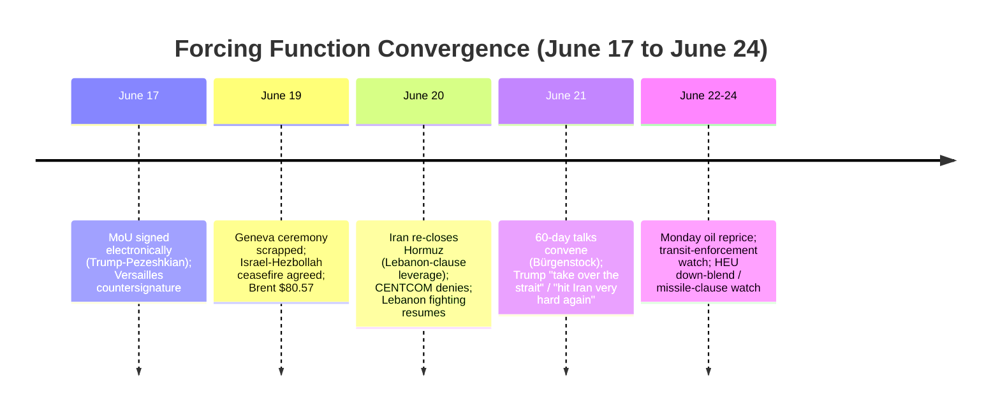
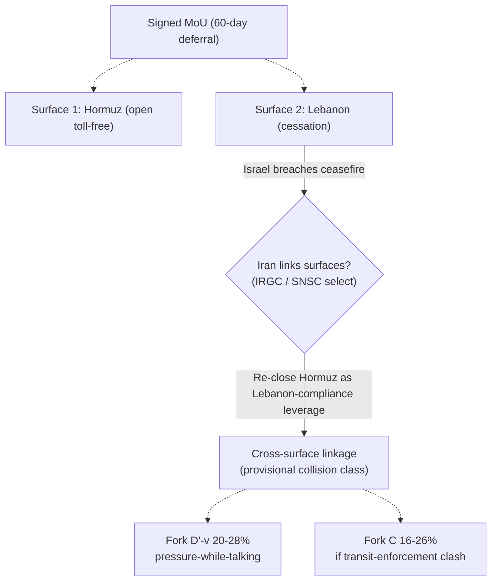
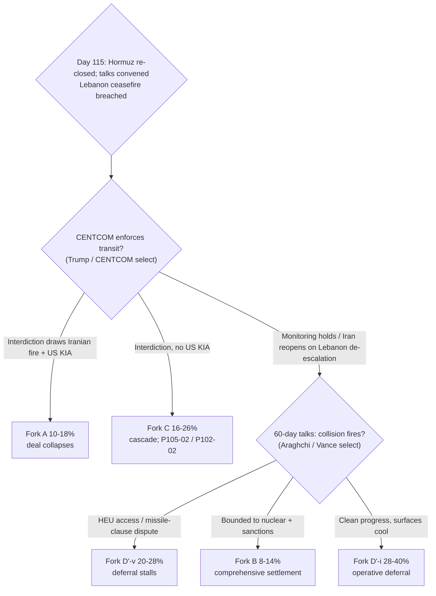

# Iran 2026 Operational SITREP — Daily Update
**Day 115 | Sunday, June 21, 2026**
*Annex/Update to Iran 2026 Operational SITREP and Strategic Synthesis (base report v4.4)*

## Executive Summary

The Day-110 de-escalation read inverted across the June 16-21 span. The MoU held but went electronic (signed June 17 by Trump and Pezeshkian; Trump countersigned a physical copy at Versailles after the G7; the June 19 Geneva ceremony did not occur), and within three days both residual collision surfaces went live: Iran re-closed the Strait of Hormuz on June 20 as MoU-compliance leverage tied to the Lebanon clause, and the June 19 Israel-Hezbollah ceasefire broke down with fighting through June 21. CENTCOM denied the closure ("Iran does not control the Strait; traffic continues to flow"); Iran's response to the Lebanon breach ran through the maritime channel, not a new direct Iran-Israel exchange. Trump flipped to coercive rhetoric (threatening to "take over the strait" and "hit Iran very hard again") while his deal-faction (Vance, Kushner, Witkoff) convened the 60-day technical talks at Bürgenstock with Araghchi and Ghalibaf. Pressure-while-talking is now bilateral: Iran closes the strait it just agreed to open; the US threatens to seize it. The signature is durable and the talks are running; the analytical problem stays inside the 60-day window exactly where v4.4 §5.30 ranked it.

Supersedes `day-110` · Hormuz reclosure NEW · Fork D'-v ↑ · Fork C ↑ · apex MoU-ownership NEW (P108-02 partial)

| Vector | Direction | Driver |
|---|---|---|
| Hormuz reclosure | NEW/LIVE | Iran re-closes June 20 as Lebanon-clause leverage; CENTCOM denies |
| Signature modality | HELD (electronic) | Signed June 17 Trump-Pezeshkian; no Geneva ceremony |
| Iranian apex ownership | NEW | Mojtaba attributed approval-with-reservation via SNSC (P108-02 partial) |
| Trump posture | ↑ coercive | "Take over the strait"; "hit Iran very hard again"; talks proceed |
| Fork D'-i (operative) | 32–44% → 28–40% | Two contested surfaces; talks convening offsets |
| Fork D'-v (signed-but-stalls) | 16–24% → 20–28% | Bilateral pressure-while-talking; US-intel nuclear pessimism |
| Fork C miscalculation | 14–22% → 16–26% | Surface 1 (Hormuz) re-armed alongside Surface 2 (Lebanon) |
| Lebanon ceasefire | breached | June 19 ceasefire; 16+ killed; Hezbollah 50+ projectiles |
| Brent crude | ~$80.57 (Fri close) | Closure un-priced; Monday June 22 open is the test |
| 60-day talks | CONVENED | Bürgenstock June 21; Vance/Kushner/Witkoff + Araghchi/Ghalibaf |

> Leading primitives: Fork A 10–18% / 30d, Fork D' 48–62% / 30d. Highest-delta this cycle: Fork D'-v ↑ (Fork C ↑). None-of-above floor: 5%.

---

## Section 1 — Operational Update

**Diplomatic track holds in substance, changed in form, and is now contested on two surfaces.** The MoU was signed electronically June 17 by Trump and President Pezeshkian, with Trump countersigning a physical copy at Versailles with Macron after the G7; the planned June 19 Geneva ceremony did not take place. The Iranian signatory is president-level (Pezeshkian, SNSC chair), elevating the ratification chain above the Day-110 "Ghalibaf signed" framing. The 60-day technical talks convened June 21 at the Bürgenstock Resort: Vance, Kushner and Witkoff met Araghchi and Ghalibaf directly. Vance claimed "great progress" toward "a full regional ceasefire"; Ambassador Waltz framed the approach as "laser focused on nuclear verification, not trust." The instrument's Hormuz-open-toll-free and Lebanon-cessation terms are both in live dispute.

**Trump posture flipped to coercive, in a deal-protective register.** On June 21 Trump warned Iran "won't have a country" if it closes the strait, said the US "may take over the strait" and collect tolls (Fox), and threatened to "hit Iran very hard again" if Iran does not immediately stop Hezbollah. The aim reads as deal-protection: pressure on Iran over the closure and on Israel to hold the Hezbollah ceasefire, to keep the signed instrument from collapsing on its residual surfaces. Statement-to-action gap stays compressed (same-day threats plus convening talks plus no strike). Per discipline, the rhetoric carries near-zero informational value absent tape action; the data is the posture-flip context.

**Maritime / CENTCOM: Hormuz reclosure declared; CENTCOM contests it; no enforcement action.** On June 20 (14:23) Iran announced reclosure of the Strait of Hormuz, citing the Israeli Lebanon offensive as an MoU violation; the IRGC warned commercial vessels away. CENTCOM countered the same morning (10:01): "Iran does not control the Strait of Hormuz. Traffic continues to flow," and said forces are monitoring. No transit-enforcement order, no new operation name, zero new US KIA. The two-track Hormuz status the framework tracked before signature has reasserted: announced-closed versus US-denied-traffic-flowing.

| Asset / signal | Day 110 baseline | Day 115 read | Implication |
|---|---|---|---|
| MoU / signature | Signed; ceremony June 19 | Signed electronically June 17 (Trump-Pezeshkian); no Geneva ceremony | P109-01 fired-partial; P93-01 substance holds |
| Strait of Hormuz | Reopening; 5 vessels transited | RE-CLOSED June 20; IRGC warns vessels; CENTCOM "traffic flows" | Surface 1 re-armed; P105-02 fired-partial |
| 60-day talks | Pending (ceremony) | CONVENED June 21 Bürgenstock (Vance/Kushner/Witkoff + Araghchi/Ghalibaf) | D'-i floor holds |
| Lebanon axis | LIVE (Israel to occupy; Iran threat) | Ceasefire June 19 then breached; 16+ killed; 50+ Hezbollah projectiles | Surface 2 hot; P102-02 firing-adjacent |
| Iran-Israel direct | None | None (Iran routed its response through Hormuz) | Channel substitution (T2) |
| CENTCOM operation | None | None; CENTCOM contests closure, "monitoring" | Fork A entry-watch unfired; P105-01 did-not-fire |
| US KIA | Zero | Zero | P93-04 did-not-fire; Fork C not converting to Fork A |
| Iranian apex | Media-framed SL; opaque | Attributed approval-with-reservation via SNSC/Pezeshkian | P108-02 fired-partial; A4 narrows to SNSC-functional |

**Iranian internal: the apex spoke, conditionally, and Tehran is divided on what it meant.** A message attributed to Mojtaba Khamenei states he held "a different view in principle" on the MoU but approved it after assurances from the SNSC and its chairman, President Pezeshkian, that Iran's rights and the "Axis of Resistance" would be safeguarded (M; attributed relay, not authenticated apex-direct). This is the first apex signal owning the MoU. Hardline media (Paydari, Kayhan) read it as proof the leader's view was not reflected; a hardliner aired "top-secret" Khamenei objections on state TV June 20. Hardliner protests carried death-chants against Araghchi and Ghalibaf; experts assess the ruling elite is "closing ranks" on a deal it sees as regime-survival. No authenticated apex-direct statement; no Vahidi-direct HEU statement (P84-07, 10th consecutive absence). Rial parallel carries ~1,790,000/USD (PROBE-3 monthly; internal transmission opaque, BS-1b).

**Israel: Lebanon ceasefire accepted then breached; pre-emption stays channeled to Lebanon.** Israel and Hezbollah agreed a ceasefire June 19 (Trump asked both sides to hold fire after the escalation threatened the talks), but fighting continued June 20-21: Israeli strikes killed at least 16 in Lebanon; Hezbollah fired 50+ projectiles. US intelligence assesses Israel will likely keep attacking Hezbollah, jeopardizing the deal. No Israeli strike on Iranian nuclear sites this cycle; the Powell pre-emption incentive remains maximal (HEU deferred) and Netanyahu continues to spend it on the Lebanon axis (A23).

**Lebanon / proxy fronts: the upstream cause of the Hormuz reclosure.** Iran cites continued Israeli Lebanon operations as the MoU breach justifying the closure. Tehran's response to the Lebanon-ceasefire breakdown ran through the maritime channel rather than a new direct Iran-Israel missile exchange, the Mosaic-Octopus multi-channel deterrent substituting channels (T2). The Khatam al-Anbiya "hard response" threat (June 16) remains the standing Lebanon-axis deterrent statement.

**Markets: the closure landed on a closed-market weekend; the Monday open is the live test.** Brent last printed ~$80.57 (Friday June 19 close, down ~8% on the week on the June 19 Israel-Hezbollah ceasefire). The Saturday June 20 reclosure has not been priced. Goldman: a sustained month of closure means $100+ Brent through 2026; UAE/ADNOC says full Hormuz flows will not resume before 2027 even with a deal; ~20+ uncleared mines are a hard floor under any decline. US gas remains "slightly under $4" (Book).

| Asset | Pre-war (Feb 28) | Day 110 (Jun 16) | Day 115 (Jun 19 close) | Implication |
|---|---|---|---|---|
| Brent crude | $73 | ~$81–83 | ~$80.57 (−8% wk) | Closure un-priced; reprice risk Monday open |
| US gasoline | — | — | <$4.00 | War-risk not yet re-transmitted to pump |
| Iranian rial (parallel) | ~960k/USD | ~1,790,000 | ~1,790,000 (carry) | −53%; internal transmission opaque |

*Equities/VIX/gold carried from Day 110 (weekend; markets closed June 20-21). The Hormuz reclosure is the live Monday cross-current; P108-04 (Brent >$92) and P105-05 (Brent >$100 sustained) are the armed reversal triggers.*

**US domestic: executive path intact; a latent war-powers re-trigger.** The MoU remains an executive instrument; no WPR challenge, court action, or ratification this cycle (T9 holds). Trump's strait-seizure and "hit Iran very hard again" threats are extreme executive-action claims that, if acted on, would re-open the war-powers question; this cycle they are rhetoric. Graham predicted diplomacy will "fail" and advocated US control of the strait, hawkish daylight against the Vance-led deal-faction but not a coalition break.

**International: Gulf at the relief pole, UAE most exposed; Russia absent; China consulted.** The deal is "a huge relief" to the Gulf six. The UAE is most hawkish: ADNOC's Al Jaber said the strait "is not open and needs to be open unconditionally," the UAE called for a plan on Iran's missiles and nuclear program, and UAE estimates full Hormuz flows will not resume before 2027. Kuwait urged Iran and its "proxies, militias and armed groups" to cease hostilities; Qatar called the ceasefire "an initial step." Gulf hedging via non-aggression pacts with Iran is forecast, with concern the US "empowered Iran." No named intra-troika split. Macron hosted the G7 and the Versailles countersignature, a European-pole datapoint. Russia is absent from the deal and Hormuz tracks; China is the consulted pole.

---

## Section 2 — Framework Validation

- **A9 (constraint architecture precedes faction decisions; T7):** the two-surface reactivation is the joint equilibrium v4.4 §5.28/§5.30 ranked as the residual; Netanyahu continues Lebanon ops, Iran re-closes Hormuz, Trump threatens and convenes talks, each selection contingent.
- **A10 / A12 (Slantchev feigning-weakness / type-revelation; T2):** Iran exercised the reserved maritime channel (Hormuz closure) as leverage rather than a direct exchange, substituting channels within the multi-channel deterrent.
- **A13 (ratification capacity is the binding constraint; T3):** confirmed. The apex approval-with-reservation routed through the SNSC, plus the hardliner backlash against Araghchi/Ghalibaf, are the two-level ratification friction; the binding deal risk is ratification, not dispositional asymmetry.
- **A21 (Gulf principal-level pivot capacity; T1):** Gulf at the relief/endorsement pole; UAE hawkish on Hormuz but no named intra-troika split; hedging via non-aggression pacts is autonomous pivot capacity.
- **A22 / A23 (structured deferral realized; Netanyahu diplomatic-spoiler via Lebanon; T8):** the signed deferral persists under stress; Netanyahu spends the maximal pre-emption incentive on Lebanon, not an Iran-nuclear strike.

**Prediction Resolution.**

- **P108-02** (Iranian apex named statement owning/repudiating the MoU): **fired-partial** (cycle 3, overdue). Mojtaba attributed message approving with reservation, conditioned on SNSC/Pezeshkian assurances. Resolves apex-ownership toward approved-conditionally; the attribution discount and SNSC contingency keep the principal-locus question open and narrow A4 toward SNSC/Pezeshkian-functional-decider. Synthesis-revision candidate flagged. Matrix-followed: n.a. (no specific move pre-committed; D'-i floor support noted).
- **P105-02** (Iran enforces Hormuz formal closure / fires on US vessel): **fired-partial**. Iran re-declared formal closure June 20; the firing/enforcement-against-a-US-vessel sub-condition is unmet (CENTCOM says traffic flows). Matrix-followed: **partial** (Fork C re-arm applied; the Fork A reset withheld pending an actual firing/interdiction, justified here).
- **P109-01** (MoU formal ceremony executes, Geneva): **fired-partial**. The Geneva ceremony did not occur; the operative substance (durable signature, talks-clock start) realized via electronic signature June 17 and the June-21 convening. Matrix-followed: partial (D'-i floor held; mass shifted to D'-v on the surface friction).
- **P109-02** (ceremony slips OR hardliner forces apex repudiation before ceremony): **did-not-fire**. The ceremony was superseded by electronic signature, not a deal-collapsing slip; the apex approved with reservation rather than repudiating. Matrix-followed: n.a.
- **P102-02** (second Iran-Israel direct exchange without successful Trump halt): **did-not-fire**, firing-adjacent. The Lebanon ceasefire broke down but Iran routed its response through Hormuz, not a new direct exchange. Carried at elevated watch. Coverage note: the carried vector anticipated a Lebanon-to-direct-exchange path; Iran substituted the Hormuz channel (which was separately carried as P105-02), so the mover was on the list.
- **P100-09** (Hezbollah accepts South Litani withdrawal): **did-not-fire**, inverse. Ceasefire agreed June 19 then breached. Carried.
- **P105-01** (CENTCOM names a new operation): **did-not-fire**. CENTCOM contested the closure but named no operation. Carried.
- **P105-05 / P108-04** (Brent >$100 sustained / >$92 on deal failure): **did-not-fire** (Brent ~$80.57; weekend). Carried; Monday open is the live test.
- **P109-03** (HEU down-blend verification dispute), **P108-03** (missile-limit clause): **did-not-fire**. Talks convened June 21; no dispute or clause text surfaced yet. ABC US-intel pessimism on Iranian concessions remains the P109-03 leading indicator. Carried; first 1-2 cycles of the talks window.
- **P110-01** (third-party demand enters text as precondition): **did-not-fire**. The UAE "unconditional open" demand is external posture, not in-text. Carried.
- **P87-01** (WH "full dismantlement" readout): **did-not-fire**, evidence-against A2 (4th cycle). Trump pressuring Netanyahu and threatening Iran to protect a HEU-deferring deal is the inverse of a penetrated executive relaying Israeli maximalism. Carried.
- **P84-07, P85-02, P86-03, P93-04, P97-02, P102-03, P102-09** (standing): **did-not-fire** this cycle; no signal. Carried.

No surprise registered. The cycle's defining mover (Hormuz reclosure) was pre-listed as P105-02; the Lebanon-to-Hormuz channel substitution is a coverage nuance within carried vectors, not an unlisted mover. Coverage hit, fourth consecutive cycle.

---

## Section 3 — Framework Revisions Required

**TRIGGER FIRED — Hormuz reclosure re-arms Surface 1; Fork C up, Fork D'-v up (H, next cycle; PROBE-8 / PROBE-2 / PROBE-16 / PROBE-7).** Prior (Day 110): Hormuz "permanently toll free / traded in the text"; Surface 1 closing; Fork C 14–22%, D'-v 16–24%. New: Iran re-closed the strait June 20 as Lebanon-clause compliance leverage three days after signing it open; CENTCOM denies; IRGC warns vessels; no enforcement. Revised: shift Fork D' mass internally (**D'-i 32–44% → 28–40%; D'-v 16–24% → 20–28%**); **Fork C 14–22% → 16–26%**. Fork A composite holds 10–18% (US-resumption sub-path elevated within the band on the Hormuz-enforcement trigger; rhetoric discounted absent action; zero new KIA, no new operation). The Hormuz term reverts from settled to contested-leverage (BS-7/BS-11 state note). **Trend cross-check:** advances T2 (asymmetric reserved-channel deterrent); holds T9 (Hormuz traded in the executive instrument, now contested within it). No VALIDATED-trend contradiction. This reverses the Day-110 PROBE-8 operational read, a within-architecture BS-7/BS-11 reading update (no trend predicted permanence; §5.28 carried Hormuz as a residual surface), not a thesis break. No /revise.

**TRIGGER FIRED — first apex MoU-ownership signal (M, next cycle; PROBE-1).** Prior: apex did not publicly own the terms; A4 narrowing toward delegated/diffuse. New: Mojtaba attributed message approving the MoU with reservation, contingent on SNSC/Pezeshkian assurances. Revised: log **P108-02 fired-partial**; BS-1a state note records apex conditional ratification; A4 principal-locus narrows toward SNSC/Pezeshkian-as-functional-decider with Mojtaba-as-ratifying-shield. **Trend cross-check:** advances T3 (apex reserves the floor via reservation and ratifies via the council; two-level structure confirmed and partially resolved). The attribution discount holds this short of resolving the principal-locus; no synthesis increment this cycle, flagged as a revision candidate.

**Operational correction — signature modality and signatory (M, immediate; PROBE-12').** The June 19 Geneva ceremony did not occur; the MoU was signed electronically June 17 (Trump-Pezeshkian) with a Versailles countersignature. The Iranian signatory is president-level (Pezeshkian, SNSC chair), not mid-tier Ghalibaf. Correct forward references. **Trend cross-check:** consistent with T3 (president/council ratification chain).

**FLAG (NEXT AUDIT) — BS-8 IRGC maritime vertex active.** The IRGC is the announced executor of the Hormuz closure; the maritime channel is the active IRGC vertex this cycle (Khatam al-Anbiya remains the Lebanon-axis voice). Logged for the BS-8 state note; not a mechanism revision.

**No /revise this cycle.** v4.4 released Day 109; the structural prior is current. The two-surface reactivation is annex-level within the §5.28/§5.30 architecture. Staging empty.

---

## Section 4 — Framework Additions

**Cross-surface compliance linkage as a provisional collision-class candidate (single-cycle; not adopted).** Iran tied the Hormuz term (Surface 1) to the Lebanon term (Surface 2), re-closing the strait as enforcement of its reading that the MoU binds Israel to halt in Lebanon. This is a linkage mechanism distinct from the three named §5.30 collision classes (HEU down-blend, missile-limit clause, Lebanon carve-out), each of which the synthesis treated as a separate surface: here one surface is weaponized to enforce compliance on another. It is instrumented within existing probes (PROBE-8 Hormuz status; PROBE-12' interpretation dispute) and is held provisional pending a second cycle, per the single-cycle-over-read discipline (Day 77 BS-12 canonical failure). If Iran repeats the cross-surface linkage on a different term pair next cycle, it promotes to a fourth §5.30 collision class at /audit; if the closure reverses on a Lebanon de-escalation, it folds back into the Surface-1 residual.

---

## Section 5 — Revised Probability Matrix

### 5a. 30-Day Matrix (cycle-Bayesian)

| Outcome | 30 days | vs. Day 110 | Driver |
|---|---|---|---|
| **Fork D': Structured deferral (signed MoU)** | **48–62%** | 50–64% ↓ | Signature durable + talks convened; trimmed by two contested surfaces; mass shifts D'-i → D'-v |
| · D'-i (operative) | 28–40% | 32–44% ↓ | Hormuz reclosure + Lebanon breach damage the clean path; talks convening offsets |
| · D'-v (signed-but-stalls) | 20–28% | 16–24% ↑ | Bilateral pressure-while-talking; US-intel nuclear pessimism; now the leading variant |
| **Fork C: Miscalculation cascade** | **16–26%** | 14–22% ↑ | Surface 1 (Hormuz) re-armed alongside Surface 2 (Lebanon); CENTCOM-denial standoff |
| **Fork A: Kinetic resumption (composite)** | **10–18%** | HELD | US-resumption sub-path elevated on Hormuz-enforcement trigger; rhetoric discounted; zero KIA |
| · Israeli pre-emption (60-day window) | 28–40% | HELD | T8 maximal; incentive routed to Lebanon |
| · US Vahidi decapitation (standalone) | 4–10% | HELD | No principal-targeting signal |
| **Fork B combined (comprehensive settlement)** | **8–14%** | HELD | Talks convening keeps the path alive; US-intel pessimism on Iranian nuclear concessions caps it |
| **None of the above** | **5%** | HELD | Mandatory non-zero floor |

**Range-width note.** No width changes this cycle: D'-i holds 12pp, D'-v 8pp, Fork C 10pp (the up-move is a level shift on the re-armed Hormuz surface, not a widening). No declared Fork A/C overlap; the US-KIA / transit-enforcement sub-condition is the discriminator gating Hormuz-response routing between Fork C and Fork A, reported as a sub-condition rather than a convergence cell. Fork D' decomposition (D'-i / D'-v) remains adopted; composite midpoint ~55% sustains the decomposition, no candidate sub-block required.

> **KEC [DERIVED]:** ~26–44% (30d). Fork A 10–18% + Fork C 16–26% + tail (<2%). Up from ~24–42% (Day 110), tracking the Fork C re-arm on the second live surface. Primitives lead.

### 5b. 6/12-Month Matrix (structural-prior; no update this cycle)

| Outcome | 6 months | 12 months | Last updated | Driver |
|---|---|---|---|---|
| Fork A composite | 32–42% | 38–48% | v4.4 (Day 109) | Sustained T8/T12 advance traded into a signed deferral |
| Fork B-bilateral | 14–20% | 14–22% | v4.4 (Day 109) | Signed deal + 60-day talks open a credible path |
| Fork B-multilateral | 12–20% | 14–22% | v4.1 (Day 84) | Gulf pathway institutionalizing (priced) |
| Fork D' structured deferral | 22–30% | 16–24% | v4.4 (Day 109) | Signed deferral; 12m capped (converts or breaks by horizon) |
| Fork C miscalculation cascade | 14–20% | 14–20% | v4.4 (Day 109) | Ceasefire closes surfaces conditionally; T2 floor (channels reserved) |
| None of the above | 10–15% | 10–15% | v4.2 (Day 88) | Mandatory non-zero floor |

*No update this cycle: the Hormuz reclosure and Lebanon-ceasefire breakdown are operational activations of the §5.28/§5.30 surfaces, not constraint-layer shifts. The structural prior was re-based one cycle ago at v4.4. A sustained closure plus a CENTCOM transit-enforcement action would cross to a structural-prior event and trigger /revise; a single weekend-announcement cycle is below that bar.*

---

## Section 6 — Probe Status Table

| PROBE | Status | Conf | Trigger | Variable moved |
|---|---|---|---|---|
| 1 Apex/Mojtaba | **fired** | M | partial | First apex MoU-ownership (approval-with-reservation via SNSC); P108-02 partial |
| 2 IRGC/Vahidi | **fired** | M | yes | IRGC executes Hormuz closure; HEU absent (10th) |
| 7 CENTCOM | **fired** | M | yes | Nominal firming (contests closure) / operational restraint; middle register |
| 8 Oil/Hormuz | **fired** | H | yes | Hormuz re-closed; Brent $80.57 Fri; war-risk re-arms Monday |
| 9 Israeli | **fired** | H | partial | Lebanon ceasefire breached; 16+ killed; P102-02 firing-adjacent |
| 12' Diplomacy | **fired** | H | yes | Signed electronically June 17; no Geneva ceremony; talks convened |
| 13 A1 Trump | **fired** | M | yes | Coercive-deal-protective flip; "take over the strait" / "hit hard again" |
| 14 Reconstitution | partial | L | no | T12 hold; no fresh cluster; capability frozen at table |
| 15 Dispositional | **fired** | M | yes | Dual split: Trump-Netanyahu + new Trump-Iran coercive axis |
| 16 First-mover | **fired** | M | yes | Two live surfaces (Hormuz + Lebanon); transit-enforcement = C→A converter |
| 20 Gulf | partial | M | no | Relief pole holds; UAE hawkish on Hormuz; no named split |
| 21 Paine | partial | M | no | No death-ground; reversible bargaining leverage |

*Fired: 8 | Partial: 4 | Null: 0 | Gap: 0. Skipped (tier/activation): PROBE-3, -6, -10, -11, -17, -18, -19. Sweep: `sweep-2026-06-21.json`.*

---

## Section 7 — Conclusion and Forking Analysis

### Central Thesis Check

The v4.0 materialist bargaining thesis is **holding with structural elaboration.** The signed deferral relocated the binding question into the 60-day window, and the window's first two collisions are materializing precisely where v4.4 §5.28/§5.30 ranked them: Surface 1 (Hormuz) and Surface 2 (Lebanon). Under joint constraints (a Trump executive that needs the deal to hold and threatens both Iran and Israel to protect it; a Netanyahu bounded by coalition and kinetic incentives who keeps the Lebanon option live; an Iranian apex that ratifies with reservation while the IRGC re-closes the strait as compliance leverage), the relative cost-benefit of pressure-while-talking outranks both a clean operative deferral and a hard kinetic resumption for the respective principals. Pressure-while-talking is now bilateral. The framework ranked the deferral and named both spoiler surfaces; Iran's command, Netanyahu and Trump are selecting within them, each contingently, and the talks still convened. **Trend lines:** T2 advance (asymmetric reserved-channel deterrent, Hormuz); T3 advance (first apex MoU-ownership; two-level structure partially resolved); T1 hold (Gulf relief pole; UAE hawkish, no named split); T8 advance-watch (pre-emption channeled to Lebanon, third cycle); T4, T9, T12 hold. No trend transitioned; no VALIDATED-trend contradiction. The Hormuz reclosure reversed a Day-110 operational reading on BS-7/BS-11, not a trend.

### Forking Tree (72-Hour Decision Path)

### Operative Judgment

The crux of the next 48 to 72 hours is whether the Hormuz reclosure stays a declaration or becomes a physical interdiction, and whether the Monday oil tape prices a war-risk premium the CENTCOM denial cannot cap. The signal cluster that tightened this cycle is the bilateral pressure-while-talking pattern: Iran re-closing the strait it just signed open, and Trump threatening to seize it, while both sides' negotiators sit down at Bürgenstock. That cluster tightens the prior that the binding deal risk is two-level ratification plus cross-surface enforcement friction, and loosens any residual prior that the signature settled the residual surfaces. The Hormuz term is back to contested-leverage three days after the framework recorded it traded-in-text; that is the clearest single illustration this cycle that a thin instrument defers collisions rather than resolving them.

The discriminating question gating Fork C from Fork A on the Hormuz surface is whether a CENTCOM transit-enforcement action draws Iranian fire that produces a US KIA. This cycle CENTCOM chose denial-and-monitoring over escort-and-interdiction, which keeps the closure at the announcement stage and Fork A composite flat; the US-resumption sub-path is nonetheless elevated within the band because the enforcement decision is now a live near-term branch alongside the Israeli-Lebanon-response branch. Iran's choice to route its Lebanon-breach response through the maritime channel rather than a new direct Israel exchange is the Mosaic-Octopus deterrent substituting channels (A10), and it is load-bearing: it keeps the Iran-Israel direct axis (Surfaces 3-4) closed for now while re-arming Surface 1.

The apex datapoint is the cycle's other mover. The attributed Mojtaba approval-with-reservation is the first apex signal owning the MoU, and its content (approval after SNSC and Pezeshkian assurances) points the principal-locus toward the council and the president rather than toward Mojtaba originating the decision. That tightens the A4 read toward delegated/diffuse with the apex as ratifying-shield, consistent with the v4.3 provisional demotion; it does not resolve the principal-locus because the modality is an attributed relay, not an authenticated apex-direct term-level statement. If the talks hold and the surfaces cool, Fork D'-i is operative and the framework's attention moves to the three named talks-window collisions (HEU down-blend verification, missile-limit clause, Lebanon carve-out) plus the provisional cross-surface linkage. The constraint surface compressed the principals toward a deferral each still prefers to the alternatives; selection by Iran's command on the Hormuz branch, by Netanyahu on the Lebanon branch, and by Trump on the enforcement branch remains contingent.

### Signals That Force Immediate Revision

- Iran fires on or interdicts a US or allied vessel transiting the "closed" strait: P105-02 terminal fires; Fork C resolves into Fork A; matrix resets (resolve-by: standing).
- CENTCOM orders armed transit-escort/interdiction or names a new operation: P105-01 fires; Fork A activates; deal track terminal (resolve-by: standing).
- Brent closes >$92 on the Monday June-22 open, or >$100 sustained, pricing the closure: P108-04 / P105-05 fire; snap-back confirmed (resolve-by: June 22-23).
- Israeli Lebanon strike draws a direct Iranian missile response, no US KIA: P102-02 fires; Fork C to 22–32%; deal-direction breaking (resolve-by: next Lebanese provocation cycle).
- HEU down-blend verification dispute (Iran refuses IAEA access or rejects the named US "active role") in the Bürgenstock talks: P109-03 fires; reprice D'-v upward (resolve-by: first 1-2 talks cycles).
- Missile-program-limit clause enters the talks text (adversary-new-vector): P108-03 fires; new Fork D' collision class (resolve-by: first 1-2 talks cycles).
- Iran links a new MoU term to a new non-Hormuz/non-Lebanon demand (cross-surface linkage on a fresh term pair; adversary-new-vector): promotes the provisional §5.30 fourth collision class; reprices D'-v (resolve-by: standing).
- Authenticated Mojtaba or Vahidi apex-direct term-level statement (HEU or Hormuz) not routed through SNSC framing: A4 principal-locus resolves; P84-07 / P108-02 follow-on (resolve-by: next 1-2 cycles).
- White House readout claiming "full dismantlement / all HEU removed": A2 Penetration-relay validated (resolve-by: standing; evidence-against 4th cycle).
- Netanyahu far-right coalition resignation: P102-03 fires; caretaker accelerates; Lebanon authority shifts toward Zamir baseline (resolve-by: standing).

---

*Compiled June 21, 2026 | Day 115 | Subject to revision as data updates*
*Companion: `sweep-2026-06-21.json`; base `synthesis-v4-4.md`. Next SITREP monitors: the Monday oil reprice; Hormuz transit-enforcement (declaration vs interdiction); the Bürgenstock talks (HEU/missile collisions); Lebanon-axis escalation; an authenticated apex-direct statement.*
