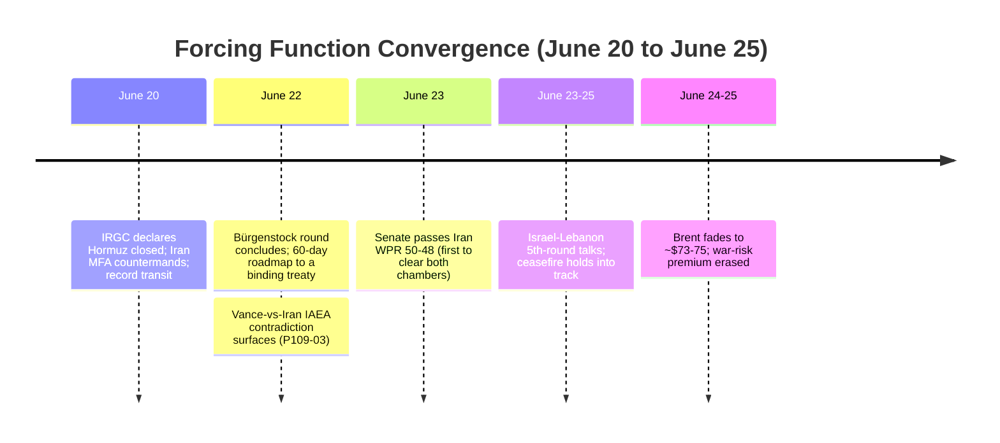
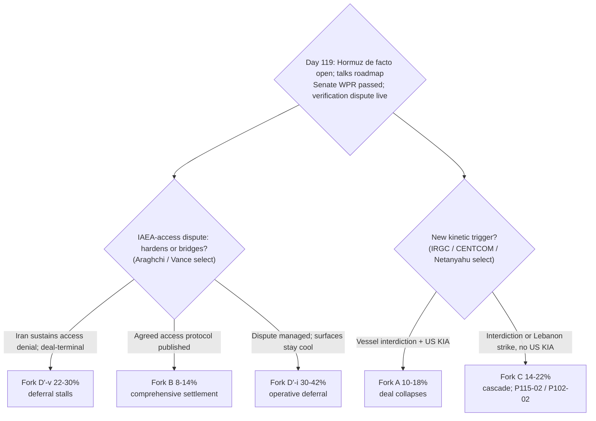

# Iran 2026 Operational SITREP — Daily Update
**Day 119 | Thursday, June 25, 2026**
*Annex/Update to Iran 2026 Operational SITREP and Strategic Synthesis (base report v4.4)*

## Executive Summary

The Day-115 de-escalation read reasserted, inverting the Hormuz re-arm within one cycle. The June-20 strait closure proved declaratory and unenforced: Iran's own Foreign Ministry (Baghaei) publicly contradicted the IRGC, CENTCOM logged record transit (55 ships / 17M+ barrels on June 20), the ports blockade stayed lifted, and Brent fell to ~$73–75, erasing its wartime gains rather than spiking. Surface 1 (Hormuz) de-armed and the Lebanon axis (Surface 2) moved into a 5th-round talks track. The Bürgenstock round concluded June 22 with a 60-day roadmap to a binding treaty, but the first named §5.30 collision surfaced on schedule: a principal-level US-Iran contradiction over IAEA re-admission, with Vance asserting Iran agreed to inspectors and Iran's ambassador denying it (zero current access). The one genuinely new structural pressure is domestic: the US Senate passed an Iran War Powers Resolution 50–48 on June 23, the first WPR to clear both chambers, tripping the T9 reachable-CONTESTED trigger armed at Day 105.

Supersedes `day-115` · Hormuz de-arm ↓ · Fork C ↓ · T9 CONTESTED-flag NEW · HEU-verification collision NEW

| Vector | Direction | Driver |
|---|---|---|
| Hormuz status | RE-OPENED (de facto) | Closure declaratory; Iran MFA contradicts IRGC; record transit |
| Brent crude | ~$80.57 → ~$73–75 | War-risk premium fades; "reopening boosts supply" |
| T9 war-powers | VALIDATED → CONTESTED (flag) | Senate WPR 50–48; first to clear both chambers |
| HEU/IAEA verification | NEW/LIVE | Vance claims inspector access; Iran denies; P109-03 fires |
| Lebanon axis | ↓ to talks | 5th-round Israel-Lebanon talks June 23–25; no Iran strike |
| Fork C miscalculation | 16–26% → 14–22% | Both accident surfaces cooled; closure unenforced |
| Fork D'-i (operative) | 28–40% → 30–42% | Hormuz de-arm + 60-day roadmap |
| Fork D'-v (signed-but-stalls) | 20–28% → 22–30% | IAEA verification fracture; now leading variant |
| Iranian apex | opaque (contested) | Hardliner relay disputes June-18 approval; no apex-direct |

> Leading primitives: Fork A 10–18% / 30d, Fork D' 50–64% / 30d. Highest-delta this cycle: Fork C ↓ (Fork D'-i ↑). None-of-above floor: 5%.

---

## Section 1 — Operational Update

**Diplomatic track produced a 60-day roadmap and exposed the verification fracture.** The first high-level Bürgenstock round concluded early June 22 after an ~18-hour session, producing a roadmap to convert the June-17 MoU into a binding treaty plus maritime safeguards, then moving to a technical phase. The load-bearing development is the §5.30 HEU collision going live as a principal-level public contradiction: VP Vance stated "the Iranians have agreed to invite IAEA inspectors back"; Iran's ambassador denied any such agreement, deferring inspections to a post-sanctions-relief stage, and Iran's team did not meet IAEA DG Grossi. The IAEA retains zero access to the four declared enrichment sites. The missile-program-limit clause is confirmed excluded from the 14-point MoU text (deferred, not a precondition).

**Trump posture: rhetoric stayed rhetoric, in a deal-protective register.** No tape action, executive order, or strike followed the Day-21 "take over the strait" and "hit Iran very hard again" threats. Graham's "if this deal fails, President Trump is going to take the Strait of Hormuz over by force" is explicitly conditional and future-tense. Trump's only in-window action was a Truth Social dismissal of the Senate WPR ("Four Republican Losers... I will get it done, one way or the other"), a domestic-posture move, not a kinetic one. Per discipline, the rhetoric carries near-zero informational value absent tape action; the data is the unconverted statement-to-action gap.

**Maritime / CENTCOM: the closure did not materialize as enforcement.** Iran's June-20 IRGC reclosure declaration was contradicted within the window by Iran's Foreign Ministry, by CENTCOM transit data (record June-20 throughput), and by the oil tape. No interdiction, no firing on a US or allied vessel, no new operation name, zero new US KIA. The two-track ambiguity of Day 115 (announced-closed vs traffic-flowing) collapsed toward traffic-flowing.

| Asset / signal | Day 115 baseline | Day 119 read | Implication |
|---|---|---|---|
| Strait of Hormuz | RE-CLOSED June 20; IRGC warns vessels | De facto OPEN; record transit; Iran MFA countermands IRGC | Surface 1 de-armed; P115-02 did-not-fire |
| CENTCOM posture | Contests closure; "monitoring" | Both axes de-escalatory; blockade lifted; no enforcement | P105-01 did-not-fire; Fork A entry-watch unfired |
| US KIA | Zero | Zero | P93-04 did-not-fire; Fork C not converting to Fork A |
| Iran-Israel direct | None (routed via Hormuz) | None; Lebanon axis to talks | P102-02 did-not-fire; axis cooling |
| Lebanon axis | Ceasefire breached; 16+ killed | 5th-round talks scheduled June 23–25 (M; aggregator) | Surface 2 cooling; P102-02 off firing-adjacent |
| IRGC vertex | Maritime channel executes closure | Closure FM-countermanded; no apex fingerprint | A4 toward delegated/diffuse |
| Iranian apex | Attributed approval-with-reservation | Approval contested via hardliner relay; no apex-direct | P115-03 unmet; A4 provisional (demote ~Day 123) |

**Iranian internal: the apex went dark again and the approval is contested through intermediaries.** No authenticated apex-direct statement surfaced; Mojtaba Khamenei has not been seen or heard directly since inheriting the position after the Feb-28 death, and the June-18 relayed approval message stands. This cycle hardliner Nabavian (June 23) claimed Mojtaba "repeatedly objected" and set conditions absent from the MoU, contesting the Day-115 approval through relay rather than apex-direct ownership. Hardliner backlash against Araghchi and Ghalibaf is escalating (Paydari Front parliamentary disruption; a planned protest over the closed parliament; earlier-window death-chants), single-exile-cluster heavy and discounted -50%. No Vahidi-direct HEU statement (P84-07, 11th consecutive absence). Rial: the parallel print is unreachable this window (PROBE-3 monthly; official CBI ~1,375,050/USD is not the parallel rate; the ~1,790,000 parallel anchor carries unverified, BS-1b).

**Israel: pre-emption stays channeled to a cooling Lebanon axis.** A 5th round of Israel-Lebanon talks (political and military tracks) was scheduled across June 23–25, implying the ceasefire held into a talks track rather than collapsing into open war (M confidence; aggregator-sourced, no T1/T2 hold-vs-rebreak confirmation). No Israeli strike on Iranian nuclear sites; no direct Iranian response drawn. Ben Gvir and Smotrich rejected the MoU ("does not bind us"; "we are not partners") but no far-right resignation occurred; the coalition is strained, intact. The Powell pre-emption incentive remains maximal (HEU deferred) and the actor continues to not spend it on an Iran-nuclear strike.

**Markets: the closure landed and faded.** Brent fell to ~$75.57 (June 24, Fortune) and into the ~$72.64–73.72 range June 25, down ~4% and roughly 36–40% off the wartime peak, the lowest since late February. Bloomberg: "Brent erases wartime gains as Hormuz reopening boosts supply." The Monday June-22 reprice, flagged at Day 115 as the live test for P108-04 (Brent >$92), resolved decisively in the inverse direction.

| Asset | Pre-war (Feb 28) | Day 115 (Jun 19) | Day 119 (Jun 24–25) | Implication |
|---|---|---|---|---|
| Brent crude | $73 | ~$80.57 | ~$73–75 (−~4% wk) | War-risk premium faded; closure unpriced (unenforced) |
| US gasoline | — | <$4.00 | <$4.00 | No pump re-transmission |
| Iranian rial (parallel) | ~960k/USD | ~1,790,000 | ~1,790,000 (carry, unverified) | Parallel print unreachable; official CBI ~1,375,050 |

*Equities/VIX/gold carried from Day 115; no framework-moving tape this cycle. The armed reversal triggers P108-04 (>$92) and P105-05 (>$100 sustained) resolved did-not-fire.*

**US domestic: the war-powers question re-opened, non-bindingly.** The Senate passed an Iran War Powers Resolution 50–48 on June 23, directing the President to remove US forces from hostilities with Iran. Four Republicans crossed (Cassidy, Collins, Paul, Murkowski); Fetterman (D) voted no. This is the first WPR to clear both chambers (the House passed ~June 3). It is non-binding, was not transmitted to the White House, carries no veto-override margin (50 vs 67), and Trump dismissed it; no Federal court granted WPA standing. The executive path operationally holds, but the trend instrumentation now has a both-chambers contradiction (Section 3).

**International: Gulf disposition sours from relief to alarm; Russia absent, China consulted.** CNN (June 24) reported Gulf allies fear the deal is a "disastrous turning point": it grants Tehran a formal Hormuz oversight role alongside Oman plus maritime service fees, while the Gulf wants toll-free freedom of navigation, and it leaves Iran's missiles and proxies unaddressed. In a counter-signed accommodation move, the UAE agreed to unlock billions in frozen Iranian assets. No named MBS-MBZ divergence on a specific decision; no Saudi-Iran FM meeting. China praised the deal; Russia remains absent from the deal and Hormuz tracks.

---

## Section 2 — Framework Validation

- **A9 / A22 (constraint architecture precedes faction selection; structured deferral realized; T7):** the signed deferral held through a contested cycle; Trump protects it with rhetoric, Iran brandishes Hormuz reversibly, Israel routes to Lebanon talks, each selection contingent.
- **A10 / A12 (Slantchev brandish-then-trade / feigning weakness; T2):** the Hormuz closure was brandished as the reserved maritime channel then held unenforced and countermanded by Iran's own Foreign Ministry, the reversible-leverage reading realized rather than a staked sovereign position.
- **A13 (ratification capacity is binding; T3):** confirmed inversely; the hardliner relay contesting the apex approval and the parliamentary-disruption push are the two-level ratification friction, with the binding risk on the Iranian ratification chain rather than dispositional asymmetry.
- **A21 (Gulf principal-level pivot capacity; T1):** Gulf disposition sours to alarm on the deal's terms and the UAE unlocks Iranian assets, both autonomous pivot moves; brake/endorsement function holds with no named split.
- **A23 (Netanyahu diplomatic-spoiler via Lebanon; T8):** the reserved Lebanon axis cooled to a talks track this cycle; the spoiler stays channeled away from an Iran-nuclear strike.

**Prediction Resolution.**

- **P109-03** (HEU down-blend verification dispute): **fired**. Vance claims Iran agreed to re-admit IAEA inspectors; Iran's ambassador denies, defers to a post-relief stage; zero current access. Matrix-followed: **y** (D'-v 20–28% → 22–30% applied).
- **P108-04** (Brent >$92 on deal failure): **did-not-fire**. Brent fell to ~$73–75 on the Monday reprice, the inverse of the snap-back. Matrix-followed: n.a.
- **P105-05** (Brent >$100 sustained): **did-not-fire**. Same tape. Matrix-followed: n.a.
- **P115-02** (Iran fires on / interdicts a US or allied vessel): **did-not-fire**. Closure unenforced; Iran MFA countermanded; record transit. Matrix-followed: y (Fork C de-arm applied as the firing sub-condition stayed unmet).
- **P105-01** (CENTCOM names a new operation): **did-not-fire**. No operation; blockade lifted. Matrix-followed: n.a.
- **P115-03** (authenticated apex-direct term-level statement): **did-not-fire**. No apex-direct; June-18 relay contested by hardliners. Matrix-followed: n.a. (A4 provisional, demote ~Day 123).
- **P84-07** (Vahidi-direct HEU): **did-not-fire**, 11th consecutive absence. Matrix-followed: n.a.
- **P87-01** (WH "full dismantlement" readout): **did-not-fire**, evidence-against A2 (5th cycle). MoU excludes missiles and leaves HEU; Vance pushes verification, not dismantlement; Trump pressured Israel. Matrix-followed: n.a.
- **P102-02** (second Iran-Israel direct exchange): **did-not-fire**, off firing-adjacent. Lebanon moved to talks. Matrix-followed: n.a.
- **P100-09** (Hezbollah accepts South Litani withdrawal): **did-not-fire**, watch improving (talks track, no accepted framework). Carried.
- **P85-02, P86-03, P93-04, P97-02, P102-03, P102-09, P108-03, P110-01, P115-01** (standing/talks-window): **did-not-fire** this cycle. P108-03 confirmed excluded from text; P110-01 UAE asset-unlock is accommodation, not an in-text demand; P102-03 no resignation; P102-09 Gulf alarm is not endorsement of a US strike. Carried.

**Surprise (S6).** The Senate WPR 50–48 passage forced a Section-3 trend move (T9 CONTESTED flag) and appeared on no Section-7 watchlist. Partial mitigation: the Day-115 sweep PROBE-10 skip-note and the Day-115 US-domestic bullet both flagged the latent war-powers re-trigger, but neither was a ledger-ready signal row. The watchlists lacked a domestic-institutional re-trigger branch; logged to the Surprise register and routed to /audit Source C, extending the Day-105 watchlist-construction finding from adversary-new-vector to domestic-institutional vectors.

---

## Section 3 — Framework Revisions Required

**TRIGGER FIRED — T9 reachable-CONTESTED trigger met; flag VALIDATED → CONTESTED (immediate; PROBE-10; for /audit).** Prior: T9 (Stage-2 hysteresis lock-in) VALIDATED, disc-ratio 4:10 at /premortem; the Day-105 reachable trigger armed on either a Federal court granting WPA standing or a second single-chamber on-merits WPR passage. New: the Senate passed the WPR 50–48 on June 23, the second single-chamber on-merits passage (the House was first), meeting reachable trigger (b). Revised: flag T9 VALIDATED → CONTESTED for the next /audit, urgency immediate; increment the disc-ratio. **Trend cross-check:** this is the designed reachable contradiction, not a single-cycle over-read; it is multi-cycle (House then Senate). It is CONTESTED, not DISCONFIRMED: the resolution is non-binding, untransmitted, sub-veto-override, and Trump-dismissed, so the executive-path prediction operationally holds and the full falsification bar (both chambers plus veto-override, or a court accepting standing) is unmet. The sweep flags; /audit enacts. If /audit enacts CONTESTED, the 6/12m structural priors resting on T9 lock-in require re-evaluation at /revise.

**TRIGGER FIRED — Hormuz closure de-arms Surface 1; Fork C down, Fork D'-i up (H, next cycle; PROBE-8 / PROBE-2 / PROBE-7 / PROBE-16).** Prior (Day 115): Hormuz "contested-leverage re-arm"; Fork C 16–26%, D'-i 28–40%. New: the June-20 closure proved declaratory and unenforced (Iran MFA countermand, record transit, Brent ~$73–75, no interdiction, zero KIA). Revised: **Fork C 16–26% → 14–22%; Fork D'-i 28–40% → 30–42%**; Fork D' composite 48–62% → 50–64%; KEC 26–44% → 24–42%. Fork A composite holds 10–18% (US-resumption sub-path de-elevates within the band). **Trend cross-check:** holds T2 (channel brandished then held reversible) and T9 (Hormuz traded in the executive instrument, contested within it); no VALIDATED-trend contradiction. This is the third consecutive operational-reading reversal on BS-7/BS-11 (D110 settled → D115 re-arm → D119 declaratory/de-escalating); logged as a within-architecture reading update and a recency-bias watch item for /audit, not a thesis break. No /revise.

**TRIGGER FIRED — HEU/IAEA verification collision goes live; Fork D'-v up (H, next cycle; PROBE-12').** Prior: §5.30 HEU down-blend class named but inactive; D'-v 20–28%. New: a principal-level US-Iran public contradiction over IAEA re-admission (Vance claims agreement; Iran's ambassador denies; zero current access). Revised: log P109-03 fired; **Fork D'-v 20–28% → 22–30%** (now the leading variant). **Trend cross-check:** consistent with T3 (verification deferred to a post-relief stage by the Iranian side, two-level managed) and T4 (deal-faction Vance owns the verification track); no contradiction.

**Operational note — apex approval contested via relay (M; PROBE-1).** The Day-115 attributed Mojtaba approval is contested this cycle by a hardliner relay (Nabavian) rather than confirmed or repudiated apex-direct; A4 principal-locus narrows further toward delegated/diffuse. No synthesis increment; the A4 provisional clock runs (cycle 5 of ~6; demote ~Day 123).

---

## Section 4 — Framework Additions

**The Day-115 cross-surface-linkage candidate did not repeat; it folds back toward the Surface-1 residual.** Day 115 flagged Iran's tying of the Hormuz term to the Lebanon term as a provisional fourth §5.30 collision class, held single-cycle pending repetition on a different term pair. This cycle the closure that carried the linkage de-armed (declaratory, unenforced) and Iran did not link a fresh term pair, so the candidate folds back into the Surface-1 residual per the single-cycle-over-read discipline (Day 77 BS-12 canonical failure). It is retained as a watch item (P115-01 standing), not promoted. No new mechanism meets the structural threshold this cycle.

---

## Section 5 — Revised Probability Matrix

### 5a. 30-Day Matrix (cycle-Bayesian)

| Outcome | 30 days | vs. Day 115 | Driver |
|---|---|---|---|
| **Fork D': Structured deferral (signed MoU)** | **50–64%** | 48–62% ↑ | Both residual surfaces cooled; signature durable; 60-day roadmap agreed |
| · D'-i (operative) | 30–42% | 28–40% ↑ | Hormuz de-arm + roadmap + Lebanon talks track |
| · D'-v (signed-but-stalls) | 22–30% | 20–28% ↑ | IAEA verification fracture live; leading variant; US-intel nuclear pessimism |
| **Fork C: Miscalculation cascade** | **14–22%** | 16–26% ↓ | Both accident surfaces de-armed; width narrows (boundary resolved toward de-escalation) |
| **Fork A: Kinetic resumption (composite)** | **10–18%** | HELD | US-resumption sub-path de-elevates on Hormuz de-arm + WPR overhang; zero KIA |
| · Israeli pre-emption (60-day window) | 28–40% | HELD | T8 maximal; incentive routed to a cooling Lebanon axis |
| · US Vahidi decapitation (standalone) | 4–10% | HELD | No principal-targeting signal |
| **Fork B combined (comprehensive settlement)** | **8–14%** | HELD | Roadmap to a binding treaty keeps the path alive; IAEA fracture caps it |
| **None of the above** | **5%** | HELD | Mandatory non-zero floor |

**Range-width note.** Fork C narrows 10pp → 8pp: the de-arm resolves the Day-115 two-live-surface boundary toward de-escalation (evidence density on the unenforced closure rose), a re-cut at the new operational reality, not a hedge. D'-i holds 12pp, D'-v 8pp, A 8pp, B 6pp. No declared Fork A/C overlap; the US-KIA / transit-enforcement sub-condition remains the discriminator gating Hormuz-response routing, reported as a sub-condition, not a convergence cell. Fork D' decomposition (D'-i / D'-v) remains adopted; composite midpoint ~57% sustains it.

> **KEC [DERIVED]:** ~24–42% (30d). Fork A 10–18% + Fork C 14–22% + tail (<2%). Down from ~26–44% (Day 115), tracking the Fork C de-arm. Primitives lead.

### 5b. 6/12-Month Matrix (structural-prior; no update this cycle)

| Outcome | 6 months | 12 months | Last updated | Driver |
|---|---|---|---|---|
| Fork A composite | 32–42% | 38–48% | v4.4 (Day 109) | Sustained T8/T12 advance traded into a signed deferral |
| Fork B-bilateral | 14–20% | 14–22% | v4.4 (Day 109) | Signed deal + 60-day talks open a credible path |
| Fork B-multilateral | 12–20% | 14–22% | v4.1 (Day 84) | Gulf pathway institutionalizing (priced) |
| Fork D' structured deferral | 22–30% | 16–24% | v4.4 (Day 109) | Signed deferral; 12m capped (converts or breaks by horizon) |
| Fork C miscalculation cascade | 14–20% | 14–20% | v4.4 (Day 109) | Ceasefire closes surfaces conditionally; T2 floor |
| None of the above | 10–15% | 10–15% | v4.2 (Day 88) | Mandatory non-zero floor |

*No update this cycle: the Hormuz de-arm, the Lebanon-talks track, and the verification collision are operational activations of the §5.28/§5.30 surfaces, not constraint-layer shifts. Conditional flag: if /audit enacts the T9 VALIDATED → CONTESTED transition, that is a trend-state transition (the primary /revise trigger) and the Fork A structural prior resting on T9 lock-in must be re-evaluated at /revise. The bicameral WPR alone, non-binding and Trump-dismissed, is below that bar.*

---

## Section 6 — Probe Status Table

| PROBE | Status | Conf | Trigger | Variable moved |
|---|---|---|---|---|
| 1 Apex/Mojtaba | partial | M | no | Approval contested via hardliner relay; no apex-direct; P115-03 unmet |
| 2 IRGC/Vahidi | **fired** | M | yes | IRGC closure FM-countermanded; no apex fingerprint; HEU absent (11th) |
| 7 CENTCOM | **fired** | M | yes | Both axes de-escalatory; blockade lifted; zero KIA |
| 8 Oil/Hormuz | **fired** | H | yes | Closure unenforced; Brent ~$73–75; war-risk faded |
| 9 Israeli | **fired** | M | partial | Lebanon to 5th-round talks; no Iran strike; no resignation |
| 10 War powers | **fired** | H | yes | Senate WPR 50–48; both chambers; T9 CONTESTED flag (upshift) |
| 12' Diplomacy | **fired** | H | yes | 60-day roadmap; IAEA verification dispute (P109-03) |
| 13 A1 Trump | **fired** | M | yes | Coercive rhetoric unconverted; WPR dismissal; deal-protective |
| 14 Reconstitution | partial | L | no | T12 hold; no fresh cluster; capability frozen |
| 15 Dispositional | partial | M | no | Dual splits persist but cooled; no kinetic exercise |
| 16 First-mover | **fired** | M | yes | Both surfaces de-armed; Fork C de-arm |
| 20 Gulf | partial | M | no | Relief → alarm; UAE asset-unlock; no named split |
| 21 Paine | partial | M | no | No death-ground; reversible leverage |

*Fired: 8 | Partial: 5 | Null: 0 | Gap: 0. Skipped (tier/activation): PROBE-3, -6 (BS-4 retirement now due, June-23 passed), -11, -17, -18, -19. Sweep: `sweep-2026-06-25.json`.*

---

## Section 7 — Conclusion and Forking Analysis

### Central Thesis Check

The v4.0 materialist bargaining thesis is **holding.** The thin-instrument-defers-collisions reading advanced a cycle further: the Day-115 Hormuz collision proved reversible and declaratory under joint constraints (Iran's diplomatic apparatus needs the deal, so the Foreign Ministry countermanded the IRGC; the oil tape priced re-supply, not closure), and the next named §5.30 collision (HEU verification) surfaced precisely where the synthesis ranked it. The 60-day window is producing the predicted collision sequence one surface at a time, each so far resolving reversibly while the signature and the talks-clock hold. The one new pressure is domestic-US, and the framework's own T9 reachable-CONTESTED trigger, pre-built at Day 105 to be reachable short of falsification, caught it. **Trend lines:** T9 CONTESTED-flag (reachable trigger b met; flagged for /audit; operational executive-path prediction holds); T2 hold (channel brandished then held reversible); T3 hold (apex opaque, ratification two-level); T1 hold (Gulf relief → alarm, no named split); T8 hold/easing (pre-emption channeled to a cooling Lebanon axis); T4, T12 hold. No trend other than T9 moved; no VALIDATED-trend contradiction beyond the T9 reachable flag. The Hormuz de-arm reversed a Day-115 operational reading on BS-7/BS-11, not a trend.

### Forking Tree (72-Hour Decision Path)

### Operative Judgment

The crux of the next 48 to 72 hours is whether the IAEA-access dispute hardens or is managed, because it is now the binding variable and it sits on the deal track, not the accident surface. The signal cluster that tightened this cycle is the gap between US and Iranian descriptions of the same instrument: Vance narrating verification secured, Iran's ambassador narrating nothing conceded before sanctions relief. That cluster tightens the prior that the binding deal risk is two-level ratification plus verification sequencing, and loosens the prior that the residual surfaces are primarily kinetic. The accident surfaces that defined Day 115 both cooled within a cycle, which is the stronger evidence: an unenforced closure that Iran's own Foreign Ministry countermanded and that the oil market de-priced is the reversible-leverage reading realized, not a staked sovereign position, and the Day-115 Fork C re-arm now reads as a mild over-reaction to a declaration that never became enforcement.

The domestic-US development is the cycle's structural mover, and the framework absorbed it as designed rather than as a surprise to the mechanism. The Senate WPR passage meets the reachable-CONTESTED trigger for T9 because both chambers have now passed a WPR on the merits, which is exactly the contradiction the Day-105 /premortem armed to make the trend testable rather than self-certifying. The cost-benefit for the named actors is unchanged at the action layer: Trump dismissed the resolution and retains freedom of action because it is non-binding, untransmitted, and sub-veto-override, so the executive-path lock-in operationally holds; the flag is an instrumentation event, not an enforcement event. The discriminating question for /audit is whether to enact CONTESTED on the reachable trigger while the operational prediction holds, and if it does, the 6/12m Fork A prior that rests on T9 lock-in becomes a /revise item.

For the Iranian apex, the constraint surface still compresses the principals toward a deferral each prefers to the alternatives, and the principal-locus stays unresolved: the closure ran through the IRGC with the Foreign Ministry countermanding it and no apex claim, which tilts the escalation-control reading toward command-autonomous or declaratory and away from apex-intended. Selection by Iran's command on the verification branch, by CENTCOM on the enforcement branch, and by Netanyahu on the Lebanon branch remains contingent; with both kinetic surfaces cooled, the framework's attention moves to the verification fracture and to the A4 provisional clock, which demotes at ~Day 123 absent an authenticated apex-direct statement.

### Signals That Force Immediate Revision

- IAEA-access dispute hardens (Iran sustains denial of inspector re-admission or rejects the named US "active role"): P109-03 follow-on; reprice D'-v toward the upper band, Fork B caps lower (resolve-by: first 1–2 talks cycles).
- Iran fires on or interdicts a US or allied vessel in the strait: P115-02 terminal fires; Fork C resolves into Fork A; matrix resets (resolve-by: standing).
- CENTCOM orders armed transit-escort/interdiction or names a new operation: P105-01 fires; Fork A activates; deal track terminal (resolve-by: standing).
- Federal court grants WPA standing OR a veto-override-capable WPR majority forms (domestic-institutional vector): T9 to DISCONFIRMED / full falsification; 6/12m Fork A prior to /revise (resolve-by: standing).
- Authenticated Mojtaba or Vahidi apex-direct term-level statement not routed through SNSC framing: A4 principal-locus resolves; P115-03 / P84-07 follow-on (resolve-by: next 1–2 cycles).
- Missile-program-limit clause OR a fresh third-party precondition enters the talks text (adversary-new-vector): P108-03 / P110-01 fire; new Fork D' collision class; reprice D'-v (resolve-by: first 1–2 talks cycles).
- Brent closes >$92 on a deal-stress event, or >$100 sustained: P108-04 / P105-05 fire; snap-back confirmed (resolve-by: standing; currently inverse, Brent ~$73–75).
- Israeli strike on Iranian nuclear sites: P85-02 fires; Fork D' and Fork B collapse, mass into Fork A (resolve-by: standing).
- Lebanon talks collapse back into a direct Iran-Israel exchange with no successful Trump halt: P102-02 fires; Fork C to 22–32% (resolve-by: next Lebanese provocation cycle).
- Named MBS-MBZ split on a specific decision: BS-18 fractures; Fork A re-elevates, Fork B-multilateral caps (resolve-by: standing).

---

*Compiled June 25, 2026 | Day 119 | Subject to revision as data updates*
*Companion: `sweep-2026-06-25.json`; base `synthesis-v4-4.md`. Next SITREP monitors: the IAEA-access dispute (harden vs bridge); whether /audit enacts the T9 CONTESTED transition; an authenticated apex-direct statement; the Lebanon talks track; the Monday-tape follow-through on Brent.*
