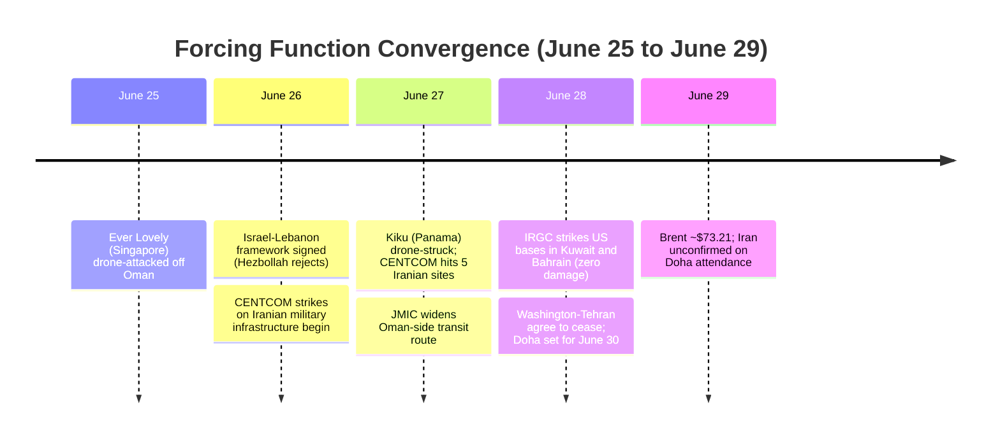
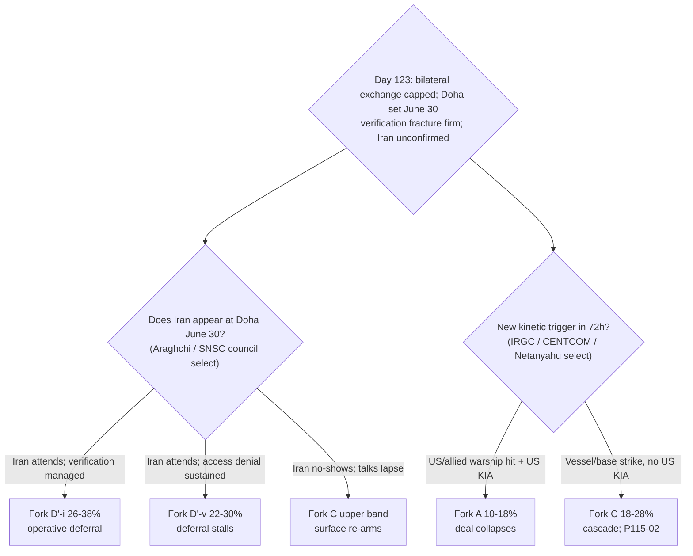

# Iran 2026 Operational SITREP — Daily Update
**Day 123 | Monday, June 29, 2026**
*Annex/Update to Iran 2026 Operational SITREP and Strategic Synthesis (base report v4.5)*

## Executive Summary

The accident surface the Day-119 read had de-armed fired into a real bilateral exchange and then self-corrected. After an Iranian drone hit the Singapore-flagged container ship Ever Lovely off Oman (June 25), CENTCOM struck five Iranian coastal/military sites (June 26-27, self-defense-of-shipping framing, no operation name, infrastructure-scoped), a second tanker (Panama-flagged Kiku) was drone-struck, and the IRGC answered with a coordinated naval-aerospace ballistic-and-drone strike on US bases in Kuwait (Ali Al Salem) and Bahrain (Fifth Fleet HQ). CENTCOM reported zero damage and zero US casualties; Washington and Tehran agreed late June 28 to halt attacks and resume talks in Doha on June 30, though Iran did not confirm attendance. The cascade-to-Fork-A barrier held under live fire: no US KIA, no new operation, mutual de-escalation. Separately, Israel and Lebanon signed a framework June 26 (Hezbollah rejects it "null and void"), and Grossi placed the MoU text on the IAEA-supervision side of the verification dispute while Iran deferred access to a final agreement.

Supersedes `day-119` · Fork C ↑ · Hormuz surface RE-FIRED (live) · A4 → structurally-opaque (v4.5) · cascade-barrier held under live fire

| Vector | Direction | Driver |
|---|---|---|
| Hormuz/shipping surface | RE-FIRED (live) | Two vessels drone-hit; US strikes; IRGC base strikes |
| Fork C miscalculation | 14-22% → 18-28% | Accident surface realized into a real exchange |
| Fork A composite | HELD 10-18% | Zero US KIA; no operation name; de-escalation |
| Fork D'-i (operative) | 30-42% → 26-38% | Window non-clean; Iran hedging Doha |
| US KIA | Zero → Zero | IRGC base strikes claimed-but-zero-damage |
| Lebanon axis | talks → FRAMEWORK SIGNED | June 26 deal; Hezbollah rejects |
| Brent crude | ~$73-75 → ~$73.21 | War premium re-add modest; nearly fully unwound |
| IAEA verification | FIRMS | Grossi: MoU mandates supervision; Iran defers |
| Iranian apex | structurally-opaque | Strikes IRGC-attributed, apex-unowned (v4.5) |

> Leading primitives: Fork A 10–18% / 30d, Fork D' 48–62% / 30d. Highest-delta this cycle: Fork C ↑ (Fork D'-i ↓). None-of-above floor: 5%.

---

## Section 1 — Operational Update

**Diplomatic track survived a live strike exchange but Iran is hedging attendance.** Washington and Tehran agreed late June 28 to cease attacks and resume talks in Doha on June 30; Trump confirmed, Iran did not. Deputy FM Gharibabadi said technical talks were "not yet planned this week" and would proceed only "when the conditions are met" (T1). The only direct meeting since the June-17 Islamabad Memorandum remains the June-21 Switzerland round. The signature held and mediator Qatar stayed active through the kinetic window; the instrument bent and reset rather than breaking.

**Trump posture: rhetoric converted to bounded tape action.** Unlike Day 119 (rhetoric stayed rhetoric), Trump ordered actual CENTCOM strikes on five Iranian sites after citing the Ever Lovely attack as a ceasefire violation ("they took a shot... actually four of them"). He paired maximalist rhetoric ("Iran will no longer exist," "complete the job") with infrastructure-only strikes and an immediate Doha re-opening. Per discipline the rhetoric carries near-zero informational value; the data is the bounded strike (no operation name, no principal or nuclear targeting) plus the simultaneous return to talks, i.e. deal-protective coercion. Vance: "violence will be met with violence."

**Maritime / CENTCOM: the surface produced a real two-way exchange that capped below Fork A.** CENTCOM struck Iranian surveillance, communications, air-defense, drone-storage and mine-laying sites (Qeshm radar; two newly-built targets per JPost) as a self-defense response to the vessel attacks. The IRGC struck US bases in Kuwait and Bahrain 2-3am local June 28, claiming "eight US infrastructures destroyed"; CENTCOM and a US official (Reuters) reported zero damage, zero casualties. The US-Navy-overseen JMIC announced a widened Oman-side transit route June 27.

| Asset / signal | Day 119 baseline | Day 123 read | Implication |
|---|---|---|---|
| Strait of Hormuz | De facto open; record transit | Contested again; two vessels drone-hit; JMIC widened Oman route | Surface RE-FIRED live; P115-02 fired-partial |
| CENTCOM posture | Both axes de-escalatory | Struck 5 Iranian sites (self-defense; no op name) | Operational-axis escalation, bounded; P105-01 did-not-fire |
| US KIA | Zero | Zero (IRGC base strikes zero-damage) | P93-04 did-not-fire; Fork C not converting to A |
| Iran-US direct | None | Bilateral exchange (vessels, strikes, base strikes), de-escalated | Fork C realized then capped |
| Iran-Israel direct | None | None; Lebanon to signed framework | P102-02 did-not-fire |
| Lebanon axis | 5th-round talks | Framework SIGNED June 26; Hezbollah rejects | Surface 2 de-escalated at state level; P100-09 did-not-fire |
| IRGC vertex | Closure FM-countermanded | Coordinated two-country base strike, calibrated, apex-unowned | A4 structurally-opaque reinforced |

**Iranian internal: apex structurally-opaque; the response ran through the IRGC.** The base strikes were IRGC-attributed (naval and aerospace) with no apex or SNSC ownership claim, and the rapid cease-and-resume-Doha agreement points to council-level control of the off-ramp, consistent with the v4.5 demotion of the apex to structurally-opaque. Mojtaba Khamenei remains unseen since the Feb-28 succession; no Vahidi-direct HEU statement (P84-07, 12th absence). Hardliner backlash against Araghchi continues (Paydari/Paydari-Front disruption; single-exile-cluster, discounted -50%). Rial parallel print unreachable this window (PROBE-3 monthly; official CBI anchor is not the parallel rate; the ~1,790,000 parallel figure carries unverified, BS-1b).

**Israel: pre-emption incentive maximal and again unspent on Iran.** Israel and Lebanon signed a framework June 26 after four days of US-brokered Washington talks, tying Israeli withdrawal to verified Hezbollah disarmament without mandating an Israeli pullout from occupied land; Hezbollah's chief called it "null and void." Through the entire US-Iran exchange Israel did not strike Iranian nuclear sites and drew no direct Iranian response, the strongest non-spend datapoint of the conflict. Ben Gvir and Smotrich reject the Iran MoU ("does not bind us"); no far-right resignation; coalition strained, intact.

**Markets: the war premium re-added modestly and remains nearly fully unwound.** Brent rose ~0.9% to ~$73.21 (Aug futures) on the weekend strikes, roughly $0.13 above the Feb-28 pre-war level. An analyst noted oil had "nearly unwound its entire war premium, despite an MoU with no enforcement details and ongoing strikes." The tape priced the de-escalation and Doha resumption over the kinetic headline.

| Asset | Pre-war (Feb 28) | Day 119 (Jun 24-25) | Day 123 (Jun 29) | Implication |
|---|---|---|---|---|
| Brent crude | $73 | ~$73-75 | ~$73.21 (+~0.9%) | Modest risk re-add; premium nearly fully unwound |
| US gasoline | — | <$4.00 | <$4.00 | No pump re-transmission |
| Iranian rial (parallel) | ~960k/USD | ~1,790,000 | ~1,790,000 (carry, unverified) | Parallel print unreachable; PROBE-3 monthly |

*Equities/VIX/gold carried from Day 119; no framework-moving tape this cycle. P108-04 (>$92) and P105-05 (>$100 sustained) resolved did-not-fire.*

**US domestic: the executive struck Iran free of war-powers constraint.** No new WPR vote this cycle. Backfill: one day after the 50-48 passage the Senate rejected a measure to restrict Trump's Iran war powers (procedural, failed 50-47, only two GOP for). Decisively, Trump ordered strikes on Iran days after both chambers passed the WPR and he dismissed it, with no court granting WPA standing, demonstrating the executive-path lock-in operationally holds under T9 CONTESTED.

**International: Iran struck Gulf soil and drew unified condemnation.** Iran's strikes on US bases inside Kuwait and Bahrain drew convergent condemnation: Bahrain ("violated its sovereignty"), Kuwait ("repeated heinous Iranian aggressions"), the UAE ("blatant violation" of sovereignty), and Jordan ("dangerous escalation"). The condemnation is convergent across the troika (UAE aligned with Bahrain/Kuwait), not a named MBS-MBZ split. Russia remains absent from the deal, Hormuz and kinetic tracks; China the consulted pole.

---

## Section 2 — Framework Validation

- **A10 / A12 (Slantchev brandish-then-trade / feigning weakness; T2):** the IRGC executed a coordinated two-country base strike calibrated below the maximum-response threshold (claim of "eight bases destroyed" against CENTCOM-confirmed zero damage), then de-escalated to talks, the multi-channel deterrent exercised as demonstration not staked position.
- **A9 / A22 (constraint architecture precedes faction selection; T7):** the signed deferral absorbed a live bilateral exchange and compressed both principals back toward Doha within ~48 hours, each selecting the off-ramp the constraint surface made cheapest.
- **A23 (Netanyahu diplomatic-spoiler via Lebanon; T8):** Israel signed a Lebanon framework and did not spend the pre-emption incentive on an Iran-nuclear strike even with the US already striking Iran; the spoiler stays channeled to the Hezbollah-rejection residual.
- **A13 (ratification capacity binding; T3):** confirmed inversely; the base strikes ran IRGC-only against the apex's own ratified instrument with no apex claim, the diffuse council consenting to the deal while the military brandished the floor.
- **A21 (Gulf principal-level pivot capacity; T1):** Gulf states exercised autonomous voice against Iranian aggression on their territory, brake/endorsement function holding with no named intra-troika split.

**Prediction Resolution.**

- **P115-02** (Iran fires on / interdicts a US or allied vessel): **fired-partial**. Iran drone-attacked two third-flag commercial vessels (Ever Lovely, Kiku) and struck US bases, but not a US or allied warship, and produced zero US KIA. Matrix-followed: partial (Fork C re-arm applied; Fork A reset withheld pending a US/allied-warship firing plus KIA, justified).
- **P119-02** (IAEA-access dispute hardens): **fired-partial**. Grossi asserts the MoU "explicitly" mandates IAEA supervision; Iran sustained deferral to a final agreement (did not concede, did not terminally reject). Matrix-followed: partial (D'-v held 22-30 as the leading variant; not yet upper-band repriced absent a sustained Iranian denial-to-terminal).
- **P93-04** (US KIA): **did-not-fire**. IRGC base strikes produced zero US casualties. Matrix-followed: y (Fork C de-arm-of-conversion held; Fork A not activated).
- **P105-01** (CENTCOM names a new operation): **did-not-fire**. Strikes framed as self-defense, no operation name. Matrix-followed: n.a.
- **P105-05 / P108-04** (Brent >$100 sustained / >$92): **did-not-fire**. Brent ~$73.21. Matrix-followed: n.a.
- **P115-03** (authenticated apex-direct statement): **did-not-fire**, subsumed by the v4.5 A4 structurally-opaque demotion; strikes IRGC-attributed, apex-unowned. Matrix-followed: n.a.
- **P84-07** (Vahidi-direct HEU): **did-not-fire**, 12th absence. Matrix-followed: n.a.
- **P87-01** (WH "full dismantlement" readout): **did-not-fire**, evidence-against A2 (now inherited, v4.5); US struck on its own shipping framing, not Israeli maximalist terms. Matrix-followed: n.a.
- **P85-02** (Israeli strike on Iranian nuclear sites): **did-not-fire**. Israel signed a Lebanon framework; no Iran strike. Matrix-followed: n.a.
- **P100-09** (Hezbollah accepts South Litani withdrawal): **did-not-fire**. Framework signed at state level; Hezbollah rejects "null and void." Carried.
- **P102-02** (second Iran-Israel direct exchange): **did-not-fire**. The exchange was US-Iran. Carried.
- **P102-03** (Netanyahu coalition fracture): **did-not-fire**. No resignation. Carried.
- **P102-09** (Saudi support for US military action): **did-not-fire**. Gulf condemned Iran's strikes; did not endorse the US strikes on Iran. Carried.
- **P108-03, P110-01, P115-01** (adversary-new-vector text watches): **did-not-fire**. Missile clause still excluded; no third-party in-text demand; no new term-pair linkage. Carried.
- **P119-01** (court WPA standing OR veto-override majority): **did-not-fire**. No court; executive struck Iran free of constraint. Carried.
- **P86-03, P97-02** (IDF refueling tempo; Bazaar closure): **did-not-fire** this cycle. Carried.

**Watchlist coverage.** The kinetic cluster was substantially pre-listed: the vessel-interdiction branch (P115-02) and the CENTCOM-strike branch (P105-01 family) both carried, and the Iran-base-strike modality recurred from the Day-90 P90-01 Kuwait strike. No new surprise this cycle; the Day-105 adversary-new-vector watchlist directive held. This is a coverage recovery after the Day-119 S6 domestic-institutional miss.

---

## Section 3 — Framework Revisions Required

**TRIGGER FIRED — Hormuz/shipping accident surface re-fired into a live exchange; Fork C up (immediate; PROBE-8 / PROBE-7 / PROBE-2 / PROBE-16).** Prior (Day 119): surface read "declaratory/unenforced, de-escalating," Fork C 14-22%. New: a real bilateral exchange (two vessels drone-hit, CENTCOM strikes on five Iranian sites, IRGC strikes on US bases in Kuwait/Bahrain) that self-corrected (zero US KIA, no operation name, cease-and-Doha agreement). Revised: **Fork C 14-22% → 18-28%; Fork D'-i 30-42% → 26-38%; Fork D' composite 50-64% → 48-62%; KEC 24-42% → 28-48%.** Fork A composite holds 10-18% (cascade-to-A barrier held under live fire). **Trend cross-check:** holds T2 (channel exercised then capped below maximum) and T9 (Hormuz traded in the executive instrument); no VALIDATED-trend contradiction. This corrects the Day-119 de-arm: the surface is live, not declaratory.

**TRIGGER FIRED — BS-7/BS-11 Hormuz sub-read four-cycle oscillation; recency-bias escalation (immediate; for /audit and /premortem; PROBE-8).** The Hormuz/shipping operational sub-read has now reversed four consecutive cycles: D110 settled → D115 contested-leverage re-arm → D119 declaratory/de-arm → D123 live-exchange. The Day-119 sweep flagged its own de-arm as a watch item ("is the sub-read tracking each headline?"); this cycle confirms the pattern. **Trend cross-check:** not a trend contradiction (no VALIDATED trend predicted Hormuz-term permanence; §5.28 carries it as a residual surface), so this is FLAGGED as a within-architecture recency-bias process finding, not a TRIGGER against a trend. Recommend to /audit a standing Fork-C floor so the live surface is not zeroed on quiet cycles, and route the four-cycle headline-tracking pattern to /premortem.

**TRIGGER FIRED — verification fracture firms; A1 converts to bounded tape action (next cycle; PROBE-12' / PROBE-13).** New: Grossi placed the MoU text on the IAEA-supervision side (P119-02 fired-partial); Iran sustained deferral. Trump converted rhetoric to a bounded, deal-protective strike (P115-02 cluster). Revised: log P119-02 fired-partial; D'-v holds 22-30% as the leading variant (not yet upper-band repriced); A1 "hawkish-with-bounded-execution, deal-protective" sub-state use-confirmed. **Trend cross-check:** holds T4 (deal-faction Vance/Grossi lead) and T3 (Iranian side defers verification to a final-agreement stage, two-level managed); no contradiction.

**No 6/12m revision.** The kinetic exchange is an annex-level activation of the §5.28/§5.30 residual surfaces, not a constraint-layer shift; T9 already CONTESTED at v4.5 and holds. No /revise trigger this cycle.

---

## Section 5 — Revised Probability Matrix

### 5a. 30-Day Matrix (cycle-Bayesian)

| Outcome | 30 days | vs. Day 119 | Driver |
|---|---|---|---|
| **Fork D': Structured deferral (signed MoU)** | **48–62%** | 50–64% ↓ | Survived a live exchange; window non-clean; Iran hedging Doha |
| · D'-i (operative) | 26–38% | 30–42% ↓ | Window non-clean (real strikes); Iran unconfirmed on Doha |
| · D'-v (signed-but-stalls) | 22–30% | HELD | Verification fracture firms (Grossi vs Iran); leading variant |
| **Fork C: Miscalculation cascade** | **18–28%** | 14–22% ↑ | Accident surface realized into a real exchange; width re-cut on live evidence |
| **Fork A: Kinetic resumption (composite)** | **10–18%** | HELD | Zero US KIA; no operation name; de-escalation; barrier held under live fire |
| · Israeli pre-emption (60-day window) | 28–40% | HELD | T8 maximal; unspent on Iran even during the US-Iran exchange |
| · US Vahidi decapitation (standalone) | 4–10% | HELD | No principal targeting; strikes hit infrastructure |
| **Fork B combined (comprehensive settlement)** | **8–14%** | HELD | Deferral survived; Doha resumption keeps it alive; verification fracture caps |
| **None of the above** | **5%** | HELD | Mandatory non-zero floor |

**Range-width note.** Fork C re-cut 8pp → 10pp on the live-exchange evidence (the surface fired, raising genuine boundary uncertainty between a one-off incident and a sustained cascade); this is a re-cut at the new operational reality, not a hedge, and stays within the 15pp cap. No declared Fork A/C overlap: the US-KIA / sustained-operation sub-conditions stayed unmet and gate the boundary cleanly (commercial-vessel + base-strike + zero-KIA places the event in Fork C, not a convergence cell). D'-i holds 12pp, D'-v 8pp, A 8pp, B 6pp. Fork D' decomposition (D'-i / D'-v) sustained; composite midpoint ~55%.

> **KEC [DERIVED]:** ~28–48% (30d). Fork A 10–18% + Fork C 18–28% + tail (<2%). Up from ~24–42% (Day 119), tracking the Fork C re-arm. Primitives lead.

### 5b. 6/12-Month Matrix (structural-prior; no update this cycle)

| Outcome | 6 months | 12 months | Last updated | Driver |
|---|---|---|---|---|
| Fork A composite | 32–42% | 38–48% | v4.4 (Day 109) | Sustained T8/T12 advance traded into a signed deferral |
| Fork B-bilateral | 14–20% | 14–22% | v4.4 (Day 109) | Signed deal + 60-day talks open a credible path |
| Fork B-multilateral | 12–20% | 14–22% | v4.1 (Day 84) | Gulf pathway institutionalizing (priced) |
| Fork D' structured deferral | 22–30% | 16–24% | v4.4 (Day 109) | Signed deferral; 12m capped (converts or breaks by horizon) |
| Fork C miscalculation cascade | 14–20% | 14–20% | v4.4 (Day 109) | Ceasefire closes surfaces conditionally; T2 floor |
| None of the above | 10–15% | 10–15% | v4.2 (Day 88) | Mandatory non-zero floor |

*No update this cycle: the kinetic exchange is an operational activation of the §5.28/§5.30 surfaces, not a constraint-layer shift. Standing /revise condition (from v4.5): a Federal court granting WPA standing OR a veto-override-capable majority moves T9 toward DISCONFIRMED and forces the Fork A prior re-base. Neither occurred; the executive struck Iran free of constraint, the opposite direction.*

---

## Section 6 — Probe Status Table

| PROBE | Status | Conf | Trigger | Variable moved |
|---|---|---|---|---|
| 1 Apex/Mojtaba | partial | M | no | No apex-direct; structurally-opaque reinforced; HEU absent (12th) |
| 2 IRGC/Vahidi | **fired** | M | yes | IRGC two-country base strike, calibrated; apex-unowned |
| 7 CENTCOM | **fired** | H | yes | US struck 5 Iranian sites; bounded; no op name, no KIA |
| 8 Oil/Hormuz | **fired** | H | yes | Surface re-fired live; Brent ~$73.21; Fork C ↑ |
| 9 Israeli | **fired** | M | partial | Lebanon framework signed; no Iran strike; no resignation |
| 10 War powers | partial | M | no | T9 CONTESTED holds; executive struck Iran post-WPR |
| 12' Diplomacy | **fired** | H | yes | Deferral survived exchange; verification firms (P119-02) |
| 13 A1 Trump | **fired** | M | yes | Rhetoric → bounded tape action; deal-protective |
| 14 Reconstitution | partial | L | no | T12 hold; no fresh cluster; capability use-confirmed |
| 15 Dispositional | **fired** | M | partial | Reserved options exercised kinetically then capped |
| 16 First-mover | **fired** | M | yes | Race ran full loop; cascade-to-A barrier held |
| 20 Gulf | **fired** | M | yes | Iran struck Gulf soil; unified condemnation; no named split |
| 21 Paine | partial | M | no | Closest approach; no death-ground; off-ramp taken |

*Fired: 9 | Partial: 4 | Null: 0 | Gap: 0. Skipped (tier/activation): PROBE-3, -11, -17, -18, -19. Sweep: `sweep-2026-06-29.json`.*

---

## Section 7 — Conclusion and Forking Analysis

### Central Thesis Check

The v4.0 materialist bargaining thesis is **holding**, and was stress-tested harder this cycle than at any point since the signing. The signed deferral absorbed a real bilateral kinetic exchange: the US struck Iranian military infrastructure and Iran struck US bases in two Gulf states, and the constraint surface still compressed both principals back toward Doha within ~48 hours with zero US KIA, no new US operation, and a mutual cease. Neither principal could afford the cascade-to-Fork-A (the US had no KIA to convert and a deal-protective executive; Iran's diffuse council wants the sanctions relief), so each selected the off-ramp the joint constraints made cheapest. **Trend lines:** T2 advanced (multi-channel deterrent use-confirmed, calibrated below maximum); T9 held CONTESTED (executive struck Iran free of constraint, reinforcing the executive-path reading); T1 held (unified Gulf condemnation of Iran, no named split); T3 held (apex structurally-opaque, strikes apex-unowned); T4, T8, T12 held. No VALIDATED trend was contradicted. The one process concern is the framework's own operational layer: the BS-7/BS-11 Hormuz sub-read has oscillated four cycles, a recency-bias pattern flagged to /audit and /premortem, not a thesis break.

### Forking Tree (72-Hour Decision Path)

### Operative Judgment

The crux of the next 48 to 72 hours is whether Iran appears at Doha on June 30 and whether the verification dispute hardens, because the kinetic surface has just demonstrated both its liveness and its self-correction. The signal cluster that tightened this cycle is the gap between a real bilateral exchange and its near-total reversibility: two vessels were hit, the US struck five Iranian sites, Iran struck US bases in two countries, and within ~48 hours both principals were back to scheduling talks with zero US KIA. That cluster tightens the prior that the cascade-to-Fork-A barrier is robust under actual fire, and loosens the prior that any single incident converts the deferral into resumed war. The mirror-image loosening is on the framework's own reading: the Day-119 de-arm that cut Fork C to 14-22% on one quiet window was recency-leaning, just as the Day-115 re-arm over-read the headline in the other direction. The disciplined position is that the shipping/Hormuz surface is a persistent live accident surface that should carry a standing Fork-C floor, not a per-cycle re-cut that zeroes on quiet weeks and spikes on loud ones.

For the verification branch, Grossi's assertion that the MoU text mandates IAEA supervision moved the dispute onto firmer ground for the US-IAEA side while Iran held its sequencing leverage (access only at a final agreement after sanctions relief). This is the §5.30 collision operating as ranked: each side narrates the same thin instrument to its own ratification audience. The binding question is whether Iran's deferral hardens to a terminal denial (repricing D'-v to the upper band) or is managed into an agreed access protocol; with Iran hedging Doha attendance and the council controlling the off-ramp, the prior tilts toward managed-but-stalled rather than terminal.

For the Iranian apex, the constraint surface still compresses every principal toward a deferral each prefers to the alternatives, and the question of who decides stays retired to structurally-opaque: the base strikes ran through the IRGC with no apex claim, calibrated to a claimed-but-zero-damage demonstration and immediately capped, which reads as council-controlled signaling rather than a directed escalation against the apex's own ratified instrument. Selection by Iran's council on the Doha branch, by CENTCOM on the enforcement branch, and by Netanyahu on the Lebanon-residual branch remains contingent. With both kinetic surfaces capped and Lebanon signed at the state level, the framework's attention is on whether Iran shows at Doha and whether the verification fracture hardens.

### Signals That Force Immediate Revision

- Iran no-shows or formally withdraws from the June-30 Doha round: D'-i reprices toward the lower band, Fork C re-arms toward the upper band (resolve-by: June 30-July 2).
- Iran fires on or interdicts a US or allied warship, or any exchange produces US KIA: P115-02 terminal / P93-04 fire; Fork C resolves into Fork A; matrix resets (resolve-by: standing).
- CENTCOM names a new operation abandoning the self-defense framing: P105-01 fires; Fork A activates; deal track terminal (resolve-by: standing).
- IAEA-access dispute hardens to a sustained Iranian denial or rejection of the US "active role": P119-02 follow-on; reprice D'-v to the upper band; Fork B caps lower (resolve-by: first 1-2 talks cycles).
- Federal court grants WPA standing OR a veto-override-capable WPR majority forms: P119-01 fires; T9 toward DISCONFIRMED; 6/12m Fork A prior to /revise (resolve-by: standing).
- Authenticated apex-direct term-level statement (Mojtaba or Vahidi) owning or repudiating a specific MoU term: A4 resurrection; principal-locus re-opens (resolve-by: next 1-2 cycles).
- Missile-program-limit clause or a fresh third-party precondition enters the talks text (adversary-new-vector): P108-03 / P110-01 fire; new Fork D' collision class; reprice D'-v (resolve-by: first 1-2 talks cycles).
- Hezbollah converts its "null and void" rejection into a kinetic breach of the June-26 framework drawing an Iranian-aligned response (adversary-new-vector): Lebanon residual re-arms; Fork C upper band (resolve-by: next Lebanese provocation cycle).
- Israeli strike on Iranian nuclear sites: P85-02 fires; Fork D' and Fork B collapse into Fork A (resolve-by: standing).
- Named MBS-MBZ split on a specific decision following the Gulf-soil strikes: BS-18 fractures; Fork A re-elevates (resolve-by: standing).
- Brent closes >$92 on a deal-stress event, or >$100 sustained: P108-04 / P105-05 fire; snap-back confirmed (resolve-by: standing; currently ~$73.21).

---

*Compiled June 29, 2026 | Day 123 | Subject to revision as data updates*
*Companion: `sweep-2026-06-29.json`; base `synthesis-v4-5.md`. Next SITREP monitors: Iran's Doha June-30 attendance; whether the verification dispute hardens; any new vessel/base/warship strike and the US-KIA gate; the Brent tape; an authenticated apex-direct statement.*
