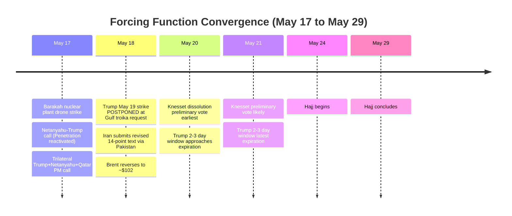
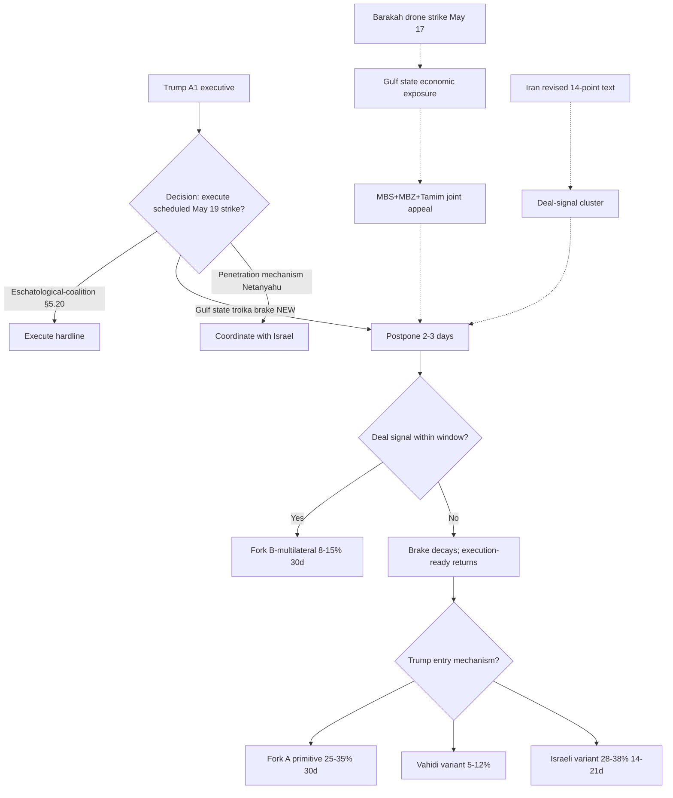
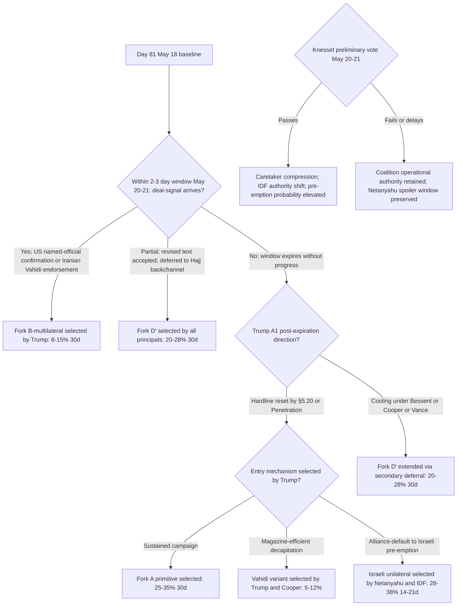

# Iran 2026 Operational SITREP: Daily Update
**Day 81 | Monday, May 18, 2026**
*Annex to Iran 2026 Operational SITREP and Strategic Synthesis (base report v4.0)*

## Executive Summary

Trump confirmed on Truth Social (Tier 1) the postponement of a US military strike on Iran scheduled for Tuesday May 19, citing direct requests from Saudi Crown Prince Mohammed bin Salman, UAE President Mohammed bin Zayed, and Qatar Emir Tamim bin Hamad to "hold off" for a "very close" deal. A specific execution date was set, then withdrawn under external Gulf state pressure; this is the highest documented operationalization of US kinetic action since the April ceasefire. A new Layer 4 channel mechanism enters the framework: the Gulf state troika as direct brake on US military timing, operating outside Israeli alliance coordination and Chinese co-mediation. Concurrent vectors: the Barakah nuclear power plant (UAE) drone strike May 17 crossed a nuclear-adjacent threshold and contradicts Cooper's May 14 Tier-1 SASC claim that Houthi proxy connectivity is "cut off"; the Netanyahu-Trump call May 17 reactivated the Penetration mechanism after 7-day dormancy; a trilateral Trump + Netanyahu + Qatar PM call added Qatar as diplomatic bridge; Iran submitted a revised 14-point text via Pakistan; Brent reversed from the Day 79 band break ($111+) to ~$102 on the deal-signal cluster.

Supersedes `day-79` (no day-80 issued) · Gulf troika brake NEW · Fork A ↓ · Fork B combined ↑ · Barakah threshold NEW

### Cycle at a Glance

| Vector | Direction | Driver |
|---|---|---|
| Gulf state troika brake | NEW | MBS+MBZ+Tamim appeal halted scheduled May 19 strike |
| US Fork A operationalization | execution-ready then BRAKED | Strike scheduled, postponed at Gulf state request |
| Barakah nuclear-adjacent attack | NEW threshold | Three drones May 17; IAEA T1; western-border launch |
| Cooper T1 proxy-connectivity | ↓ discounted to M | Barakah contradicts "Houthis cut off" framing |
| Netanyahu Penetration mechanism | reactivated | 30-min Trump call; trilateral with Qatar PM (T1) |
| Iran diplomatic engagement | ↑ active | Revised 14-point text via Pakistan |
| Brent crude | $111+ → ~$102 | Band reversal on postponement + US waiver proposal |
| Fork A 30d / Fork B combined 30d | 25–35% / 20–30% | Brake compresses A; Gulf pathway elevates B |
| Knesset dissolution vote | pending May 20–21 | Haredi distrust of Netanyahu; passage "all but assured" |

> Cumulative escalation: ~52–67% over 30 days, ~73–88% over 12 months. Dominant non-escalation path is Fork B combined at 20–30% (30d), ↑ from Day 79's 15–23% on the Gulf state pathway; Fork D' at 20–28% as deferral-default, marginally compressed.

---

## 1. Operational Update

**Diplomatic track entered active exchange inside Trump's 2-3 day window.** Iran submitted a revised 14-point text to Pakistani mediators May 18 (Tasnim T3, Xinhua T3 corroborating; M after −30% state-media discount). Revisions: HEU dilution plus third-country transfer rather than US delivery; enrichment-suspension shorter than the US 20-year moratorium; 30-day timeline retained. Bloomberg (T2) reports Tasnim claim of a US temporary OFAC waiver during negotiations; US unconfirmed (net M-L). Pakistan channel operationally elevated above Oman this round.

**Trump posture at maximum A1 paradox.** Truth Social May 18 (T1): the planned strike "scheduled for tomorrow" was postponed at the Gulf troika request because "a deal would be made that would be very acceptable." Concurrent annihilation rhetoric: "clock is ticking"; "won't be anything left of them" (ABC); military "prepared for full large-scale assault" if deal fails. Attack-scheduling, attack-postponement, and annihilation framing all inside a single 48-hour arc. Penetration mechanism reactivated: 30-min Netanyahu-Trump call May 17 (ITV T2, ToI T2) focused on "possibility of renewing fighting"; White House X (T1) confirmed a trilateral call Trump + Netanyahu + Qatar PM Mohammed bin Abdulrahman Al Thani same day. Qatar runs two roles: Emir Tamim as Gulf brake actor; PM Al Thani as US-Israel diplomatic bridge.

**Maritime and CENTCOM posture corrects an inherited error.** USS Gerald R. Ford confirmed home at Norfolk May 16 after a 326-day deployment (CNN T2, War Zone T3); the Day 79 synthesis identified the departing CSG-10 as Truman. Two-CSG posture (Lincoln, Bush) now H-confidence. No Eisenhower deployment order. The scheduled attack profile implies two-CSG plus pre-positioned air was sufficient for the planned strike.

| Asset / signal | Day 79 baseline | Day 81 read | Implication |
|---|---|---|---|
| CENTCOM CSG count | Lincoln + Bush + Truman (synthesis); two-CSG provisional | Lincoln + Bush H; Ford (not Truman) departed May 16 | Synthesis §1.2, §3.1 require Truman → Ford correction |
| USS Eisenhower | undeployed | undeployed | Restraint signal marginally elevated under two-CSG |
| US strike order | not scheduled | scheduled May 19 then POSTPONED at Gulf state request | Execution-ready threshold reached, externally braked |
| Barakah / nuclear-adjacent | not targeted | drone strike May 17 (generator hit) | New escalation threshold demonstrated; IAEA T1 |
| Cooper T1 proxy-connectivity | "Houthis cut off" face value | discounted to M post-Barakah | Houthi indigenous manufacturing plus Iraqi militia not fully severed |
| IRGC Hormuz enforcement | physical closure sustained | Zolfaghari T2: "no vessel passed in past 24 hours" | Maximalist enforcement concurrent with diplomatic exchange |
| Netanyahu Penetration | dormant 7 days (last May 10) | 30-min call May 17 plus trilateral with Qatar PM | Mechanism reactivated; Qatar bridge novel |
| IDF operational tempo | Sulfur-and-Fire exercise; Zamir forward-campaign framing | no Day 80-81 strike; security cabinet convened | Israeli graduation threshold held; not driving in this window |

**Iranian internal ran public threat plus private engagement on parallel tracks.** Pezeshkian (May 17, T2): "negotiation is neither surrender nor retreat" but defense of "rights of the Iranian nation"; consistent with Ghalibaf-Araghchi diplomatic track. IRGC spokesperson Zolfaghari (May 17, T2): "All US military bases in the southern Persian Gulf will be deactivated"; IRGC Navy "did not allow any vessel to pass through Strait of Hormuz in past 24 hours." Most aggressive IRGC named-principal signal of the cycle, concurrent with revised text submission. Vahidi silent. Aliabadi silent. PROBE-3 12th gap.

**Israel held operational tempo while engaging diplomatically.** Netanyahu convened security cabinet May 17 on renewed Iran strikes; "our eyes are also open; prepared for any scenario." No Israeli strike Day 80-81. The trilateral with Qatar PM is the first documented case in this conflict of Qatar brokering a direct US-Israel coordination call. Knesset dissolution preliminary vote pending May 20 or 21 (JNS, ToI T2); Haaretz May 18: Degel HaTorah spiritual leader Dov Lando publicly stated Haredi parties "don't believe Netanyahu's promises" on draft exemption, hardening the dissolution push. Passage "all but assured"; five-month calendar locks late August to October 27.

**Proxy fronts reset the Cooper baseline.** The Barakah western-border launch profile points to Houthi (Yemen) or Iraqi militia origin. FP March 2026 (T3) Houthi baseline: local airframe and warhead assembly; guidance, propulsion, avionics still Iran-supplied. Cooper's Tier-1 "cut off" framing conflates supply-flow severance with operational capability; the latter is partially indigenous, partially Iranian-channel-dependent. Saudi, Kuwait, Egypt issued formal condemnation (Khaleej Times T2). No Hezbollah mass response. No Houthi mass-launch beyond Barakah. Cyber Stage 3 latent.

**Markets reversed the Day 79 band break.** Brent closed from $111+ (May 15 intraday) to ~$102 (May 18), back into upper portion of the prior $102–110 oscillation band. Drivers: Trump postponement; US oil sanctions waiver proposal (Iranian-sourced; US unconfirmed); active Pakistan-channel exchange. Hormuz physical enforcement remains maximalist (Zolfaghari): deal-signal and physical-coercion layers decoupled this cycle.

| Asset | Pre-war (Feb 28) | Day 79 (May 16) | Day 81 (May 18) | Move |
|---|---|---|---|---|
| Brent crude | $73 | $111.04 intraday above band | ~$102 within band upper portion | ↓ band reversal |
| WTI crude | $70 | $108+ | ~$99 | ↓ tracking Brent |
| S&P 500 | ~6,800 | +6-7% YTD | tracking | held |
| US gas / gallon | $3.27 | $4.50 approaching $5 | $4.50 | stable |
| 10Y Treasury | ~3.9% | ~4.38% | tracking | held |
| Iranian rial parallel | ~960k/USD | 1,815,000 (PROBE-3 gap) | 1,815,000 carry | held |
| Iranian crude exports | varied | first sustained interruption | physical tightness | held |

**US domestic preserved the constitutional window temporarily.** No new WPR vote. Had Trump executed May 19 without new AUMF, Stage 2 hysteresis lock-in would have completed; postponement preserves the constraint window through May 20–21. Fetterman mechanism unchanged.

**International produced a regional condemnation block.** Saudi, Kuwait, Egypt, Gulf states condemned Barakah. The troika request operates inside this solidarity envelope: Barakah hardened Gulf state preference for negotiated resolution because the Gulf states are now exposed targets in any kinetic resumption. China silent post-summit (no Day 80-81 signal). Iran's BRICS appeal Day 79 plus Pakistan-channel routing suggests Beijing dormant for this round. Russia: no Putin readout; path ≤5% held.

---

## 2. Framework Validation

- **A1 (Trump improvisational / oscillating principal):** Validated at maximum severity. Attack scheduled, postponed under Gulf state pressure, concurrent annihilation rhetoric and deal-optimism framing inside a single 48-hour arc.
- **A4 (Iranian apex consolidation under Vahidi):** Validated by silence; Ghalibaf-Araghchi diplomatic track moves (revised text) while apex remains unstated.
- **A9 (Constraints compress principal decision sets; principals select):** Validated. The Trump executive choice set under joint Gulf state pressure, Barakah escalation, Knesset compression, and ceasefire architecture narrowed; the executive selected postpone.
- **A10 (Slantchev feigning-weakness):** Validated and operationalized. Barakah is an active demonstration of the Iranian extended-deterrent network, not residual inventory; calibrated below maximum response threshold.
- **A15 (Principal-Access Channel Architecture):** Validated. Penetration reactivated after 7-day dormancy; Qatar PM trilateral adds a bridge node.
- **A18 (US Eschatological-Coalition operationally distinct):** Held but contested. Gulf state troika brake operated against the §5.20 driver direction this cycle.

---

## 3. Framework Revisions Required

**TRIGGER FIRED (PROBE-13, PROBE-16 IMMEDIATE): Gulf State Troika as Operational Brake on US Military Timing.**
Prior (v4.0 §5): external multilateral constraints modeled as E3/IAEA (weakened) and Beijing co-mediation; Gulf states passive recipients. Data: Trump Truth Social (T1) postponing May 19 strike at direct MBS/MBZ/Tamim request; CNBC, WaPo, Newsweek T2 corroboration; Saudi-Kuwait-Egypt regional condemnation envelope. Revised: new mechanism §5.25 (Gulf State Troika Brake); Fork A 30d 28–38% → 25–35%; Fork A 12m 45–55% held; Fork B-multilateral (Gulf pathway) 5–10% → 8–15%; Fork B-bilateral 10–18% → 12–20%; combined Fork B 15–23% → 20–30%; Vahidi decapitation variant standalone 5–12% held. §5.20 eschatological-coalition driver reading revised: contested when Gulf state economic-interest pressure diverges from coalition pressure.

**TRIGGER FIRED (PROBE-14 IMMEDIATE): Cooper Tier-1 Proxy-Connectivity Claim Discounted.**
Prior (v4.0 §1.4, §3.5): Cooper SASC May 14 (T1): "Hamas, Hezbollah, Houthis cut off from Iran's weapons and support." Data: Barakah drone strike May 17, IAEA T1 confirmed; western-border launch consistent with Houthi/Iraqi militia; FP March 2026 T3 Houthi indigenous-manufacturing baseline. Revised: Cooper discounted to M on proxy-connectivity; framework distinguishes supply-flow severance from operational delivery capability. Layer 2 §3.2 update: Iranian horizontal escalation ladder now includes demonstrated nuclear-adjacent targeting one step below direct reactor strike; Israeli first-mover threshold marginally compressed.

**TRIGGER FIRED (PROBE-7 NEXT CYCLE): CSG-10 Identity Correction.** Ford (CSG-10) returned May 16; Truman reference incorrect. Two-CSG (Lincoln, Bush) confirmed H. §1.2 and §3.1 patch at next /revise; no probability impact.

**FLAG (PROBE-9 NEXT CYCLE): Knesset Dissolution Vote Pending May 20–21.** Per Appendix B trigger table, passage triggers Israeli electoral compression and IDF caretaker-period decision-architecture shift.

---

## 4. Framework Additions

**Gulf State Troika Brake Mechanism (§5.25, NEW).** Three Gulf principals jointly intervened in the US military decision cycle at a 24-hour interval with documented success.

| Property | Description |
|---|---|
| Trigger | Gulf state economic/infrastructure exposure; Barakah supplied proximate motivation |
| Channel | Principal-to-principal (MBS, MBZ, Tamim → Trump); supplements Penetration and Qatar PM trilateral |
| Effect | Compressed Trump A1 toward postponement; conditional on deal-signal within 2-3 days |
| Limit | Temporary by Trump framing; if window expires, brake decays and execution-ready returns |
| Structural fit | Outside Israeli alliance coordination and Chinese co-mediation; fills Layer-4 channel gap |

**Pakistan as elevated mediating channel.** Iran's revised text delivered via Islamabad, not Muscat. Pakistan expanded from secondary backchannel to active conduit. Mediator architecture update: Pakistan plus Qatar (trilateral bridge) plus Beijing (baseline co-mediator) operate concurrently; Oman dormant this round.

---

## 5. Revised Probability Matrix

| Outcome | 30d | 12m | vs. Day 79 | Driver |
|---|---|---|---|---|
| **Fork A: Full kinetic resumption** | **25–35%** | **45–55%** | **↓ from 28–38%; 12m held** | Gulf brake compresses 30d primitive |
| Fork A variant: Vahidi decapitation (absorbed) | 5–12% | 8–18% | held | CNN T2 planning baseline unchanged |
| **Fork B-bilateral: Negotiated MOU** | **12–20%** | **14–20%** | **↑ from 10–18%** | Revised text; US waiver proposal; "deal very close" |
| **Fork B-multilateral (Gulf pathway)** | **8–15%** | **10–18%** | **↑ NEW from sub-5%** | Gulf troika brake; Qatar trilateral bridge |
| **Combined Fork B** | **20–30%** | **22–32%** | **↑ from 15–23%** | Both pathways elevated |
| **Fork D': Indefinite gray-zone deferral** | **20–28%** | **18–24%** | **↓ marginally** | Active exchange interrupts Meta-Regression |
| Fork C: Miscalculation cascade | 14–19% | 14–19% | ↑ from 12–17% | Multi-threshold simultaneity; Barakah accident-risk |
| **Israeli unilateral strike (14-21d)** | **28–38%** | **38–48%** | **↓ from 30–40%** | Netanyahu in trilateral; not driving in window |
| Israeli first nuclear use | <2% | 12–20% | → | Held |
| Brent through $130 in 60 days | 30–40% | | ↓ from 35–45% | Band reversal on deal-signal cluster |
| Constitutional crisis (30d) | 60–70% | 60–70% | → | Postponement preserves window |

**Kinetic Escalation Composite (DERIVED): ~52–67% (30d), ~73–88% (12m).** ↓ marginally from Day 79. Construction: Fork A (25–35% / 45–55%) compressed on Gulf state brake; Fork C (14–19%) elevated on multi-threshold approach; tails held; Variants A, B, and Vahidi decapitation absorbed as Fork A trigger paths. Fork D' and Fork B excluded by design.

---

## 6. Probe Status Table

| PROBE | Status | Conf | Trigger | Variable Moved |
|---|---|---|---|---|
| 2 IRGC Factional | partial | M | partial | Cooper proxy-connectivity discounted; extended-deterrent active |
| 6 Chinese Support | null | M | no | Xi Day 1 delivery holds |
| 7 CENTCOM Posture | partial | H | no | Ford (not Truman) departed CSG-10; two-CSG H |
| 8 Oil Markets | fired | M | yes | Brent reversed to ~$102; deal-probability pricing elevated |
| 9 Israeli Internal | partial | M | no | Penetration reactivated; Qatar bridge; Haredi coalition stress |
| 10 War Powers | null | H | no | Postponement preserves constitutional window |
| 12' MOU Framework | partial | M | partial | Pakistan elevated as mediator; revised text submitted |
| 13 PA-Gap | fired | H | yes | Gulf troika as new Layer 4 channel; Fork A execution-ready then braked |
| 14 Iranian Residual | fired | M | yes | Cooper discounted; Houthi/Iraqi delivery capability residual |
| 15 Dispositional | partial | M | no | Gulf troika shift; Trump maximum-paradox A1 |
| 16 First-Mover | fired | M | yes | Five-actor architecture; decision window May 20-21 |

Skipped per cadence: 1 (bi-weekly), 3 (monthly; 12th gap), 11 (bi-weekly), 17 (bi-weekly), 18 (monthly; Barakah Tier-2 flagged), 19 (quarterly).

---

## 7. Conclusion and Forking Analysis

### Central Thesis Check

The v4.0 thesis holds with structural elaboration. The materialist bargaining model predicts dominant strategies under joint constraints and ranks options under the constraint surface; it does not predict selection. The Day 81 cluster validates both halves. Under joint Layer-1 (two-CSG plus pre-positioned air assets), Layer-2 (Barakah demonstrating Iranian extended-deterrent network active), Layer-3 (Trump 2-3 day clock plus Knesset May 20-21 plus Hajj May 24-29), and Layer-5 (Vahidi silence persisting through revised-text submission) constraints, the relative cost-benefit of postponement-with-deal-window improved against immediate execution for the Trump executive; the Gulf state troika appeal supplied the focal signal that tightened the prior on this option becoming the dominant strategy. Trump selected postpone. The framework did not predict this selection; it predicted the ranking. The structural elaboration required: the Gulf state troika as Layer-4 channel-architecture mechanism was unmodeled prior to Day 81 and now requires inclusion as §5.25.

### Forking Tree (72-Hour Decision Path)

### Operative Judgment

The single most important read for the next 48-72 hours: the Trump executive's choice set has compressed to a binary decision over an interval shorter than any prior fork-decision window in this conflict. Under the joint constraints above, postponement-with-deal-window outranked execution at the May 18 decision point; the question is whether deal progress within the 2-3 day window holds that ranking or whether absent progress the ranking inverts back toward execution. The Gulf state troika brake is temporary and conditional on Iranian and US deliverables; it is not a durable Fork B substrate. Iran's revised text plus the alleged US oil waiver supply candidate deliverables, but the Vahidi ratification gap remains unstated and the US has not confirmed the waiver. Pakistan operating; Beijing and Oman dormant; Qatar trilateral is the high-status diplomatic structure for the next 72 hours.

Barakah reshapes Layer 2. The Iranian extended-deterrent network demonstrated calibrated capability against UAE nuclear-adjacent infrastructure under active ceasefire. Cooper's Tier-1 "cut off" was a supply-flow read but operationally contradicted on May 17; Houthi indigenous manufacturing plus partial Iranian channel persistence sustains delivery capability the synthesis underweighted. If the 2-3 day window expires without deal, Israeli pre-emption probability re-elevates against post-postponement baseline. The Knesset vote May 20-21 concentrates Israeli decision-making at the worst possible moment for Fork B-durability: passage shifts authority toward IDF leadership (HEU-diplomatic-removal accepting) during caretaker period; pre-dissolution, Netanyahu coalition retains operational authority. Selection of pre-emption by Netanyahu versus deferral by IDF leadership is contingent on vote timing relative to any Trump deal announcement.

### Signals That Force Immediate Revision

- Tier-1 US confirmation (CENTCOM, DOD, or White House) of postponed-strike operational plan or deal-framework agreement signed within 2-3 day window
- Vahidi direct named statement on MOU or 5 preconditions; most consequential Iranian principal signal
- Knesset dissolution preliminary vote outcome May 20-21 (passage triggers BS-3 revision)
- Confirmed Israeli strike on Iranian nuclear facilities or IRGC infrastructure within window
- Trump Truth Social post-window framing May 21-22 (deal confirmation, attack reschedule, or third option)
- US official confirmation or denial of Iran oil sanctions waiver (currently Tasnim-only, M-L)
- Barakah attribution by UAE government or multi-source intelligence
- Eisenhower deployment order; Iranian Mahdist invocation by Mojtaba; cyber Stage 3 activation

---

*Compiled May 18, 2026 | Day 81 | Subject to revision as data updates*
*Next SITREP: Day 82 (May 19); Trump window expiration watch; any deal signal or attack reschedule; Knesset vote; Vahidi or Iranian named-principal statement; CENTCOM operational signal; Barakah attribution updates.*
*Framework revision: v4.1 warranted if (a) Tier-1 US confirmation of deal or attack reschedule; (b) Knesset preliminary vote passes; (c) confirmed Israeli unilateral strike; (d) Vahidi direct named statement; (e) Trump confirms deal terms publicly; (f) Eisenhower deployment order; (g) Barakah attribution Iran-ordered multi-source.*
*Companion: Day 79 annex; Day 81 probe sweep (sweep-2026-05-18.json); synthesis-v4-0.md; appendix-b-blind-spots.md; reference/god-and-the-machine.md (§5.20); reference/costly-signaling-framework.md.*
