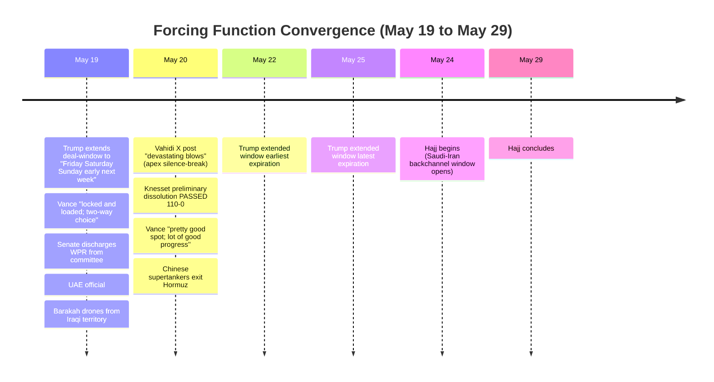
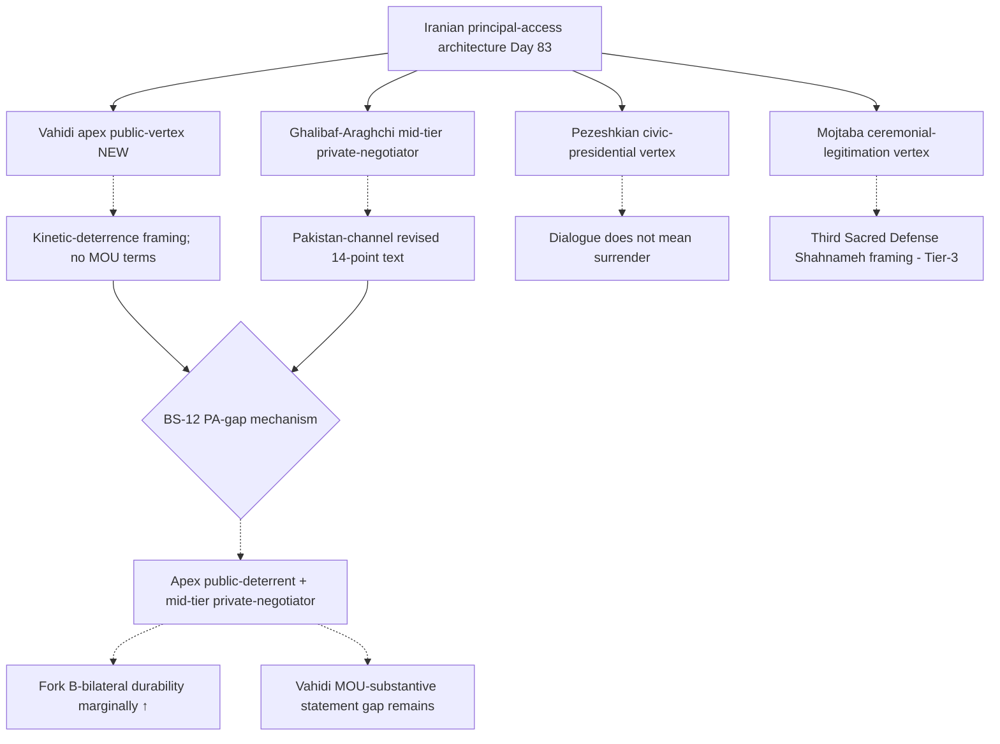
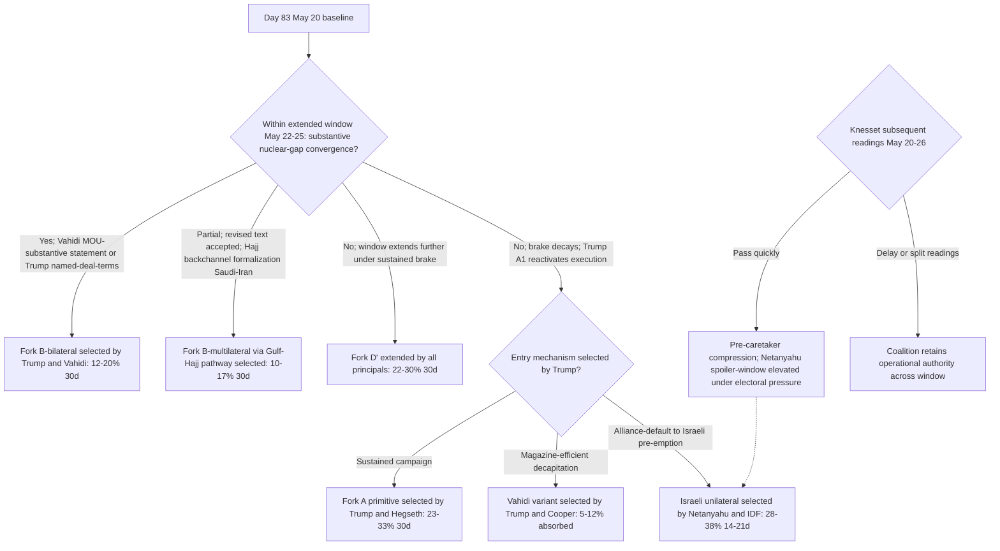

# Iran 2026 Operational SITREP: Daily Update
**Day 83 | Wednesday, May 20, 2026**
*Annex to Iran 2026 Operational SITREP and Strategic Synthesis (base report v4.0)*

## Executive Summary

Vahidi broke silence on X (Tier-2 Fox News attribution May 20), warning of "devastating blows that will leave you in abject defeat" against any further aggression; the long-monitored apex Iranian-principal silent vertex now speaks publicly on kinetic-deterrence (not on MOU terms). Knesset preliminary dissolution passed 110-0 with Netanyahu absent at security consultations, firing the Day 82 BS-3 framework-revision trigger and locking the Israeli election horizon to September-October 2026. UAE official attribution of the Barakah drones to Iraqi territory (not Yemen) refines the Day 81 channel-architecture reading: Iraqi PMU is the operative delivery channel, Houthi-supply-cut framing from Cooper's May 14 SASC testimony holds on its specific component. Trump extended his own deal-window May 19 from the original 2-3 day framing to "Friday, Saturday, Sunday, something, maybe early next week"; the Gulf-state troika brake mechanism is durable across one extension cycle (BS-18 visibility +5pp). Vance upgraded from Day 77 partial-fire to active deal-direction principal-vertex, framing the Iranian choice as binary across May 19 ("locked and loaded") and May 20 ("pretty good spot"). WPR resolution discharged from Senate committee May 19 (procedural advance; on-merits Fetterman arithmetic unchanged); Brent closed $111.28 on May 19, with the Day 81 ~$102 read confirmed as intraday-only and the $102-110 oscillation band broken upward.

Supersedes `day-81` · Vahidi silence-broken NEW · Knesset dissolution FIRED · Gulf brake durable across extension

### Cycle at a Glance

| Vector | Direction | Driver |
|---|---|---|
| Vahidi public statement | NEW | First direct named X post; "devastating blows" kinetic-deterrence framing |
| Knesset dissolution preliminary | FIRED 110-0 | Netanyahu absent; haredi-draft crisis; election horizon Sept-Oct |
| Barakah attribution | refined | UAE: drones from Iraqi territory; Iraqi-PMU channel operative |
| Trump deal-window | extended | "Friday Saturday Sunday early next week"; brake holds across extension |
| Vance principal-vertex | ↑ ACTIVE | "Locked and loaded" + "pretty good spot" within 24h |
| Senate WPR | procedural ↑ | Committee discharge May 19; on-merits arithmetic unchanged |
| Brent crude | $111+ band-break held | Day 81 reversal intraday only; oscillation band broken up |
| Mojtaba religious framing | Tier-3 only | "Third Sacred Defense" (Shahnameh, NOT Mahdist Tier-1) |
| Fork B-multilateral (Gulf) | 8-15% → 10-17% | Brake-durability across one extension cycle |
| Fork D' deferral | 20-28% → 22-30% | Extended window without substantive convergence |

> Cumulative escalation: ~50-65% over 30 days, ~73-88% over 12 months. Dominant non-escalation path is combined Fork B at 22-32% (30d), ↑ marginally from Day 81's 20-30% on Gulf-state brake durability across one extension; Fork D' at 22-30% (30d), ↑ marginally as the window-extension itself becomes the operative state.

---

## 1. Operational Update

**Diplomatic track sustains active exchange under extended window.** Iran's Day 81 revised 14-point text via Pakistan remains the operative Iranian negotiating position; no new text submission Day 82-83. Trump (TIME May 19): the original 2-3 day window extends to "two or three days, maybe Friday, Saturday, Sunday, something, maybe early next week"; Gulf-state messaging through Trump frames "positive momentum" in Pakistan-led mediation. Trump simultaneously framed the nuclear-substantive gap: "most points were agreed to, but the only point that really mattered, nuclear, was not" (per Commons Library briefing). Pakistan-channel remains primary; Qatar PM Mohammed bin Abdulrahman Al Thani retains dual role (trilateral bridge per Day 81 White House readout + Emir Tamim as Gulf brake actor); Oman dormant; Beijing dormant (Chinese supertankers exit Hormuz May 20, signal-ambiguous between deal-confidence and protective hedging). US oil-sanctions waiver proposal sustains as Iranian-media-only (Tasnim); Treasury action this cycle was a separate Russian-crude-tanker waiver, not Iran-specific.

**Trump posture holds A1 paradox under extended brake.** Truth Social May 18 confirmed the postponement; May 19 added "might have to give Iran another big hit" (TIME) and concurrent window-extension framing. SecDef Hegseth and Joint Chiefs Chairman Cain instructed (Trump May 18, T1) to "be prepared to go forward with a full, large scale assault of Iran, on a moment's notice." The principal-disposition operates as range-bound oscillation within the Gulf-state brake, not against it; the brake is a constraint on the executive choice set, not a substitute for the underlying disposition. Vance enters this cycle as an active principal-vertex: May 19 "locked and loaded; two-way choice" (Washington Times); May 20 "pretty good spot; lot of good progress is being made" (Al Jazeera, The Hill). The Day 77 partial-fire on Vance upgrades to active.

**CENTCOM posture unchanged; standing-attack-readiness sustained under brake.** No new force-posture signal Day 82-83. Two-CSG (Lincoln in Arabian Sea, Bush in CENTCOM rotation) confirmed H from Day 81 War Zone tracker baseline. USS Eisenhower remains in OFRP training phase (East Coast); no deployment order. The scheduled-attack-readiness state from Day 81 persists under the brake; the framework reads the absence of force-posture innovation as confirmation that the postponement is brake-mechanism-driven, not capability-driven.

| Asset / signal | Day 81 baseline | Day 83 read | Implication |
|---|---|---|---|
| CENTCOM CSG count | Lincoln + Bush (Ford home May 16) | Lincoln + Bush H | Two-CSG posture stable; no new deployment |
| USS Eisenhower | OFRP training; not deployed | OFRP training; not deployed | Restraint signal held under brake |
| Trump strike timing | Scheduled May 19, postponed | Postponed; window extended to ~May 22-25 | Brake durable across one extension cycle |
| Barakah attribution | Western-border drones; Yemen/Iraq inferred | UAE official: Iraqi territory (WaPo May 19) | Iraqi-PMU channel operative; Houthi-supply-cut framing refined |
| Cooper T1 proxy-connectivity | Discounted to M post-Barakah | Refined: Houthi-supply-cut + Iraqi-PMU-operational | Channel-architecture clarified; T1 discount preserved |
| IRGC Hormuz enforcement | Zolfaghari "no vessel passed" Day 81 | No update; baseline carry | Physical-coercion layer sustained |
| Vahidi public statement | Silent across 83 days | Direct X post May 20 "devastating blows" | Apex-vertex silence-broken; deterrent framing |
| Netanyahu Penetration | Reactivated Day 81 (call + trilateral) | Netanyahu absent at Knesset vote for security consultations | Penetration mechanism active; coalition-discipline secondary to security track |
| IDF operational tempo | Sulfur-and-Fire; Zamir forward-campaign | "High alert" (Fox News May 19) | Operational-readying held; no strike Day 82-83 |

**Iranian internal saturates the principal-vertex architecture.** Vahidi (Fox News liveblog May 20, X attribution): "If any further aggression is committed against the soil of Iran, that fire whose promise was previously given and remained confined within the framework of a limited regional war, this time will erupt into flames and transcend every border and domain; you will receive devastating blows that will leave you in abject defeat." The statement addresses kinetic-deterrence threshold, not MOU substance (no 5-precondition restatement, no sunset-clause reference). Pezeshkian (X May 19): "Dialogue does not mean surrender... will never bow our heads before the enemy." Ghalibaf-Araghchi diplomatic track continues operating via Pakistan-channel revised text from Day 81. Mojtaba speech corpus May 19-20 ("Third Sacred Defense" framing) draws on Defah-e Moghadas (Iran-Iraq War "Sacred Defense" tradition) and Ferdowsi Shahnameh civilizational rhetoric; Fox News analyst characterization as "jihad" is single-source tier-3 interpretation. Per `eschatology-islam-v1.0.md` definition (no Imam-al-Zaman, no Hujjat-i-asr, no Mahdi-arrival language in source corpus), this is explicit non-fire for BS-16 Tier-1 Mahdist invocation; logged as Tier-3 PROBE-18 background. PROBE-3 13th gap; rial baseline $1,815,000 carry.

**Israel passes the dissolution trigger.** Knesset preliminary dissolution vote passed 110-0 May 20 (Times of Israel, Haaretz, Jerusalem Post, Israel Hayom multi-source T2); Netanyahu absent at security consultations. Triggering event: coalition failure to pass haredi-draft-exemption bill; Degel HaTorah spiritual leader Dov Lando instructed haredi lawmakers to vote dissolution. Three readings remain mechanically; unanimous preliminary passage forecloses Netanyahu delay capacity. Election horizon: September-October 2026 (Haredi parties pushing September). Netanyahu's absence is itself a Penetration-mechanism signal: Trump consultations or strike-readiness consultations outweighed coalition-discipline imperatives. IDF on "high alert" (Fox News May 19); no Israeli unilateral strike Day 82-83. The IDF-coalition uranium-removal asymmetry mechanism (Day 77 sub-finding) enters phase-dependent activation: pre-caretaker (current state, subsequent readings pending) Netanyahu retains operational authority; post-caretaker authority shifts toward IDF leadership.

**Proxy fronts: Iraqi-PMU channel surfaces structurally.** WaPo and Euronews May 19 confirm UAE official attribution: Barakah drones came from Iraqi territory. Concurrent Saudi-airspace drone intercept May 17 (3 drones from Iraqi airspace, Times of Israel) corroborates an Iraqi-territory launch corridor active across both Gulf-state targeting cycles. Cooper Tier-1 SASC testimony (May 14, "Houthis cut off from Iran's weapons and support") is refined rather than contradicted: the Houthi-supply-cut component holds; the Iraqi-PMU channel is a parallel Iranian channel Cooper's framing did not address. The framework now reads Iranian Quds-Force coordination with Iraqi Shia militias as the operative Gulf-infrastructure-targeting pathway; Houthi mass-launch absence persists; Hezbollah dormant; cyber Stage 3 latent.

**Markets break the band upward, durably.** Brent closed $111.28 May 19 (CNBC, T2), down 0.73% intraday but above the $102-110 A1-oscillation band. The Day 81 sweep's read of approximately $102 reflected an intraday cluster in the postponement window; the session-close pattern across May 18-20 confirms operating range $110-115 with kinetic-resumption premium sustained. Drivers: Trump "another big hit" rhetoric; Vance "locked and loaded" framing; sanctions-waiver proposal still US-side unconfirmed; Chinese supertanker exit Hormuz May 20 signal-ambiguous. Hormuz physical enforcement maintained at Zolfaghari Day 81 baseline; no commercial restoration announcement.

| Asset | Pre-war (Feb 28) | Day 81 (May 18) | Day 83 (May 20) | Move |
|---|---|---|---|---|
| Brent crude | $73 | ~$102 intraday read in deal-cluster | $111.28 close May 19 | ↑ band-break held above |
| WTI crude | $70 | ~$99 intraday | ~$108 close May 19 | ↑ tracking Brent |
| S&P 500 | ~6,800 | tracking | tracking | held |
| US gas / gallon | $3.27 | $4.50 | $4.50 | stable |
| 10Y Treasury | ~3.9% | tracking | tracking | held |
| Iranian rial parallel | ~960k/USD | 1,815,000 (PROBE-3 carry) | 1,815,000 carry | held |
| Iranian crude exports | varied | physical tightness | physical tightness | held |

**US domestic produces procedural WPR advance without on-merits passage.** Senate voted May 19 to advance the war-powers resolution by discharging it from committee (WaPo, MS.NOW): four Republicans (Murkowski, Collins, Paul plus one) joined Democrats; Fetterman remained the lone Democrat NO. Procedural advance, not on-merits passage; Fetterman-swing arithmetic from the Day 76 7th-vote baseline (49-50 against) holds absent further GOP defection or Fetterman pivot. Stage 2 hysteresis indicators (hostilities-terminated certification, Day 60 WPA deadline passed, operation-rebranding mechanism) continue to accumulate. The on-merits vote post-discharge becomes the operative forcing function if Trump executes the scheduled-attack-rescheduling.

**International: Gulf-brake durable; Beijing dormant; Russia inert.** Trump credits MBS, MBZ, and Tamim for sustained brake messaging through Day 19-20; no public intra-troika divergence; no MBS or MBZ statement supporting US military action. UAE attribution of Barakah drones to Iraqi territory (not direct Iran-command) preserves UAE's diplomatic positioning within the brake mechanism rather than forcing Gulf hardening against Iran. From Gulf-state perspective per Al Jazeera May 18: priority is Hormuz reopening and Iran missile programme, distinct from US-priority nuclear-focus; this priority-divergence is an unmodeled BS-18 dimension. Chinese supertanker exit Hormuz May 20 (Al Jazeera T2): operationally significant maritime-flow signal but ambiguous between commercial pre-positioning for expected deal and protective withdrawal anticipating kinetic resumption. No Putin readout; Russia path ≤5% held.

---

## 2. Framework Validation

- **A1 (Trump improvisational / oscillating principal):** Validated at sustained severity. Window-extension on May 19 ("Friday Saturday Sunday early next week") coexists with concurrent "another big hit" framing; A1 oscillation operates within the Gulf-state brake mechanism, not against it.
- **A4 (Iranian apex consolidation under Vahidi):** Validated and elaborated. Vahidi X post May 20 is the first direct named public statement by the apex; framing is kinetic-deterrence rather than MOU-substantive; consistent with apex-public-silence on terms while Ghalibaf-Araghchi mid-tier negotiates.
- **A9 (Constraints compress principal decision sets; principals select):** Validated. The Trump executive choice set under joint Gulf state pressure, Iraqi-PMU demonstrated channel, Knesset compression, and ceasefire architecture sustained; the executive selected window-extension rather than execution-reactivation. The framework predicts the ranking; Trump selects.
- **A10 (Slantchev feigning-weakness):** Validated and refined. Iraqi-PMU channel-attribution of Barakah confirms Iranian extended-deterrent network as active rather than residual; Cooper Tier-1 framing refined to "Houthi-supply-cut + Iraqi-PMU-operational" rather than blanket proxy-connectivity-cut.
- **A15 (Principal-Access Channel Architecture):** Validated and saturated. Vance active deal-direction vertex; Vahidi apex-public-vertex; Pezeshkian civic-presidential vertex; Trump executive; Gulf troika via Pakistan-channel; Qatar PM trilateral bridge. The principal-vertex architecture is more saturated than at any prior point.
- **A18 (US Eschatological-Coalition operationally distinct):** Validated by counter-evidence. The §5.20 driver does not surface as active counter-coalition this cycle; no Huckabee, Hegseth, or CUFI public statement against the Gulf-state brake; the maximalist faction is latent during brake-extension.

---

## 3. Framework Revisions Required

**TRIGGER FIRED (PROBE-2 / PROBE-13 IMMEDIATE): Vahidi Direct Named Statement.**
Prior (v4.0 §5.23, BS-1a Day 82): Vahidi silent across all SITREP cycles; ISW-analytical apex characterization only; PROBE-2 silent-vertex flagged. Data: Fox News liveblog May 20 X-post attribution; "devastating blows that will leave you in abject defeat" against any further aggression; kinetic-deterrence framing without MOU-substantive content. Revised: BS-1a apex visibility 65-70% → 75-80%; BS-12 PA-gap mechanism revised as "apex public-deterrent + mid-tier private-negotiator" two-level pattern rather than "apex-veto-against-mid-tier"; the apex consents to mid-tier negotiation activity by silence on substantive terms while publicly signaling kinetic-deterrence threshold. v4.0 §5.23 decapitation pathway: target-identification context improved (X-post platform use, audience-cost-binding rhetoric pattern); no operational-presence disclosure. Fork B-bilateral marginally elevated on apex-non-rejection of diplomatic activity; full Fork-B durability reassessment pending Vahidi MOU-substantive statement.

**TRIGGER FIRED (PROBE-9 IMMEDIATE): Knesset Dissolution Preliminary Passage.**
Prior (v4.0 §3.4, BS-3 Day 82): preliminary vote pending May 20-21; passage "all but assured." Data: 110-0 passage May 20 (Times of Israel, Haaretz, Jerusalem Post, Israel Hayom multi-source T2); Netanyahu absent at security consultations; Degel HaTorah Lando instruction to haredi lawmakers; three readings remain mechanically. Revised: election horizon locks September-October 2026 (Haredi pushing September); pre-caretaker period operative with electoral compression on coalition decision-window; subsequent readings shift authority phase-state. IDF-coalition uranium-removal asymmetry mechanism enters phase-dependent activation: pre-caretaker Netanyahu retains authority; post-caretaker shifts toward IDF leadership's HEU-diplomatic-removal-acceptable threshold. Powell shifting-power mechanism activates on electoral compression. Israeli unilateral 14-21d probability holds at 28-38% with phase-state dependence.

**TRIGGER FIRED (PROBE-14 IMMEDIATE): UAE Official Attribution of Barakah to Iraqi Territory.**
Prior (v4.0 §3.2, Day 81 PROBE-14): western-border drone entry; Yemen (Houthi) or Iraqi militia inferred; Cooper Tier-1 "Houthis cut off" discounted to M on operational delivery. Data: WaPo and Euronews May 19 confirm UAE official attribution to Iraqi territory; concurrent Saudi-airspace drone intercept May 17 from Iraqi airspace corroborates pattern. Revised: Iranian-extended-deterrent channel-architecture clarified as Iraqi-PMU operative plus Houthi-supply-cut sustained; Cooper Tier-1 discount preserved on broader claim while recognizing Houthi-specific supply component may hold; Iranian Quds-Force coordination with Iraqi Shia militias more directly implicated than Houthi-autonomous reading; BS-13 visibility 45-55% → 50-60%. Layer 2 escalation-ladder position from Day 81 (nuclear-adjacent threshold crossed) preserved; channel-attribution refinement does not lower threshold.

**TRIGGER FIRED (PROBE-13 / PROBE-16 / PROBE-20 IMMEDIATE): Gulf-State Brake Durable Across Extension Cycle.**
Prior (v4.0 §5.25, Day 81): 2-3 day Trump window framing expiring May 20-21; BS-18 baseline visibility 25-35%; brake decay-threshold unspecified. Data: Trump May 19 extends window to "Friday Saturday Sunday early next week" (~May 22-25); Gulf-state messaging through Trump frames sustained "positive momentum"; no public intra-troika divergence; UAE attribution-management (territory-Iraqi, not command-Iran) structurally preserves brake. Revised: BS-18 visibility 25-35% → 30-40%; brake mechanism is durable across at least one extension cycle, not strictly one-off; Layer 3 time-arithmetic operative forcing function is now Trump's extended window ~May 22-25, overlapping with Hajj May 24-29. Six-actor first-mover architecture (Iran, US, Israel, Gulf troika, Pakistan mediator, Iraqi-PMU channel-attribution per PROBE-14); the joint-distribution-of-thresholds has multiple cell-fires without binary fork-resolution.

**FLAG (PROBE-13 NEXT CYCLE): Vance Active Principal-Vertex Upgrade.**
Vance May 19-20 statements ("locked and loaded; two-way choice" / "pretty good spot; lot of good progress") upgrade Day 77 partial-fire to active deal-direction vertex; BS-5 deal-faction substantively visible against accelerationist-veto path; BS-17 intra-Republican fracture dynamics operationally visible in the principal-access-channel architecture.

**FLAG (PROBE-10 NEXT CYCLE): WPR Committee Discharge.**
Senate discharged the war-powers resolution from committee May 19 (procedural advance); Fetterman-swing arithmetic holds; on-merits vote positioned but not held; Stage 2 hysteresis continues to accumulate under Trump-window-extension. WPR-as-forcing-function status: armed, not fired.

**FLAG (PROBE-15 / PROBE-18 NEXT AUDIT): Mojtaba "Third Sacred Defense" Explicit Non-Fire.**
Mojtaba X corpus May 19-20 ("Third Sacred Defense," "Sacred Defense against the American and Zionist invasion," Shahnameh "Zahhak-likes" framing) is Tier-3 PROBE-18 background. Explicit non-fire for BS-16 Tier-1 (Mojtaba public Mahdist invocation in major speech): source content draws on Defah-e Moghadas tradition and Ferdowsi Shahnameh, not Twelver Mahdist eschatological tradition; Fox News analyst "jihad" characterization is single-source tier-3 interpretation and does not constitute eschatological-tradition activation per `eschatology-intersection-matrix.md` four-characteristic test. Framework discipline preserved by explicit non-fire log.

---

## 4. Framework Additions

**Gulf-State Brake Decay-Threshold Refinement (§5.25 update; not new mechanism).** The Day 81 §5.25 mechanism is preserved; what's added is the brake-durability dimension. The mechanism withstands at least one extension cycle under sustained Pakistan-mediation "positive momentum" framing. The brake is not strictly tied to the original 2-3 day Trump framing; it operates across Trump's repeated extension cycles so long as (a) Gulf-state messaging frames mediation as productive, (b) no second Barakah-class attack on Gulf infrastructure, (c) no public intra-troika divergence, and (d) no Israeli unilateral strike forces hardening. This is a refinement of the Day 81 §5.25 properties table, not a new structural addition; the framework's decay-threshold instrumentation gap (BS-18 specific gap row 2) narrows from "unspecified" to "at least one extension cycle holds."

**Six-Actor First-Mover Architecture (BS-15 elaboration).** Day 81 named five actors: Iran, US, Israel, Gulf state troika, Pakistan mediator. Day 83 adds Iraqi-PMU as a distinct channel-attribution actor within the Iranian extended-deterrent network. The Iraqi-PMU channel matters structurally because Iran can demonstrate kinetic threshold via Iraqi-PMU (Barakah pattern) without firing Houthi mass-launch, preserving Houthi-supply-cut framing on Cooper's component while operationalizing horizontal escalation through a separate channel. This refines the joint-distribution-of-thresholds in BS-15 rather than adding a new mechanism; the threshold-decomposition continues with sharper channel-attribution.

---

## 5. Revised Probability Matrix

| Outcome | 30d | 12m | vs. Day 81 | Driver |
|---|---|---|---|---|
| Fork A: Full kinetic resumption | 23-33% | 45-55% | ↓ marginal 30d; 12m held | Gulf brake durable across extension; standing-readiness sustained |
| Fork A variant: Vahidi decapitation (absorbed) | 5-12% | 8-18% | held | Target-ID context marginally improved; no operational signal |
| Fork B-bilateral: Negotiated MOU | 12-20% | 14-20% | held | Vahidi non-rejection + Vance activation marginal; nuclear gap unchanged |
| **Fork B-multilateral (Gulf pathway)** | **10-17%** | **12-20%** | **↑ from 8-15% / 10-18%** | Brake-durability across extension cycle |
| **Combined Fork B** | **22-32%** | **24-34%** | **↑ from 20-30% / 22-32%** | Gulf pathway elevated |
| **Fork D': Indefinite gray-zone deferral** | **22-30%** | **20-26%** | **↑ from 20-28% / 18-24%** | Window-extension without substantive convergence |
| Fork C: Miscalculation cascade | 15-20% | 15-20% | ↑ marginal | Multiple threshold-fires; Iraqi-PMU adds accident-pathway |
| Israeli unilateral strike (14-21d) | 28-38% | 38-48% | held (phase-dependent) | Pre-caretaker Netanyahu retains authority; post-caretaker IDF-leadership |
| Israeli first nuclear use | <2% | 12-20% | → | Held |
| Brent through $130 in 60 days | 30-42% | | ↑ from 30-40% | Band-break held above; deal-premium did not session-close-durably |
| Constitutional crisis (30d) | 60-70% | 60-70% | → | WPR procedural advance; Stage 2 hysteresis continues |

**Kinetic Escalation Composite (DERIVED): ~50-65% (30d), ~73-88% (12m).** ↓ marginal at 30d from Day 81's 52-67%; 12m held. Construction: Fork A (23-33% / 45-55%) compressed 2pp on brake-durability across extension; Fork C (15-20%) elevated 1pp on multi-fire and Iraqi-PMU accident-pathway; tails held; Variants A, B, and Vahidi decapitation absorbed as Fork A trigger paths. Fork D' and Fork B excluded by design.

---

## 6. Probe Status Table

| PROBE | Status | Conf | Trigger | Variable Moved |
|---|---|---|---|---|
| 2 IRGC Factional | fired | M | yes | Vahidi silence-break; BS-1a apex visibility +15-20pp |
| 6 Chinese Support | partial | M | no | Beijing mediating channel dormant; supertanker exit ambiguous |
| 7 CENTCOM Posture | null | H | no | Two-CSG stable; Eisenhower training; no deployment signal |
| 8 Oil Markets | partial | M | no | Brent $111.28 close; band-break held above; Day 81 reversal intraday only |
| 9 Israeli Internal | fired | H | yes | Knesset preliminary dissolution PASSED 110-0; Netanyahu absent |
| 10 War Powers | partial | M | no | Senate committee discharge May 19; Fetterman arithmetic unchanged |
| 12' MOU Framework | partial | M | no | Trump window extended to ~May 22-25; Vance active; nuclear gap unchanged |
| 13 PA-Gap | fired | H | yes | Vahidi silence-broken; Vance active deal-direction vertex; principal-vertex saturation |
| 14 Iranian Residual | fired | M | yes | UAE official: Iraqi territory; Iraqi-PMU channel operative; Cooper T1 refined |
| 15 Dispositional | partial | M | no | Mojtaba "Third Sacred Defense" Tier-3 (EXPLICIT non-fire BS-16 Tier-1); Vahidi apex deterrent |
| 16 First-Mover | fired | M | yes | Three threshold-fires under extended brake; six-actor architecture |
| 20 Gulf State Troika | partial | M | no | Brake DURABLE across one extension; UAE attribution-management preserves brake |

Skipped per cadence: 1 (bi-weekly; Mojtaba X corpus Tier-3 background captured under PROBE-15/PROBE-18), 3 (monthly; 13th gap; structural opacity), 11 (bi-weekly; ran Day 78), 17 (bi-weekly; ran Day 78), 18 (monthly background; explicit non-fire on Mojtaba "Third Sacred Defense" logged), 19 (quarterly; Vance signal captured under PROBE-13/PROBE-17 cross-reference).

---

## 7. Conclusion and Forking Analysis

### Central Thesis Check

The v4.0 thesis holds with structural elaboration on extended-brake durability and principal-vertex saturation. The materialist bargaining model predicts dominant strategies under joint constraints and ranks options under the constraint surface; it does not predict selection. The Day 83 cycle validates both halves. Under joint Layer-1 (two-CSG plus pre-positioned air assets), Layer-2 (Iraqi-PMU channel demonstrated operative; Barakah pattern preserved), Layer-3 (Trump extended window approximately May 22-25 overlapping Hajj May 24-29 plus Knesset subsequent readings), Layer-4 (Gulf-state brake durable across extension; Vance active deal-direction vertex; Vahidi apex public-vertex; six-actor architecture), and Layer-5 (Vahidi apex consents to mid-tier negotiating by silence on MOU terms while signaling kinetic-deterrence) constraints, the relative cost-benefit of window-extension-with-sustained-deal-framing outranked execution-reactivation for the Trump executive at the May 19 decision point; the Gulf-state troika messaging through Trump supplied the focal signal that tightened the prior on this option becoming the dominant strategy. Trump selected extension. The framework did not predict the selection; it predicted the ranking. The structural elaboration required: the brake-mechanism decay-threshold instrumentation gap narrows from "unspecified" to "at least one extension cycle holds under positive-mediation framing."

### Forking Tree (72-Hour Decision Path)

### Operative Judgment

The single most consequential signal cluster of the cycle is the Vahidi apex-silence-break combined with the Knesset preliminary passage. The Vahidi statement closes a multi-week opacity at the Iranian-side apex: the framework had treated Vahidi as ISW-analytical-attributed ratification-veto figure, with BS-12 mechanism revised at Day 77 as "Vahidi-shaped PA-gap" without direct public-speech evidence. The May 20 X post supplies the direct-speech evidence and refines the mechanism: Vahidi consents to mid-tier negotiating activity by silence on MOU substantive terms while publicly signaling the kinetic-deterrence threshold. This is structurally different from "apex-veto-against-mid-tier." It means the Ghalibaf-Araghchi Pakistan-channel diplomatic activity is not operating against apex preference; it is operating within apex-tolerated bounds where the apex reserves the kinetic threshold as the public-statement domain. The Iranian-side ratification gap is therefore narrower than the Day 77 BS-12 mechanism-revision read suggested, but the substantive Vahidi-MOU-terms statement remains the dispositive signal absent.

The Knesset 110-0 passage activates Powell shifting-power on Israeli pre-emption incentive at a phase-dependent timing. Pre-caretaker (current; subsequent readings pending) Netanyahu retains operational authority; the electoral compression on coalition decision-window tightens his window for any pre-emptive action. Post-caretaker authority shifts toward IDF leadership, whose Day 77 baseline reads as HEU-diplomatic-removal-accepting (Zamir). The structural reading: if Israeli pre-emption is selected, the selection more likely occurs pre-caretaker than post-caretaker, which compresses the spoiler-decision interval to approximately the Trump extended-window overlap (May 22-25). The Trump extended-window selection and the Israeli pre-emption-window selection are now coupled in time more tightly than at any prior cycle.

The Gulf-state brake mechanism's durability across one extension is the cycle's most analytically valuable Bayesian update. The Day 81 framework treated the brake as 2-3 day-conditional; the Day 19 Trump window-extension updates the prior toward "brake holds under positive-mediation-framing for at least one extension cycle." BS-18 visibility moves from 25-35% to 30-40% on this update. The decay-conditions enumerated in the BS-18 specific gaps row (deal-failure threshold, second Barakah-class attack, intra-troika divergence, US executive frustration) remain unspecified except by negative: none of them fired this cycle. The framework's next-cycle priority is observation of whether the brake withstands a second extension request (May 24-25 expiration if Trump extends again, vs Hajj overlap producing Saudi-Iran principal-level meeting that formalizes the Gulf-state pathway).

The Iraqi-PMU channel-attribution refines Cooper's Tier-1 SASC framing rather than contradicting it. Houthi-supply-cut may be accurate on its specific component; Iraqi-PMU is a parallel Iranian-channel that Cooper's testimony did not address. The framework's BS-13 Iranian-residual-capability assessment elevates marginally on channel-architecture clarification, not on supply-flow assessment. The operational implication: Iran can demonstrate horizontal-escalation threshold via Iraqi-PMU (Barakah pattern) without firing Houthi mass-launch, preserving the Cooper-component-of-Houthi-supply-cut while maintaining the kinetic-deterrence threshold the Vahidi statement publicly invokes. The two are structurally consistent under Slantchev feigning-weakness as confirmed at Day 77; the Iraqi-PMU channel is the operational expression Vahidi rhetorically guarantees.

### Signals That Force Immediate Revision

- Vahidi direct named statement on MOU substantive terms (5 preconditions, sunset clause, HEU disposition); the May 20 statement addresses kinetic threshold not MOU terms
- Trump deal-terms-named statement post-extended-window (May 22-25); any specific MOU-text endorsement or attack-rescheduling announcement
- Knesset subsequent readings (1st, 2nd, 3rd dissolution readings); mechanical passage timing affects pre-caretaker-to-caretaker phase transition
- Second Gulf-state-infrastructure attack (any Houthi or Iraqi-territory launch against UAE, Saudi, or Kuwait infrastructure within 14 days)
- UAE formal Iran-command attribution of Barakah (territory ≠ command; command-attribution would stress Gulf-state brake mechanism)
- Saudi-Iran principal-level meeting during Hajj window (May 24-29); backchannel formalization would fire BS-18 trigger
- Confirmed Israeli unilateral strike on Iranian nuclear facilities or IRGC infrastructure within extended window
- WPR on-merits vote post-committee-discharge; Fetterman position confirmation or flip
- Eisenhower deployment order; Mojtaba explicit Mahdist invocation (Imam-al-Zaman / Hujjat-i-asr); CENTCOM ROE shift to "offensive"; cyber Stage 3 activation
- US official confirmation or denial of Iran oil sanctions waiver (currently Tasnim-only); intra-troika split (MBS, MBZ, or Tamim public divergence)

---

*Compiled May 20, 2026 | Day 83 | Subject to revision as data updates*
*Next SITREP: Day 84 (May 21); Trump extended window approach; Knesset subsequent readings; any Vahidi MOU-substantive statement; Saudi-Iran Hajj backchannel signals; Israeli operational signal; Barakah follow-on attack watch; CENTCOM force-posture watch.*
*Framework revision: v4.1 warranted if (a) Tier-1 US confirmation of deal or attack reschedule; (b) Vahidi MOU-substantive statement; (c) confirmed Israeli unilateral strike; (d) second Gulf-state-infrastructure attack; (e) Knesset dissolution full passage; (f) WPR on-merits passage; (g) Eisenhower deployment order; (h) Mojtaba Tier-1 Mahdist invocation.*
*Companion: Day 81 annex; Day 83 probe sweep (sweep-2026-05-20.json); synthesis-v4-0.md; appendix-b-blind-spots.md (Day 82 audit); reference/eschatology-islam-v1.0.md; reference/costly-signaling-framework.md; reference/tripolar-realignment-whitepaper.md §3.1.*
