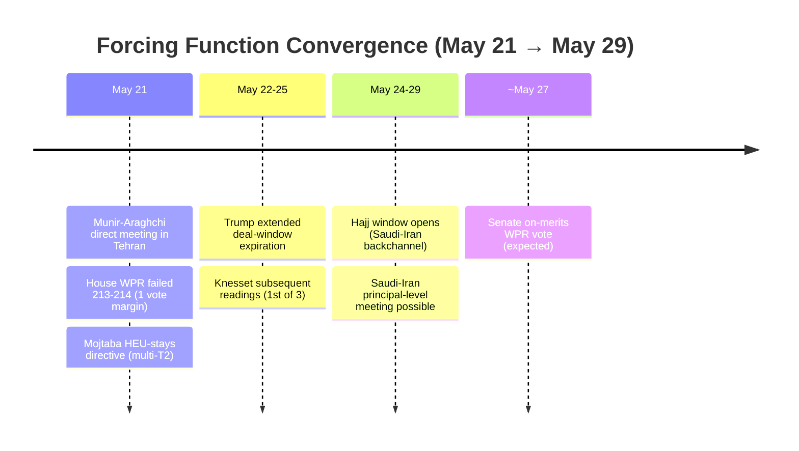
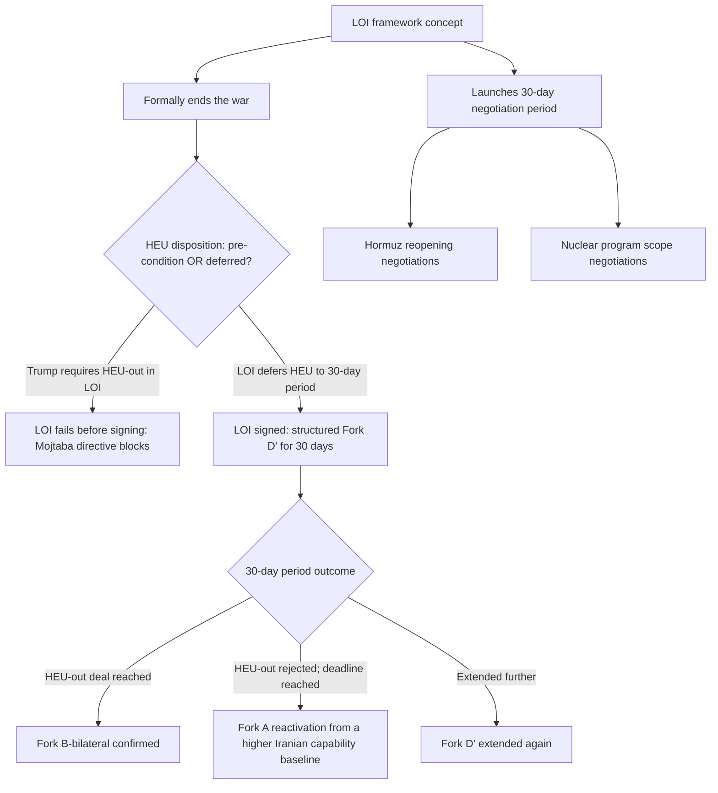
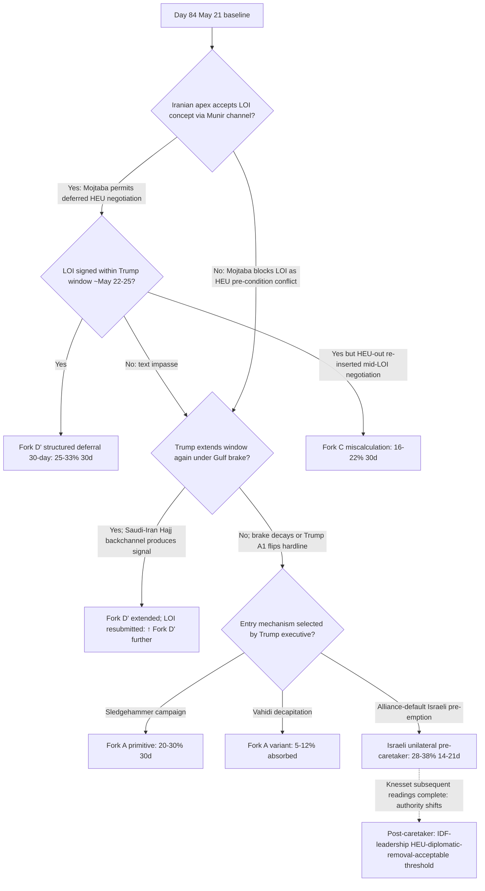

# Iran 2026 Operational SITREP: Daily Update
**Day 84 | Thursday, May 21, 2026**
*Annex to Iran 2026 Operational SITREP and Strategic Synthesis (base report v4.0)*

## Executive Summary

Pakistan Army Chief Munir met Iranian FM Araghchi directly in Tehran (Day 84), elevating the Pakistan channel to principal-on-principal contact and delivering the "letter of intent" + 30-day framework concept that Trump described to Netanyahu the prior day. Mojtaba Khamenei issued a directive (multiple T2 outlets, anonymous senior Iranian sources, M confidence) that near-weapons-grade enriched uranium must stay in Iran, hardening the apex position on the core US deal demand and narrowing Fork B-bilateral. The House WPR failed 213-214, the narrowest margin in three attempts, with three GOP defectors. CNN reports Iranian military reconstitution is proceeding faster than all IC timelines, with 50% drone capability intact and production resumed during the ceasefire. The structural collision between Trump's stated requirement ("we will get the highly enriched uranium") and Mojtaba's HEU-stays directive is the binding constraint the "letter of intent" is designed to defer, not resolve.

Supersedes `day-83` · Mojtaba HEU directive NEW · LOI architecture NEW · Reconstitution faster than IC timelines ↑

### Cycle at a Glance

| Vector | Direction | Driver |
|---|---|---|
| Mojtaba HEU directive | NEW | Apex: HEU must stay in Iran; multi-T2 M confidence |
| LOI + 30-day framework | NEW | Trump to Netanyahu; Munir-Araghchi direct meeting |
| Munir-Araghchi meeting | NEW | Pakistan Army Chief in Tehran; principal-level contact |
| Iranian reconstitution | ↑ | CNN US IC: 50% drone capability intact; production resumed |
| Trump-Netanyahu divergence | ↑ active | Tense call; Netanyahu pushes resumption; Trump resists |
| House WPR | Failed 213-214 | 1-vote margin; 3 GOP defectors |
| Fork A (30d) | 23-33% → 20-30% | Gulf brake holds; Trump resisting Netanyahu; LOI active |
| Fork B-bilateral (30d) | 12-20% → 10-16% | Mojtaba HEU-stays contradicts Trump's deal basis |
| Fork D' structured deferral (30d) | 22-30% → 25-33% | LOI = deferral mechanism for HEU collision |
| Fork C miscalculation (30d) | 15-20% → 16-22% | Israeli window compression; faster reconstitution |
| Brent crude | ~$104-107 | Deal-progress signals pulled back from May 19 $111.28 |

> Cumulative escalation: ~47-63% over 30 days, ~72-87% over 12 months. Dominant non-escalation path is Fork D' structured deferral at 25-33%, ↑ from 22-30% on "letter of intent" architecture; Combined Fork B 20-28% ↓ from 22-32% on HEU-stays directive.

---

## 1. Operational Update

**Diplomatic track: Munir in Tehran at principal tier; Iran reviewing US proposal; LOI concept circulating.** Pakistan Army Chief Asim Munir met FM Araghchi in Tehran Thursday (Dawn T2, confirmed). Iran's MFA spokesperson Baghaei: "we have received US views and are reviewing them" (T1 late Wednesday). Araghchi: "wherever it is necessary to fight, we will fight, and wherever it is necessary to negotiate, we will negotiate" (T1, dual-readiness framing consistent with two-level-game apex-tolerates-mid-tier pattern). No formal Iranian acceptance or rejection of the "letter of intent" concept as of Day 84.

**Trump posture: deal-direction holding under "borderline" framing; A1 oscillation within Gulf-brake constraint.** Trump (Wednesday): talks "right on the borderline"; worth giving diplomacy a few more days "if it saves lives." Secretary Rubio: "some progress." Trump simultaneously maintained standing attack-readiness framing (Hegseth and Cain instructed to be "prepared to go forward with a full, large scale assault of Iran, on a moment's notice" per Day 83 baseline). Trump-Netanyahu call Tuesday: Trump explicitly described "letter of intent" + 30-day framework to Netanyahu while Netanyahu pushed for military resumption; Trump framed the halt as driven by Gulf allies' request. A1 oscillation confirmed at high severity: deal-direction framing and kinetic-readiness framing coexist within the same 24-hour arc.

**CENTCOM posture: unchanged; Operation Sledgehammer named but not executed.** Two-CSG (Lincoln + Bush) held. USS Eisenhower in OFRP training phase (East Coast); no deployment order. CNN / Axios confirmed the suspended attack was to be named "Operation Sledgehammer." The name was pre-positioned and halted, not post-hoc cancelled; this is a Stage 2 hysteresis resumed-operations indicator (operation pre-named, execution paused by brake, name now documented).

| Asset / signal | Day 83 baseline | Day 84 read | Implication |
|---|---|---|---|
| CENTCOM CSG count | Lincoln + Bush | Lincoln + Bush H | Two-CSG posture stable |
| USS Eisenhower | OFRP training; not deployed | OFRP training; not deployed | Restraint signal held |
| Operation Sledgehammer | Not named | Named; suspended by brake | Stage 2 hysteresis indicator |
| Trump strike window | ~May 22-25 (extended) | Held; Munir in Tehran may extend further | Brake operative; decision deferred |
| Barakah attribution | UAE official: Iraqi territory | Held | Iraqi-PMU channel operative |
| IRGC Hormuz enforcement | Zolfaghari Day 81 baseline | No update; carry | Physical coercion layer held |
| Vahidi public statement | Day 83: "devastating blows" | No new MOU-substantive statement | Apex deterrent framing; no terms |

**Iranian internal: Mojtaba HEU directive and faster-than-expected reconstitution.** Multiple T2 outlets (Haaretz lead, Reuters via geo.tv / Al Arabiya / Daily Sabah, Times of Israel) report Mojtaba Khamenei issued a directive: near-weapons-grade enriched uranium must not be sent abroad; "the consensus within the establishment is that the stockpile of enriched uranium should not leave the country" (senior Iranian source). Source is anonymous (apply standard -50% discount) but multi-outlet T2 pickup pushes confidence to M. This is the first documented apex position on a specific MOU sub-element. CNN (T2, two US officials): Iran has already restarted drone production during the six-week ceasefire; reconstitution proceeding faster than all IC timelines; "The Iranians have exceeded all timelines the IC had for reconstitution"; 50% drone capability intact; full reconstitution possible in six months; factors include Russian and Chinese material support plus lower-than-estimated war damage. PROBE-3: 14th consecutive gap cycle; rial $1,815,000 carry.

**Israel: Knesset subsequent readings not yet scheduled; Netanyahu-Trump divergence documented.** Knesset subsequent readings (three remain after 110-0 preliminary) not scheduled through Day 84; mechanical passage expected. Netanyahu explicitly pushed Trump for military resumption in Tuesday call; Trump resisted. IDF on high alert (Day 83 Fox News baseline held); no Israeli unilateral strike Day 84. Pre-caretaker window operative: Netanyahu retains operational authority until subsequent readings complete; IDF-coalition uranium-removal asymmetry mechanism active.

**Markets.**

| Asset | Pre-war (Feb 28) | Day 83 (May 20) | Day 84 (May 21) | Move |
|---|---|---|---|---|
| Brent crude | $73 | $111.28 close May 19 | ~$104-107 (EIA $106/b May-June forecast; WTI recovered ~3% to $101+) | ↓ pulled back; deal-progress signals vs sustained tightness |
| WTI crude | $70 | ~$108 close | ~$101+ recovering | ↓ marginal |
| Iranian rial parallel | ~960k/USD | 1,815,000 carry | 1,815,000 carry | held |
| US gas / gallon | $3.27 | $4.50 | $4.50 | stable |

**US domestic: House WPR fails 213-214; Senate on-merits vote expected but likely blocked.** House Concurrent Resolution 38 failed 213-214 (one-vote margin), the closest House vote yet on WPR; three Republicans crossed (Massie, Fitzpatrick, Barrett). Senate: May 19 committee-discharge 50-47 (four GOP: Collins, Murkowski, Paul, Cassidy; three absent: Cornyn, Tuberville, Tillis; Fetterman sole Dem NO) set up on-merits Senate vote; Republican leaders project a block at full-attendance. The combined Senate + House trajectory: more GOP defectors than any prior cycle in both chambers simultaneously. Stage 2 hysteresis indicators: Operation Sledgehammer pre-named; "hostilities terminated" certification in place; Day 60+ WPA deadline passed; no judicial challenge filed.

**International: Gulf brake holding publicly; Saudi-UAE structural divergence documented.** Trump credited MBS, MBZ, and Tamim for the brake through Day 84; no public intra-troika divergence. Saudi-Iran Hajj backchannel: Saudi interior minister met Iranian Hajj head in Jeddah May 20; ~30,000 Iranian pilgrims arriving via Iraqi overland convoy through Arar crossing; Hajj window May 24-29 is the operative backchannel interval. Analytical reporting (NBC News, Soufan Center, Chatham House, CSIS) documents structural MBS-UAE divergence: MBZ sought coordinated Gulf military strike on Iran (during war's hot phase); MBS refused; UAE exited OPEC May 1. Russia path ≤5%; no new BS-9 sub-probe fires.

---

## 2. Framework Validation

- **A1 (Trump improvisational / oscillating principal):** Deal-direction framing ("borderline"; LOI description to Netanyahu) coexists with standing attack-readiness instruction (Hegseth/Cain order held). Oscillation confirmed at high severity within Gulf-brake constraint.
- **A4 (Iranian apex consolidation):** Mojtaba HEU directive is the first documented apex position on a specific MOU element; apex consents to Munir-mediated mid-tier engagement while publicly holding HEU line. Two-level pattern holds.
- **A9 (Constraints compress choice sets; principals select):** Under joint constraints (Gulf brake, faster reconstitution, Netanyahu pressure, WPR tightening), the LOI deal-window-extension is the relatively highest-ranked option for Trump at Day 84; Trump selected continued extension. Framework predicted the ranking; Trump selected.
- **A10 (Slantchev feigning-weakness):** CNN US IC multi-source confirms at H confidence: reconstitution faster than all IC timelines; 50% drone capability intact; production resumed. Feigning-weakness now corroborated by named US officials, not analytical inference.
- **A15 (Principal-Access Channel Architecture):** Munir-Araghchi direct meeting is a new principal-on-principal contact within the Pakistan channel. Channel saturation increasing: Munir (Pakistan principal) + Araghchi (Iran mid-tier principal) directly negotiating architecture.

---

## 3. Framework Revisions Required

**TRIGGER FIRED (PROBE-13, M / IMMEDIATE): Mojtaba HEU-stays directive.**
Prior (v4.0; BS-12; Day 83): Mojtaba apex position on specific MOU elements opaque; BS-1a apex visibility 75-80% post-Day-83 Vahidi silence-break. Data: Haaretz lead + Reuters via multiple T2 outlets; senior Iranian sources (anonymous, -50% discount, mitigated by multi-outlet T2 convergence); directive that HEU must not leave Iran. Revised: BS-1a apex visibility +3-5pp to 78-83%; BS-12 Iran-side apex position on HEU now documentable at M confidence: HEU stays. This directly contradicts Trump's stated deal basis ("we will get the highly enriched uranium") and Israeli assurances Trump gave Netanyahu (Reuters via ToI). Fork B-bilateral: 12-20% → 10-16% (30d), because the full bilateral MOU requires HEU disposition and the apex position forecloses the US's stated requirement. The "letter of intent" concept (see Section 4) is designed to defer this collision by launching a 30-day negotiation period rather than resolving HEU in the LOI text itself.

*Trend cross-check:* Advances T3 (Fearon-Slantchev apex-reserves-deterrent-floor). The HEU directive is apex public maximalism while Munir mid-tier mediation continues; the two-level pattern (apex holds maximalist floor publicly; mid-tier explores bargaining range) is confirmed. No contradiction of any VALIDATED trend; no single-cycle override of reference prediction.

**TRIGGER FIRED (PROBE-14, H / IMMEDIATE): Iranian military reconstitution faster than IC timelines.**
Prior (v4.0; BS-13; Day 83): Slantchev feigning-weakness confirmed at H on multi-cycle analytical basis; 50% drone capability noted but not IC-confirmed; Day 83 Iraqi-PMU attribution refined. Data: CNN T2, two named US officials: 50% drone capability retained; drone production resumed during ceasefire; "exceeded all timelines IC had for reconstitution"; six-month full-reconstitution estimate; Chinese components and Russian support as contributing factors. Revised: BS-13 visibility 50-60% → 55-65%; Slantchev feigning-weakness upgraded from multi-cycle-analytical to US-IC-confirmed. Fork A intensity prior revised up: kinetic resumption faces a more capable adversary than post-Twelve-Day-War IC estimates assumed. Powell mechanism amplified: faster reconstitution strengthens Israeli "window closing" perception independent of Trump deal-direction. The reconstitution speed also adds a Layer 3 time-arithmetic element: Iran's bargaining leverage increases as capability recovers; US and Israeli incentive to resolve or strike before full reconstitution intensifies.

*Trend cross-check:* Advances T2 (Mosaic-Octopus multi-channel deterrent). Active drone production + Iraqi-PMU channel confirmed operational + Chinese support = multi-channel deterrent is not residual but actively rebuilding. No contradiction of VALIDATED trends.

**TRIGGER FIRED (PROBE-9, H / NEXT CYCLE): Trump-Netanyahu tense call; Penetration mechanism counter-direction.**
Prior (Day 83): Netanyahu Penetration mechanism active; direction unclear; Netanyahu absent at Knesset vote for security consultations. Data: CNN T2 US official; Axios corroboration. Revised: Penetration mechanism is active but being explicitly resisted. Trump counter-pushed Netanyahu's military-resumption argument, described LOI architecture, credited Gulf allies for the halt. The mechanism is "active-but-resisted" for the first time; prior cycles showed active-and-penetrating (Day 77-81 oscillation toward hardline following Netanyahu contact) or dormant. Powell mechanism: as Trump holds deal-direction, Netanyahu's "window closing" perception intensifies, raising Israeli pre-emption incentive further.

*Trend cross-check:* Advances T4 (US eschatological-coalition disaggregation). Deal-faction (Trump + Rubio + Vance) explicitly overriding maximalist pressure from Netanyahu. No CUFI / Hegseth / Huckabee counter-mobilization visible Day 84.

---

## 4. Framework Additions

**"Letter of Intent" + 30-day framework: structured Fork D' deferral architecture.**

The "letter of intent" (LOI) concept describes a new deal mechanism: a formal end-of-war statement that both the US and Iran would sign, launching a 30-day negotiation period on nuclear program details (including HEU disposition) and Hormuz reopening. Source: CNN T2 (Trump to Netanyahu); Dawn T2 (Munir-Araghchi meeting in Tehran). The LOI is not the full MOU (which would require resolving HEU disposition, enrichment limits, sunset clause); it is a pre-MOU framework agreement. Its structural function is to defer the Mojtaba HEU-stays vs Trump HEU-out collision into a defined negotiation period rather than make it a pre-condition for the LOI signing itself.

Under joint constraints, the LOI is the relatively highest-ranked option for Trump at Day 84 over both immediate Fork A execution (Gulf brake and Netanyahu resistance aside) and the previous 14-point MOU track (which produced no substantive convergence in five rounds). Iran has not formally accepted or rejected the LOI concept; Araghchi's dual-readiness framing ("wherever to fight, we fight; wherever to negotiate, we negotiate") is consistent with a principal that has received the concept but not yet cleared it at apex level. The Mojtaba HEU directive creates an operational constraint on the LOI: the directive is about the outcome of HEU negotiations, not about whether to negotiate; the LOI framework that simply defers the HEU question may be compatible with Mojtaba's position if it does not pre-commit HEU removal as a LOI condition. Iranian apex acceptance probability is unknown; Munir-Araghchi meeting is the live signal.

This addition is to Section 5.25 of v4.0 (Gulf State Troika Brake Mechanism), as an elaboration of the structured-deferral properties of the brake's deal-window-extension outcome.

---

## 5. Revised Probability Matrix

| Outcome | 30d | 12m | vs. Day 83 | Driver |
|---|---|---|---|---|
| Fork A: Full kinetic resumption | 20-30% | 43-53% | ↓ 30d | Trump-Netanyahu active resistance; LOI mechanism operative |
| Fork B-bilateral: Negotiated MOU | 10-16% | 12-18% | ↓ 30d | Mojtaba HEU-stays directive contradicts Trump's deal basis |
| Fork B-multilateral (Gulf pathway) | 10-17% | 12-20% | held | Saudi-UAE structural divergence prevents upward revision |
| **Combined Fork B** | **20-28%** | **24-32%** | **↓ from 22-32%** | Bilateral down; multilateral held |
| **Fork D' structured deferral (LOI)** | **25-33%** | **20-26%** | **↑ from 22-30%** | LOI architecture = named deferral mechanism |
| Fork C: Miscalculation cascade | 16-22% | 16-22% | ↑ marginal | Israeli window compression; faster reconstitution adds accident-pathway complexity |
| Israeli unilateral strike (14-21d) | 28-38% | 38-48% | held | Pre-caretaker window; Knesset subsequent readings pending |
| Brent through $130 in 60 days | 30-42% | — | held | Deal-progress pulls price lower; physical tightness maintained |
| Constitutional crisis (30d) | 60-70% | 60-70% | held | House near-miss; Senate on-merits vote expected |

**Kinetic Escalation Composite (DERIVED): ~47-63% (30d), ~72-87% (12m).** ↓ marginal from Day 83's ~50-65% / ~73-88%. Construction: Fork A (20-30%) ↓ 3pp on Trump-resisting + LOI active; Fork C (16-22%) ↑ 1pp on Israeli window compression + reconstitution faster; tails held; Israeli unilateral and Vahidi decapitation absorbed as Fork A trigger paths. Fork D' and Fork B excluded by design.

---

## 6. Probe Status Table

| PROBE | Status | Conf | Trigger | Variable Moved |
|---|---|---|---|---|
| 2 IRGC Factional | null | M | no | No new Vahidi/IRGC factional signals |
| 6 Chinese Support | partial | M | no | Chinese components to Iranian missiles confirmed (CNN T2) |
| 7 CENTCOM Posture | null | H | no | Eisenhower training; two-CSG stable; Sledgehammer named not executed |
| 8 Oil Markets | partial | M | no | Brent ~$104-107; pulled back from $111; EIA $106/b forecast |
| 9 Israeli Internal | partial | H | yes | Trump-Netanyahu tense call; Penetration mechanism counter-direction |
| 10 War Powers | partial | H | yes | House 213-214 (3 GOP defectors); Senate on-merits pending |
| 12' MOU Framework | **fired** | M | yes | LOI + 30-day framework; Munir-Araghchi direct meeting |
| 13 PA-Gap | **fired** | M | yes | Mojtaba HEU-stays directive; Fork B-bilateral ↓ |
| 14 Iranian Residual | **fired** | H | yes | Reconstitution faster than IC timelines; 50% drone capability |
| 15 Dispositional | partial | M | no | US-Israeli divergence; Powell mechanism intensifying |
| 16 First-Mover | **fired** | M | yes | LOI as suspension mechanism; Israeli threshold approaching most acutely |
| 17 Russian Siloviki | null | M | no | No new sub-probe fires; M1 baseline holds |
| 20 Gulf State Troika | partial | M | yes | Saudi-UAE structural fissure; brake is coalition of different interests |

Skipped per cadence: 1 (bi-weekly), 3 (monthly; 14th gap), 11 (bi-weekly; next run May 22), 18 (monthly), 19 (quarterly).

---

## 7. Conclusion and Forking Analysis

### Central Thesis Check

The v4.0 thesis holds with structural elaboration on the LOI deferral mechanism and the reconstitution-speed Powell amplifier. The materialist bargaining model predicts dominant strategies under joint constraints; it does not predict selection. Under Day 84's joint constraints (Gulf brake operative; faster-reconstitution raising Strike-first costs; Netanyahu Penetration resisted by Trump; Mojtaba HEU directive hardening the apex position on the core US demand; WPR at threshold proximity; Munir in Tehran at principal level), the relative cost-benefit of LOI-window-extension outranks both immediate Fork A execution and another 14-point-MOU cycle for the Trump executive at this decision point. Trump selected LOI framing. The framework predicted the ranking; Trump selected.

T1 (tripolar realignment) advances: Munir principal-level confirms Pakistan pivot capacity; Saudi-UAE divergence confirms unaligned-middle is internally complex but both actors exercise autonomous agency. T2 (Mosaic-Octopus deterrent) advances: faster reconstitution at H via US IC; drone production resumed; Chinese components confirmed flowing. T3 (Fearon-Slantchev apex-deterrent floor) holds: Mojtaba public HEU maximalism + mid-tier Munir negotiation = two-level pattern confirmed. T4 (US eschatological-coalition disaggregation) advances: Trump-Netanyahu explicit divergence is the first documented principal-level resistance to Israeli pressure on deal-vs-strike question. T5 (multi-tradition convergence) held PENDING: Hajj window opens May 24; no Tier-1 fires. T6 (Russian siloviki succession) held: M1 baseline. T7 (materialist bargaining methodology) held.

### Forking Tree (72-Hour Decision Path)

### Operative Judgment

The day's most consequential structural development is not the Mojtaba HEU directive alone, nor the LOI concept alone, but their intersection. Trump's stated deal basis requires HEU removal from Iran. Mojtaba's apex directive says HEU stays. The LOI's function is to create a named commitment (formal end-of-war) that both principals can accept without resolving this collision at the LOI-signing stage, deferring it to a 30-day negotiation period. Under this structure, Trump can frame the LOI as "Iran agreed to negotiate over HEU"; Mojtaba can frame the LOI as "Iran never agreed to send HEU abroad." Whether this face-saving architecture holds through 30 days of actual HEU negotiation is a separate question. The LOI raises the probability of Fork D' (structured deferral) and the 30-day period raises the probability of a second HEU-collision deadline 30 days hence. The Iranian reconstitution finding (faster than IC timelines; 50% capability intact) adds a Layer 3 time-arithmetic dimension that runs against the LOI: every day that passes under a deferral, Iran's reconstitution advances toward full capability. This creates competing incentive structures: Iran gains leverage as capability recovers; US and Israel feel increasing urgency to resolve or strike before the six-month reconstitution horizon closes.

The Saudi-UAE structural divergence is the second significant Day 84 finding for the medium-term framework. The Day 82 "Gulf troika brake" was characterized as a coherent unified bloc; Day 84 reporting reveals it is a coalition of different interests. MBS held the brake through accommodation logic; MBZ held the brake through Barakah-exposure logic (his alternative preference was a coordinated Gulf military strike on Iran, refused by MBS). These two causal pathways have different decay triggers. The MBS pathway decays if Iran fails to reciprocate Saudi accommodation signals (specifically: Hajj-window backchannel, Hormuz reopening, and rial stabilization as indicators of reciprocity); the MBZ pathway decays if another Barakah-class attack hits UAE infrastructure. The troika's unified public front is real but fragile in a way the Day 82 characterization underestimated.

The Israeli first-mover window is the most acute near-term risk. Netanyahu explicitly pushed Trump for military resumption; Trump resisted. The faster-reconstitution finding amplifies the Powell mechanism: the more credible the LOI-path becomes (as Trump holds deal-direction), the stronger Netanyahu's "window closing" incentive to act before a deal locks in Iran's existing capability rather than requiring dismantlement. Pre-caretaker window (before Knesset subsequent readings complete) gives Netanyahu direct operational authority. If the LOI negotiation produces no Iranian public signal of HEU flexibility within the Trump window (May 22-25, potentially extended via Hajj backchannel), the Israeli pre-emption incentive reaches its structural maximum: deal appears likely enough to close the military window while the terms do not include the capability-reduction Israelis require.

### Signals That Force Immediate Revision

- Iranian official (Araghchi or Baghaei Tier-1) accepts or rejects the "letter of intent" concept in named public statement
- Munir public characterization of Tehran meetings describing LOI framework as accepted-in-principle
- Trump statement holding deal-direction past May 22-25 window expiration (second extension); or Trump statement abandoning LOI and ordering resumed operations
- Knesset first subsequent dissolution reading (Phase-transition from pre-caretaker to caretaker authority in progress)
- Saudi-Iran principal-level meeting during Hajj window (May 24-29); backchannel formalization fires BS-18 trigger
- Second Barakah-class attack on Gulf infrastructure; UAE public Iran-command attribution of Barakah (not just territory)
- Vahidi direct named statement on LOI or HEU disposition (distinguishable from the Day 83 kinetic-deterrence statement)
- Senate on-merits WPR vote result; Fetterman position confirmation or flip
- Eisenhower deployment order; CENTCOM ROE shift to "offensive"; new operation name executed (Sledgehammer order issued)
- Mojtaba Tier-1 Mahdist invocation during Hajj window; Hajj sectarian attack with eschatological framing

---

*Compiled May 21, 2026 | Day 84 | Subject to revision as data updates*
*Next SITREP: Day 85 (May 22); Trump window expiration; Munir-Araghchi meeting outcome; Knesset subsequent readings; any Iranian LOI acceptance signal; Hajj window opening (May 24); Saudi-Iran backchannel signals; Israeli operational signal; WPR Senate on-merits vote.*
*Framework revision v4.1 warranted if: (a) LOI formally accepted by both US and Iran; (b) Vahidi MOU-substantive statement; (c) confirmed Israeli unilateral strike; (d) second Gulf-infrastructure attack; (e) Knesset dissolution full passage; (f) WPR on-merits passage; (g) Eisenhower deployment order; (h) Mojtaba Tier-1 Mahdist invocation.*
*Companion: Day 83 annex; Day 84 probe sweep (sweep-2026-05-21.json); synthesis-v4-0.md; appendix-b-blind-spots.md (Day 82 audit).*
