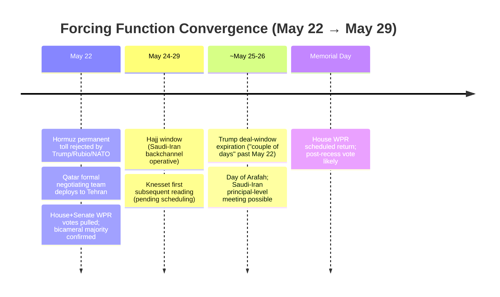
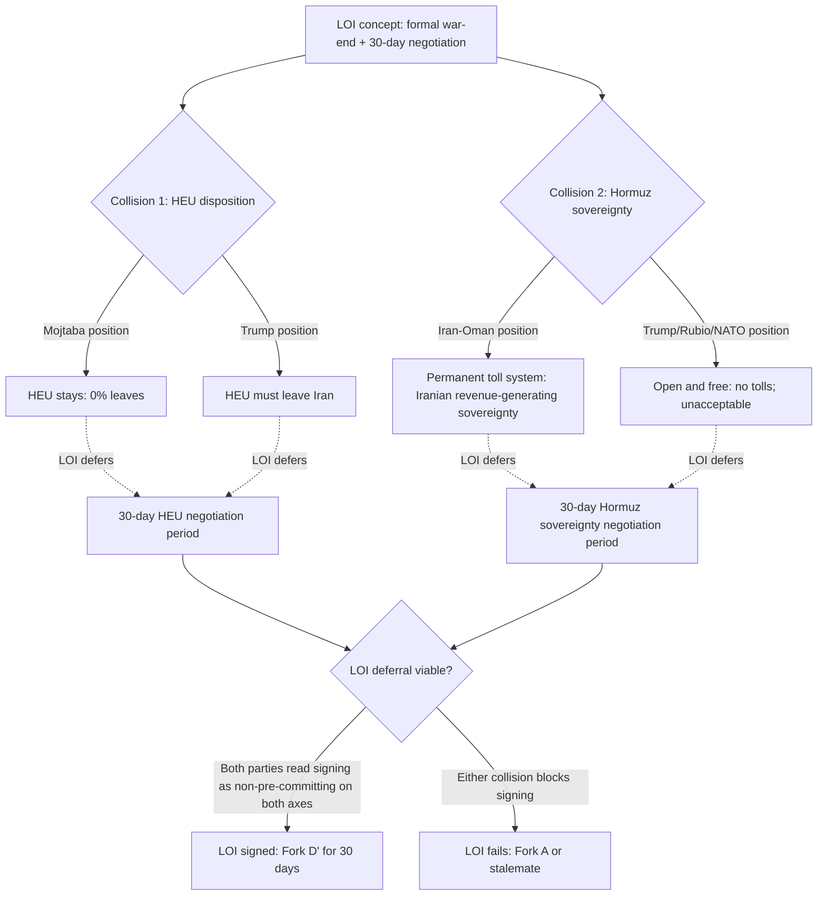
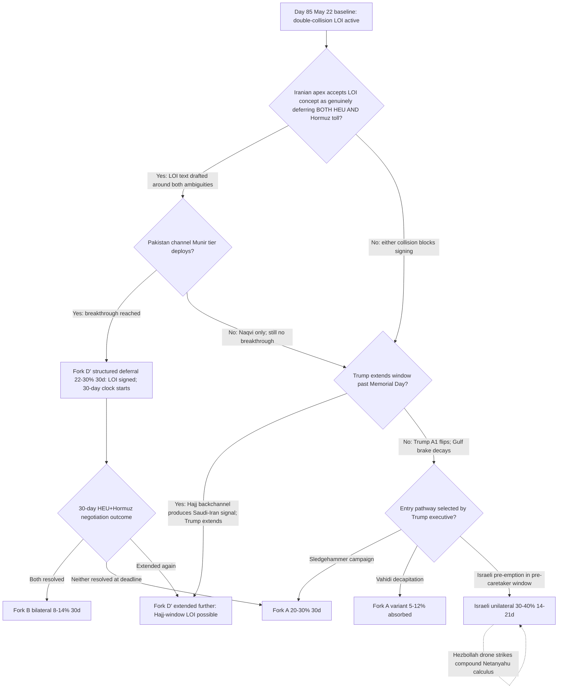

# Iran 2026 Operational SITREP: Daily Update
**Day 85 | Friday, May 22, 2026**
*Annex to Iran 2026 Operational SITREP and Strategic Synthesis (base report v4.1)*

## Executive Summary

The LOI architecture that Day 84 characterized as carrying one structural collision (Mojtaba HEU-stays vs. Trump HEU-out) now carries two: Iran and Oman are negotiating a permanent Strait of Hormuz toll system, and Trump explicitly rejected it ("open, free, no tolls"), adding a second irreconcilable demand the LOI's deferral function must absorb or collapse around. Qatar deployed a formal negotiating team to Tehran, formalizing its mediator role beyond the ad-hoc trilateral call and expanding the unaligned-middle mediation architecture; Trump extended the deal window a second time ("a couple of days" past May 22). Against this: Munir stayed home from Tehran because no breakthrough existed, Baghaei stated differences are "deep and significant," and the House WPR vote was pulled for the second consecutive day after both parties confirmed it had majority support. The process is expanding while the substantive space is contracting.

Supersedes `day-84` · Hormuz permanent toll (new collision) NEW · Qatar formal mediator team NEW · WPR de facto majority confirmed ↑ · Fork B-bilateral ↓

| Vector | Direction | Driver |
|---|---|---|
| Iran-Oman Hormuz toll proposal | NEW | Trump/Rubio explicit rejection; second structural LOI collision |
| Qatar formal mediation team in Tehran | NEW | Negotiating team deployed; bridge node formalizes |
| Trump deal-window extension (second) | ↑ | "Couple of days" past May 22; BS-18 brake durable two cycles |
| WPR de facto bicameral majority | ↑ | GOP pulled votes twice; Democrats confirmed passage count |
| Fork B-bilateral (30d) | 10-16% → 8-14% | HEU 0% + Hormuz toll = two irreconcilable deal-terms |
| Fork D' LOI deferral (30d) | 25-33% → 22-30% | Two-collision LOI; signing harder; multilateral gain partial offset |
| Fork B-multilateral (30d) | 10-17% → 12-18% | Qatar formal + Egypt/Turkey peripheral + second extension |
| Israeli unilateral (14-21d) | 28-38% → 30-40% | Hezbollah active northern front; LOI further; pre-caretaker window |
| HEU negotiating floor | hardened | 50% out (pre-war offer) → 0% out (post-war directive) |
| Hezbollah drone strikes | NEW | Western Galilee; two seriously wounded; Lebanon-front active |
| Brent crude | ~$104-105 | $29/bbl extreme backwardation; IEA red-zone by July |
| Munir Iran trip | cancelled | No breakthrough; Naqvi (Interior Minister) went instead |

> Cumulative escalation: ~47-63% over 30 days, ~72-87% over 12 months. Dominant non-escalation path is Fork D' structured deferral at 22-30%, down from 25-33% as two-collision LOI architecture puts ceiling pressure on the deferral mechanism; Fork B-multilateral rising partially offsets on Qatar formalization.

---

## 1. Operational Update

**Diplomatic track: Qatar formal team in Tehran; Munir cancelled; two-collision LOI under strain.** Qatar sent a formal negotiating team to Tehran on May 22 (JP, Modern Diplomacy, BusinessToday, T2 convergence), formalizing its role from ad-hoc trilateral bridge to named mediator with deployed personnel. Pakistan Army Chief Munir did not travel to Tehran: his visit was conditioned on a breakthrough, and none was reached; Pakistan Interior Minister Naqvi made a second trip this week instead, carrying a US message to Araghchi. Rubio named Egypt and Turkey as peripheral participants. Iran MFA spokesperson Baghaei (T1): "differences are deep and significant"; "we will not reach a conclusion if we try to delve into details related to highly enriched uranium in Iran." The mediator architecture is now Pakistan (primary, agent-tier this cycle) + Qatar (formal team) + Egypt + Turkey (peripheral). The Pakistan channel escalation ladder is visible: Naqvi is the continuous contact; Munir deploys only on breakthrough attainment.

**Iran-Oman Hormuz toll: new irreconcilable collision alongside HEU.** Iran's ambassador to France and working discussions with Oman surfaced a proposal for a permanent Iranian toll system governing Strait of Hormuz traffic, framed as formalizing Iranian sovereignty and raising war-reparation revenue. Trump (T1, Thursday): "We want it open, we want it free, we don't want tolls." Rubio (T1): "No one in the world is in favor of a tolling system. It can't happen, it would be unacceptable." NATO Secretary General Rutte condemned Iran's actions at sea as threatening global maritime security. The HEU position has simultaneously hardened relative to the pre-war baseline: before February 28, Iran had signaled willingness to ship half of its 60% enriched stockpile abroad; Reuters-Geo.tv sourcing (T2, anonymous, standard -50% discount) attributes the reversal to "repeated threats from Trump to strike Iran." Post-war Iranian position: 0% of HEU leaves. The LOI's face-saving deferral function now requires both the US and Iran to read signing as not pre-committing them on EITHER HEU OR Hormuz sovereignty.

**Trump posture: second extension; deal-leaning with noise.** Trump willing to wait "a couple of days" for Iranian response (CBS, CNBC, T2). Characterization: "pretty impressed by Iran's negotiators" while standing attack-readiness instruction (Hegseth/Cain order) held. Rubio Day 85 issued two contradictory signals within the same cycle: "slight progress" (WaPo, PBS) and "I'm not sure you can reach a deal with these guys" (CNBC). The contradiction reflects intra-US-executive ambivalence, not policy resolution; the deal-faction (Trump + Vance + Rubio net) remains active under the Gulf brake constraint.

**CENTCOM posture: two-CSG stable; Eisenhower training; Sledgehammer unexecuted.**

| Asset / signal | Day 84 baseline | Day 85 read | Implication |
|---|---|---|---|
| CENTCOM CSG count | Lincoln + Bush | Lincoln + Bush; H | Stable; no escalation signal |
| USS Eisenhower | OFRP training, East Coast, AIS on | Unchanged | Restraint signal held |
| Operation Sledgehammer | Named; suspended by brake | Unexecuted; brake holding | Stage-2 hysteresis indicator sustained |
| Trump strike window | ~May 22-25 (extended) | "Couple of days" past May 22 | Second extension confirmed |
| IRGC Hormuz enforcement | Zolfaghari Day 81 carry | No update | Physical coercion layer unchanged |
| Brent backwardation | $19-22/bbl spread (est.) | $29.34/bbl Jul26-Jul27 Brent spread | Extreme; supply fears severe |

**Iranian internal: HEU position hardened; Vahidi receives US message.** Vahidi met Pakistan Interior Minister Naqvi to receive a message from Washington (Euronews T3 analytical; context from Al Arabiya T2 Naqvi-Araghchi meeting). The apex IRGC decision-maker is in direct receipt of US negotiation traffic, not only broadcasting deterrent-floor posture; this narrows the PA-gap on process without moving the substantive position. Euronews (T3) characterizes Vahidi's strategy as two pillars: maintaining Hormuz control and refusing HEU transfer, confirming the dual-collision structure from the Vahidi apex downward. Mojtaba status: no visual appearance (87+ days); Pezeshkian claimed a face-to-face meeting of 2.5 hours approximately May 7 (Euronews T2, single-source). Rial: 1,815,000 IRR/USD carry; PROBE-3 15th consecutive gap cycle.

**Israel: pre-caretaker window; no strike Day 85.** No Israeli unilateral strike. Knesset dissolution at preliminary reading only (passed May 20, 110-0); committee stage and three subsequent readings not yet scheduled. Netanyahu retains operational authority in pre-caretaker window. IDF on "high alert" baseline carries. Penetration mechanism state: active-but-resisted (Day 84 tense Trump-Netanyahu call carry).

**Lebanon / proxy fronts: Hezbollah explosive drones strike northern Israel.** Hezbollah launched explosive drones from Lebanon into northern Israel, striking the Western Galilee; two Israelis seriously wounded (Haaretz T2, Jerusalem Post T2). IDF struck multiple Hezbollah-linked facilities in Lebanon; Lebanon Health Ministry: 10 killed including paramedics and a child. The Lebanon ceasefire (effective April 16-17) has sustained violations from both sides. This is a T2 (Mosaic-Octopus) signal: Hezbollah retains operational drone capability on the northern front during the Iran main-channel ceasefire, contradicting the "terminal decline" characterization of March 2026. A Kataib Hezbollah (Iraq PMF) leader, Mohammad Baqer Saad Dawood al-Saadi, was arrested in a US-Turkey joint operation for directing 18+ attacks across the US, Canada, and Europe during the Iran war (Al Jazeera, CNN T2). P-OVEX partial: proxy network under prosecution pressure at named-leader level.

**Markets.**

| Asset | Pre-war (Feb 28) | Day 84 (May 21) | Day 85 (May 22) | Move |
|---|---|---|---|---|
| Brent crude | $73 | ~$104-107 | $103.92-$105.15 (open $104.94) | stable/marginal ↓ |
| Brent backwardation (Jul26-Jul27) | flat | ~$19-22 est. | $29.34/bbl | extreme tightness |
| WTI backwardation (Jun26-Jun27) | flat | n/a | $20.65/bbl | extreme tightness |
| Iranian rial parallel | ~960k/USD | 1,815,000 | 1,815,000 (15th gap) | held |
| US gas / gallon | $3.27 | ~$4.50 | ~$4.50 | stable |

IEA Executive Director Birol (T2, named): oil market could enter "red zone" by July if Hormuz remains closed; 14 mb/d shut in; 250 million barrel inventory drawdown March-April alone; "biggest pain felt in developing Asia and Africa." Goldman's 4-6 week South Africa/India/Thailand/Taiwan product-scarcity window is entering its zone. Extreme backwardation ($29/bbl Brent July 2026 vs. July 2027) confirms market reading of severe near-term supply tightness even as spot price is pulled back by deal-progress signals.

**US domestic: WPR de facto majority confirmed; vote pulled twice.** House GOP leadership cancelled the Iran war-powers vote for the SECOND CONSECUTIVE DAY (May 21-22) because counts showed the resolution would pass. House Democratic Leader Jeffries joint statement: "Republicans cowardly pulled a scheduled vote — legislation that would have passed with bipartisan support." Rep. Meeks: "We had the votes to pass it today." GOP plans to bring it to vote after Memorial Day recess. Senate leadership simultaneously called off its WPR vote that was "on the verge of passing" (NPR). Both chambers have now confirmed de facto majority support for war-powers constraint through leadership decisions not to hold votes; parliamentary delay, not substantive opposition, is the only remaining blocker.

**International: Gulf brake second extension; Hajj window opens May 24; NATO condemns Hormuz.** Hajj window opens May 24; Day of Arafah May 26; ~30,000 Iranian pilgrims in Saudi Arabia via Iraqi overland convoy through Arar. Saudi-Iran backchannel through the window is live but no principal-level meeting confirmed Day 85. NATO Secretary General Rutte: Iran's actions "threaten global maritime security." Russia-Ukraine: ceasefire ended; Putin hinted at Zelensky talks; no new BS-9 sub-probe fires; M1 baseline holds.

---

---

## 2. Framework Validation

- **A4 (Mojtaba operational patterns):** Pezeshkian's claimed face-to-face meeting (T2 single-source, May 7) is consistent with functional-figurehead model: apex accessible to senior official but not to public. HEU directive routing via anonymous senior sources continues the weaponized-opacity pattern.
- **A9 (constraints compress choice sets; principals select):** Under joint constraints (Gulf brake operative; double-collision making LOI harder but not impossible; WPR de facto majority; strangulation clock accelerating), second extension remains the highest-ranked option for Trump; Trump selected extension. The framework predicted the ranking; Trump selected.
- **A10 (Slantchev feigning-weakness):** Hezbollah explosive drone strikes into northern Israel confirm the Mosaic-Octopus multi-channel deterrent retains operational capability despite the "terminal decline" characterization of March 2026. The Lebanese channel is degraded, not dead.
- **A15 (Principal-Access Channel Architecture):** Pakistan channel escalation ladder confirmed operational: Naqvi (agent-tier) as continuous contact; Munir (principal-tier) conditioned on breakthrough. Qatar team formalizes a parallel channel at the agent-tier level with potential principal escalation via Emir Tamim if the Qatar track produces traction.

---

## 3. Framework Revisions Required

**TRIGGER FIRED (PROBE-8, M, next_cycle): Iran-Oman permanent Hormuz toll as second structural LOI collision.**
Prior (v4.1; BS-7; BS-11): Hormuz framing was about reopening timing and the interim two-track arrangement (Iran-approved transits coexisting with commercial closure). Revised: Iran-Oman negotiations on a permanent toll system introduce a sovereignty-monetization dimension. Trump (T1) and Rubio (T1) rejected explicitly. The LOI's face-saving deferral function must now absorb two simultaneous irreconcilable demands, not one. Fork D' 25-33% → 22-30% on dual-collision strain; Fork B-bilateral 10-16% → 8-14% because full bilateral MOU resolution now requires bridging BOTH the HEU AND the Hormuz sovereignty collision. Auditor item: evaluate whether BS-11 Hormuz sub-element needs a permanent-toll tracking mechanism added to the probe directive; evaluate whether P-AIM should be elevated given Hormuz permanent-toll approaches the order-revisionist threshold on freedom-of-navigation norms.

*Trend cross-check:* No contradiction of VALIDATED trends. Advance of T1 (unaligned middle: Oman as Iran's Hormuz institutional co-designer is an unaligned-middle state exercising autonomous agency). Does not contradict T3 (apex Vahidi's strategy confirming HEU + Hormuz as twin pillars is consistent with deterrent-floor framing).

**TRIGGER FIRED (PROBE-10, H, next_cycle): House and Senate WPR votes pulled because majority existed; T9 single-cycle contradict flag.**
Prior (v4.1; T9 VALIDATED; BS-5): House WPR failed 213-214 (three GOP); Senate on-merits vote expected to be blocked at full attendance. Revised: de facto bicameral majority for war-powers constraint is confirmed by both parties' leadership simultaneously, the first such confirmation in this conflict. T9 (Stage-2 hysteresis lock-in) receives one discounted-contradicting-cycle entry per sweep protocol. T9 remains VALIDATED: the Stage-2 architecture (hostilities-terminated certification + Sledgehammer pre-naming + WPA day-60 elapsed + no judicial challenge) is not disrupted by a vote that was prevented from occurring. Flag for auditor: if the House WPR is scheduled and passes after Memorial Day recess, T9 transitions to CONTESTED. This is the strongest T9 challenge yet without technically breaking the lock-in.

*Trend cross-check:* Single-cycle contradict signal against T9 (VALIDATED). Per sweep protocol, does not trigger T9 demotion. Disc-ratio update: T9 accumulates one discounted-contradicting cycle (b:a counter incremented).

**TRIGGER FIRED (PROBE-12'/20, M, next_cycle): Qatar formal mediation team deployed; second Trump extension confirmed.**
Prior (v4.1; BS-11; BS-18): Qatar in ad-hoc trilateral bridge role; first extension of Trump window. Revised: Qatar formal negotiating team in Tehran fires the BS-11/BS-18 trigger (Qatar bridge node formalizes; mediator architecture stabilizes; Fork B-multilateral via Gulf-Qatar pathway durability ↑). Second extension fires the BS-18 second-extension trigger: brake mechanism confirmed durable across two cycles; Fork B-multilateral structural rather than contingent. Mediator architecture updated: Pakistan (primary; Munir conditioned on breakthrough; Naqvi continuous) + Qatar (formal team) + Egypt + Turkey (peripheral, Rubio-acknowledged) + Saudi Hajj-channel (live, not yet at principal tier). Proposed BS-18 visibility: 35-45% → 40-50%. Fork B-multilateral: 10-17% → 12-18%.

*Trend cross-check:* Advances T1 (tripolar realignment with structurally significant unaligned middle). Egypt and Turkey adding to mediator architecture extends the unaligned-middle pivot capacity beyond the Gulf-specific cluster the framework had instrumented.

**PARTIAL (PROBE-13, M): HEU negotiating floor hardened from pre-war baseline.**
Prior (v4.1; BS-12): Mojtaba HEU-stays directive was characterized as a new apex position surfacing Day 84. Revised: the position shift predates the directive. Before February 28, Iran had signaled willingness to ship half of its 60% enriched stockpile; post-war position is 0% leaves Iran. The LOI deal space on HEU was already narrower than the pre-war baseline when the Day 84 directive was logged. This is not a new mechanism revision but a retroactive quantification of the Iranian concession-floor movement: Iran's opening concession on HEU has moved from -50% to 0% since the conflict began.

*Trend cross-check:* Consistent with T3 (Fearon-Slantchev: apex maintains maximum public deterrent floor; the hardening IS the deterrent floor assertion). No contradiction.

---

## 4. Framework Additions

**Two-collision LOI architecture: structural double-deferral problem.**

The LOI concept requires both the US and Iran to be able to read signing as not pre-committing them on EITHER of two incompatible requirements. At Day 84 the collision was one-dimensional: HEU (Mojtaba stays; Trump out). At Day 85 it is two-dimensional:

The double-deferral structure puts additional strain on the LOI's face-saving architecture. Signing requires both the Trump executive (Rubio has publicly called the Hormuz toll "unacceptable") and the Iranian apex (Mojtaba has publicly required HEU stay) to tolerate a document that resolves neither demand. The practical test is whether the LOI's text can be drafted to be genuinely ambiguous on BOTH axes simultaneously. Pakistan's Naqvi-Araghchi channel is the operative drafting mechanism; Munir's conditioned-on-breakthrough posture will remain the live readout of whether that drafting is producing convergence.

**Pakistan channel escalation ladder as real-time breakthrough indicator.**

Munir's confirmed non-travel to Tehran is a direct observable that no breakthrough existed as of May 22. The ladder operates: Naqvi (agent-tier, continuous) sends messages → Munir (principal-tier, Army Chief) deploys if and when Iran signals substantive LOI-concept acceptance. Each Naqvi-without-Munir cycle is a real-time confirmation that no breakthrough has been reached. This makes Pakistan mediator tier (Naqvi vs. Munir) a structurally informative indicator independent of content: principal-tier deployment = breakthrough attained; agent-tier only = not yet.

---

## 5. Revised Probability Matrix

| Outcome | 30d | 12m | vs. Day 84 | Driver |
|---|---|---|---|---|
| Fork A: Full kinetic resumption | 20-30% | 43-53% | stable | Gulf brake holds; second extension; but double-collision elevates structural impasse pressure |
| Fork B-bilateral: Negotiated MOU | 8-14% | 10-16% | ↓ | HEU hardened to 0% from pre-war 50%; Hormuz permanent toll = second irreconcilable demand |
| Fork B-multilateral (Gulf pathway) | 12-18% | 14-22% | ↑ | Qatar formal team; second extension; Egypt+Turkey peripheral; Hajj window |
| **Combined Fork B** | **20-28%** | **24-32%** | **stable** | Bilateral ↓ offsets multilateral ↑ |
| Fork D' structured deferral (LOI) | 22-30% | 18-24% | ↓ | Two-collision LOI; dual-deferral problem; signing harder |
| Fork C: Miscalculation cascade | 16-22% | 16-22% | stable | Hezbollah northern-front activity adds complexity; net stable |
| Israeli unilateral strike (14-21d) | 30-40% | 40-50% | ↑ marginal | Pre-caretaker window; Hezbollah active; LOI further; Powell amplifier holds |
| Brent through $130 in 60 days | 30-42% | — | stable | IEA red zone July; physical tightness maintained; deal-progress signal partially offsets |
| Constitutional crisis (30d) | 60-70% | 60-70% | stable | De facto bicameral majority; GOP using procedure delay only |

**Kinetic Escalation Composite (DERIVED): ~47-63% (30d), ~72-87% (12m).** Stable from Day 84 baseline. Fork A held (20-30%); Fork C held (16-22%); Israeli unilateral absorbed into Fork A composite with marginal upward pressure (30-40% from 28-38% within 14-21d sub-horizon); conflict-leading tails unchanged. Fork D' deferral and Fork B excluded by design.

---

## 6. Probe Status Table

| PROBE | Status | Conf | Trigger | Variable Moved |
|---|---|---|---|---|
| 1 Mojtaba | partial | M | no | Pezeshkian claimed meeting (T2 single-source; no visual) |
| 2 IRGC Factional | partial | M | no | Vahidi-Naqvi meeting: apex in process channel; no terms statement |
| 6 Chinese Support | null | M | no | No new signals; Day 84 baseline carries |
| 7 CENTCOM Posture | null | H | no | Two-CSG stable; Eisenhower training; Sledgehammer unexecuted |
| 8 Oil Markets | **fired** | M | yes | Iran-Oman Hormuz toll (Trump rejected); IEA red-zone warning |
| 9 Israeli Internal | null | M | no | Knesset preliminary only; no strike; no IDF dissent |
| 10 War Powers | **fired** | H | yes | House+Senate WPR votes pulled; de facto majority confirmed |
| 11 Russian Settlement | null | M | no | Dugin disillusionment; no BS-9 fires; M1 holds |
| 12' MOU Framework | **fired** | M | yes | Qatar formal team; second extension; Munir cancelled (downgrade) |
| 13 PA-Gap | partial | M | no | HEU floor: 50% out pre-war → 0% out post-war confirmed |
| 14 Iranian Residual | partial | M | no | Kataib Hezbollah leader arrested (P-OVEX partial) |
| 15 Dispositional | partial | M | no | Rubio internal contradiction; deal-faction noise ↑ |
| 16 First-Mover | **fired** | M | yes | Double-collision LOI; process-substance gap; WPR approaching |
| 20 Gulf Troika | **fired** | M | yes | Qatar formal + second extension: BS-18 durable two cycles; T1 advances |
| 21 Paine Death-Ground | partial | M | no | P-OVEX partial; P-AIM limited; P-DG null |

Skipped per cadence: PROBE-3 (monthly; 15th gap), PROBE-17 (bi-weekly), PROBE-18 (monthly), PROBE-19 (quarterly).

---

## 7. Conclusion and Forking Analysis

### Central Thesis Check

The v4.1 central thesis holds: five constraint layers condition each principal's decision set; faction misalignment and PA-gap dynamics determine form and timing within those sets; Bayesian updates over correlated signal clusters tighten or loosen priors on dominant strategies. Day 85 confirms the thesis under stress: the LOI deferral mechanism is under compounding strain from two simultaneous structural collisions (HEU and Hormuz toll), but the Gulf brake still holds across a second extension cycle, and the Trump executive is still selecting window-extension as the highest-ranked option under joint constraints. The framework predicted the ranking; Trump selected.

Trend-state lines this cycle: **T1 advances** (Qatar formal team + Egypt/Turkey extends unaligned-middle architecture beyond Gulf-specific). **T2 advances** (Hezbollah explosive drones into northern Israel confirm multi-channel deterrent operationally alive despite terminal-decline characterization). **T3 advances** (Vahidi-Naqvi process engagement while Baghaei maintains public sequencing: two-level pattern confirmed Day 85). **T4 holds** (Rubio ambivalent; deal-faction active; no maximalist counter-mobilization). **T5 holds PENDING** (Hajj window opens May 24; no Tier-1 fires Day 85). **T6 holds**. **T7 holds** (no substrate-as-agent voice drift this cycle). **T8 holds VALIDATED** (Hezbollah active on northern front reinforces Powell-amplifier loading; no Israeli threshold crossing Day 85). **T9 holds VALIDATED with single-cycle contradict flag** (WPR de facto majority confirmed; parliamentary delay operative; disc-ratio incremented). **T10, T11 hold PENDING**.

### Forking Tree (72-Hour Decision Path)

### Operative Judgment

The Day 85 defining structural shift is the emergence of a dual-collision LOI architecture: where Day 84 characterized one irreconcilable demand requiring face-saving deferral (HEU), Day 85 has confirmed a second (Hormuz permanent sovereignty and toll). Two simultaneous irreconcilable demands create a harder face-saving problem. The LOI's structural function was to offer each principal a text both could read as not pre-committing them on HEU; it must now offer that simultaneously on Hormuz sovereignty. Trump and Rubio explicitly rejecting the toll at the T1 level makes it harder to claim the LOI is ambiguous on that axis.

The Munir non-travel readout is the clearest single Day 85 signal. His presence was conditioned on breakthrough attainment; his absence confirms the condition was not met. The gap between process expansion (Qatar formal team in Tehran; Naqvi second visit; Egypt/Turkey acknowledged; Hajj window open) and substantive convergence failure (Munir stayed home; Baghaei "deep differences"; two collisions publicly stated by both sides) is as wide as it has been since the LOI concept emerged on Day 84.

The WPR situation adds a second structural development: both chambers' leadership have now confirmed that a majority for war-powers constraint exists and that procedural delay is the only remaining mechanism blocking passage. This is qualitatively different from the Day 84 213-214 failed vote: that was a substantive count failure (the votes were not there). Day 85 was a procedural cancellation (the votes were there). The post-Memorial Day scheduled return means the House vote is coming regardless; the question is whether the Iran situation resolves before that vote, or whether the vote forces resolution. Either way, the Stage-2 hysteresis lock-in's durability depends on whether the vote is prevented, not whether it fails.

Hezbollah explosive drone strikes into northern Israel on Day 85 add a northern-front dimension to the Powell-amplifier loading. Netanyahu can now point to active Hezbollah drone activity as evidence that the full threat architecture remains operational during the ceasefire; this compounds the "window closing" incentive (each day of LOI-period-deferral compounds future-strike costs against a more-capable adversary on multiple fronts). The combination of dual-collision LOI (making a signed deal less likely on the 30-day timeline) and active Hezbollah operations (making the military case harder to defer) is the maximum-pressure environment for Israeli pre-emption incentive in the pre-caretaker window.

The Hajj window (May 24-29) is the next structural constraint inflection point: 30,000 Iranian pilgrims on Saudi soil, the Day of Arafah on May 26, and the MBS accommodation pathway conditioned on Iranian reciprocity of Saudi gestures. A Saudi-Iran principal-level meeting during the window would fire the BS-18 backchannel-formalization trigger and elevate the Gulf-pathway sub-fork; the absence of any such meeting would confirm that the accommodation pathway has not yet produced the signal Saudi Arabia requires to escalate the channel.

### Signals That Force Immediate Revision

- Pakistani Army Chief Munir travels to Tehran (breakthrough-attainment signal; inverse of Day 85 non-travel)
- Iranian official (Araghchi T1 or Baghaei T1) accepts or rejects "letter of intent" concept by named public statement
- Saudi-Iran principal-level meeting during Hajj window (May 24-29); backchannel formalization fires BS-18 trigger
- Second Barakah-class attack on Gulf infrastructure; UAE official attribution of Barakah to Iran command (not just Iraqi territory); MBZ pathway decay test
- Knesset first subsequent dissolution reading scheduled and voted
- Israeli unilateral strike on Iranian nuclear or military site; Fork B collapses
- House WPR scheduled and passed after Memorial Day recess; Senate WPR on-merits result; T9 test event
- Vahidi or Mojtaba direct named public statement on LOI concept or Hormuz toll position (distinguishable from Day 83 kinetic-deterrence and Day 84 anonymous HEU directive)
- Trump statement explicitly abandoning LOI and ordering resumed operations; A1 binding flip
- Named-country product-scarcity riots or rationing (South Africa, India, Thailand, Taiwan); BS-15 strangulation-threshold breach

---

*Compiled May 22, 2026 | Day 85 | Subject to revision as data updates*
*Next SITREP: Day 86 (May 23/24); Hajj window opening (May 24); Munir travel-or-not readout; any Iranian LOI acceptance signal; Knesset scheduling; Senate WPR; Hezbollah northern-front tempo; any second Gulf infrastructure attack.*
*Framework revision v4.2 warranted if: (a) LOI formally accepted by both US and Iran; (b) Vahidi or Mojtaba named LOI or Hormuz-toll statement; (c) confirmed Israeli unilateral strike; (d) second Gulf-infrastructure attack breaking troika; (e) House or Senate WPR passage; (f) Saudi-Iran principal-level Hajj meeting.*
*Companion: day-84.md annex; sweep-2026-05-22.json; synthesis-v4-1.md; appendix-b-blind-spots.md (Day 85 reference layer).*
