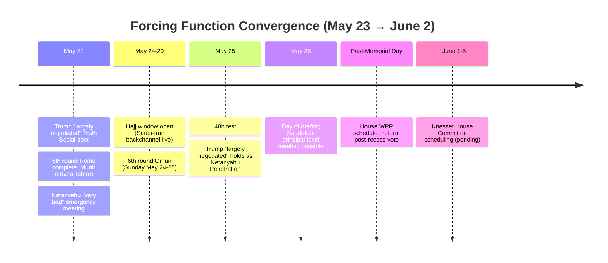
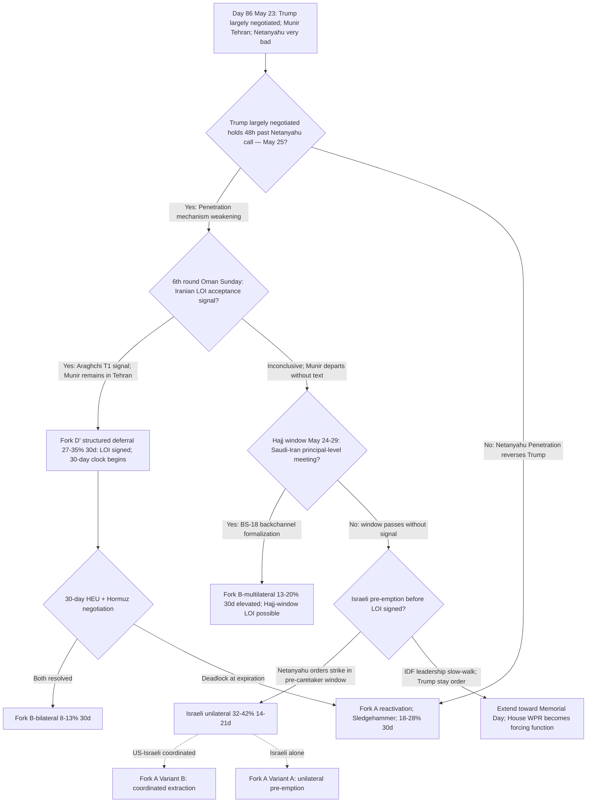

# Iran 2026 Operational SITREP — Daily Update
**Day 86 | Saturday, May 23, 2026**
*Annex/Update to Iran 2026 Operational SITREP and Strategic Synthesis (base report v4.1)*

## Executive Summary

Day 86 produced the highest single-cycle signal density in the sweep history: seven fired probes and three IMMEDIATE trigger digest entries. Trump upgraded from "solid 50/50" to "largely negotiated" on Truth Social after sequential calls with 8 regional leaders (Saudi Arabia, UAE, Qatar, Pakistan, Turkey, Egypt, Jordan, Bahrain) — the hardest A1-binding deal-direction commitment since the conflict began. Pakistani Army Chief Munir arrived in Tehran, the inverse of Day 85 non-travel, firing the breakthrough-condition signal on the Pakistan escalation ladder. Baghaei confirmed Iran is "in the finalization stage of this memorandum of understanding." Simultaneously, Netanyahu convened an emergency meeting with coalition leaders and security chiefs, calling the emerging deal "very bad" and noting it "greatly contradicts things Netanyahu said publicly, and things Trump said publicly just hours earlier" — Trump's announcement made no mention of HEU or enrichment. Iran's Fars disputed Trump's "Hormuz will be opened" framing immediately: "Hormuz will stay under Iran's management; Trump's post is inconsistent with reality per latest exchanged text." The race condition (LOI signing pace vs Israeli pre-emption timing in Netanyahu's pre-caretaker window) is now the binding operative question for the next 24-72 hours.

Supersedes `day-85` · Fork D' ↑ · Israeli pre-emption incentive ↑ · Gulf brake evolved to deal-shaper · T1/T3/T4/T8 advance

| Vector | Direction | Driver |
|---|---|---|
| Trump deal signal | "50/50" → "largely negotiated" | 8-leader call series; Truth Social public commitment |
| Munir in Tehran | NON-TRAVEL → TRAVEL | Pakistan escalation-ladder breakthrough-condition met |
| Baghaei "finalization stage" | NEW | Iranian MFA mid-tier LOI acceptance-adjacent statement |
| Netanyahu "very bad" emergency meeting | ↑ | Coalition + security chiefs briefing; deal "greatly contradicts" public statements |
| Gulf brake character | brake → deal-shaper | 8 regional leaders consulted before Trump announcement |
| Fork D' 30d | 22-30% → 27-35% | Trump committed; Munir arrived; 6th round Sunday; Baghaei finalization |
| Fork A 30d | 20-30% → 18-28% | Trump public deal-commitment raises reversal cost near-term |
| Israeli pre-emption (14-21d) | 30-40% → 32-42% | T8 at maximum loading; LOI advances without HEU resolution |
| IDF Litani River | NEW | Golani weeklong cross-Litani raid; 45 Hezbollah targets; Lebanon MoH 23 killed |
| Brent crude | ~$103 (-6% wk) | Deal-signal pricing; structural backwardation extreme ($29/bbl Jul26-Jul27) |
| 5th round Rome | COMPLETE | "Some progress, not conclusive"; 6th round Oman Sunday |
| Dual-collision: Iran Fars dispute | persists | Hormuz sovereignty disagreement public; HEU carries |

> Leading primitives: Fork D' 27-35% / 30d (↑ highest-ranked single primitive); Fork A 18-28% / 30d (↓ near-term on Trump public commitment). Highest-delta this cycle: Fork D' ↑ ~5pp midpoint. None-of-above floor: 5%.

---

## 1. Operational Update

**Diplomatic track: Trump "largely negotiated"; 5th round Rome complete; Munir in Tehran; 6th round Sunday.** The 5th round in Rome ended with Oman FM Busaidi (T1) confirming "some progress but no definitive outcome." Witkoff and Anton met Iran's Araghchi team for approximately two hours at the Oman ambassador's Rome residence. Enrichment remains the central sticking point: Witkoff insists zero enrichment publicly; US privately proposed a 20-year freeze (Axios April 13 carry); Iran offered a 5-year suspension counter while insisting the domestic enrichment right must be preserved. Baghaei (T2): nuclear issues are not part of the current MOU negotiations — Iran's position is that war must end first, with nuclear questions entering a separate post-MOU track. A 6th round is scheduled for Sunday in Oman. Before Trump's Truth Social post, he called 8 regional leaders and then Netanyahu; the upgrade from "50/50" to "largely negotiated" followed the regional-leader call series. Trump's announcement made no mention of HEU or enrichment, consistent with the LOI deferring nuclear questions. Iran's Fars news immediately disputed the framing.

**Trump posture: hardest A1-binding deal-direction signal in the conflict.** Trump's post also declared Hormuz "will be opened" and "final aspects and details are currently being discussed, and will be announced shortly." The 48h test runs through May 25: whether "largely negotiated" holds without Netanyahu Penetration reversal. Trump said his call with Netanyahu "went very well" — while Netanyahu simultaneously convened an emergency meeting. Rubio ambivalence from Day 85 may persist at the sub-principal level; Trump's public commitment supersedes it at the A1-binding level.

**Maritime / Military posture.**

| Asset / signal | Day 85 baseline | Day 86 read | Implication |
|---|---|---|---|
| CENTCOM CSG count | Lincoln + Bush (H) | Unchanged | Stable; no escalation signal |
| USS Eisenhower | OFRP training, East Coast | Unchanged | Restraint signal held |
| Operation Sledgehammer | Named; unexecuted | Unexecuted; authorization sustained | Stage-2 hysteresis indicator |
| Trump deal window | "Couple of days" past May 22 | "Largely negotiated; final aspects being discussed" | Window extended de facto; deal-direction upgraded |
| Hormuz sovereignty | Dual-collision carry | Iran Fars: "Hormuz stays under Iran management; Trump post inconsistent with reality" | Second structural collision persists despite Trump framing |
| Brent backwardation | $29.34/bbl Jul26-Jul27 | ~$29/bbl carry | Extreme near-term tightness unchanged |
| IDF Litani posture | Day 85 drone exchange | Weeklong cross-Litani raid disclosed by IDF | Offensive escalation on Lebanese front during Iran ceasefire |

**Iranian internal: Baghaei "finalization stage"; enrichment gap.** Baghaei's "finalization stage" statement covers war-end, halting US naval aggression, and blocked assets release. His clarification that nuclear issues are outside the current MOU track is the most explicit Iranian official framing of the deal scope: the MOU ends the war; HEU and enrichment enter a separate negotiation. Vahidi characterized by CNN (T2) as having evolved to "key power broker" and potentially "main point of contact for regional mediators" — characterization is inferred from meeting attendance rather than direct named statement on terms; ISW multi-cycle deterrent-floor baseline carries as the stronger reference. Mojtaba: 87+ days no visual appearance; HEU-stays directive carries.

**Israel: emergency meeting; "very bad" characterization; no strike.** Netanyahu convened an emergency meeting with coalition party leaders and security chiefs on May 23. Times of Israel (T2, multiple entries): the deal "greatly contradicts things that Netanyahu has said publicly, and, more than this, things that Trump said publicly just a few hours ago." The specific contradiction: Trump's "largely negotiated" announcement made no mention of HEU, enrichment, or nuclear weapons. Knesset dissolution at preliminary reading only; committee stage not yet scheduled; Netanyahu retains pre-caretaker operational authority.

**Lebanon / proxy fronts: IDF Litani River weeklong raid.** The IDF disclosed a weeklong raid by the Golani Brigade Reconnaissance Unit beyond the Litani River near Zawtar al-Sharqiyah (~10km from the border), during the Iran-channel ceasefire. The operation struck 100+ targets over the operation's duration; 45 Hezbollah targets in the 24-hour period ending May 23, including command centers, tunnel networks with weapons caches, missile launchers, and weapon depots. Lebanon's Health Ministry: 23 killed in the previous 24 hours. Hezbollah launched explosive drones at IDF troops in south Lebanon; no injuries; IDF shot them down. The cross-Litani raid is an IDF initiative using the Iran-channel ceasefire to degrade Hezbollah infrastructure — consistent with T2 (Mosaic-Octopus): Hezbollah has target-rich infrastructure that is being systematically degraded, not eliminated.

**Markets.**

| Asset | Pre-war (Feb 28) | Day 85 (May 22) | Day 86 (May 23) | Move |
|---|---|---|---|---|
| Brent crude | $73 | $103.92-$105.15 | ~$103 (intraday high $106) | -6% weekly on deal-signal pricing |
| Brent backwardation (Jul26-Jul27) | flat | $29.34/bbl | ~$29/bbl carry | Extreme; unchanged |
| Iranian rial parallel | ~960k/USD | 1,815,000 (15th gap) | 1,815,000 (16th gap) | held |
| US gas / gallon | $3.27 | ~$4.50 | ~$4.50 | held |

Brent intraday rose to $106 on Trump's announcement then corrected to $103 as Iran's Fars disputed the characterization. Market is pricing meaningful deal-progress probability; extreme backwardation persists as the structural-tightness read. IEA red-zone July warning carries.

**US domestic: no WPR vote Day 86; White House WPR inapplicability claim.** No new War Powers vote. House scheduled to return post-Memorial Day recess. White House argued WPR requirements "no longer apply" due to the ceasefire — a Stage-2 hysteresis argument reinforcing the "hostilities terminated" certification. If an LOI or MOU is signed before the House returns, the WPR debate may be mooted under T9 lock-in architecture before any vote occurs.

**International: Gulf brake scope expanded; Hajj window opens May 24.** Eight regional leaders consulted before Trump's announcement; Turkey, Egypt, Jordan, and Bahrain newly visible in the consultation architecture beyond the prior Gulf troika + Pakistan cluster. No Saudi-Iran principal-level Hajj meeting confirmed Day 86; window opens May 24. Russia: M1 baseline holds; no BS-9 fires; Putin-Xi Power of Siberia 2 pipeline discussions carry (T10 absorption pathway active, no threshold crossing).

---

---

## 2. Framework Validation

- **A9 (constraints compress choice sets; principals select):** Under joint constraints (IEA red-zone July; 8-leader reputational commitment; strangulation clock; IDF Litani operations), Trump selected "largely negotiated" — the highest-ranked option preserving deal-direction without committing to nuclear terms. The framework predicted the ranking; Trump selected.
- **A10 (Slantchev feigning-weakness):** IDF weeklong cross-Litani raid confirms Hezbollah retains target-rich infrastructure during the Iran-channel ceasefire. T2 (Mosaic-Octopus) validated: the network is being degraded across operations, not eliminated by the ceasefire's existence.
- **A21 (Gulf state principal-level pivot capacity):** 8-leader consultation upstream of Trump's "largely negotiated" announcement validates A21 at its strongest operational cycle. The unaligned-middle mechanism has evolved from preventing US strikes (Days 81-85) to shaping the deal announcement itself — a qualitative advance.
- **A15 (Pakistan escalation ladder):** Day 85 Munir non-travel → Day 86 Munir travel confirms the ladder as a real-time breakthrough indicator. The Naqvi/Munir tier distinction is operationally precise.

---

## 3. Framework Revisions Required

**TRIGGER FIRED (PROBE-12', H, next_cycle): Fork D' elevated; Meta-Negotiation Regression interrupted.**
Prior (Day 85): Fork D' at 22-30% under dual-collision strain. Revised: Trump "largely negotiated" (T1) + Baghaei "finalization stage" (T2) + Munir in Tehran (T2 ISPR) + 6th round Sunday = Fork D' 27-35% (30d). The dual-collision (HEU + Hormuz) persists but both sides are actively treating these as deferrable: Baghaei explicitly stated nuclear issues are outside the current MOU scope; Trump's announcement omitted any nuclear reference. The LOI's text is being drafted via Pakistan-Oman channel.
*Trend cross-check:* Advances T3 (Fearon two-level pattern at maximum visibility: apex public-maximalism carries while mid-tier advances MOU). Advances T1 (8-leader consultation). No contradiction of VALIDATED trends.

**TRIGGER FIRED (PROBE-13/15, M, IMMEDIATE): Trump "largely negotiated" 48h test activated.**
Prior (v4.1; Day 85): Trump oscillating deal-leaning ("couple of days" framing). Revised: "largely negotiated" Truth Social post is the hardest A1-binding deal-direction signal in the conflict. Public commitment raises reversal cost materially relative to prior oscillation. Test: whether this holds past May 25 without Netanyahu Penetration reversal. Enrichment gap clarified this cycle: US publicly (Witkoff) zero enrichment; US privately (Axios April 13) 20-year freeze; Iran: 5-year suspension counter + domestic enrichment right must be permanently preserved. Both sides have moved off stated positions into a negotiating range on duration, but Iran insists on the right itself. Trump's announcement deferred both questions entirely.
*Trend cross-check:* Advances T4 (deal-faction vs maximalist at peak principal-level divergence). Advances T3 (two-level pattern: US apex-equivalent commits to deferral while mid-tier conducts the actual negotiation). No contradiction of VALIDATED trends.

**TRIGGER FIRED (PROBE-9/15, M, IMMEDIATE): Netanyahu "very bad" emergency meeting; T8 at maximum loading.**
Prior (v4.1; Day 85): Israeli pre-emption incentive at 30-40%, Penetration mechanism active-but-resisted. Revised: Netanyahu convened emergency meeting characterizing the LOI as "very bad" and "greatly contradicting" public statements by both Netanyahu and Trump. The specific mechanism: Trump announced a deal that defers HEU and enrichment; Netanyahu reads this as a war ending without the nuclear objective being achieved — a closing window under T8 Powell. Israeli pre-emption incentive elevated to 32-42% (14-21d, pre-caretaker). Trump's "went very well" characterization of the Netanyahu call simultaneous with Netanyahu convening emergency meeting confirms: Penetration mechanism active-but-resisted, not dormant.
*Trend cross-check:* Single-cycle T8 advance. Netanyahu's alarm is the predicted T8 response to credible Fork B/D' progress. Consistent with all VALIDATED trends; no contradiction.

**TRIGGER FIRED (PROBE-20, H, next_cycle): Gulf brake evolved to deal-shaping; T1 advance.**
Prior (v4.1; §5.25): Gulf brake prevents US military action; scope is Gulf troika + Pakistan. Revised: 8-leader consultation (Saudi Arabia, UAE, Qatar, Pakistan, Turkey, Egypt, Jordan, Bahrain) is operationally upstream of Trump's "largely negotiated" announcement — the unaligned-middle is now actively shaping the deal announcement, not only preventing strikes. The Trump upgrade from "50/50" to "largely negotiated" followed the regional-leader call series. Turkey, Egypt, Jordan, and Bahrain newly visible in the consultation architecture. BS-18 visibility: 40-50% → 45-55%. §5.25 updated below (Section 4).
*Trend cross-check:* Strongest single-cycle T1 advance in sweep history. Advances T4 (deal-faction is now unaligned-middle-informed at 8-actor scope). No contradiction of VALIDATED trends.

---

## 4. Framework Additions

**§5.25 Gulf State Troika Brake: qualitative addition of deal-shaping function.**

The v4.1 §5.25 codified the brake as a mechanism preventing US military action. Day 86 adds a second functional property: positive deal-shaping. The Trump upgrade from "50/50" to "largely negotiated" followed, not preceded, consultation with 8 regional leaders. The unaligned-middle is now operationally upstream of a major US executive foreign-policy announcement — the brake mechanism has evolved from preventing-strike to shaping-deal-terms within the same cycle sequence.

Updated properties (additions to existing §5.25):
- Scope expanded: Gulf troika (MBS/MBZ/Tamim) + Pakistan + Turkey + Egypt + Jordan + Bahrain visible in Day 86 consultation
- Function expanded: preventing US military action (Days 81-85) + shaping deal announcement direction (Day 86)
- Decay trigger: intra-consultation divergence; any actor publicly breaking from deal-shaping posture; second Barakah-class attack testing MBZ Barakah-exposure pathway
- BS-18 visibility revised: 40-50% → 45-55%
- T1 advance: tripolar unaligned-middle is operating as a positive shaper of US executive decision, not only a brake; this is the strongest T1 validation in the sweep history

---

## 5. Revised Probability Matrix

### 5a. 30-Day Matrix (cycle-Bayesian)

| Outcome | 30 days | vs. Day 85 | Driver |
|---|---|---|---|
| Fork D': Structured deferral via LOI | **27-35%** | ↑ from 22-30% | Trump committed; Munir Tehran; Baghaei finalization; 6th round Sunday |
| Fork A: Full kinetic resumption | **18-28%** | ↓ from 20-30% | Trump public deal-commitment raises near-term reversal cost; Sledgehammer authorized but suspension extended |
| Fork B-bilateral | **8-13%** | ↓ from 8-14% | Enrichment gap: US 20yr freeze (private) vs Iran 5yr suspension + domestic right; dual-collision persists |
| Fork B-multilateral (Gulf pathway) | **13-20%** | ↑ from 12-18% | 8-leader consultation; Turkey/Egypt/Jordan/Bahrain added; brake evolved to deal-shaper |
| Combined Fork B | **21-30%** | ↑ from 20-28% | Multilateral ↑ offsets bilateral ↓ |
| Fork C: Miscalculation cascade | **15-22%** | stable | IDF Litani cross-ceasefire raid adds northern-front accident pathway; net stable |
| Israeli unilateral strike (14-21d, pre-caretaker) | **32-42%** | ↑ from 30-40% | T8 at maximum; deal advances without HEU resolution; pre-caretaker window holds |
| None-of-above | **5%** floor | held | Mandatory non-zero floor |

> **Kinetic Escalation Composite ([DERIVED]): ~46-63% (30d), ~72-87% (12m).** Construction: Fork A 18-28% + Fork C 15-22% + conflict-leading tail components (Israeli first nuclear use <2% 30d; inadvertent WMD 3-8% 90d). Israeli unilateral variants A/B and Vahidi decapitation variant absorbed into Fork A composite per primitive-priority rule; not added independently. Fork D' and Fork B excluded by design. Day 85 composite (~47-63%) marginally adjusted: Fork A ↓ 2pp midpoint offsets Israeli unilateral ↑ 2pp midpoint within composite.

### 5b. 6/12-Month Matrix (structural-prior; no update this cycle)

No trend-state transition, L1-L5 constraint shift, or major-version increment this cycle. Matrix reprinted from v4.1 (Day 84 baseline, May 21, 2026).

| Outcome | 6 months | 12 months | Last updated | Driver |
|---|---|---|---|---|
| Fork A composite | 38-48% | 43-53% | v4.1 (Day 84) | Time arithmetic; reconstitution-speed Powell amplifier |
| Fork B-bilateral | 12-18% | 12-18% | v4.1 (Day 84) | Apex PA-gap constraint |
| Fork B-multilateral | 12-20% | 14-22% | v4.1 (Day 84) | Gulf pathway institutionalizing |
| Fork D' structured deferral | 18-24% | 12-18% | v4.1 (Day 84) | LOI expiration compresses at horizon |
| Fork C miscalculation cascade | 16-22% | 16-22% | v4.1 (Day 84) | Structural accident pathway |
| Israeli first nuclear use | <2% | 12-20% | v4.1 (Day 84) | Conditional on HEU sub-state |
| Tripolar reordering substantially advanced | partial | 80-90% | v4.1 (Day 84) | T1/T10/T11 trajectory |

---

## 6. Probe Status Table

| PROBE | Status | Conf | Trigger | Variable Moved |
|---|---|---|---|---|
| 2 IRGC Factional | partial | M | no | Vahidi T2 "power broker" characterization; no direct named statement on MOU terms; ISW deterrent-floor baseline carries |
| 6 Chinese Support | null | M | no | Putin-Xi Power of Siberia 2; no Iran-specific Chinese signals Day 86 |
| 7 CENTCOM Posture | partial | M | no | Fork A: 20-30% → 18-28% on Trump commitment; Sledgehammer unexecuted |
| 8 Oil Markets | **fired** | M | yes | Brent $103 (-6% wk); Trump "Hormuz will be opened" (disputed by Fars); IEA red zone July |
| 9 Israeli Internal | **fired** | M | yes | Netanyahu "very bad" emergency meeting; "greatly contradicts" public statements; Powell at maximum |
| 10 War Powers | partial | M | no | No new vote; WH argues WPR inapplicable due to ceasefire; T9 holds; Day 85 contradict_single carries |
| 12' MOU Framework | **fired** | H | yes | Fork D' 22-30% → 27-35%; 5th round complete; Trump "largely negotiated"; Munir Tehran; Baghaei finalization; 6th round Sunday |
| 13 PA-Gap | **fired** | M | yes | Trump A1-binding hardened; US: 20yr freeze private / zero public; Iran: 5yr suspension + domestic enrichment right |
| 14 Iranian Residual | null | M | no | Day 84 CNN T2 baseline carries; no new capability signals; IDF Litani confirms T2 in Section 1 |
| 15 Dispositional | **fired** | M | yes | Trump deal-direction hardened; Netanyahu maximum alarm; US-Israeli divergence at structural peak |
| 16 First-Mover | **fired** | H | yes | Race condition: LOI pace vs Israeli pre-emption; Munir travel = breakthrough-condition; Trump A1 softly crossed |
| 17 Russian Siloviki | partial | M | no | Dyumin de facto VP-equivalent consolidating; M1 baseline holds; no BS-9 fires |
| 20 Gulf Troika | **fired** | H | yes | 8-leader consultation shaped Trump announcement; brake evolved to deal-shaper; T1 advance |
| 21 Paine Death-Ground | partial | M | no | P-DG2 multi-cycle partial accumulating (Days 84-85-86); P-AIM holding limited classification |

Skipped per cadence: PROBE-1 (bi-weekly; ran Day 85), PROBE-3 (monthly; 16th gap), PROBE-11 (bi-weekly; ran Day 85), PROBE-18 (monthly), PROBE-19 (quarterly).

---

## 7. Conclusion and Forking Analysis

### Central Thesis Check

The v4.1 central thesis holds with the highest predictive resolution in the framework's operational window. Five constraint layers conditioned each principal's decision set on Day 86: L1 military physics produced the two-CSG stable posture and Sledgehammer suspended while the IDF operated cross-Litani against Hezbollah infrastructure; L2 asymmetric-conflict logic produced Iranian deterrent-floor maintenance alongside mid-tier MOU advancement, with Hezbollah launching drones at IDF troops south of the Litani during the same cycle; L3 time arithmetic produced Trump's upgrade to "largely negotiated" under the converging IEA red-zone July timeline and strangulation clock; L4 faction misalignment produced Netanyahu's "very bad" emergency meeting simultaneous with deal-faction (Trump + Vance) publicly committed to the deferral architecture; L5 PA-gap produced Baghaei "finalization stage" at mid-tier while Mojtaba HEU-stays and Vahidi deterrent-floor hold at apex. The framework predicted the ranking of dominant strategies under joint constraints; each named actor selected within those constraints.

Trend-state lines this cycle: **T1 advances** (8-leader consultation upstream of Trump deal announcement; Gulf brake evolved from preventing-strike to deal-shaping; strongest single-cycle T1 confirmation in sweep history). **T2 holds** (IDF Litani cross-Litani weeklong raid confirms Hezbollah retains target-rich infrastructure during Iran-channel ceasefire; network degraded, not eliminated). **T3 advances** (Trump "largely negotiated" + Munir in Tehran + Baghaei "finalization stage" = Fearon two-level pattern at maximum predicted visibility on both kinetic-posture and deal-terms axes simultaneously). **T4 advances** (deal-faction vs maximalist at peak principal-level divergence: Trump "largely negotiated" while Netanyahu convenes emergency meeting). **T5 holds PENDING** (Hajj window opens May 24; no Tier-1 fires Day 86). **T6 holds**. **T7 holds**. **T8 advances** (Netanyahu "very bad" emergency meeting; Powell window-closing mechanism at maximum loading; single-cycle advance). **T9 holds VALIDATED** (no WPR vote; WH argues WPR inapplicable due to ceasefire — T9 hysteresis argument extended; Day 85 contradict_single carries). **T10 holds PENDING**. **T11 holds PENDING**.

### Forking Tree (72-Hour Decision Path)

### Operative Judgment

The Day 86 race condition is the binding operative constraint. Two signals moved simultaneously in opposite directions: Trump's "largely negotiated" is the strongest deal-direction signal in the conflict; Netanyahu's "very bad" emergency meeting is the strongest Israeli pre-emption alarm in the conflict. These are not contradictory — they are the predicted T8 Powell mechanism at maximum loading. Under T8, Israeli pre-emption incentive rises precisely because the deal is advancing without the nuclear objective being achieved, not because the deal is failing. Netanyahu reads the LOI deferral as "30 more days of Iranian reconstitution plus no HEU constraint plus no enrichment halt" — a worsening rather than a holding of Israel's strategic position. The framework ranks this as the Israeli pre-emption incentive's highest point in the conflict window; selection by Netanyahu remains contingent on whether IDF leadership operationalizes or slow-walks the option.

The 48-hour test (May 25) is the first empirical check on Trump's public commitment durability. The Day 86 Trump-Netanyahu call produced "went very well" from Trump while Netanyahu simultaneously convened an emergency meeting — the Penetration mechanism is active, not dormant. If "largely negotiated" survives to May 25 without revision, the Penetration mechanism is documented as weakening: Netanyahu's Day 83-84 explicit pushback produced a tense call but not reversal; Day 86 emergency meeting produced "went very well" and maintained posture. That multi-cycle pattern would be the strongest evidence yet that the Penetration mechanism has lost its prior reversal function under Gulf-brake + deal-faction joint constraint.

The IDF Litani River weeklong raid, disclosed Day 86, requires integration into the T8 reading. The raid is IDF using the Iran-channel ceasefire to systematically degrade Hezbollah infrastructure across the Litani — consistent with Israel managing its northern-front threat reduction in parallel with nuclear negotiations it is not party to. The raid reinforces the Powell-amplifier reading: each day of deferral allows Iranian reconstitution to proceed while IDF continues independent northern-front operations. Netanyahu's operational picture as he considers pre-emption timing includes this cross-front complexity: striking now while the cross-Litani operation is active produces multi-front coordination demands; waiting compounds Iranian reconstitution.

The 6th round in Oman (May 24-25) and the Hajj window (May 24-29) are the two convergent forcing functions in the next 24-48 hours. If the 6th round produces an MOU text both sides can provisionally accept, and the Hajj backchannel elevates to Saudi-Iran principal-level contact, the LOI signing timeline compresses into next week. If neither produces signal, Trump's public "largely negotiated" encounters its first empirical test without Iranian-side confirmation, and the race-condition timeline extends into Memorial Day week — where the House WPR return becomes the next structural forcing function regardless of deal state.

### Signals That Force Immediate Revision

- Iranian official (Araghchi T1) named public acceptance or rejection of LOI/MOU concept
- Trump statement revising "largely negotiated" or abandoning deal-direction after Netanyahu contact on May 25 (Penetration mechanism documented as operative; Fork A re-elevates)
- 6th round Oman (May 24-25) produces MOU text signed or formally rejected by either side
- Saudi-Iran principal-level meeting during Hajj window (May 24-29); BS-18 backchannel formalization trigger fired
- Israeli unilateral strike on Iranian nuclear or military site; Fork D' and Fork B collapse
- IDF air refueling tempo escalation or F-35/F-15 forward positioning signals indicating Israeli pre-emption preparation in the next 24-48h
- Vahidi or Mojtaba direct named public statement on LOI concept or Hormuz toll (distinguishable from Day 83 kinetic-deterrence framing)
- Named-country product-scarcity crisis (South Africa, India, Thailand, Taiwan); IEA red-zone July threshold crossed
- Knesset House Committee scheduling second dissolution reading; Netanyahu operational authority transition timeline set
- House WPR passed after Memorial Day recess; T9 CONTESTED test event; Senate WPR on-merits result

---

*Compiled May 23, 2026 | Day 86 | Subject to revision as data updates*
*Next SITREP: Day 87 (May 24-25); 6th round Oman outcome; Hajj window opening (Day of Arafah May 26); Munir readout on departure; any Iranian LOI acceptance signal; Trump "largely negotiated" 48h durability test (May 25); House WPR return timeline.*
*Framework revision v4.2 warranted if: (a) LOI formally accepted by both US and Iran; (b) Vahidi or Mojtaba named LOI or Hormuz-toll statement; (c) confirmed Israeli unilateral strike; (d) House WPR passes post-recess; (e) Saudi-Iran principal-level Hajj meeting; (f) IDF pre-emption signal escalation from "high alert" to operational-deployment phase.*
*Companion: day-85.md annex; sweep-2026-05-23.json; synthesis-v4-1.md.*
