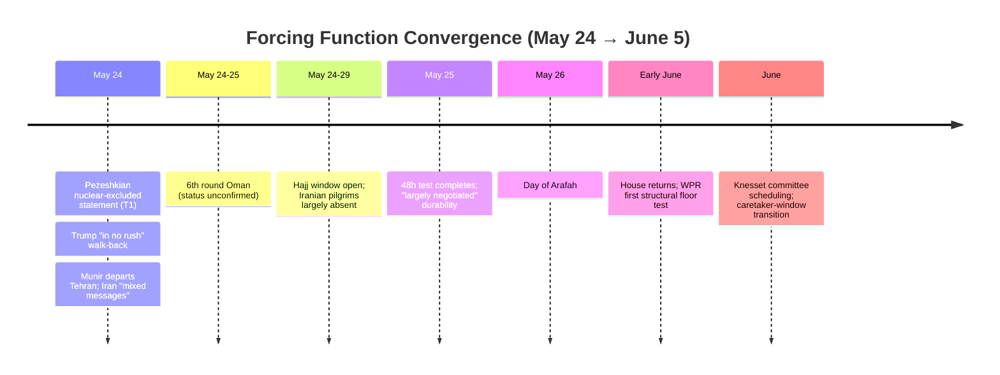
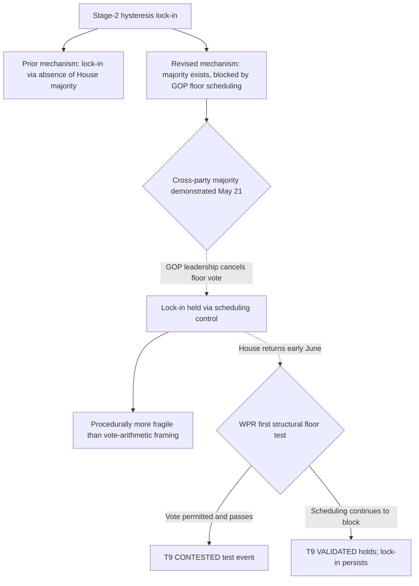
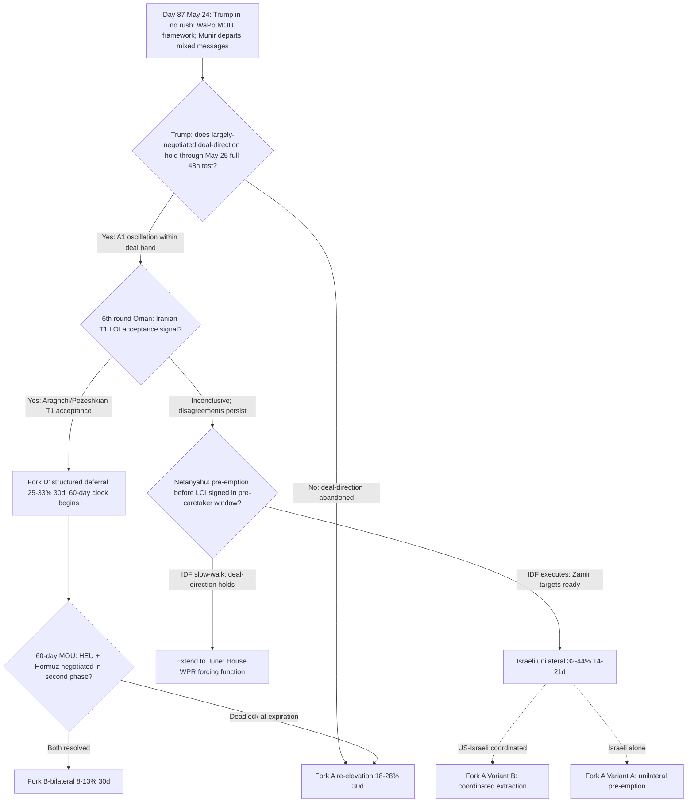

# Iran 2026 Operational SITREP — Daily Update
**Day 87 | Sunday, May 24, 2026**
*Annex/Update to Iran 2026 Operational SITREP and Strategic Synthesis (base report v4.1)*

## Executive Summary

Day 87 inverts Day 86's signal direction without breaking the race condition. Trump walked back "largely negotiated" to "in no rush" within roughly 24 hours, a partial failure of the 48-hour durability test set Day 86 and behavior consistent with the predicted A1 apex-oscillation pattern. WaPo published the most specific MOU architecture to date: a 60-day ceasefire, gradual Hormuz reopening, end to the US naval blockade, restored Iranian oil sales, and nuclear talks deferred to a second phase. Pezeshkian (IRIB, T1) corroborated the sequencing, stating Iran is ready to assure the world it does not seek nuclear weapons and confirming nuclear is excluded from the current MOU scope. Munir departed Tehran leaving "mixed messages"; Iranian officials said "deep and significant disagreements remain." Against this deal-cooling, the Israeli pre-emption threshold advanced: a three-signal cluster over ten days (F-35I fuel-tank contract, Zamir "targets ready," postponed scheduled strike) plus Netanyahu maximalist anchoring and Israeli security sources "almost completely cut off from updates." The binding operative question remains LOI signing pace versus Israeli pre-emption timing in Netanyahu's pre-caretaker window.

Supersedes `day-86` · Fork D' ↓ · Israeli pre-emption ↑ · MOU framework NEW · T8/T9 advance

| Vector | Direction | Driver |
|---|---|---|
| Trump deal signal | "largely negotiated" → "in no rush" | A1 oscillation; 48h test partial fail at 24h |
| MOU framework (WaPo T2) | NEW | 60d ceasefire; gradual Hormuz; blockade ends; oil restored; nuclear deferred |
| Pezeshkian nuclear sequencing | NEW | Nuclear excluded from MOU; war-end first, nuclear second (T1) |
| Fork D' 30d | 27-35% → 25-33% | Trump walk-back; Munir "mixed messages"; disagreements remain |
| Israeli pre-emption (14-21d) | 32-42% → 32-44% | Three-signal cluster; Netanyahu maximalist anchoring |
| Israeli pre-emption cluster | NEW | F-35I tanks (May 14) + Zamir targets-ready (May 6) + postponed strike (May 18) |
| WPR lock-in (T9) | ↑ risk | House cross-party majority demonstrated; GOP cancelled floor vote |
| Hajj backchannel | DISRUPTED | Iranian pilgrims largely excluded; visas suspended, flights cancelled |
| IEA strangulation clock | ↑ | 246mb consecutive draw; 3.9mb/d shortfall path absent June resumption |
| Saudi-UAE divergence | NEW (T2/T3) | UAE demands harder security guarantees; Riyadh accommodationist |

> Leading primitives: Fork A 18-28% / 30d, Fork D' 25-33% / 30d. Highest-delta this cycle: Fork D' ↓ ~2pp midpoint. None-of-above floor: 5%.

---

## 1. Operational Update

**Diplomatic track: WaPo MOU framework details; Munir departs with mixed messages; 6th round status unconfirmed.** WaPo (T2, May 24) reported the most specific MOU architecture to date: 60-day ceasefire, gradual Hormuz reopening, end to the US naval blockade, restored Iranian oil sales, and nuclear talks deferred to a second phase. Apply the -25% multi-outlet anonymous discount; the originating cluster is likely one US official familiar with the framework. Munir departed Tehran on May 23; Iran issued "mixed messages" per Al Jazeera (T2), with officials stating the visit "did not represent a turning point" and that "deep and significant disagreements remain." A 6th round in Oman was scheduled for this window (May 24-25 per Day 86) but is not confirmed as of May 24. The Washington Times (T4) "24-hour announcement" claim is treated as near-zero actionable.

**Trump posture: "in no rush" walk-back; 48h test partial fail at 24h.** Trump softened from "largely negotiated" (T1, May 23) to "in no rush" (T2 ToI/NBC, May 24) within roughly 24 hours. Per the A1 mechanism this is within the predicted oscillation band, not a deal-direction abandonment; the softening likely reflects post-Munir "mixed messages" and/or the Netanyahu call on May 23 evening. The full 48-hour durability test completes May 25. Discount Trump statements to near-zero absent tape action; the deal-direction is held, the urgency is lowered.

**Pezeshkian nuclear sequencing (T1).** Pezeshkian (IRIB, May 24) stated Iran is "ready to assure the world it is not seeking nuclear weapons" and confirmed nuclear is excluded from the current MOU scope, with the war ending first and nuclear addressed in a final-agreement phase. This is the cycle's most important Iranian T1 signal: it corroborates the WaPo sequencing and confirms war-end-first, nuclear-second as the operative Iranian deal architecture. It also directly contradicts a P-AIM unlimited reading.

**Maritime / Military posture.**

| Asset / signal | Day 86 baseline | Day 87 read | Implication |
|---|---|---|---|
| CENTCOM CSG count | Lincoln + Bush | Unchanged | Stable; no escalation signal |
| USS Eisenhower | OFRP, East Coast | No deployment order | Restraint signal held |
| Operation Sledgehammer | Named; unexecuted | Unexecuted; authorization sustained | Stage-2 hysteresis indicator |
| Hormuz commercial traffic | ~5% pre-war | ~5% pre-war; Maersk/Hapag-Lloyd suspended | Blockade enforcement stable; Fork A legal architecture in force |
| F-35I long-range capability | n/a | $34M Elbit fuel-tank contract (May 14); 12-18mo program | Strategic-intention signal: autonomous Tehran-range strike |
| Israeli pre-emption posture | "high alert" carry | Three-signal cluster; no forward deployment | Threshold advancing; not operational this cycle |
| IDF Litani posture | Weeklong cross-Litani raid | Operations continuing | Hezbollah degradation ongoing during Iran ceasefire |

**Iranian internal: Pezeshkian limited-aims framing; Vahidi power-broker characterization; rial held.** Pezeshkian's demand-set remains bounded at war-end, sanctions relief, and Hormuz management. Iran's "Hormuz under our control" insistence is consistent with limited-aims sovereign-management assertion, not order-revisionist demand; the WaPo "gradual reopening" detail suggests Iran is willing to negotiate transit terms. Al Arabiya/Euronews (T2, May 21) characterize Vahidi as a "key power broker" and back-channel interlocutor with Mojtaba access; this is T2 role inference, not a Vahidi direct named statement on MOU terms. ISW multi-cycle deterrent-floor baseline carries as the stronger reference. Rial parallel rate held at 1,815,000/USD.

**Israel: maximalist anchoring; three-signal pre-emption cluster; cut off from updates.** Netanyahu, post-emergency cabinet, claimed Trump gave two private assurances: that a final agreement requires full dismantlement of enrichment sites and removal of all HEU, and that Israel retains freedom of action in all arenas. No White House corroboration of the "full dismantlement" language; apply the -50% Trump-through-Netanyahu discount, with Netanyahu the likely framing agent. Israel Hayom: "Israel alarmed as Iran deal takes shape." Israeli security sources are "almost completely cut off from updates." The three-signal pre-emption cluster over ten days: F-35I fuel-tank contract ($34M Elbit, May 14, a 12-18 month development program explicitly targeting Tehran range without aerial refueling); Zamir "targets ready for a powerful and broad operation" (T1 JNS, May 6); postponed scheduled attack (T1, May 18). Knesset committee stage not yet scheduled; Netanyahu retains pre-caretaker operational authority.

**Lebanon / proxy fronts: degradation continuing across channels.** IDF cross-Litani operations continue to degrade Hezbollah infrastructure during the Iran-channel ceasefire. Houthis retain long-range strike capability but face constrained strategic calculus; significant US-target action risks organizational collapse (Stimson T3). Hezbollah is operationally marginal, with the Lebanese government prohibiting military activity (FP/Belfer T3). Proxy degradation is accumulating across channels (P-OVEX), consistent with T2: network degraded, not collapsed.

**Markets.**

| Asset | Pre-war (Feb 28) | Day 86 (May 23) | Day 87 (May 24) | Move |
|---|---|---|---|---|
| Brent crude | $73 | ~$103 | ~$103-104 (May 22 last print) | held; IEA OMR confirms structural tightness |
| Brent backwardation (Jul26-Jul27) | flat | ~$29/bbl | ~$29/bbl | extreme; unchanged |
| Iranian rial parallel | ~960k/USD | 1,815,000 | 1,815,000 | held |
| US gas / gallon | $3.27 | ~$4.50 | ~$4.50 | held |

The IEA May 2026 OMR (T1) operationalizes the prior red-zone warning with concrete data: global supply down 1.8 mb/d in April to 95.1 mb/d; Gulf output 14.4 mb/d below pre-war; consecutive inventory draws of 129 mb (March) and 117 mb (April), 246 mb total. The OMR assumes gradual Hormuz resumption from June; absent that resumption, the full-year supply hit reaches ~3.9 mb/d below baseline. The June assumption is deal-contingent and not yet confirmed.

**US domestic: House GOP cancelled WPR floor vote after majority apparent.** GOP leadership cancelled a scheduled floor vote on H.Con.Res.38 on May 21 before recess, after Democrats and a cross-party bloc appeared to have the votes to pass it; Rep. Meeks (D-NY): "We had the votes to pass it today" (CNN/WashExaminer T2, NPR T2). The House returns in early June, where the WPR is likely the first major floor action. The Senate 50-47 procedural advance (May 19) holds; Fetterman is a confirmed structural holdout (Semafor T2); the on-merits Senate vote is still expected to fail at full attendance. The White House continues to argue WPR requirements no longer apply due to the ceasefire.

**International: Saudi-UAE divergence; Iranian Hajj exclusion; MOFCOM-OFAC standoff.** Saudi-UAE divergence is advancing in T2/T3 sourcing: Riyadh aligned with Ankara/Islamabad/Cairo on accepting a diplomatic settlement, Abu Dhabi demanding harder security guarantees before any deal and reportedly arguing Saudi is "willing to settle for less." No T1 intra-troika public split. Iranian nationals are largely excluded from this year's Hajj (visas suspended, flights cancelled); the ~30,000-pilgrims-on-Saudi-soil premise underpinning the Saudi-Iran Hajj-backchannel pending candidate did not materialize, though the official-to-official channel (Saudi interior minister met an Iranian Hajj official in Jeddah May 20) remains. China MOFCOM's May 2 counter-order directing firms to disregard OFAC designations stands against the most recent OFAC action (Hengli, May 11); no new OFAC action May 24, no PLA Taiwan Strait spike (Xi-restraint price holding). Russia M1 baseline holds; no BS-9 sub-probe fires.

---

---

## 2. Framework Validation

- **A9 (constraints compress choice sets; principals select):** Trump's "in no rush" walk-back is predicted A1 oscillation; under joint constraints (post-Munir mixed messages, the Netanyahu call, unresolved enrichment gap), his dominant strategy oscillated within the deal-direction band. The framework ranked the option set; Trump selected.
- **A10 (Mosaic-Octopus multi-channel deterrent):** Houthis constrained but retaining long-range capability; Hezbollah operationally marginal; IDF cross-Litani degradation continuing. Network degraded across channels, not collapsed (T2 holds).
- **A21 (Gulf principal-level pivot capacity):** The 8-leader consultation architecture holds; Saudi-UAE divergence (UAE harder guarantees vs Riyadh accommodation) is pivot-capacity complexity consistent with T1, not a brake fracture.
- **Powell shifting-power (T8):** Netanyahu maximum-alarm simultaneous with the WaPo framework emerging is the predicted T8 dynamic: the more credible the deal, the higher the Israeli pre-emption incentive. The three-signal cluster confirms the mechanism at maximum loading.

---

## 3. Framework Revisions Required

No IMMEDIATE-urgency triggers fired this cycle; five triggers fired at next_cycle or next_audit urgency. The single most consequential delta is Fork D' cooling from its Day 86 peak.

**TRIGGER FIRED (PROBE-12', H, next_cycle): Fork D' pullback; WaPo framework absorbed.**
Prior (Day 86): Fork D' 27-35% on Trump "largely negotiated" + Baghaei finalization + Munir Tehran. Revised: Fork D' 25-33% (30d) on Trump walk-back to "in no rush" within 24h, Munir departure with "deep and significant disagreements remain," and unconfirmed 6th round. Absorb the WaPo framework (60-day ceasefire + gradual Hormuz + blockade ends + oil restored + nuclear deferred) as the working MOU architecture under the -25% anonymous-source discount; Pezeshkian T1 corroborates the sequencing.
*Trend cross-check:* Holds T3 (A1 oscillation is the predicted apex behavior; Pezeshkian limited-aims mid-tier framing plus public Hormuz-sovereignty floor is the two-level pattern). No contradiction of VALIDATED trends.

**TRIGGER FIRED (PROBE-10, M, next_cycle): T9 hysteresis mechanism refined.**
Prior (Day 84-86): lock-in framed as the House lacking a WPR majority (213-214 narrow fail). Revised: the May 21 cancelled vote implies a larger majority was imminent; lock-in is now primarily a function of GOP leadership floor scheduling, not vote arithmetic. The mechanism is more procedurally fragile than the vote-count framing suggested; a demonstrated majority is being blocked, not absent. When the House returns early June, the WPR is the first structural test.
*Trend cross-check:* T9 VALIDATED advances; mechanism characterization updated, state unchanged. The Day 85 contradict_single does not recur; this strengthens the path-dependence reading while clarifying its procedural dependency.

**TRIGGER FIRED (PROBE-9/15, M, next_cycle): Israeli pre-emption upper bound widens; T8 advance.**
Prior (Day 86): Israeli unilateral pre-emption 32-42% (14-21d, pre-caretaker). Revised: 32-44% on three-signal cluster accumulation plus Netanyahu maximalist anchoring and exclusion from deal updates. The F-35I fuel-tank program is a 12-18 month development, not operational this cycle, but signals strategic intention toward long-range autonomous Iran strike. Apply -50% to the Netanyahu "full dismantlement" assurance relay; Netanyahu is the likely framing agent, not Trump.
*Trend cross-check:* T8 advances on a three-signal cluster sustained over ten days. **Principal-validation flag:** 4th-plus consecutive cycle of Netanyahu asserting Trump private maximalist endorsement without White House corroboration; flag the Netanyahu-Penetration-mechanism characterization for next /premortem wrong-principal review.

**TRIGGER FIRED (PROBE-8, M, next_cycle): IEA OMR operationalizes the strangulation clock.**
Prior: IEA red-zone July warning (synthesis language). Revised: IEA OMR (T1) confirms a 246 mb consecutive March-April inventory draw and a 3.9 mb/d baseline shortfall path absent June Hormuz resumption; commercial traffic at ~5% pre-war. The June resumption assumption is deal-contingent; if no LOI is signed before June, the IEA baseline breaks into the shortfall path, firing the BS-15 Iran-side strangulation-transmission sub-threshold within 4-6 weeks per Goldman timeline. BS-7 framework risk HIGH maintained.
*Trend cross-check:* No trend contradiction; advances the L3 time-arithmetic strangulation reading.

**FLAG (NEXT AUDIT) (PROBE-20, M, next_audit): Saudi-UAE divergence; Hajj backchannel premise disrupted.**
Saudi-UAE divergence is T2/T3 single-cycle; per the framework rule it is flagged, not promoted to BS revision (no contradiction of VALIDATED T1, which predicts pivot-capacity complexity). Two audit items: (1) BS-18 MBZ-pathway fragility advancing via the UAE hard-security-guarantee demand, pending next-audit confirmation; (2) the pending-trend candidate "Cross-pole Saudi-Iran diplomatic geometry via Hajj backchannel" requires mechanism revision: Iranian pilgrims are largely absent, so the pilgrim-facilitated conduit is not operative. Revise to "official-level Saudi-Iran contact during Hajj period," with promotion criteria updated to require a named Saudi-Iranian meeting at FM level or above during the May 24-29 window.

---

## 4. Framework Additions

No new structural mechanism, actor, or constraint layer meets the addition threshold this cycle. The PROBE-13 Penetration-mechanism candidate state ("active-via-private-channel," Netanyahu claiming Trump private maximalist endorsement while public posture stays deal-oriented) is a candidate mode of an existing mechanism under active wrong-principal review, not a confirmed addition; it is carried in Section 3 pending discriminating evidence (a White House readout using "full dismantlement" language).

---

## 5. Revised Probability Matrix

### 5a. 30-Day Matrix (cycle-Bayesian)

| Outcome | 30 days | vs. Day 86 | Driver |
|---|---|---|---|
| Fork D': Structured deferral via LOI | **25-33%** | ↓ from 27-35% | Trump "in no rush"; Munir mixed messages; 6th round unconfirmed |
| Israeli unilateral strike (14-21d, pre-caretaker) | **32-44%** | ↑ upper from 32-42% | Three-signal cluster; Netanyahu maximalist anchoring; excluded from updates |
| None-of-above | **5%** floor | held | Mandatory non-zero floor |

Forks A (18-28%), B-bilateral (8-13%), B-multilateral (13-20%), and C (15-22%) hold at Day 86 values. Fork A's rationale shifted (Trump's softening lowers the near-term reversal-cost that had suppressed it, but deal-direction held; net stable). Fork D' remains below the 30% / 4-cycle decomposition threshold; no decomposition required.

> **Kinetic Escalation Composite ([DERIVED]): ~46-63% (30d), ~72-87% (12m).** Construction: Fork A 18-28% + Fork C 15-22% + conflict-leading tail (Israeli first nuclear use <2% 30d; inadvertent WMD 3-8% 90d). Israeli unilateral variants absorbed into Fork A per primitive-priority rule. Held from Day 86; the Israeli-unilateral upper-bound widening (42→44) is absorbed within the composite and does not move the headline range.

### 5b. 6/12-Month Matrix (structural-prior; no update this cycle)

No trend-state transition (T8/T9 advanced within VALIDATED; no state change), L1-L5 constraint shift, or major-version increment this cycle. Reprinted from v4.1 (Day 84 baseline, May 21, 2026).

| Outcome | 6 months | 12 months | Last updated | Driver |
|---|---|---|---|---|
| Fork A composite | 38-48% | 43-53% | v4.1 (Day 84) | Time arithmetic; reconstitution-speed Powell amplifier |
| Fork B-bilateral | 12-18% | 12-18% | v4.1 (Day 84) | Apex PA-gap constraint |
| Fork B-multilateral | 12-20% | 14-22% | v4.1 (Day 84) | Gulf pathway institutionalizing |
| Fork D' structured deferral | 18-24% | 12-18% | v4.1 (Day 84) | LOI expiration compresses at horizon |
| Fork C miscalculation cascade | 16-22% | 16-22% | v4.1 (Day 84) | Structural accident pathway |
| Israeli first nuclear use | <2% | 12-20% | v4.1 (Day 84) | Conditional on HEU sub-state |
| Tripolar reordering substantially advanced | partial | 80-90% | v4.1 (Day 84) | T1/T10/T11 trajectory |

---

## 6. Probe Status Table

| PROBE | Status | Conf | Trigger | Variable Moved |
|---|---|---|---|---|
| 2 IRGC Factional | partial | M | no | Vahidi T2 "power broker"/back-channel characterization; no direct named MOU-terms statement; ISW deterrent-floor baseline carries |
| 6 Chinese Support | partial | M | no | MOFCOM counter-order vs OFAC standoff unresolved; no Hengli-to-banks cascade; Taiwan restraint |
| 7 CENTCOM Posture | partial | M | no | No Eisenhower order; no ROE/munitions change; Hormuz ~5% pre-war; blockade enforcement stable |
| 8 Oil Markets | **fired** | M | yes | BS-7: IEA OMR T1 confirms 246mb consecutive draw; 3.9mb/d shortfall path absent June resumption |
| 9 Israeli Internal | **fired** | M | yes | Israeli pre-emption 32-42% → 32-44%; three-signal cluster advancing T8 |
| 10 War Powers | **fired** | M | yes | T9: majority demonstrated, blocked by GOP floor scheduling; House WPR risk elevated for June |
| 12' MOU Framework | **fired** | H | yes | Fork D' 27-35% → 25-33%; WaPo framework most specific to date; Trump walk-back + Munir mixed messages |
| 13 PA-Gap | **fired** | M | yes | Trump A1 "in no rush" within 24h (partial 48h fail); Penetration candidate state active-via-private-channel |
| 14 Iranian Residual | partial | M | no | Day 84 CNN T2 baseline carries; CENTCOM "severely degraded" vs IC reconstitution = timeframe distinction |
| 15 Dispositional | **fired** | M | yes | T8 at maximum loading sustained; F-35I capability-investment signal; US-Israeli gap at structural peak |
| 16 First-Mover | **fired** | H | yes | BS-15: Hajj backchannel premise disrupted; Israeli threshold advancing; WPR majority confirmed; Trump A1 softening |
| 20 Gulf Troika | **fired** | M | yes | BS-18: Saudi-UAE divergence T2/T3; Hajj-backchannel mechanism disrupted; pending-trend revision flagged for /audit |
| 21 Paine Death-Ground | partial | M | no | P-AIM limited maintained (Pezeshkian nuclear assurance); P-OVEX proxy degradation advancing |

Skipped per cadence: PROBE-1 (bi-weekly; ran Day 85), PROBE-3 (monthly; 16th-plus gap), PROBE-11 (bi-weekly; ran Day 85), PROBE-17 (bi-weekly; ran Day 86), PROBE-18 (monthly), PROBE-19 (quarterly).

---

## 7. Conclusion and Forking Analysis

### Central Thesis Check

The v4.1 central thesis holds. Day 87's signal direction inverted Day 86's (deal-cooling rather than deal-acceleration) without breaking the race condition, and every move was a predicted output of the materialist bargaining model. Trump "in no rush" within 24 hours of "largely negotiated" is A1 apex-oscillation; Netanyahu's maximum-alarm anchoring simultaneous with a more-credible deal is the T8 Powell closing-window mechanism; Pezeshkian's nuclear-excluded sequencing is the T3 two-level pattern on the deal-terms axis. Five constraint layers conditioned each principal's decision set: L1 stable CSG posture and Sledgehammer suspended; L2 proxy degradation across channels without network collapse; L3 the IEA strangulation clock advancing on a 246 mb draw; L4 the deal-faction/maximalist split at maximum resolution (Trump process-oriented, Netanyahu pre-emption-incentivized); L5 mid-tier Pezeshkian limited-aims framing while apex public-maximalism and the Hormuz-sovereignty floor hold. The framework ranked the dominant strategies; each named actor selected within those constraints.

Trend-state lines this cycle: **T1 advances** (8-leader architecture holds; Saudi-UAE divergence is T2/T3 single-cycle pivot-capacity complexity, not a contradiction). **T2 holds** (proxy degradation across channels, network intact). **T3 holds** (A1 oscillation and Pezeshkian limited-aims framing are the predicted two-level pattern). **T4 advances** (deal-faction vs maximalist at maximum resolution; no eschatological-coalition counter-mobilization for a 4th-plus consecutive cycle). **T5 holds PENDING** (Hajj window open, Iranian pilgrims largely absent, no Tier-1 fire). **T6 holds**. **T7 holds** (no substrate-as-agent voice slips). **T8 advances** (three-signal cluster over ten days; maximum loading sustained). **T9 advances** (mechanism refined to GOP floor-scheduling dependency; VALIDATED holds). **T10 holds PENDING**. **T11 holds PENDING**. The pending-trend Saudi-Iran Hajj-backchannel candidate is disrupted at the pilgrim-conduit level and flagged for /audit mechanism revision; it is not demoted from a single sweep.

### Forking Tree (72-Hour Decision Path)

### Operative Judgment

The race condition that defined Day 86 persists, but the two competing clocks moved in opposite directions this cycle, and that divergence is the operative read. The deal clock slowed: Trump's "in no rush" walk-back, Munir's "mixed messages" departure, and the "deep and significant disagreements remain" framing all push Fork D' off its Day 86 peak. The Israeli pre-emption clock accelerated: the three-signal cluster over ten days plus Netanyahu's maximalist anchoring plus the exclusion of Israeli security services from deal updates. Under T8 Powell, these are not offsetting; a slowing deal does not relieve Israeli pressure, because the binding Israeli variable is the perceived inadequacy of the emerging architecture (nuclear deferred, HEU unresolved), not the speed of its conclusion. The WaPo framework, if accurate, is precisely the outcome Netanyahu reads as a war ending without the nuclear objective achieved.

The exclusion-from-updates signal deserves specific weight. Israeli security sources being "almost completely cut off from updates" amplifies the Powell closing-window dynamic independent of actual deal pace: Netanyahu cannot monitor progress in real time, which raises the rational incentive to pre-empt before an inadequate architecture locks in. The discriminating question for selection is not Netanyahu's disposition, which is saturated, but whether IDF Chief Zamir and the General Staff operationalize or slow-walk the option within the pre-caretaker window. Zamir's May 6 baseline ("targets ready") sits alongside his earlier conditional ("if uranium is removed diplomatically, we have done our part"); the F-35I fuel-tank program is a 12-18 month investment, which signals durable intention but provides no near-term operational capability. The framework ranks Israeli pre-emption as the highest-probability single escalation read in the conflict window; selection remains contingent on IDF operationalization, and no forward-deployment or air-refueling-tempo signal fired this cycle.

Two principal-attribution cautions discipline this read. First, the Netanyahu "full dismantlement" assurance claim is a 4th-plus consecutive cycle of asserting Trump private maximalist endorsement without White House corroboration; the most parsimonious reading is that Netanyahu is the framing agent translating non-committal Trump reassurance into maximalist domestic-coalition language, and this is flagged for the next /premortem wrong-principal review. Second, the WaPo framework details share a probable single anonymous provenance cluster and carry the -25% discount; Pezeshkian's T1 corroboration of the sequencing is the stronger independent confirmation that war-end-first, nuclear-second is the operative architecture.

The 48-hour test completes May 25 and the 6th round outcome remains the near-term LOI-pace check. If "largely negotiated" survives to May 25 and the 6th round produces an Iranian T1 acceptance signal, the LOI timeline compresses and Fork D' recovers toward its Day 86 level. If the deal-direction softens further and the 6th round is inconclusive, the race extends toward early June, where the House WPR return becomes the next structural forcing function regardless of deal state, now under a demonstrated-majority reading that makes the GOP floor-scheduling block the load-bearing variable.

### Signals That Force Immediate Revision

- Iranian official (Araghchi or Pezeshkian, T1) named public acceptance or formal rejection of the LOI/MOU concept
- Trump statement on May 25 abandoning deal-direction after Netanyahu contact (Penetration mechanism documented as operative; Fork A re-elevates) or reaffirming it (Penetration weakening)
- 6th round Oman produces a signed MOU text or a formal rejection by either side
- Israeli unilateral strike on an Iranian nuclear or military site; Fork D' and Fork B collapse
- IDF air-refueling tempo escalation or F-35/F-15 forward positioning indicating pre-emption preparation in the next 24-48h
- White House readout using "full dismantlement" or "all HEU removed" language (would confirm the Penetration-via-private-channel state and invalidate the framing-agent hypothesis)
- Saudi-Iran principal-level meeting at FM level or above during the Hajj window (May 24-29); pending-trend promotion criterion met
- T1 confirmation of an intra-troika split (UAE public break from the deal-shaping posture); BS-18 brake-fracture test
- IEA June Hormuz-resumption assumption fails without an LOI; 3.9 mb/d shortfall path and BS-15 strangulation-transmission sub-threshold fire
- House WPR floor vote scheduled or passed on early-June return; T9 CONTESTED test event

---

*Compiled May 24, 2026 | Day 87 | Subject to revision as data updates*
*Next SITREP: Day 88 (May 25-26); 48h test completion (May 25); 6th round Oman outcome; Day of Arafah (May 26); any Iranian T1 LOI acceptance signal; Saudi-Iran Hajj-period official contact; IDF pre-emption-preparation signals.*
*Framework revision v4.2 warranted if: (a) LOI formally accepted by both US and Iran; (b) White House corroboration of Netanyahu "full dismantlement" assurance; (c) confirmed Israeli unilateral strike; (d) House WPR passes post-recess; (e) Saudi-Iran principal-level Hajj meeting; (f) IDF pre-emption signal escalation to operational-deployment phase.*
*Companion: day-86.md annex; sweep-2026-05-24.json; synthesis-v4-1.md.*
