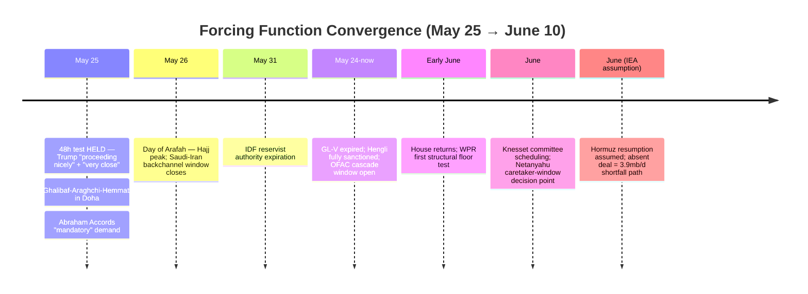
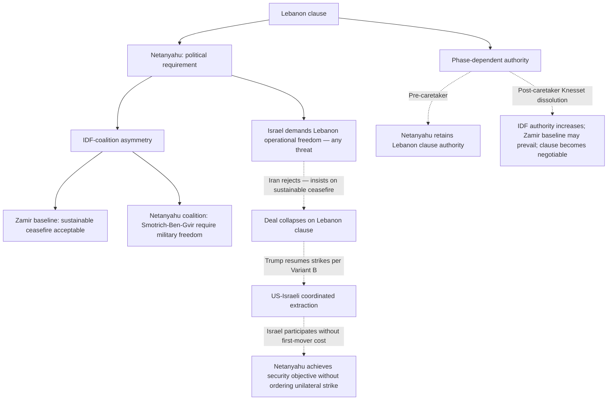

# Iran 2026 Operational SITREP — Daily Update
**Day 88 | Sunday, May 25, 2026**
*Annex/Update to Iran 2026 Operational SITREP and Strategic Synthesis (base report v4.1)*

## Executive Summary

Day 88 produced the strongest deal-direction cluster observed in the conflict window, and simultaneously introduced two new structural obstacles. The Trump 48-hour durability test completed at maximum hold: "largely negotiated" (May 23) → "in no rush" (May 24) → "proceeding nicely" (May 25), the first full 48h hold on record, with Trump also calling the deal "very close." Iran deployed its highest-level negotiating delegation to Doha — Ghalibaf (Parliament Speaker; IRGC-adjacent), Araghchi (FM), and Hemmati (Central Bank Governor) — for talks on Hormuz, HEU, and frozen funds; Iran MFA confirmed "consensus on many topics." Against this, the Lebanon clause entered the MOU architecture as the binding obstacle: Netanyahu demands Israel retain freedom to operate in Lebanon "in response to any threat"; Iran insists on a "sustainable and lasting ceasefire" and has told all mediators it will not sign until all clauses are fully agreed. Trump's Abraham Accords "mandatory" demand (6 Muslim nations must join as part of the deal) creates a structural bind for MBS — who cannot accept without a Palestinian state pathway — straining the multilateral Gulf path. Markets confirmed the deal-pricing: Brent fell to ~$98 (first sub-$100 since the crisis), and the rial appreciated 5.8% in a single session, breaking a 14-cycle stasis.

Supersedes `day-87` · Fork D' ↑ · Israeli kinetic ↓ / diplomatic-spoiler ↑ · Lebanon clause NEW · Abraham Accords demand NEW

| Vector | Direction | Driver |
|---|---|---|
| Trump deal-direction | HELD (48h + "very close") | Completes 48h window from "largely negotiated"; deal-faction defending vs. GOP critics |
| Ghalibaf-Araghchi-Hemmati in Doha | NEW peak | Highest-level Iranian delegation; Hormuz + HEU + frozen funds on table |
| Lebanon clause | NEW spoiler | Netanyahu: operational freedom in Lebanon; Iran: sustainable ceasefire; binding obstacle; blocks signing |
| Abraham Accords demand | NEW constraint | Trump "mandatory" for 6 Muslim nations; MBS cannot accept without Palestinian state pathway |
| Fork D' 30d | 25-33% → 28-36% | Delegation elevation + 48h hold; partially offset by two new obstacles |
| Fork B-multilateral 30d | 13-20% → 11-18% | Abraham Accords demand inverts MBS accommodation-reciprocity logic |
| Israeli unilateral (14-21d) | 32-44% → 30-43% | Options assessed limited without US; Lebanon clause substitutes as primary spoiler vector |
| Mojtaba incapacitation | ESCALATING | IRGC military council controlling apex access; A4 mechanism revision required |
| Brent crude | ~$103 → ~$98 | First sub-$100 since crisis; WTI ~$91; deal-premium deflation |
| Iranian rial parallel | 1,815,000 → 1,709,000 | 5.8% appreciation in one session; breaks 14-cycle stasis |
| T8 Powell mechanism | ↑ | Second reconstitution intel cluster (ToI Israeli-IC independent of CNN US-IC) |

> Leading primitives: Fork D' 28-36% / 30d, Fork A 18-28% / 30d. Highest-delta this cycle: Fork D' ↑ ~3pp midpoint. None-of-above floor: 5%.

---

## 1. Operational Update

**Diplomatic track: Ghalibaf-Araghchi-Hemmati in Doha; Lebanon clause and Abraham Accords demand enter the MOU architecture.** Iran's highest-level negotiating delegation traveled to Doha on May 25 — Ghalibaf (Parliament Speaker; IRGC-adjacent), Araghchi (FM), and Hemmati (Central Bank Governor) — for talks on Hormuz, HEU, and frozen funds. Iran MFA: "consensus on many topics; signing not imminent." Two new load-bearing obstacles: (1) Lebanon clause — the MOU draft contains a Lebanon ceasefire provision; Netanyahu demands Israel retain freedom to operate militarily "in response to any threat"; Iran insists on "sustainable and lasting ceasefire" and told all mediators it will not sign until all clauses are fully agreed. (2) Abraham Accords demand — Trump (Truth Social, T1): joining the Accords is "mandatory" for Saudi Arabia, Qatar, Pakistan, Turkey, Egypt, and Jordan; "should start with Saudi Arabia and Qatar"; non-joiners "should not be part of this deal." Gulf leaders responded with silence. No signed LOI. No Iranian T1 named acceptance.

**Trump posture: 48h test HELD; deal "very close"; Abraham Accords demand introduced.** "Largely negotiated" (May 23) → "in no rush" (May 24) → "proceeding nicely" and "very close" (May 25) — first full 48h hold observed. Trump defended the deal against GOP critics on Fox News, signaling deal-faction consolidating under domestic pressure. Simultaneously inserted the Abraham Accords demand via Truth Social. Rubio (France 24): "Iran deal still possible Monday" — Rubio not echoing "mandatory" framing; weak discriminating signal favoring Slantchev-inverse reading. Discount Truth Social to near-zero absent tape action; the 48h direction-hold is the load-bearing finding.

**Maritime / Military posture.**

| Asset / signal | Day 87 baseline | Day 88 read | Implication |
|---|---|---|---|
| CENTCOM CSGs | Lincoln + Bush in AOR | Unchanged | Stable; no escalation |
| USS Eisenhower | Final preparations, East Coast | No deployment order | Restraint signal held |
| Hormuz commercial traffic | ~5% pre-war | ~5% pre-war | Blockade enforcement unchanged |
| Operation Sledgehammer | Authorized; unexecuted | Authorized; unexecuted | Stage-2 hysteresis intact |
| UK/France Hormuz mission | Not present | HMS Dragon deployed; Charles de Gaulle deploying; joint UK/France military HQ forming | T11 multiplex indicator; Iran warns "immediate and decisive response" to extra-regional warships |
| Israeli pre-emption posture | Three-signal cluster | No forward deployment; IDF intercepted Hezbollah drones | Cluster sustained; not operational this cycle |
| GL-V (Hengli wind-down) | Active through May 24 | Expired May 24 | Full Hengli sanctions now active; OFAC cascade potential next cycle |

**Iranian internal: IRGC military council as functional apex; Ghalibaf as IRGC-authorized deal-track principal.** Iran International (T3) reports a military council of senior IRGC officers now controls all access to Mojtaba Khamenei, blocking Pezeshkian from the center of power; government reports are not reaching Mojtaba. Pezeshkian's claimed 2.5-hour meeting (Euronews, May 7) is disputed — Iran International holds it did not occur as described. US reporting (WSJ-sourced T2): prosthetic leg, multiple operations; prevailing external assessment: killed or incapacitated. Combined with PROBE-2 finding: Ghalibaf in Qatar likely carries IRGC military council authorization, not a Pezeshkian-government mandate. The Day 84 HEU-stays directive attributed to Mojtaba through anonymous sources was almost certainly IRGC-generated. Rial parallel market: 1,709,000/USD (from 1,815,000); first significant appreciation in this window. Kataib Hezbollah leader arrested by US (Soufan Center, May 19): P-OVEX advancing on Iraqi PMU channel.

**Israel: Lebanon clause as operative spoiler; second reconstitution cluster; options assessed limited.** Netanyahu's operative concrete demand is the Lebanon clause; Ben Gvir: Netanyahu must "inform" Trump that Lebanon war is being restarted. Liberman: deal is "catastrophe"; Israel becoming "banana republic." Golan: Netanyahu "not functioning." Times of Israel May 25: "Intel reports said to indicate Iran rebuilding missile production faster than expected" — second independent cluster (ToI sourcing is Israeli-IC; CNN Day 84 was US-IC; partial source independence confirmed) elevating reconstitution-faster confidence from M to M-H. Multi-source analytical assessment (Al Jazeera T3; CSIS cross-reference): Israel's military options are "limited without US permission." No IDF air-refueling tempo escalation; no forward deployment. Knesset reservist authority extended to May 31 (T1). IDF intercepted Hezbollah explosive drones; Iran claimed downed Israeli surveillance drone (May 24), IDF: "not familiar with incident" while noting a "suspicious aerial target lost contact."

**Markets.**

| Asset | Pre-war (Feb 28) | Day 87 (May 24) | Day 88 (May 25) | Move |
|---|---|---|---|---|
| Brent crude | $73 | ~$103-104 | ~$98 | ↓ ~5%; first sub-$100 since crisis began |
| WTI crude | ~$68 | ~$98 | ~$91 | ↓ ~7%; deal-premium deflating |
| Brent backwardation (Jul26-Jul27) | flat | ~$29/bbl | ~$29/bbl | Structural tightness holds despite spot decline |
| Iranian rial parallel | ~960k/USD | 1,815,000 | 1,709,000 | ↓ 106k IRR (5.8% appreciation); breaks 14-cycle stasis |
| US gas / gallon | $3.27 | ~$4.50 | ~$4.30 | ↓ on deal-progress signals |

Brent and rial moving in the same deal-pricing direction simultaneously is the first cross-asset confirmation in this window: markets are reading the Ghalibaf delegation plus Trump 48h hold as a genuine Fork D' advance. The persistent backwardation ($29/bbl) confirms structural tightness persists even as spot falls — markets are pricing deal-possible, not deal-done. IEA OMR (Day 87 T1 carry): 246 mb consecutive March-April inventory draw; 3.9 mb/d shortfall path absent June Hormuz resumption.

**US domestic: House in Memorial Day recess; WPR mechanism confirmed.** H.Con.Res.75 tied 212-212 on May 14 (separate from H.Con.Res.38's 213-214 fail) — House majority oscillates near 212-215 depending on attendance and which resolution is scheduled. Progressive caucus weekly privileged-resolution introduction strategy operational; no scheduling delay can permanently forestall a vote. House returns early June; WPR is expected first major floor business. Senate 50-47 procedural advance holds; Fetterman structural holdout. White House: WPR no longer applies (ceasefire framing).

**International: UK/France Hormuz mission; GL-V expiration; Russia inert; Hajj underway.** UK/France preparing joint Hormuz mine-clearing mission (HMS Dragon deployed; WaPo T2: "waiting for a peace deal to execute"); Iran Deputy FM Gharibabadi warns "immediate and decisive response" to extra-regional warships — T11 multiplex-configuration indicator. GL-V expired May 24 — all Hengli-related transactions now fully sanctioned; MOFCOM blocking order remains in force (T1-vs-T1 standoff). Hajj formally underway May 25 (pilgrims proceeding to Mina; Day of Arafah May 26); Iranian pilgrims largely absent; no Saudi-Iran principal-level meeting confirmed during Hajj window as of Day 88. Russia inert on Iran across all cycles; no confirmed Putin public appearances May 10-25. BS-9.3 approaching the concern threshold.

---



---

## 2. Framework Validation

- **A4 (Vahidi + IRGC military council as functional Iranian apex):** IRGC military council controlling Mojtaba access confirms that Vahidi plus the IRGC military council, not Mojtaba, constitute the operational apex. Ghalibaf's delegation in Qatar carrying IRGC-council authorization is the first observable output of this A4 state — the functional apex authorized the deal-track negotiator.
- **A9 (constraints compress choice sets; principals select):** Trump defending the deal against GOP critics while simultaneously inserting the Accords demand illustrates A1 oscillation within the deal-direction band — under L4 faction constraints, extracting maximum peripheral concessions while holding the deal core is Trump's dominant strategy. Vahidi + IRGC council authorizing Ghalibaf to negotiate before the strangulation clock forces an adverse first-mover position is the Iranian apex's dominant strategy.
- **T8 Powell shifting-power:** Second reconstitution intel cluster (ToI Israeli-IC) independent of Day 84 CNN US-IC advances the Powell amplifier to M-H confidence. Lebanon clause is T8 operating exactly as predicted: the more credible the deal, the stronger Netanyahu's incentive to use every available spoiler mechanism before the window closes — the diplomatic-spoiler vector is lower-cost and lower-attribution than the kinetic vector.
- **T3 Fearon-Slantchev two-level:** Ghalibaf-Araghchi-Hemmati in Qatar is the most legible two-level-games moment in the conflict window. The IRGC-functional-apex maintains public opacity (Mojtaba nominally incapacitated); the IRGC-authorized mid-tier directly negotiates the most sensitive issues in Qatar.

---

## 3. Framework Revisions Required

**TRIGGER FIRED (PROBE-1, M, next_cycle): A4 mechanism revision — IRGC military council as functional apex; Mojtaba nominal/incapacitated.**
Prior (Day 84 carry): Mojtaba as nominal apex with weaponized opacity; HEU-stays directive attributed to Mojtaba via multi-T2 anonymous senior Iranian sources (M confidence). Revised: IRGC military council (Vahidi + senior officers) is the functional apex; Mojtaba incapacitated or nominal, serving as a legitimacy shield for IRGC decision-making. The HEU-stays directive's CONTENT stands (HEU stays is the IRGC position); the ATTRIBUTION changes (IRGC-generated, not Mojtaba personal decision). Discriminating signal now shifts to VAHIDI-DIRECT named statements on HEU terms, not Mojtaba-attributed anonymous signals. BS-1a apex visibility reduced: 78-83% → 72-80%. Flag for /premortem: A4 apex-attribution systematic review; 4th-plus consecutive cycle of incapacitation signals without second-source confirmation.
*Trend cross-check:* Aligns with T3 (IRGC apex retains deterrent floor publicly; IRGC-authorized mid-tier Ghalibaf negotiates). No contradiction of VALIDATED trends.

**TRIGGER FIRED (PROBE-12', H, next_cycle): Fork D' elevated; Fork B-multilateral reduced; Lebanon clause and Abraham Accords demand as new MOU architecture variables.**
Prior (Day 87): Fork D' 25-33%; Fork B-multilateral 13-20%. Revised: Fork D' 28-36% on Ghalibaf/Araghchi/Hemmati full delegation plus Trump 48h HELD — strongest simultaneous deal-direction signals since talks began. Fork B-multilateral 11-18% (↓) on Abraham Accords "mandatory" demand inverting the MBS accommodation-reciprocity logic: MBS was previously receiving positive reciprocity (security guarantees, ceasefire) for supporting the brake; Trump now demands MBS give something he cannot give without Palestinian state pathway. Two-reading treatment required: (A) sincere ultimatum — MBS accommodation pathway under structural strain; (B) Slantchev-inverse leverage — Gulf leaders' silence-not-rejection suggests processing; Rubio's non-echo of "mandatory" weakly favors (B). Next 48h: MBS or Tamim public response resolves the two readings. The Lebanon clause is the more load-bearing short-term obstacle: Iran's "not signing until all clauses agreed" blocks completion regardless of Accords status.
*Trend cross-check:* T1 — single-cycle complication; Gulf leaders' silence is pivot-capacity processing, not a brake fracture. Advance (not contradiction). T3 and T4 advance on delegation elevation and deal-faction defense respectively.

**TRIGGER FIRED (PROBE-13, M, next_cycle): Trump A1 state updated to "active-but-non-reversing"; Netanyahu Penetration via Lebanon clause.**
Prior (Day 87): Penetration mechanism "active-via-private-channel"; 48h test partial fail at 24h. Revised: 48h test HELD; Penetration mechanism state is now active-but-non-reversing: Netanyahu's leverage operates through Lebanon clause (diplomatic-spoiler) rather than through reversing Trump's public deal-direction. Trump defending deal against GOP critics simultaneously confirms deal-faction solidifying. Abraham Accords demand is Trump's own insertion (not Netanyahu Penetration product); Rubio non-echo confirms. Netanyahu leverage now operates primarily through Lebanon terms-veto inside the US-Iran framework, not through private maximalist-assurance relay. Flag: 4th-plus consecutive cycle of Netanyahu asserting Trump private maximalist endorsement without White House corroboration — flag for next /premortem wrong-principal review.
*Trend cross-check:* T4 advances. No VALIDATED-trend contradiction.

**TRIGGER FIRED (PROBE-9/15, M, next_cycle): Israeli spoiler mechanism revised; T8 advancing on second cluster.**
Prior (Day 87): Israeli unilateral 32-44%; primarily kinetic spoiler vector. Revised: 30-43% (marginal ↓) on multi-source "options limited without US permission" assessment. Israeli spoiler mechanism now has two vectors: (1) kinetic — constrained by US-authorization requirement (cannot act unilaterally); (2) diplomatic — Lebanon clause blocks deal from inside the US-Iran framework without requiring IDF activation. IDF-coalition asymmetry: IDF (Zamir baseline: "if uranium removed diplomatically, we have done our part") likely accepts a sustainable Lebanon ceasefire; Netanyahu coalition (Smotrich/Ben-Gvir) requires operational freedom. Phase-dependent: pre-caretaker Netanyahu controls the Lebanon demand; post-caretaker, Zamir's baseline may prevail and Lebanon terms become negotiable. T8 advances: second reconstitution intel cluster (ToI Israeli-IC independent of CNN US-IC) elevates feigning-weakness confidence to M-H.
*Trend cross-check:* T8 advances within VALIDATED. No contradiction.

---

## 4. Framework Additions

**Lebanon clause as structural diplomatic-spoiler mechanism (new; threshold met: repeating mechanism operating across negotiating rounds, constraining an active front).**

The Lebanon clause meets the Section 4 threshold because it will remain load-bearing in every round until the IDF-Netanyahu authority split resolves at the caretaker transition. It is not a one-off event.



Under L4 faction misalignment plus L5 PA-gap constraints, the Lebanon clause is Netanyahu's dominant strategy: block deal diplomatically via Lebanon terms (which Iran cannot accept), wait for Trump to resume strikes, participate in coordinated Variant B. The mechanism operates independently of whether Trump is sympathetic — it requires only that Lebanon terms are incompatible with Iran's position, which they demonstrably are.

---

## 5. Revised Probability Matrix

### 5a. 30-Day Matrix (cycle-Bayesian)

| Outcome | 30 days | vs. Day 87 | Driver |
|---|---|---|---|
| Fork D': Structured deferral via LOI | **28-36%** | ↑ from 25-33% | Ghalibaf/Araghchi/Hemmati full delegation + Trump 48h HELD; offset by Lebanon clause and Accords demand |
| Fork A: Kinetic resumption (composite) | **18-28%** | held | Lebanon clause opens a diplomatic-collapse → Variant B pathway; offset by deal-faction consolidation |
| Fork B-bilateral | **8-13%** | held | Apex PA-gap constraint unchanged |
| Fork B-multilateral (Gulf pathway) | **11-18%** | ↓ from 13-20% | Abraham Accords demand strains MBS accommodation pathway |
| Fork C: Miscalculation cascade | **15-22%** | held | Israel-Hezbollah drone exchange + Iran UAV claim sub-threshold; structural accident risk stable |
| Israeli unilateral (14-21d, pre-caretaker) | **30-43%** | ↓ from 32-44% | Options limited without US; Lebanon clause substitutes as primary spoiler vector |
| None-of-above | **5%** floor | held | Mandatory non-zero floor |

Combined Fork B: 19-31% (↓ from 21-33%). Fork D' midpoint ~32%; approaching the 4-cycle decomposition threshold — if midpoint sustains above 30% for four consecutive cycles beginning Day 89, decompose into named variants at Day 92.

> **Kinetic Escalation Composite ([DERIVED]): ~44-62% (30d).** Construction: Fork A 18-28% + Fork C 15-22% + conflict-leading tail (<2% Israeli first nuclear use 30d; 3-8% inadvertent WMD 90d). Israeli unilateral absorbed into Fork A per primitive-priority rule. Lebanon-clause collapse pathway partially offsets the kinetic-constraint downward revision on Israeli unilateral; net composite moves slightly down from Day 87's ~46-63%.

### 5b. 6/12-Month Matrix (structural-prior; no update this cycle)

No trend-state transitions, L1-L5 constraint shifts, or major-version increments this cycle. Lebanon clause and Accords demand are new L4 variables that do not yet shift L1-L3 constraint structure. The 6/12m matrix will require reassessment if the Lebanon clause survives two or more additional negotiating rounds unresolved — that would raise the 6m Fork A upper bound. Reprinted from v4.1 (Day 84, May 21, 2026).

| Outcome | 6 months | 12 months | Last updated | Driver |
|---|---|---|---|---|
| Fork A composite | 38-48% | 43-53% | v4.1 (Day 84) | Time arithmetic; reconstitution-speed Powell amplifier |
| Fork B-bilateral | 12-18% | 12-18% | v4.1 (Day 84) | Apex PA-gap constraint |
| Fork B-multilateral | 12-20% | 14-22% | v4.1 (Day 84) | Gulf pathway institutionalizing |
| Fork D' structured deferral | 18-24% | 12-18% | v4.1 (Day 84) | LOI expiration compresses at horizon |
| Fork C miscalculation cascade | 16-22% | 16-22% | v4.1 (Day 84) | Structural accident pathway |
| Israeli first nuclear use | <2% | 12-20% | v4.1 (Day 84) | Conditional on HEU sub-state |
| Tripolar reordering substantially advanced | partial | 80-90% | v4.1 (Day 84) | T1/T10/T11 trajectory |

---

## 6. Probe Status Table

| PROBE | Status | Conf | Trigger | Variable Moved |
|---|---|---|---|---|
| 1 Mojtaba Status | **fired** | M | yes | A4 revision: IRGC military council as functional apex; Mojtaba nominal/incapacitated; Day 84 HEU-stays directive reattributed to IRGC |
| 2 IRGC Factional | **fired** | M | yes | Ghalibaf in Doha as IRGC-authorized co-lead negotiator (highest tier yet); Kataib Hezbollah leader arrested (P-OVEX advancing) |
| 6 Chinese Support | partial | M | no | GL-V expired May 24; MOFCOM standoff continues; no banking cascade |
| 7 CENTCOM Posture | partial | M | no | UK/France Hormuz mission forming (not yet executing); no Eisenhower deployment; blockade stable |
| 8 Oil Markets | **fired** | M | yes | Brent ~$98 (first sub-$100 since crisis); WTI ~$91; rial 1,709k (14-cycle stasis broken) |
| 9 Israeli Internal | **fired** | M | yes | Israeli unilateral 32-44% → 30-43%; Lebanon clause as diplomatic-spoiler; second reconstitution cluster |
| 10 War Powers | partial | M | no | H.Con.Res.75 212-212 detail; House recess; majority demonstrated, blocked by GOP scheduling |
| 11 Russian Settlement | partial | M | no | Putin no appearances May 10-25; BS-9.3 approaching <2/month threshold |
| 12' MOU Framework | **fired** | H | yes | Fork D' 25-33% → 28-36%; Fork B-multi 13-20% → 11-18%; Lebanon clause and Accords demand as new MOU architecture variables |
| 13 PA-Gap | **fired** | M | yes | Trump 48h HELD; Penetration state: active-but-non-reversing; deal-faction consolidating under domestic pressure |
| 14 Iranian Residual | partial | M | no | Second reconstitution cluster (M-H confidence on feigning-weakness); Iran UAV claim vs IDF denial unresolved |
| 15 Dispositional | **fired** | M | yes | T8 advancing on second independent cluster; Israel options limited; Lebanon clause introduces diplomatic-spoiler vector |
| 16 First-Mover | **fired** | H | yes | Primary near-term risk shifts from kinetic pre-emption to Lebanon clause diplomatic deadlock; IRGC apex attribution revised |
| 17 Russian Siloviki | partial | M | no | BS-9.3 May on track for ≤1 confirmed public appearance; not yet triggering 3-month threshold |
| 20 Gulf Troika | **fired** | M | yes | Fork B-multi ↓; Abraham Accords demand strains MBS pathway; Hajj: no principal-level meeting confirmed |
| 21 Paine Death-Ground | partial | M | no | P-AIM limited holds (Iran demand-set bounded at war-end + sanctions + Hormuz management); P-OVEX advancing; P-INFO sub-threshold |

Skipped per cadence: PROBE-3 (monthly; 17th-plus consecutive gap), PROBE-18 (monthly; no Tier-1 eschatological events), PROBE-19 (quarterly).

---

## 7. Conclusion and Forking Analysis

### Central Thesis Check

The v4.0-v4.1 central thesis holds under Day 88's highest-signal cycle of the conflict window. Every major finding is a predicted output of the materialist bargaining model. Ghalibaf-Araghchi-Hemmati traveling to Qatar is the IRGC military council's dominant-strategy selection: deploy the IRGC-authorized negotiator before the strangulation clock (Brent $98; rial 1,709k; IEA June deadline) forces a worse first-mover position. Trump "proceeding nicely" while inserting the Accords demand is A1 oscillation within the deal-direction band — defend the core while extracting maximum peripheral concessions, constrained by the need to hold the Gulf troika brake through the LOI window. Netanyahu's Lebanon clause is L4 faction-misalignment operating as designed: under Smotrich/Ben-Gvir coalition constraints, blocking the deal diplomatically via an Iran-incompatible demand and then participating in US-led Variant B is Netanyahu's lowest-cost path to Israeli security objectives. Five constraint layers conditioned each principal's decision set; each named actor selected within those constraints.

Trend-state lines this cycle: **T1 advance** (8-leader consultation confirmed; Abraham Accords demand is a single-cycle complication, not a brake fracture — Gulf leaders' silence is pivot-capacity processing). **T2 advance** (second reconstitution cluster; Kataib Hezbollah leader arrested; P-OVEX advancing). **T3 advance** (Ghalibaf in Doha is the most legible two-level-pattern moment in the window: IRGC-functional-apex maintains public opacity while IRGC-authorized mid-tier directly negotiates). **T4 advance** (Trump defending deal against GOP critics; no eschatological counter-mobilization for a 5th-plus consecutive cycle). **T5 holds PENDING** (Hajj underway; Day of Arafah May 26; Iranian pilgrims absent; no Tier-1 fire). **T6 holds** (Putin absence May 10-25 consistent with prior signal cluster; M1 baseline holds; BS-9.3 watch). **T7 holds** (voice discipline maintained throughout Day 88 output). **T8 advances** (second independent reconstitution cluster; T8 approaching multi-cluster VALIDATED+ confirmation; Israeli options limited without US is the predicted closing-window state). **T9 holds** (WPR mechanism confirmed as GOP floor-scheduling dependent; VALIDATED holds; House returns early June as next structural test). **T10 holds PENDING** (Russia entirely absent from Doha architecture; GL-V expiration does not yet trigger a banking cascade). **T11 holds PENDING** (UK/France Hormuz mission is the first multi-Western non-US Hormuz coordination: multiplex-configuration advancing). No trend-state transitions warranted on single-cycle evidence.

### Forking Tree (72-Hour Decision Path)

```mermaid
flowchart TD
    Start[Day 88: Trump 48h held; Ghalibaf-Araghchi-Hemmati Doha; Lebanon clause; Accords demand] --> LC{Lebanon clause: will Netanyahu accept a sustainable Lebanon ceasefire in the MOU?}
    LC -->|No — coalition requires operational freedom| DD[Diplomatic deadlock on Lebanon terms]
    LC -->|Yes — Zamir IDF baseline prevails post-caretaker| ACCORDS{Abraham Accords demand: does MBS publicly respond or reject in next 48h?}
    DD -.->|Trump resumes strikes — Variant B| FA[Fork A Variant B: US-Israeli coordinated 18-28% 30d]
    DD -.->|Deadlock drags; WPR forces House vote| T9TEST[T9 CONTESTED test event early June]
    ACCORDS -->|MBS accepts or sidesteps | FD{Ghalibaf-Araghchi return from Doha: named Iranian T1 LOI acceptance?}
    ACCORDS -->|MBS rejects publicly| FBM[Fork B-multilateral collapses further below 11%]
    FD -->|Yes: Araghchi named T1 acceptance| LOI[Fork D' advances 28-36%; 60-day clock begins]
    FD -->|No: "significant progress"; 7th round required| RACE{Race: LOI pace vs. IDF reservist expiration May 31 + caretaker window}
    LOI --> P60{60-day phase: HEU and Hormuz negotiated in phase 2 without Lebanon re-ignition?}
    P60 -->|Both resolved; Lebanon ceasefire holds| FBB[Fork B-bilateral 8-13%]
    P60 -->|Lebanon or HEU deadlock at expiration| FA
    RACE -->|Caretaker begins before LOI| IControl[IDF Zamir authority increases; Lebanon clause may no longer be Netanyahu's to impose]
    RACE -->|LOI signed before caretaker| ForkD[Fork D' 28-36% sustained]
```

### Operative Judgment

Day 88 is the cycle most legible as a genuine deal-direction advance, and also the cycle in which two new structural obstacles entered simultaneously. The Lebanon clause and the Accords demand are not symmetrically weighted. The Lebanon clause is the binding near-term obstacle: Iran has explicitly told all mediators it will not sign until all clauses are fully agreed, and a sustainable Lebanon ceasefire is incompatible with Netanyahu's coalition requirements. The Accords demand is structurally ambiguous — Rubio's non-echo of "mandatory" and Gulf leaders' silence-without-rejection suggest this may be Slantchev-inverse leverage, not a sincere ultimatum. The discriminating test is State Department or Rubio echoing "mandatory" in the next 48-72 hours.

The Mojtaba incapacitation finding, if accurate at M confidence, is the most significant structural shift this cycle: it changes not what Iran's apex position IS (HEU-stays is still the IRGC position) but WHOSE DECISION it represents and how the discriminating signal should be read. Ghalibaf is not a Pezeshkian-government emissary hoping to get apex approval later — he is an IRGC-council-authorized deal-track principal whose mandate comes from the functional apex itself. This is a more coherent deal-direction signal. The discriminating evidence that resolves the A4 question: a Vahidi-direct named statement on HEU terms, or Pezeshkian publicly gaining access to Mojtaba.

The Lebanon clause's structural logic warrants specific treatment. Netanyahu cannot plausibly negotiate Israeli operational freedom in Lebanon — that is a condition Iran will not accept under any architecture, given that Lebanon operations directly targeted Iran's proxy deterrent network. The clause is a designed incompatibility, not a bridgeable gap. Its operative effect: Netanyahu holds a diplomatic spoiler that does not require an IDF activation order, works inside the US-Iran framework, and collapses the deal in a way that positions Israeli participation in Variant B as the logical next step. The race between LOI pace and Netanyahu's pre-caretaker window is now a two-vector race: kinetic first-mover AND diplomatic obstruction via Lebanon terms. The caretaker window timing matters: if Knesset dissolution proceeds and IDF Zamir's authority over Lebanon decisions increases, the Lebanon clause may no longer be Netanyahu's to impose — and the deal-blocking dynamic shifts.

Under joint constraints at Day 88, the framework ranks three dominant-strategy options by 30d probability: Fork D' (28-36%) on the strongest simultaneous US-Iran deal-direction signals since talks began; Fork A composite (18-28%) on the Lebanon clause diplomatic-collapse pathway opening Variant B; Fork C (15-22%) on persistent sub-threshold escalation risk. Selection across all three remains contingent on actor agency. The next cycle is the critical test: MBS response to the Accords demand and Ghalibaf-Araghchi return from Doha with or without a named Iranian acceptance are the two signals that resolve the two-reading ambiguity and set the 30d Fork D'/Fork A balance.

### Signals That Force Immediate Revision

- Araghchi or Ghalibaf T1 named public acceptance of the LOI/MOU (Fork D' advances; Lebanon clause bridged or deferred)
- Netanyahu accepts sustainable Lebanon ceasefire language in MOU (diplomatic-spoiler deactivated; Fork D' upper bound rises)
- MBS public rejection of Abraham Accords demand (Gulf brake structural fracture; Fork B-multilateral collapses further; T1 CONTESTED test)
- Rubio or State Department echoes "mandatory" Accords framing in next 48h (sincere demand confirmed; MBS accommodation pathway under structural strain — reading A prevails)
- Iranian T1 statement rejecting the MOU wholesale (Fork D' collapses; Fork A re-elevates toward 25-35%)
- Israeli unilateral strike on Iranian nuclear or military site (Fork D' and Fork B collapse; all probability mass into Fork A)
- IDF air-refueling tempo escalation or F-35/F-15 forward positioning in next 24-48h (pre-emption preparation signal; Israeli unilateral probability re-elevates)
- Vahidi-direct named statement on HEU disposition terms (discriminating evidence resolving A4 apex-attribution and Day 84 HEU-stays directive provenance)
- White House readout using "full dismantlement" or "all HEU removed" language (Netanyahu Penetration mechanism confirmed at private-channel level; 4th-plus cycle of unconfirmed Netanyahu relay resolved)
- House WPR floor vote passes early June on return from recess (T9 CONTESTED test event; Stage-2 hysteresis structural test)

---

*Compiled May 25, 2026 | Day 88 | Subject to revision as data updates*
*Next SITREP: Day 89 (May 26); Day of Arafah; MBS public response to Abraham Accords demand (48h window resolves two-reading ambiguity); Ghalibaf-Araghchi Doha outcome; any Iranian T1 named LOI acceptance or rejection; IDF pre-emption signals; GL-V OFAC cascade watch.*
*Framework revision v4.2 warranted if: (a) LOI formally accepted by both US and Iran; (b) Lebanon clause bridged in named MOU text; (c) confirmed Israeli unilateral strike; (d) MBS public rejection of Accords demand (Gulf brake fracture); (e) House WPR passes early June; (f) Vahidi-direct HEU named statement resolving A4 apex attribution.*
*Companion: day-87.md annex; sweep-2026-05-25.json; synthesis-v4-1.md.*
