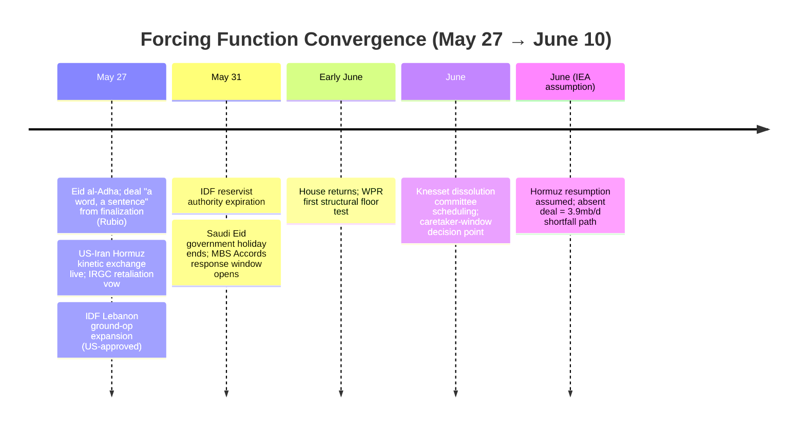
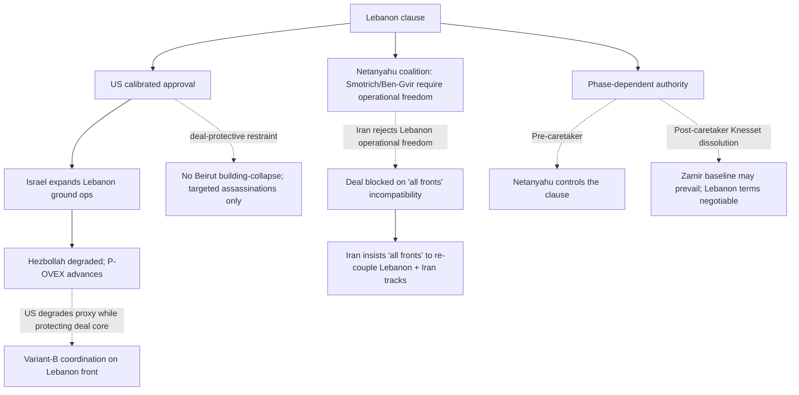
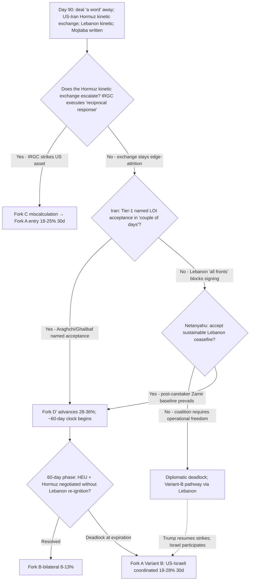

# Iran 2026 Operational SITREP — Daily Update
**Day 90 | Tuesday, May 27, 2026**
*Annex/Update to Iran 2026 Operational SITREP and Strategic Synthesis (base report v4.2)*

## Executive Summary

Day 90 is the sharpest bifurcation cycle of the conflict window. The deal reached its strongest diplomatic-axis articulation to date: Rubio said it is down to "disagreements over a word, a sentence" and could finalize in "a couple of days"; Trump said "final aspects" are being discussed and "will be announced shortly"; Pakistan's Munir told Beijing an agreement is "close to being reached." Against that, three kinetic vectors fired in the same 48 hours: US CENTCOM self-defense strikes inside Iran (two IRGC mine-laying boats in the Strait and a Bandar Abbas SAM site), with Iran's Foreign Ministry alleging a ceasefire violation and the IRGC vowing a "reciprocal response"; an expansion of Israeli ground operations in southern Lebanon conducted with calibrated US approval; and continued Iran-Israel drone exchanges. The Iranian apex projected maximalism in two registers without exposure: Mojtaba Khamenei issued his first major message since taking office in writing with no camera appearance ("all US bases must close or be attacked"), and adviser Shamkhani dismissed Trump's desired nuclear-control terms as "fantasy."

Supersedes `day-88` · Fork C ↑ · Lebanon clause kinetic NEW · Fork D' HELD · US-Iran kinetic exchange NEW

| Vector | Direction | Driver |
|---|---|---|
| US-Iran Hormuz kinetic exchange | NEW | CENTCOM self-defense strikes on IRGC boats + SAM; Iran retaliation vow |
| Fork C miscalculation (30d) | 15–22% → 18–25% | Bidirectional Hormuz exchange + Lebanon + drone exchanges |
| Lebanon clause | diplomatic → KINETIC | US-approved IDF ground-op expansion; Beirut building-collapse restrained |
| Deal-direction (Trump/Rubio) | HELD at peak | "A word, a sentence"; "announced shortly"; Munir "close" |
| Fork D' structured deferral (30d) | 28–36% HELD | Deal strength offset by Lebanon kinetic hardening |
| Mojtaba public posture | NEW (written) | First message since taking office; no camera; reinforces A4 |
| Iranian capability | use-confirmed | 24h IRGC launches + mine-laying + active SAM (T12) |
| Brent / rial | ↑ / ↓ slight | $98 → $99.58 on strikes; rial 1,709k → 1,726k; deal-pricing partly reversed |
| Abraham Accords demand | unresolved | MBS silence calendar-structural (Hajj + Eid holiday to May 31) |

> Leading primitives: Fork D' 28–36% / 30d, Fork A 18–28% / 30d. Highest-delta this cycle: Fork C ↑ (15–22% → 18–25%). None-of-above floor: 5%.

---

## Section 1 — Operational Update

**Diplomatic track narrowed to final-text disputes while the binding obstacle hardened.** Rubio (T2, India presser) put the deal at "a couple of days," down to "disagreements over a word, a sentence"; the framework is a one-page 14-point MOU (Witkoff/Kushner) declaring war's end and a roughly 60-day negotiation window, US blockade lift, Hormuz reopening, phase-2 nuclear deferral, and Iranian commitment to never seek a weapon plus snap inspections. The Lebanon clause is now the binding obstacle on record from both sides: Iran insists the truce cover "all fronts" including Lebanon; Israeli Energy Minister Eli Cohen said Israel "will insist that its freedom of action on all fronts be preserved." Rubio named two further open items: Iran's frozen assets and its reluctance to guarantee unrestricted Hormuz passage.

**Trump held deal-direction through a kinetic-strike cycle.** Trump (Truth Social, T1, discounted near-zero absent tape action) said the deal "will be announced shortly" and "the Strait of Hormuz will be opened," and defended the deal against GOP critics. The load-bearing finding is behavioral, not rhetorical: Trump did not pivot to Fork A framing despite US strikes inside Iran the same cycle, a stronger A1 durability datapoint than the Day 88 word-cadence hold.

**CENTCOM conducted self-defense strikes inside Iran.** CENTCOM (T1, via NBC) struck two IRGC boats laying mines in the Strait and a Bandar Abbas SAM site that was targeting US aircraft, framed as a direct response to 24 hours of IRGC missile, drone, and small-boat launches near Hormuz (H confidence on the strikes; T1 tape action). Iran's Foreign Ministry (T1) called the preceding US naval activity a ceasefire violation, citing 48 hours of "naval harassment" of Iranian commercial vessels; the IRGC warned its "reciprocal response" is "legitimate and certain." Sources conflict on causation (CENTCOM mine-laying account vs Iran harassment account); not averaged, the bidirectional violation-claims are themselves the Fork C signal regardless of initiator. USS Eisenhower remains in final preparations off the East Coast with no deployment order; no ROE shift to offensive; no new operation name.

**Iranian internal: apex maximalism in two registers without exposure.** Mojtaba Khamenei issued his first major message since succeeding his father, broadcast on state TV May 26 in writing with no camera appearance (Iran International: "unseen new leader issues first message in writing"): "all US bases must close immediately; otherwise they will be attacked." Shamkhani (Supreme Leader adviser, T2) dismissed Trump's desired control over Iran's nuclear program as "fantasy," reinforcing the IRGC HEU-stays floor at the apex-adjacent tier. No Vahidi-direct named statement on HEU surfaced (the A4 discriminating evidence remains absent, roughly a 5th consecutive cycle). The Ghalibaf-Araghchi-Hemmati delegation carried over from Doha; Iran MFA: "consensus on many topics; signing not imminent." Rial parallel/remittance rate ticked back to ~1,726,000/USD (from the Day 88 1,709,000), partially unwinding the Day 88 appreciation.

**Israel: Lebanon clause graduated to kinetic activation.** Israel expanded ground operations in southern Lebanon (Euronews, May 27); IDF troops pushed north and clashed with Hezbollah along the Litani after overnight strikes across Lebanon. Washington approved the expansion but warned against Beirut building-collapse (Amb. Huckabee relay, T2: "not to bring down buildings in Beirut"; targeted assassinations permitted "if an operational opportunity presents itself") - calibrated, deal-protective approval. Israeli cabinet hardened the clause on record (Eli Cohen "freedom of action all fronts"; Gantz "under no circumstances accept a Lebanon ceasefire"); Liberman "catastrophe"/"banana republic"; Golan "Netanyahu not functioning." No IDF air-refueling tempo escalation or F-35/F-15 forward positioning toward Iran. Knesset reservist authority runs to May 31; dissolution committee stage not scheduled.

**Lebanon / proxy fronts: heavy Hezbollah attrition; P-OVEX advancing.** Lebanon MoH cumulative 3,213 killed, 9,737 wounded; 31+ killed (including children) in the latest attacks. The Lebanese proxy channel is degraded under sustained attrition, not eliminated (drones still launched into northern Israel, IDF intercepting). Combined with the prior Kataib Hezbollah leader arrest, the proxy self-amputation clock (P-OVEX) advances, plausibly across two channels (Lebanese and Iraqi PMU).

**Markets.**

| Asset | Pre-war (Feb 28) | Day 88 (May 25) | Day 90 (May 27) | Move |
|---|---|---|---|---|
| Brent crude | $73 | ~$98 | ~$99.58 | ↑ +3% on US strikes + Iran retaliation vow; off the sub-$100 print |
| WTI crude | ~$68 | ~$91 | ~$93 (tracking) | ↑ marginally with Brent |
| Brent backwardation (Jul26–Jul27) | flat | ~$29/bbl | ~$29/bbl | Structural tightness holds despite spot oscillation |
| Iranian rial parallel | ~960k/USD | 1,709,000 | ~1,726,000 | ↓ ~1% re-depreciation; risk premium re-priced |
| US gas / gallon | $3.27 | ~$4.30 | ~$4.30 | Broadly stable |

The Day 88 cross-asset deal-pricing (Brent and rial both pricing optimism) partially reversed as the kinetic exchange re-introduced a risk premium. Persistent $29/bbl backwardation continues to signal physical tightness independent of the deal-premium oscillation; it collapses only on a signed deal. IEA baseline carries (T1): 246 mb consecutive March-April draw; 3.9 mb/d shortfall path absent a June Hormuz resumption, which is deal-contingent.

**US domestic: WPR delayed to June; mechanism unchanged.** The House floor vote was delayed into June after GOP leaders declined to hold it, having concluded they lacked the numbers to defeat the resolution (de facto majority persists; blocked by floor-scheduling control). The Senate cluster: discharge advanced 50-47 with four Republicans (Collins, Murkowski, Paul, Cassidy), but the on-merits resolution was blocked (Fetterman votes with the GOP; VP-tiebreaker math at full attendance). White House maintains the WPR "no longer applies." The May 25-26 self-defense strikes did not generate a new AUMF this cycle but sharpen the early-June House test.

**International: Russia inert; China standoff holds; Hajj closed with no Tier-1 fire.** Russia is absent from the Doha architecture; Munir routed the "close" readout through Beijing, not Moscow. No new confirmed Putin public appearance surfaced beyond the May 9 baseline (BS-9.3 watch continues). GL-V (Hengli wind-down) expired May 24; MOFCOM blocking order in force; counterparties caught between US sanctions and Chinese law; no Hengli-to-major-banks cascade. Hajj concluded (Day of Arafah May 26, Eid al-Adha May 27) with >1.8M pilgrims and no Tier-1 eschatological trigger; Iranian pilgrims effectively absent.

---

## Section 2 — Framework Validation

- **A1 (Trump improvisational/oscillating principal):** Held deal-direction through a US kinetic-strike cycle ("announced shortly" concurrent with the Hormuz strikes), a behavioral non-reversal stronger than rhetoric.
- **A4 (Iranian apex = Vahidi + IRGC military council):** Mojtaba's first major message issued in writing with no camera appearance is the legitimacy-shield output the re-identification predicts; it does not revert him to functional apex.
- **A9 (constraints precede; named actors select):** Each principal selected its dominant strategy under joint constraints this cycle; the deal-plus-escalation conjunction is the joint equilibrium, not a designed outcome.
- **A10 (Slantchev feigning-weakness):** Iran exercised maritime-denial and air-defense capability (mine-laying, multi-domain launches, active SAM), confirming retained capability through use.
- **A11 (inadvertent escalation, Talmadge):** The bidirectional Hormuz exchange is the predicted structural-accident exposure surface widening.
- **A22 (structured deferral as Trump dominant strategy under apex collision):** Deal "down to a word" with phase-2 nuclear deferral validates the LOI deferral track.
- **A23 (diplomatic-spoiler as Netanyahu dominant strategy under kinetic constraint):** The Lebanon clause, now kinetically active with US approval, is the predicted spoiler vector.

---

## Section 3 — Framework Revisions Required

**TRIGGER FIRED (PROBE-7, H, immediate): Fork C elevated on the first bidirectional US-Iran kinetic exchange in the recent ceasefire window.**
Prior (Day 88): Fork C 15-22% (held). What broke it: CENTCOM self-defense strikes inside Iran (IRGC mine-laying boats + Bandar Abbas SAM), Iran's ceasefire-violation claim, and the IRGC "reciprocal response" vow, compounded by Lebanon escalation and Iran-Israel drone exchanges. Revised: Fork C 15-22% → 18-25% (30d). Calibration guard: this is NOT scored as Fork A resumption. The strikes were CENTCOM self-defense framed (no new operation name, no Eisenhower deployment, no offensive ROE shift), and Trump held deal-direction concurrently; over-reading them as a campaign restart would be the recency-bias failure mode.
*Trend cross-check:* No VALIDATED-trend contradiction. Consistent with the kinetic-discipline (not kinetic-absence) ceasefire and the A11/§5.15 inadvertent-escalation pathway. T2 advances (Iranian network actively kinetic).

**TRIGGER FIRED (PROBE-9/15, M, next cycle): Lebanon clause graduated from diplomatic-spoiler to kinetic activation.**
Prior (Day 88): Lebanon clause as diplomatic-spoiler vector; Israeli unilateral 30-43%. What broke it: US-approved expansion of Israeli ground operations in southern Lebanon (Beirut building-collapse restrained); Israeli cabinet on record "freedom of action all fronts." Revised: Israeli unilateral-Iran-strike held 30-43% (Israeli energy channeled into the Lebanon front, not a unilateral Iran strike); the §5.27 mechanism is now both diplomatic and kinetic. The US-approved Lebanon escalation is Variant-B coordination materializing on the Lebanon front: the US permits Hezbollah degradation (P-OVEX) while protecting the Iran deal core, and Iran's "all fronts" insistence is an attempt to re-couple the Lebanon and Iran tracks.
*Trend cross-check:* T8 advances within VALIDATED (Powell shifting-power: Israel prosecutes the front it can as the Iran deal nears). No contradiction.

**TRIGGER FIRED (PROBE-12'/13, H, next cycle): Fork D' held at peak deal-direction; A1 durability strengthened.**
Prior (Day 88): Fork D' 28-36%; 48h test held. What moved it: Rubio "a word, a sentence"; Trump "announced shortly"; Munir-to-Beijing "close." Revised: Fork D' held 28-36% (30d), the strongest diplomatic-axis signal yet offset by the Lebanon-clause kinetic hardening and the Hormuz exchange. A1 durability strengthened (deal-direction held through the kinetic cycle). Fork D' midpoint ~32%: 2nd cycle above the 30% midpoint with Day 88 (Day 87 was below); the 4-consecutive-cycle decomposition rule is not triggered. Monitor.
*Trend cross-check:* T1 advance (Munir principal-tier mediation); T3 advance (IRGC-authorized mid-tier within apex floors). No contradiction.

**TRIGGER FIRED (PROBE-1, M, next cycle): Mojtaba written statement reinforces, does not revise, the A4 re-identification.**
Prior (v4.2 Day 88): functional apex = Vahidi + IRGC military council; Mojtaba incapacitated/nominal, legitimacy shield. What surfaced: Mojtaba's first major message, issued in writing with no camera appearance. Revised: A4 NOT revised, reinforced. The written-only modality does not meet the framework-revision trigger ("Mojtaba public visual appearance OR second-source death confirmation") and is consistent with council-authorship under nominal authority. BS-1a held ~72-80%. Discriminating evidence still pending: an authenticated visual Mojtaba appearance (would revise toward functional apex) or a Vahidi-direct HEU statement (would confirm the council).
*Trend cross-check:* T3 advance (apex deterrent-floor maximalism via legitimacy shield). No contradiction.

**TRIGGER FIRED (PROBE-14, M, next cycle): Iranian capability use-confirmed; T12 reinforced.**
Prior: reconstitution-faster intel-assessed (two clusters, Day 84/88). What surfaced: 24h of IRGC missile, drone, and small-boat launches plus active mine-laying and an operational Bandar Abbas SAM. Revised: the Slantchev feigning-weakness reading graduates from intel-assessed to use-confirmed; capability-recovery is now demonstrated, not just assessed, and is the proximate cause of the bidirectional exchange.
*Trend cross-check:* T12 advances (first post-promotion cross-check; capability-recovery amplifier demonstrated through use). T2 advance. No contradiction.

---

## Section 4 — Framework Additions

**Lebanon-clause kinetic graduation: Variant-B coordination materializing on the Lebanon front (structural; recurring mechanism, now across Day 88 and Day 90).**

The Lebanon clause was logged Provisional at v4.2 (§5.27, Day 88) as a diplomatic-spoiler. This cycle it graduated to a kinetic mechanism: the US approved Israeli ground-op expansion against Hezbollah while restraining Beirut building-collapse to protect the Iran deal. The mechanism now meets the structural threshold (repeating, kinetically active) and is a candidate to move from Provisional to a permanent §5.x at next /revise.

Under L4 faction misalignment plus L5 PA-gap constraints, the Lebanon clause is Netanyahu's dominant strategy; selection remains contingent and phase-dependent on Knesset dissolution. The US-approval dimension is new this cycle: Washington decoupled the Lebanon kinetic track from the Iran diplomatic track, degrading Hezbollah while protecting the deal. Whether that decoupling holds is the binding question, since Iran's "all fronts" demand is precisely an attempt to re-couple them.

---

## Section 5 — Revised Probability Matrix

### 5a. 30-Day Matrix (cycle-Bayesian)

| Outcome | 30 days | vs. Day 88 | Driver |
|---|---|---|---|
| Fork D': Structured deferral via LOI | **28–36%** | HELD | Deal "a word" away; offset by Lebanon kinetic hardening + Hormuz exchange |
| Fork A: Kinetic resumption (composite) | **18–28%** | HELD | Variant-B-via-Lebanon pathway more active; deal-faction holds the core |
| Fork B-bilateral | **8–13%** | HELD | Apex PA-gap unchanged (Shamkhani "fantasy" reinforces HEU floor) |
| Fork B-multilateral (Gulf pathway) | **11–18%** | HELD | MBS silence calendar-structural (Hajj + Eid to May 31), not strain |
| Fork C: Miscalculation cascade | **18–25%** | ↑ from 15–22% | Bidirectional Hormuz kinetic exchange + Lebanon + drone exchanges |
| Israeli unilateral (14–21d, pre-caretaker) | **30–43%** | HELD | Energy channeled to US-approved Lebanon; no Iran forward deployment |
| None-of-above | **5%** floor | HELD | Mandatory non-zero floor |

Fork D' midpoint ~32%; 2nd cycle above 30% with Day 88 (Day 87 below). The 4-consecutive-cycle decomposition rule is not triggered; if the midpoint sustains above 30% through the next two cycles, decompose into named variants.

> **Kinetic Escalation Composite ([DERIVED]): ~47–65% (30d).** Construction: Fork A 18–28% + Fork C 18–25% + conflict-leading tail (<2% Israeli first nuclear use 30d; 3–8% inadvertent WMD 90d). Israeli unilateral absorbed into Fork A per primitive-priority. Up from the Day 88 ~44–62%, driven by the Fork C elevation on the Hormuz kinetic exchange. Reported as a footnote for continuity; the primitives lead.

### 5b. 6/12-Month Matrix (structural-prior; no update this cycle)

No trend-state transition, L1-L5 constraint shift, or major-version increment this cycle. The Lebanon-clause kinetic graduation and the Hormuz exchange are L2/L4 operational movements that do not yet shift the L1-L3 structural priors. Reprinted from v4.1 (Day 84); None-of-above structural addition v4.2 (Day 88). The 6m Fork A upper bound rises if the Lebanon clause survives two or more additional negotiating rounds unresolved or the Hormuz exchange escalates into a sustained pattern.

| Outcome | 6 months | 12 months | Last updated | Driver |
|---|---|---|---|---|
| Fork A composite | 38–48% | 43–53% | v4.1 (Day 84) | Time arithmetic; reconstitution-speed amplifier (T12) |
| Fork B-bilateral | 12–18% | 12–18% | v4.1 (Day 84) | Apex PA-gap constraint |
| Fork B-multilateral | 12–20% | 14–22% | v4.1 (Day 84) | Gulf pathway institutionalizing |
| Fork D' structured deferral | 18–24% | 12–18% | v4.1 (Day 84) | LOI expiration compresses at horizon |
| Fork C miscalculation cascade | 16–22% | 16–22% | v4.1 (Day 84) | Structural accident pathway |
| None of the above | 10–15% | 10–15% | v4.2 (Day 88) | Mandatory non-zero floor |
| Israeli first nuclear use (conditional) | <2% | 12–20% | v4.1 (Day 84) | Conditional on HEU sub-state |
| Tripolar reordering substantially advanced | partial | 80–90% | v4.1 (Day 84) | T1/T10/T11 trajectory |

---

## Section 6 — Probe Status Table

| PROBE | Status | Conf | Trigger | Variable Moved |
|---|---|---|---|---|
| 1 Mojtaba Status | **fired** | M | yes | First message in writing, no camera; REINFORCES A4 re-identification (not revised); BS-1a held ~72–80% |
| 2 IRGC Factional | **fired** | M | yes | Shamkhani "fantasy" reinforces HEU-stays floor; Vahidi-direct HEU still absent (~5th cycle) |
| 6 Chinese Support | partial | M | no | GL-V expired; MOFCOM standoff; no bank cascade; Munir briefed Beijing |
| 7 CENTCOM Posture | **fired** | H | yes | US self-defense strikes inside Iran (IRGC boats + SAM); Fork C 15–22% → 18–25%; NOT Fork A resumption |
| 8 Oil Markets | **fired** | M | yes | Brent ~$98 → ~$99.58 (+3%); rial 1,709k → ~1,726k; deal-pricing partly reversed |
| 9 Israeli Internal | **fired** | M | yes | Lebanon clause diplomatic → kinetic; US-approved expansion; Israeli unilateral held 30–43% |
| 10 War Powers | partial | M | no | House vote delayed to June; Senate on-merits blocked; de facto majority persists |
| 11 Russian Settlement | partial | M | no | No new Putin appearance; BS-9.3 watch continues |
| 12' MOU Framework | **fired** | H | yes | Deal "a word, a sentence"; Lebanon clause binding; Fork D' held 28–36% |
| 13 PA-Gap | **fired** | M | yes | Trump held deal-direction through the strikes (A1 behavioral durability); Penetration active-but-non-reversing |
| 14 Iranian Residual | **fired** | M | yes | Capability demonstrated via use (24h launches + mine-laying + SAM); T12 use-confirmed |
| 15 Dispositional | **fired** | M | yes | T8 advancing; Israel converts closing-window into US-approved Lebanon action; gap managed not ruptured |
| 16 First-Mover | **fired** | H | yes | Primary near-term risk shifts to Fork C inadvertent Hormuz escalation; race = deal-finalization vs miscalculation |
| 17 Russian Siloviki | partial | M | no | BS-9.3 May tracking ≤1 appearance; no concurrent sub-probe fire |
| 18 Eschatological | null | M | no | Hajj closed; no Tier-1 fire; Mojtaba rhetoric doctrinal, not Mahdist |
| 20 Gulf Troika | partial | M | no | Accords demand unresolved; MBS silence calendar-structural; Fork B-multi held 11–18% |
| 21 Paine Death-Ground | partial | M | no | P-AIM limited holds; P-DG non-fire (assets not principals); P-OVEX advancing |

Skipped per cadence: PROBE-3 (monthly; 18th-plus consecutive gap), PROBE-19 (quarterly).

---

## Section 7 — Conclusion and Forking Analysis

### Central Thesis Check

The v4.0-v4.2 central thesis is holding, with Fork C materially elevated. Day 90 produces the conjunction the materialist bargaining model predicts: under L1-L2 (the IRGC demonstrates Hormuz maritime-denial capability; CENTCOM ROE responds in self-defense), L3 (deal-finalization clock against the strangulation, reconstitution, and reservist-expiration clocks), L4 (Netanyahu's coalition channels the closing-window incentive into US-approved Lebanon escalation), and L5 (the IRGC-council apex projects maximalism via a written Mojtaba statement and Shamkhani's "fantasy," while the IRGC-authorized mid-tier negotiates within the floor), each named actor selected its dominant strategy. Trump held deal-direction through the kinetic exchange. No actor designed the deal-plus-escalation conjunction; it is the joint equilibrium of constrained choices.

Trend-state lines this cycle (from the sweep `reference_trends`): **T1 advance** (Munir principal-tier mediation routed through Beijing; Gulf brake intact; MBS silence calendar-structural). **T2 advance** (Iranian network actively kinetic; Hezbollah degraded-not-eliminated). **T3 advance** (apex maximalism both axes; the written-not-visual Mojtaba statement reinforces the A4 re-identification). **T4 advance** (deal-faction holding; Rubio NSC deal-team consolidation; the Huckabee channel used for restraint; no maximalist counter-mobilization a 6th-plus cycle). **T5 holds PENDING** (Hajj closed, explicit Tier-1 non-fire). **T6 holds** (no new Putin appearance; BS-9.3 watch). **T7 holds** (voice discipline). **T8 advances** (Israel converts the closing-window into US-approved Lebanon kinetic action; reconstitution amplifier demonstrated). **T9 holds** (House vote delayed to June; Senate on-merits blocked; House early-June CONTESTED test pending). **T10 holds PENDING** (Russia absent; Munir routes through Beijing; no bank cascade). **T11 holds PENDING** (UK/France Hormuz architecture; US still primary unilateral enforcer). **T12 advances** (capability-recovery demonstrated through use). No trend-state transitions on single-cycle evidence; no VALIDATED trend contradicted.

### Forking Tree (72-Hour Decision Path)

### Operative Judgment

The cycle's defining development is a shift in the leading collapse path. On Day 88 the primary near-term risk was the Lebanon-clause diplomatic deadlock; on Day 90 it is Fork C inadvertent escalation from the live US-Iran Hormuz exchange, with the Lebanon clause itself moving from diplomatic to kinetic. The bidirectional exchange (US strikes on IRGC mine-laying boats and a SAM site; Iran's "reciprocal response" vow; mutual ceasefire-violation claims) is the structural-accident surface widening exactly as A11 predicts, and it runs concurrently with a deal that Rubio places "a word, a sentence" from finalization. The race is now between deal-finalization on a horizon of days and a miscalculation on the same horizon; the signal that tightens the Fork D' prior (Iranian Tier-1 LOI acceptance) and the signal that tightens the Fork C prior (a second kinetic round or IRGC execution of the reciprocal-response threat) are both live in the same 72-hour window.

The most important calibration this cycle is what the framework does NOT read. The US self-defense strikes are not scored as Fork A resumption: they were CENTCOM self-defense framed, carried no new operation name or Eisenhower deployment, and Trump held deal-direction concurrently. Reading them as a deliberate campaign restart would be the recency-bias failure mode the framework is built to resist; the strikes are ceasefire-edge attrition under standing ROE, not a principal-level Trump Fork A selection. The same discipline applies to Mojtaba's written statement, which reinforces rather than revises the IRGC-council re-identification precisely because it is written and not a visual appearance.

Two principal-validation items now sit at the /premortem threshold and should be actioned at next audit. The Netanyahu-relayed Trump maximalist private assurance is in its 5th-plus consecutive cycle without White House corroboration; the parsimonious reading remains that Netanyahu is the framing agent. And the Vahidi-direct HEU statement, the discriminating evidence for the A4 attribution, is absent for a comparable run, leaving the IRGC-council functional-apex attribution "inherited, not validated." The Abraham Accords ambiguity is structurally unresolvable until after May 31: MBS cannot respond publicly during the Hajj no-escalation window and the Saudi Eid government holiday, so the silence is forced quiet, not refusal, and the Day 88 "strain" read should be held back rather than promoted to a brake-fracture.

### Signals That Force Immediate Revision

- Iranian Tier-1 named acceptance of the LOI/MOU (Araghchi or Ghalibaf): Fork D' advances; ~60-day clock begins.
- IRGC executes the "reciprocal response" against a US naval or air asset: Fork C resolves into a Fork A entry; KIA spike forces Trump A1 direction.
- A second US strike round inside Iran under a new operation name or offensive ROE: the self-defense framing breaks; "resumed operations" trigger fires; matrix reset.
- Netanyahu accepts a sustainable Lebanon ceasefire in named MOU text: diplomatic-spoiler deactivates; Fork D' upper bound rises.
- Israeli strike on Iranian nuclear or military soil (distinct from Lebanon): Fork D' and Fork B collapse; mass into Fork A.
- MBS public response to the Accords demand after May 31, or Rubio/State adopting "mandatory" language: resolves the sincere-vs-leverage two-reading.
- Vahidi-direct named statement on HEU disposition: resolves the A4 apex-attribution and the Day 84 HEU-stays provenance.
- White House readout using "full dismantlement" / "all HEU removed" language: confirms the Netanyahu Penetration relay at principal level (5th-plus uncorroborated cycle resolved).
- House WPR floor vote passes on the early-June return: T9 CONTESTED test; Stage-2 hysteresis structural test.
- BS-9.3 fires (Putin <2 public appearances/month confirmed across a third consecutive month): emergency synthesis review; M3 incapacity-cascade elevated.

---

*Compiled May 27, 2026 | Day 90 | Subject to revision as data updates*
*Next SITREP: Day 91 (May 28); MBS post-Eid Accords response window (after May 31); Iranian Tier-1 LOI acceptance/rejection; second US-Iran kinetic round or IRGC reciprocal-response execution; IDF Lebanon ground-op depth; Vahidi-direct HEU statement.*
*Framework revision v4.3 warranted if: (a) LOI formally accepted by both US and Iran; (b) second US strike round under new operation name (resumed-operations trigger); (c) IRGC executes reciprocal-response against a US asset; (d) confirmed Israeli unilateral strike on Iranian soil; (e) MBS public rejection of the Accords demand (Gulf brake fracture); (f) Vahidi-direct HEU named statement resolving A4 attribution.*
*Companion: day-88.md annex; sweep-2026-05-27.json; synthesis-v4-2.md.*
