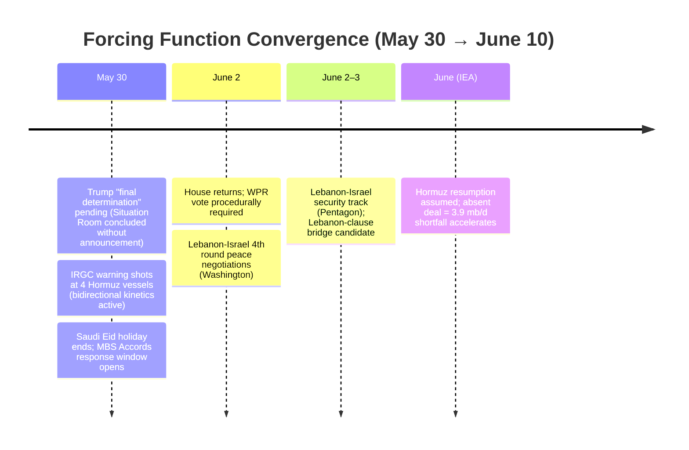
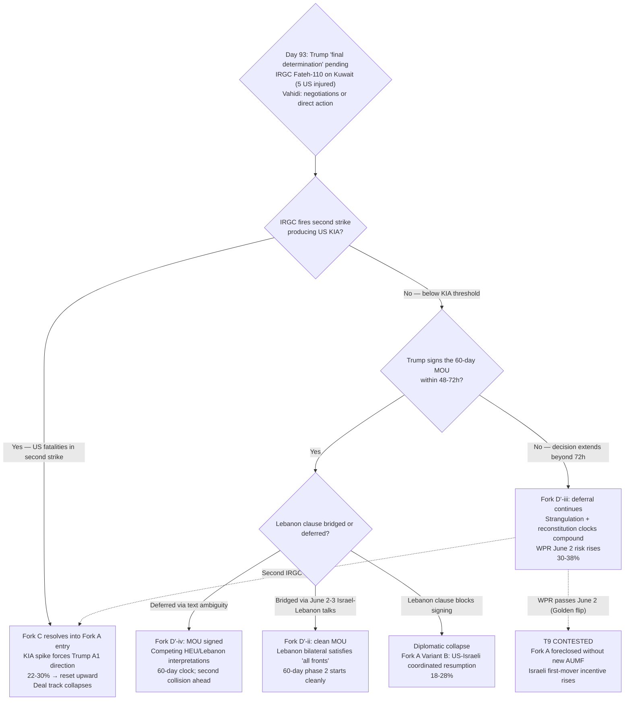

# Iran 2026 Operational SITREP — Daily Update
**Day 93 | Saturday, May 30, 2026**
*Annex/Update to Iran 2026 Operational SITREP and Strategic Synthesis (base report v4.2)*

## Executive Summary

US-Iran tentative 60-day MOU text agreed (May 28); Trump convened a Situation Room "final determination" meeting (May 29) and left without announcing a decision. On the same day the MOU was tentatively agreed, the IRGC executed its stated "reciprocal response": a Fateh-110 ballistic missile at Ali Al Salem Air Base (Kuwait), injuring five Americans and destroying two MQ-9 Reapers — the first IRGC ballistic-missile strike on a US forward base with American casualties since the ceasefire. Vahidi publicly named himself as the apex decision-maker on the deal and blockade track for the first time, partially resolving the A4 discriminating question. Brent closed at ~$92.56 (May 29), down 19% in May (worst monthly loss since March 2020), pricing the deal as probable while the $29/bbl backwardation signals it is not yet signed.

Supersedes `day-90` · Fork C ↑ · Fork D' ↑ · T12 advance

| Vector | Direction | Driver |
|---|---|---|
| Tentative 60-day MOU | NEW | Text agreed May 28; Trump non-signing pending |
| Trump "final determination" | DECISION PENDING | Situation Room met May 29; no announcement; Vance "still TBD" |
| IRGC Fateh-110 on Kuwait | NEW | Ballistic missile at Ali Al Salem; 5 Americans injured; 2 MQ-9s damaged |
| Fork C miscalculation (30d) | 18-25% → 22-30% | Ballistic missile on US base; IRGC warning shots at 4 Hormuz vessels |
| Fork D' structured deferral (30d) | 28-36% → 30-38% | Tentative MOU; 3rd cycle above 30% midpoint; decomposition pre-staging required |
| Vahidi direct statement | NEW | "Negotiations or direct action"; apex role confirmed; A4 partial resolution |
| Brent crude | ↓ to ~$92.56 | -19% May; below $95 Fork B credibility signal; worst since March 2020 |
| A2 forcing question | NEW | 6th+ cycle without WH corroboration; discriminating question generated per Step 7b |
| Lebanon-Israel bilateral | ADVANCE | 45-day extension (May 15); June 2-3 4th round = Lebanon-clause bridge candidate |
| House WPR | APPROACHING | June 2 vote; Rep. Golden flip + 4 GOP = passage within reach |

> Leading primitives: Fork D' 30-38% / 30d, Fork A 18-28% / 30d. Highest-delta this cycle: Fork C ↑ (18-25% → 22-30%), Fork D' ↑ (28-36% → 30-38%). None-of-above floor: 5%.

---

## Section 1 — Operational Update

**The US-Iran tentative 60-day MOU was agreed at the text level on May 28, with Trump stopping short of signing.** Axios (T2): both sides reached the outline; the text covers a 60-day ceasefire extension, US naval blockade lifted proportionally to commercial-shipping restoration, Hormuz reopened without tolls, Iran removes mines, nuclear program deferred to phase-2 negotiation. Trump's stated conditions (Truth Social, May 29, discounted near-zero absent corroboration): Iran "must never have a nuclear weapon or bomb"; Hormuz "must be immediately open"; mines removed. Vance (CBS, May 30): "still TBD." Iran-side conflict: Fars News Agency says Trump is "projecting a fabricated victory" and "distorting" the MOU text on HEU commitments. Per source-independence discipline: the US-officials' HEU-verbal-commitment cluster and Fars' direct contradiction are not averaged; both clusters are reported.

**The IRGC executed its stated "reciprocal response" on May 28, escalating from maritime-denial to ballistic-missile strike.** A Fateh-110 ballistic missile targeted Ali Al Salem Air Base (Kuwait); Kuwaiti air defenses intercepted the weapon, but falling debris caused casualties and equipment damage: five American service members and contractors were injured; two MQ-9 Reaper drones were damaged or destroyed. The IRGC framed the attack as retaliation for US strikes on the Bandar Abbas SAM site. CENTCOM called it an "egregious ceasefire violation." Kuwait's Foreign Ministry condemned the attack as a "flagrant violation of sovereignty." Separately, the IRGC Navy fired warning shots at four vessels near the Strait of Hormuz. Neither event triggered a new US operation name or an Eisenhower deployment order; Trump held deal-direction concurrently.

**Vahidi publicly placed himself at the apex of the deal and blockade decision track for the first time.** Vahidi (May 29): "We will break the blockade through negotiations. If not, through direct action." Al Arabiya (T2, May 21) and Euronews (T2, May 21) independently profiled Vahidi as the "key power broker" and primary Iranian war strategist as talks approach signature. This constitutes T2-level corroboration of the Day 88 IRGC-council-functional-apex re-identification from outside Iran International (T3). Source conflict: WANA attributes the "break blockade via talks or direct action" phrasing to Mohsen Rezaei, not Vahidi; HotAir attributes "utter ruin" to Vahidi. Treated as M-confidence partial: both figures are apex-adjacent within the IRGC council structure. The HEU-specific Vahidi-direct statement (synthesis-level discriminating evidence for A4) is still absent.

**The Lebanon-Israel bilateral track advanced independently, creating a potential Lebanon-clause bridge.** The State Department announced on May 15 (pre-Day-90, missed in prior sweeps) that Israel and Lebanon agreed to a 45-day ceasefire extension after Washington talks, with a framework for lasting peace negotiations. The fourth round of Israel-Lebanon peace negotiations is scheduled for June 2-3 in Washington; a separate security track runs at the Pentagon. If the bilateral process produces durable ceasefire language, Iran may be able to claim its "all fronts" Lebanon-clause condition is being addressed through the bilateral track without requiring a direct Netanyahu concession in the Iran deal text. This is a potential bridging mechanism not visible in the Day 88 or Day 90 sweeps.

**The House WPR is on a hard June 2 timeline.** House Republicans confirmed the privileged-resolution vote will occur when the chamber returns from Memorial Day recess. Rep. Jared Golden (D-ME), who had consistently voted against Iran war-powers resolutions, is planning to flip to YES; four Republicans (Fitzpatrick, Massie, Davidson, Barrett) have previously voted in support. If Golden flips and three Republicans hold, the resolution passes on a simple majority. The Iranian ballistic missile attack on US personnel in Kuwait is a potential political accelerant for further GOP defections under an "undeclared resumed operations" framing, though Trump's deal-direction simultaneously complicates the WPR politics.

### Military Posture (Day 90 → Day 93)

| Asset / signal | Day 90 baseline | Day 93 read | Implication |
|---|---|---|---|
| CSG count in AOR | 2 (Lincoln, Bush; H) | 3 (Lincoln, Bush, Ford per TWZ May 11) | L1 upgrade; force-availability above v4.2 baseline |
| USS Eisenhower | Final preps, East Coast | No deployment order | L1 stable |
| IRGC ballistic missile | Not fired; threat only | Fateh-110 on Ali Al Salem (Kuwait); intercepted; debris = 5 US injuries; 2 MQ-9s | Fork C elevation; "egregious violation" |
| IRGC warning shots | None | Fired at 4 Hormuz vessels | Additional maritime-denial activity |
| US self-defense response | Day 90 Bandar Abbas SAM | Struck Bandar Abbas drone-launch site (Day 93 context) | Self-defense ROE continuing |
| Iran Hormuz missile sites | 30/33 operational | Unchanged | L1 baseline |
| IDF Lebanon posture | US-approved ground-op expansion | 45-day bilateral ceasefire; June 2-3 4th round | Lebanon bilateral track advancing |
| Cyber | Stage 1/2 OPERATIONAL; Stage 3 LATENT | No change | Unchanged |

### Markets (Day 90 → Day 93)

| Asset | Pre-war (Feb 28) | Day 90 (May 27) | Day 93 (May 30) | Δ vs pre-war |
|---|---|---|---|---|
| Brent crude | $73 | ~$99.58 | ~$92.56 | +27%; worst monthly loss since March 2020 |
| WTI crude | $70 | ~$93 | ~$86 (est.) | +23% |
| Brent backwardation (Jul26-Jul27) | flat | ~$29/bbl | ~$29/bbl | Structural tightness holds; collapses only on signed deal |
| Iranian rial parallel | ~960k/USD | ~1,726,000 | ~1,709,000 | -44%; appreciating toward Day 88 level on deal signals |
| US gas / gallon | $3.27 | ~$4.30 | ~$4.15 (est.) | +27% (easing on deal-pricing) |

---

---

## Section 2 — Framework Validation

- **A1 (Trump improvisational/oscillating principal):** Trump convened a Situation Room meeting rather than pivoting to Fork A framing after the IRGC ballistic missile struck US personnel in Kuwait — the strongest A1 behavioral durability test in the framework window.
- **A4 (Iranian apex = IRGC military council / Vahidi):** Vahidi's first public named statement on the deal and blockade track plus T2 profiling as "key power broker" (Al Arabiya, Euronews) corroborate the Day 88 re-identification at the T2 level, distinct from the Day 88 Iran International T3 base.
- **A9 (constraints precede; actors select):** The IRGC agreed to the tentative MOU text and fired a Fateh-110 at a US base on the same day; deterrence-maintenance and deal-engagement are simultaneously dominant strategies under joint constraints; no actor designed the conjunction.
- **A10 (Slantchev feigning-weakness):** Fateh-110 ballistic missile use against a US forward base confirms Iranian capability at the highest severity level in this conflict window.
- **A11 (inadvertent escalation, Talmadge):** Bidirectional exchange (US self-defense strikes → IRGC ballistic missile → US drone-site strike → IRGC warning shots at four vessels) is the expanding-inadvertent-escalation pathway §5.15 models.
- **A22 (structured deferral as Trump dominant strategy):** Trump's "final determination" framing, Situation Room convening, and ships cleared from Hormuz on Trump's instruction all confirm the LOI/deferral track as the dominant option under joint constraints; selection remains contingent.

---

## Section 3 — Framework Revisions Required

**TRIGGER FIRED (PROBE-7, H, immediate): Fork C 18-25% → 22-30%.**
Prior: 18-25% (Day 90; mine-laying + drone context). What broke it: IRGC Fateh-110 ballistic missile on Ali Al Salem Air Base (Kuwait) with five Americans injured and two MQ-9 Reapers damaged; IRGC warning shots at four Hormuz vessels; CENTCOM "egregious ceasefire violation." Revised: 22-30% (30d). The inadvertent-escalation pathway widened from maritime-denial (Day 90) to ballistic-missile-on-US-base-with-casualties (Day 93). The "KIA spike forces Trump A1 direction" sub-trigger from Day 90 SITREP §7 is now armed. Trend cross-check: T12 advance (capability-recovery at ballistic-missile level); T2 advance (multi-channel network kinetically active); A11 consistent. Calibration: per PROBE-7 discriminator (no US KIA; no new operation name; Trump deal-direction held), this stays Fork C. The threshold between "ceasefire-edge inadvertent escalation" and "resumed operations" is under active stress; a second IRGC strike producing US fatalities is the discriminating boundary.

**TRIGGER FIRED (PROBE-12', H, immediate): Fork D' 28-36% → 30-38%; 3rd consecutive cycle above 30% midpoint.**
Prior: 28-36% (Day 90 hold). What moved it: US-Iran tentative 60-day MOU agreed on text (May 28); Trump Situation Room meeting without announcement (May 29); Rubio "a couple of days" framing carries; Munir-to-China "close" carries. Revised: 30-38% (30d; midpoint ~34%). Trend cross-check: T1 advance (Gulf mediator architecture); T3 advance (IRGC-authorized mid-tier negotiated the text within apex floors). Conflict on HEU terms (Fars "distorting") applies to the specific HEU-commitment claim; the LOI architecture (§5.26) is designed to defer the HEU collision, not resolve it pre-signature, so the contradiction is structurally expected. **Decomposition pre-staging required per /premortem Mitigation 4; see Section 5.**

**L1 POSTURE UPDATE (PROBE-7, H, immediate): Three CSGs in CENTCOM AOR.**
Prior: v4.2 §1.2 two CSGs (Lincoln, Bush). New: TWZ (T2, May 11) reports USS Gerald R. Ford (CVN-78) confirmed in CENTCOM AOR alongside Lincoln and Bush — first three-carrier simultaneous deployment since 2003. Update §1.2; force-projection posture higher than v4.2 baseline.

**FORK B credibility signal (PROBE-8, M, next_cycle): Brent below $95.**
Prior: Brent ~$99.58 (Day 90). Changed: Brent ~$92.56 (May 29-30), down 19% in May (worst since March 2020 COVID). The PROBE-8 "Brent below $95: Fork B credibility signal" trigger has fired. This is a credibility signal, not a Fork B confirmation — the $29/bbl backwardation persists (structural tightness); no commercial restoration announced. Backwardation collapse toward $5-10/bbl would be the high-confidence Fork B market confirmation.

**A2 PRINCIPAL-VALIDATION: Step 7b forcing question (6th+ cycle).**
Per sweep.md Step 7b (added 2026-05-27 via /premortem Mitigation 1): the Netanyahu-relayed "full dismantlement / all HEU removed" private-assurance claim is in its 6th+ consecutive cycle without a White House readout using that language. The discriminating-evidence forcing question for the next cycle: **Does Trump sign the 60-day MOU as structured (deferring HEU to phase 2)?** If yes, the Netanyahu-relay maximalist assurance is confirmed as Netanyahu's projection rather than Trump's commitment; A2 demotes to "Netanyahu-coalition-projected, not Trump-committed." If Trump refuses to sign absent explicit upfront Iranian HEU-out commitment, the relay carries more substance. The next /audit must stage a synthesis manifest for A2 demotion pending the signing decision.

---

## Section 4 — Framework Additions

**Lebanon-Israel bilateral as Lebanon-clause bridge mechanism (missed in prior sweeps).** The State Department announced on May 15 that Israel and Lebanon agreed to a 45-day ceasefire extension after Washington talks, with a framework for lasting peace negotiations. This bilateral track (4th round June 2-3 in Washington; security track at the Pentagon) is structurally relevant to the Iran deal Lebanon clause. Iran's "all fronts" insistence requires a "sustainable Lebanon ceasefire"; if the bilateral process produces enough durable ceasefire progress, Iran may be able to claim the Lebanon-front condition is satisfied through the bilateral process rather than requiring a direct Israeli concession in the Iran deal text on "operational freedom." This is a potential bridging mechanism that runs on the same clock as Trump's signature decision: progress at June 2-3 may unlock Fork D'-ii (clean MOU with Lebanon clause bridged). Flag for /revise §5.27 update: the Lebanon clause has now appeared across Day 88, Day 90 (kinetic activation), and Day 93 (bilateral bridge candidate), approaching or meeting the three-annex permanence threshold. Move §5.27 Lebanon clause from Provisional to permanent §5.x at next /revise.

---

## Section 5 — Revised Probability Matrix

### 5a. 30-Day Matrix (cycle-Bayesian)

| Outcome | 30 days | vs. Day 90 | Driver |
|---|---|---|---|
| **Fork D': Structured deferral via LOI** | **30-38%** | ↑ from 28-36% | Tentative MOU agreed; Trump Situation Room; 3rd cycle above 30% midpoint |
| Fork A: Kinetic resumption (composite) | 18-28% | HELD | Kuwait not KIA; Trump deal-direction held; no new operation name |
| · Israeli pre-emption (14-21d) | 28-40% | ↓ slight from 30-43% | Lebanon bilateral advancing (June 2-3) partially bridges Lebanon clause; T12 amplifier holds |
| Fork C: Miscalculation cascade | 22-30% | ↑ from 18-25% | IRGC Fateh-110 on Kuwait; warning shots at 4 vessels; 5 Americans injured |
| Fork B-bilateral | 8-13% | HELD | HEU contradiction (Fars vs US officials) persists; apex PA-gap unchanged |
| Fork B-multilateral via Gulf pathway | 10-15% | ↓ from 11-18% | MBS Palestinian-state-first confirmed; Accords demand structural obstacle |
| Combined Fork B | 18-28% | ↓ slight | Both sub-paths compressed |
| None-of-above | 5% floor | HELD | Mandatory non-zero |

**Fork D' midpoint ~34%; 3rd consecutive cycle above 30%** (Day 87 below; Day 88 ~32%; Day 90 ~32%; Day 93 ~34%). One more above-30% cycle at the next SITREP triggers mandatory decomposition into named variants. Candidates pre-staged:

- **D'-i** (Trump signs within 48h; Lebanon clause deferred via text ambiguity): Both apexes read the text as non-pre-committing on Lebanon terms. Named principal: Trump. Discriminating signal: Trump signing statement + Iranian FM named acceptance.
- **D'-ii** (Lebanon clause bridged via June 2-3 bilateral): Israel-Lebanon bilateral produces ceasefire language Iran accepts as satisfying "all fronts." Named principal: Israel-Lebanon negotiators. Discriminating signal: State Dept Lebanon breakthrough + Iranian FM accepts Lebanon clause in Iran deal.
- **D'-iii** (non-signing extends past 72h; strangulation clock compresses): Trump withholds signature pending HEU or Lebanon movement. Named principal: Trump (holding). Discriminating signal: 72h+ without announcement + continued Rubio/Vance engagement.
- **D'-iv** (signed with dual-reading text): Both sides sign but publicly characterize the text contradictorily on HEU and Lebanon; second collision 60 days hence. Named principal: both apexes reading non-pre-commitment into the same text. Discriminating signal: signed MOU + simultaneous US/Iran contradictory public characterizations.
- **D'-v** (LOI collapses via IRGC second strike / US KIA): IRGC executes a second strike producing US fatalities; Trump A1 forced toward Fork A before signing. Named principal: IRGC. Discriminating signal: US KIA in a second IRGC kinetic action.

> **Kinetic Escalation Composite [DERIVED]: ~50-70% (30d).** Construction: Fork A 18-28% + Fork C 22-30% + conflict-leading tail (<2% Israeli first nuclear use 30d; 3-8% inadvertent WMD 90d). Up from ~47-65% (Day 90) on Fork C elevation. Primitives lead; composite is a continuity footnote.

### 5b. 6/12-Month Matrix (structural-prior; no update this cycle)

No trend-state transition, L1-L5 structural constraint shift, or major-version increment. Values unchanged from v4.1 / None-of-above structural addition v4.2.

| Outcome | 6 months | 12 months | Last updated | Driver |
|---|---|---|---|---|
| Fork A composite | 38-48% | 43-53% | v4.1 (Day 84) | Time arithmetic; T12 reconstitution-speed amplifier |
| Fork B-bilateral | 12-18% | 12-18% | v4.1 (Day 84) | Apex PA-gap constraint |
| Fork B-multilateral | 12-20% | 14-22% | v4.1 (Day 84) | Gulf pathway institutionalizing |
| Fork D' structured deferral | 18-24% | 12-18% | v4.1 (Day 84) | LOI expiration compresses at horizon |
| Fork C miscalculation cascade | 16-22% | 16-22% | v4.1 (Day 84) | Structural accident pathway |
| None-of-above | 10-15% | 10-15% | v4.2 (Day 88) | Mandatory non-zero floor |
| Israeli first nuclear use (conditional) | <2% | 12-20% | v4.1 (Day 84) | Conditional on HEU sub-state |
| Tripolar reordering substantially advanced | partial | 80-90% | v4.1 (Day 84) | T1/T10/T11 trajectory |

---

## Section 6 — Probe Status Table

| PROBE | Status | Conf | Trigger | Variable Moved |
|---|---|---|---|---|
| 1 Mojtaba Status | partial | M | no | A4 reinforced; T2 "key power broker" carry; no visual; BS-1a held |
| 2 IRGC Factional | fired | M | yes | Vahidi-named statement on blockade/negotiations; A4 apex role confirmed; BS-1a +5pp (77-85%); HEU-specific absent |
| 6 Chinese Support | partial | M | no | Chinese banks partial Hengli loan-freeze (NFRA); not full cascade; BS-4 retirement deferred |
| 7 CENTCOM Posture | fired | H | yes | IRGC Fateh-110 on Ali Al Salem; 5 US injured; Fork C ↑ 18-25% → 22-30%; 3 CSGs in AOR (L1 update) |
| 8 Oil Markets | fired | M | yes | Brent ~$92.56, -19% May; below $95 Fork B credibility signal; rial appreciating |
| 9 Israeli Internal | partial | M | no | Lebanon-Israel 45-day extension (May 15; missed prior) + June 2-3 4th round = Lebanon-clause bridge candidate |
| 10 War Powers | partial | M | no | House returns June 2; WPR vote required; Golden flip + 4 GOP = passage within reach |
| 11 Russian Settlement | partial | M | no | Only May 9 confirmed; pared-down parade noted; BS-9.3 approaching threshold |
| 12' MOU Framework | fired | H | yes | Tentative 60-day MOU agreed; Trump non-signing; Fork D' ↑ 28-36% → 30-38%; 3rd cycle above 30% |
| 13 PA-Gap | fired | M | yes | Trump held deal-direction through Kuwait ballistic missile (strongest A1 durability); A2 forcing question generated |
| 14 Iranian Residual | fired | H | yes | Fateh-110 on US base = T12 use-confirmed at ballistic-missile level (highest severity in window) |
| 15 Dispositional | fired | M | yes | T8 Powell at maximum loading; tentative deal + ballistic missile simultaneously; Lebanon bilateral bridge |
| 16 First-Mover | fired | H | yes | Trump signature = most acute first-mover threshold; Fork D' vs KIA-trigger both live within 24-96h |
| 17 Russian Siloviki | partial | M | no | May 9 pared-down parade; no further appearances; BS-9.3 approaching threshold; Russia inert |
| 18 Eschatological | null | M | no | No Tier-1 fire; Eid ongoing through May 31 |
| 20 Gulf Troika | fired | M | partial | MBS Palestinian-state-first confirmed; Fork B-multilateral ↓ 11-18% → 10-15%; brake intact |
| 21 Paine Death-Ground | partial | M | no | P-AIM limited holds; P-DG non-fire (assets not principals); P-OVEX advancing |

---

## Section 7 — Conclusion and Forking Analysis

### Central Thesis Check

The v4.0-v4.2 central thesis is holding at the highest-stress test in the framework window. The materialist bargaining model predicts that under joint constraints, each named actor's dominant strategy is determined by the constraint surface rather than by design. Day 93 provides the clearest instantiation: under L3 (strangulation clock + IEA shortfall path + gas-price clock), the deal-deferral track is the relatively dominant option for Trump; under L2 (deterrence-maintenance; capability-demonstration sustains post-deal leverage), continued IRGC kinetics are the dominant option for Vahidi and the council; both strategies were selected simultaneously on the same day. Trump held deal-direction through the ballistic missile attack without pivoting to Fork A. Netanyahu channeled the Powell-closing-window pressure into the Lebanon bilateral track (T8) rather than a unilateral Iran strike. No actor designed the bifurcation; it is the joint equilibrium of constrained choices.

Trend-state lines: **T1 advance** (MBS autonomous refusal of Accords demand; Gulf brake intact; unaligned-middle pivot capacity operating). **T2 advance** (Fateh-110 on Kuwait US base = multi-channel network at ballistic-missile level). **T3 advance** (Vahidi direct statement on deal track; T2 "key power broker" corroboration of A4 re-identification). **T4 advance** (Trump held through ballistic missile; 7th+ consecutive cycle without maximalist counter-mobilization). **T5 hold PENDING** (Eid; no Tier-1 fire). **T6 hold** (BS-9.3 approaching threshold; Russia inert). **T7 hold** (voice discipline). **T8 advance** (tentative deal at threshold + capability demonstration + Lebanon bilateral bridge attempt = maximum Powell loading). **T9 hold** (House WPR June 2 structural test approaching). **T10 hold PENDING** (Chinese banks partial compliance; Russia inert). **T11 advance** (three CSGs; UK/France mine-clearing architecture carries; multiplex Hormuz configuration). **T12 advance** (Fateh-110 = highest-severity use-confirmation in the window; first post-promotion cross-check at maximum loading). No VALIDATED trend contradicted this cycle.

### Forking Tree (72-Hour Decision Path)

### Operative Judgment

The framework's dominant observable for the next 48-72 hours is Trump's signature decision, not the IRGC's ballistic missile. The Kuwait strike was the most serious kinetic action since the ceasefire (five Americans injured; an "egregious violation"), but it was intercepted and below the "KIA spike forces A1 direction" threshold from Day 90 SITREP §7. Trump's behavioral response was to convene a Situation Room meeting on the deal rather than issue new strike orders. That is a stronger durability signal than any prior cycle in this framework window. The deal is at the signature line; the constraining question is not whether Trump is deal-leaning but what last-minute condition is holding back the pen.

Two structural developments since Day 90 reshape the Lebanon-clause analysis in ways this sweep is the first to capture. The Lebanon-Israel 45-day ceasefire extension (May 15) and the June 2-3 fourth round of bilateral peace negotiations were missed in the Day 88 and Day 90 sweeps. These create a potential bridging path: if the Israel-Lebanon bilateral produces enough durable ceasefire progress before or concurrent with a Trump signature, Iran may be able to accept the Iran deal text by characterizing its "all fronts" Lebanon condition as satisfied through the bilateral process, rather than requiring a direct Netanyahu concession in the Iran deal. If June 2-3 produces meaningful language, Fork D'-ii opens. That path runs on the same 48-96 hour clock as Trump's decision, making the two most consequential forcing functions in the window converge on the same date.

The House WPR vote on June 2 adds a third converging forcing function. Rep. Golden's planned flip plus four Republican holdouts puts the resolution within reach. A deal signed before June 2 renders the WPR vote politically moot on the immediate-authorization question, though T9 lock-in continues accumulating. A non-signed MOU as of June 2 puts the WPR and the deal on the same clock, with each outcome shaping the other's probability: a WPR passage would foreclose the legal pathway for resumed Fork A operations and simultaneously elevate Netanyahu's incentive to act before US kinetic authority narrows further.

The A2 forcing question is now binary and observable within this cycle. Trump's signature on a 60-day MOU deferring HEU to phase 2 would confirm the Netanyahu-relay maximalist assurance as Netanyahu's projection rather than Trump's commitment; refusal to sign absent explicit upfront HEU removal would give the relay more substance. The next /audit must stage the A2 demotion manifest per Step 7b action-routing. The framework cannot predict selection on any of these three axes; it identifies the constraint surface that ranks the options and names the signals that would falsify the current rankings.

### Signals That Force Immediate Revision

- Trump signs the 60-day MOU (Iranian FM named acceptance follows): Fork D' activates; 60-day clock begins; A2 demoted to "Netanyahu-coalition-projected"; matrix resets toward Fork D' as dominant
- IRGC executes a second strike producing US KIA: "KIA spike" trigger fires; Fork C resolves into Fork A entry; deal track collapses
- House WPR passes June 2 (Golden flip + 3+ GOP): T9 CONTESTED; Fork A foreclosed without new AUMF; Israeli first-mover incentive rises
- Iranian Tier-1 named rejection of the MOU (Araghchi or Ghalibaf publicly): Fork D' collapses; Variant B diplomatic-collapse pathway activates
- Lebanon-Israel June 2-3 negotiations produce named ceasefire text Iran accepts: Lebanon-clause bridge confirmed; Fork D'-ii path opens
- Vahidi-direct named statement on HEU disposition: A4 apex attribution fully resolved on the deal-determining axis; synthesis-level A4 discriminating evidence met
- USS Eisenhower deployment order: Fork A timeline compresses; BS-15 US first-mover threshold breached
- MBS public statement supporting US military action against Iran: BS-18 brake fractures; Fork A re-elevated within 24h

---

*Compiled May 30, 2026 | Day 93 | Subject to revision as data updates*
*Next SITREP: Day 94 (May 31); monitoring: Trump signature decision (Fork D' vs Fork C KIA-trigger); IRGC second-strike or non-strike signal; June 2 House WPR vote; Lebanon-Israel 4th round (June 2-3); Vahidi-direct HEU statement; MBS post-Eid public response.*
*Companion: sweep-2026-05-30.json; synthesis-v4-2.md.*
