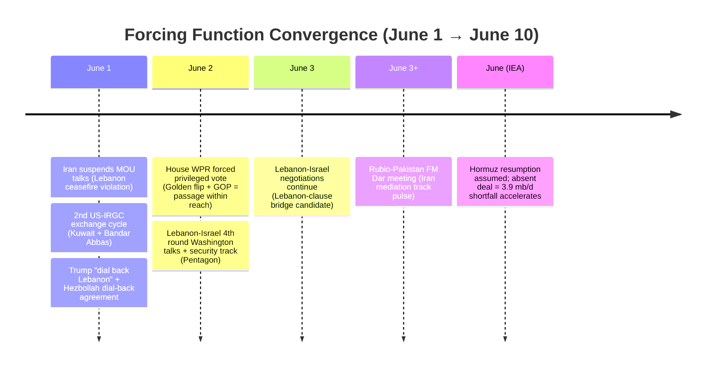
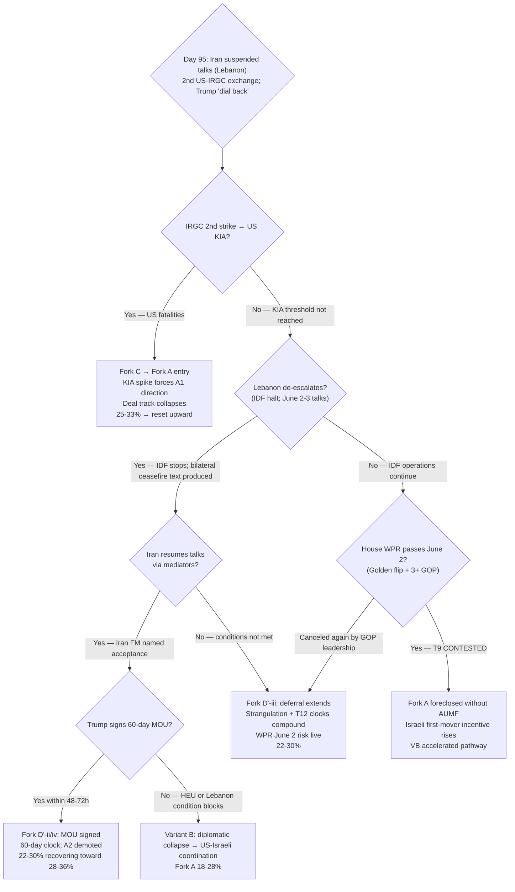

# Iran 2026 Operational SITREP — Daily Update
**Day 95 | Monday, June 1, 2026**
*Annex/Update to Iran 2026 Operational SITREP and Strategic Synthesis (base report v4.2)*

## Executive Summary

Iran suspended exchange of messages with US via mediators (Tasnim/T2 June 1), citing Israeli Lebanon operations as a ceasefire violation "on all fronts"; Araghchi: "violation on one front is a violation on all fronts; no dialogue until Israel fully withdraws from Lebanon and halts all attacks in Lebanon and Gaza." Netanyahu confirmed IDF past the Litani River, capturing Beaufort Castle and ordering Beirut Dahieh strikes — deepest Lebanon incursion in 26 years. A second US-IRGC kinetic exchange cycle ran in parallel (US Sirik Island telecom tower → IRGC Kuwait base + warning shots → US Bandar Abbas drone-launch site). Brent spiked 7% intraday on the talks suspension before settling +4.5% at $94.98. Trump oscillated within hours: "Talks are continuing, at a rapid pace" (Truth Social, T1, near-zero informational value per discount rule) then "I don't care if they're over, honestly" (CNBC direct quote) — the tightest A1 oscillation arc in the framework window. The §A23 mechanism executed as predicted: under the constraint of "limited kinetic options without US permission," the Lebanon clause was Netanyahu's dominant strategy to block the deal without ordering a unilateral Iran nuclear strike.

Supersedes `day-93` · Fork D' ↓ · Fork C ↑ · §A23 confirmed

| Vector | Direction | Driver |
|---|---|---|
| Iran talks suspension | NEW | Lebanon "all fronts" ceasefire violation cited |
| Fork D' structured deferral (30d) | 30–38% → 22–30% | Talks suspended; Lebanon clause executed |
| Fork C miscalculation cascade (30d) | 22–30% → 25–33% | 2nd exchange cycle; dual-chokepoint threat |
| Netanyahu Lebanon operations | NEW | IDF past Litani; Beaufort Castle; Beirut Dahieh |
| Brent crude | +4.5% to ~$94.98 | Talks-suspension spike; settled below intraday high |
| Hormuz + Bab el-Mandeb | NEW | Iran/Axis threatens dual-chokepoint activation |
| §A23 Lebanon clause | CONFIRMED PERMANENT | 4 annex appearances; mechanism executed through IDF ops |
| MBS Abraham Accords demand | RESOLVED | White House "complement" language; Slantchev-inverse confirmed |
| House WPR | APPROACHING | June 2 forced privileged vote; Golden flip + 4 GOP = passage within reach |
| BS-9.3 Putin | APPROACHING | May 2026: 1 appearance; June 2026: 0 confirmed |

> Leading primitives: Fork D' 22–30% / 30d (down), Fork A 18–28% / 30d (held). Highest-delta this cycle: Fork D' ↓ (talks suspended); Fork C ↑ (escalation compounding). None-of-above floor: 5%.

---

## Section 1 — Operational Update

**Iran suspended all exchanges with US via mediators, conditioning resumption on Israeli Lebanon withdrawal and Gaza halt.** Tasnim News Agency (June 1) stated Iran's negotiating team is suspending "discussions and exchanges of texts through intermediaries" due to "continuing crimes of the Zionist regime in Lebanon." Araghchi framed the explicit condition: Israel must fully withdraw from Lebanon and halt all attacks in both Lebanon and Gaza before talks resume. Iran simultaneously told mediators it holds Washington directly responsible for Israeli military conduct. Iran and the Axis of Resistance stated their "determination to completely block the Strait of Hormuz and activate other fronts, including the Bab al-Mandab Strait" (CNBC/Middle East Eye/Euronews, T2 multi-outlet June 1).

**Trump held deal-direction while oscillating within hours.** Truth Social: "Talks are continuing, at a rapid pace" (T1, near-zero informational value per discount rule; A1 oscillation signal). CNBC same session: "I don't care if they're over, honestly" and talks "started to get very boring." Both within hours. Trump separately confirmed: told Netanyahu and Hezbollah to "dial back fighting"; no troops going to Beirut; forces "on their way have been turned back." CBS News: Trump recently personally edited the MOU text — including enriched uranium and Hormuz language — a structural signal that the HEU framing in the text is Trump-edit, not a Netanyahu-relay product. Rubio scheduled to meet Pakistan FM Muhammad Ishaq Dar for Iran mediation (deal track holds structural pulse despite suspension).

**Netanyahu ordered IDF past the Litani River; captures Beaufort Castle; orders Beirut Dahieh strikes.** IDF captured Beaufort Castle (strategic ridge ~14.5km from Israeli border, May 31 into June 1). Netanyahu: "Our forces have crossed the Litani and advanced to controlling positions; we are operating in Beirut, in the Beqaa, across the entire width of the front." Netanyahu ordered strikes on Beirut Dahieh on June 1. Netanyahu asserts the ceasefire "did not apply to Lebanon"; Iran, Pakistan FM Sharif, and Lebanon disagree. Lebanon-Israel 4th round peace negotiations remain scheduled June 2-3 in Washington (State Department confirmed); security track running at Pentagon.

**A second US-IRGC kinetic exchange cycle ran June 1, distinct from the Day 93 Fateh-110 baseline.** US struck Sirik Island telecommunications tower; IRGC responded with additional ballistic missiles and drones at Ali Al Salem Air Base (Kuwait); Kuwaiti air defenses intercepted, but 3 Kuwaiti servicemembers were injured from debris and civil aviation over Kuwait was disrupted. US then struck a Bandar Abbas drone-launch site in self-defense. CENTCOM: "egregious ceasefire violation." Per PROBE-7 discriminator: no new operation name; reactive to named IRGC provocation; no offensive ROE shift; Trump deal-direction held concurrently. Scored Fork C inadvertent-escalation, not Fork A resumption.

**Military / Maritime Posture:**

| Asset / signal | Day 93 (May 30) | Day 95 (June 1) | Implication |
|---|---|---|---|
| CSG count in AOR | 3 (Lincoln, Bush, Ford) | 3 held | L1 stable |
| USS Eisenhower | Final preps, East Coast | No deployment order | L1 stable |
| IRGC kinetics | Fateh-110 Kuwait (May 28) | June 1: Kuwait base + warning shots | Fork C inadvertent-escalation widening |
| Hormuz threat | 30/33 missile sites; partial denial | Complete closure threatened + Bab el-Mandeb | T2/T12 escalation; new scope |
| IDF Lebanon | 45-day bilateral (May 15); cross-Litani | Past Litani; Beaufort Castle; Beirut Dahieh | §A23 executed |
| MOU signing | Text agreed; Trump non-signing | Iran suspended talks; Lebanon clause fired | Fork D' under acute stress |
| UK/France Hormuz | HMS Dragon + Charles de Gaulle deploying | Unchanged | T11 multiplex indicator |
| Cyber | Stage 1/2 OPERATIONAL; Stage 3 LATENT | No change | Unchanged |

**Iranian apex update.** Vahidi-direct HEU statement absent for 6th+ consecutive cycle. IRGC simultaneously agreeing MOU text and executing June 1 kinetics confirms A9: deterrence-maintenance and deal-engagement are simultaneously dominant strategies under joint constraints. Iran seeking Chinese guarantees before proceeding with any agreement (T3 multi-source, Carnegie Endowment); China offered to "facilitate transfer of Iran's uranium" (HotAir/T4, single-outlet; L confidence; logged as structural signal).

**Markets:**

| Asset | Pre-war (Feb 28) | Day 93 (May 30) | Day 95 (June 1) | Δ vs pre-war |
|---|---|---|---|---|
| Brent crude | $73 | ~$92.56 | ~$94.98 (+4.5%) | +30% |
| WTI crude | $70 | ~$86 est | ~$89 est | +27% |
| Brent backwardation (Jul26–Jul27) | flat | ~$29/bbl | ~$29/bbl | Tightness holds; collapses only on signed deal |
| Iranian rial parallel | ~960k/USD | ~1,709,000 | ~1,709,000 (uncertain) | -44%; direction unclear on talks suspension |
| US gas / gallon | $3.27 | ~$4.15 est | ~$4.20 est | +28% |

Brent closed +4.5% at $94.98 after an intraday 7% spike on the Iran suspension announcement; Trump Truth Social post stabilized the market. $29/bbl backwardation persists: market prices a deal as possible but not locked. Dual-chokepoint threat (Hormuz complete closure + Bab el-Mandeb) is not fully priced at $94.98; confirmed operational dual closure would push well above the $115 Fork A repricing threshold.

**US domestic.** House Republicans canceled the scheduled WPR vote on May 22 (NBC/NPR/CNN) when it became clear the resolution would pass bipartisan. June 2 forced privileged vote approaching: Rep. Jared Golden (D-ME) planning flip to YES; four Republicans (Fitzpatrick, Massie, Davidson, Barrett) have previously voted in support. Three holdovers present = passage within reach. IRGC Kuwait strike on US personnel is a potential political accelerant for further GOP defections under "undeclared resumed operations" framing. Democrats "poised to force repeated Iran war powers votes" (The Hill).

**China.** NFRA private directive: banks to withhold new yuan loans to OFAC-designated refineries including Hengli (Dalian). MOFCOM blocking order (May 2) still in force. Standard dual-track compliance pattern. No banking cascade confirmed; BS-4 retirement remains deferred.

---

---

## Section 2 — Framework Validation

- **A9 (constraints precede; actors select):** IRGC agreed the tentative MOU text and executed June 1 Kuwait strikes on the same day. Deterrence-maintenance and deal-engagement are simultaneously dominant under joint L1-L5 constraints; no actor designed the conjunction.
- **A22 (structured deferral as Trump dominant strategy):** Trump held deal-direction through a ballistic missile attack and Iran's talks suspension, issuing Lebanon de-escalation instructions to both Netanyahu and Hezbollah — strongest A1 structural-durability signal in the window.
- **§A23 (diplomatic-spoiler as Netanyahu dominant strategy under kinetic constraint):** Netanyahu ordered IDF past the Litani and Beirut strikes while multiple sourced assessments hold Iranian nuclear pre-emption "limited without US permission." The Lebanon operations exceed IDF Chief Zamir's baseline and are Netanyahu-coalition-driven; §A23 mechanism confirmed through actual military operations, not only diplomatic blocking.
- **T8 (Powell shifting-power):** As the deal approached signature, Netanyahu escalated in Lebanon to block it — Powell's predicted spoiler deployment confirmed at maximum loading.

---

## Section 3 — Framework Revisions Required

**TRIGGER FIRED — Fork D' ↓ 30–38% → 22–30% (PROBE-12', H, immediate).**
Prior: 30–38% (Day 93). What broke it: Iran suspended exchange of messages via mediators (Tasnim/T2 June 1) citing Lebanon ceasefire violation; Lebanon clause executed through actual IDF operations; Trump has not signed. Revised: 22–30% (30d). This is a conditional suspension, not a text rejection — Iran did not reject the MOU text; it suspended exchanges until Lebanon de-escalates. Trump "dial back" instruction and June 2-3 bilateral path preserve a resumption window; the downward revision reflects window narrowing, not Fork D' collapse. Trend cross-check: T3 advance (IRGC council holding MOU text ready while executing kinetics = two-level structure at maximum loading); T1 advance (Lebanon clause execution confirms unaligned-middle dynamics).

**TRIGGER FIRED — Fork C ↑ 22–30% → 25–33% (PROBE-7, H, immediate).**
Prior: 22–30% (Day 93). What moved it: second US-IRGC exchange cycle (June 1) plus Iran/Axis dual-chokepoint threat (complete Hormuz + Bab el-Mandeb). Individual exchanges scored Fork C per discriminator (self-defense framing; no new operation name; Trump deal-direction held); the qualitative escalation — talks suspension combined with dual-chokepoint threat — expands the inadvertent-escalation surface beyond Day 90 discriminator scope. The KIA threshold remains the operative Fork C-to-Fork A discriminator; not yet reached. Trend cross-check: T12 advance (June 1 strikes + dual-chokepoint threat = capability use at new scope); T2 advance (multi-channel network kinetically active at ballistic-missile level).

**TRIGGER FIRED — §5.27 Lebanon clause promoted to permanent mechanism (PROBE-9, H, immediate).**
Prior: Provisional §5.27. What promoted it: four annex appearances (Day 88 diplomatic-blocking; Day 90 kinetic activation; Day 93 bilateral bridge candidate; Day 95 mechanism executed through actual IDF operations). Three-annex permanence threshold exceeded. §A23 (diplomatic-spoiler as Netanyahu dominant strategy) fully confirmed: Netanyahu ordered IDF past Litani and Beirut strikes while the kinetic-options constraint ("limited without US permission") was operative. Flag for next /revise: promote Lebanon clause from §5.27 Provisional to permanent §5.x with full mechanism text and §A23 as a confirmed assumption. Trend cross-check: T8 advance; T4 advance (Netanyahu autonomous action confirms US-Israeli principal gap at direct-ordering level).

---

## Section 4 — Framework Additions

**Iran dual-chokepoint threat: Hormuz complete closure + Bab el-Mandeb activation.** Iran and the Axis of Resistance stated (June 1, state media; T2 Western confirmation via CNBC, Middle East Eye) their "determination to completely block the Strait of Hormuz and activate other fronts, including the Bab al-Mandab Strait." This is structurally new: the prior framework modeled Hormuz partial denial (maritime restriction, not complete closure) and did not instrument the Bab el-Mandeb as an active threat variable. A combined dual-chokepoint closure places an estimated $10 billion/day of global trade at risk, blocks ~30% of global container shipping, and threatens ~22% of global oil supply. The threat is state-media posture at this cycle; operational execution is not confirmed.

Flag for /audit (three items):
- Add Bab el-Mandeb activation to PROBE-8 target signals; add framework revision trigger: "Bab el-Mandeb partial or full operational closure by Houthis or IRGC — dual-chokepoint confirmation; Fork A repricing and strangulation step-function."
- Add Gulf brake scope note to BS-18: the brake does not extend to Israeli Lebanon operations; Gulf states did not interpose on Netanyahu's escalation this cycle.
- Add "Gulf state response to Netanyahu Lebanon escalation (coordinated or absent)" as a standing PROBE-20 target signal; absence of brake on Lebanon is itself informative.

---

## Section 5 — Revised Probability Matrix

### 5a. 30-Day Matrix (cycle-Bayesian)

| Outcome | 30 days | vs. Day 93 | Driver |
|---|---|---|---|
| **Fork D': Structured deferral** | **22–30%** | ↓ from 30–38% | Talks suspended; Lebanon clause executed; D'-iii operative state |
| **Fork A: Kinetic resumption (composite)** | **18–28%** | HELD | Lebanon theater (not nuclear); no Eisenhower order; Trump deal-direction held |
| · Israeli pre-emption (14–21d) | 28–40% | HELD | Lebanon ops = §A23 diplomatic-spoiler; nuclear pre-emption distinct; T8 maximum |
| · US Vahidi decapitation (standalone; absorbed) | 5–12% | HELD | Target framing sharpened by A4; magazine-efficient |
| **Fork C: Miscalculation cascade** | **25–33%** | ↑ from 22–30% | 2nd exchange cycle; dual-chokepoint threat; talks suspended; KIA threshold not yet reached |
| Fork B-bilateral | 8–13% | HELD | HEU source conflict (Axios vs Fars); apex PA-gap unchanged |
| Fork B-multilateral via Gulf | 8–12% | ↓ from 10–15% | Talks suspended; Gulf brake not deployed on Lebanon |
| Combined Fork B | 16–25% | ↓ | Both sub-paths compressed |
| None-of-above | 5% floor | HELD | Mandatory non-zero |

**Fork D' decomposition status.** Day 95 midpoint ~26% — below 30%; talks suspended. Decomposition trigger (4+ consecutive cycles above 30%) does NOT fire: Day 95 breaks the streak (Days 88/90/93 above 30%; Day 95 below). Three of the last four cycles were above 30% midpoint, triggering the pre-staging requirement. Pre-staged candidates remain relevant if Lebanon de-escalates:

- **D'-ii:** Lebanon clause bridged via June 2-3 bilateral; State Dept breakthrough + Iran FM accepts Lebanon ceasefire satisfies "all fronts" condition. Discriminating signal: named State Dept Lebanon ceasefire text Iran accepts + Iran FM accepts.
- **D'-iii** (current operative state): Non-signing extends past 72h; strangulation + T12 clocks compound. Discriminating signal: 72h+ without announcement + Rubio/Vance continued engagement.
- **D'-iv:** MOU signed with dual-reading text on HEU and Lebanon; competing public characterizations by US and Iran. Discriminating signal: signed MOU + simultaneous contradictory US/Iran statements on HEU terms.
- **D'-i:** Trump signs within 48h; Lebanon clause deferred via text ambiguity. Discriminating signal: Trump signing statement + Iranian FM named acceptance without Lebanon withdrawal condition.
- **D'-v:** LOI collapses via second IRGC strike producing US KIA; Fork A entry from D' collapse. Discriminating signal: US KIA in second IRGC kinetic action.

> **KEC [DERIVED]: ~46–64% (30d).** Construction: Fork A 18–28% + Fork C 25–33% + tail (<2% Israeli first nuclear use 30d). Up from ~43–63% (Day 93) on Fork C elevation; Fork A held. Primitives lead; composite is a continuity footnote.

### 5b. 6/12-Month Matrix (structural-prior; no update this cycle)

No trend-state transition, L1-L5 constraint shift, or major-version increment. Values unchanged from v4.2 / v4.1 structural baseline.

| Outcome | 6 months | 12 months | Last updated | Driver |
|---|---|---|---|---|
| Fork A composite | 38–48% | 43–53% | v4.1 (Day 84) | Time arithmetic; T12 reconstitution-speed amplifier |
| Fork B-bilateral | 12–18% | 12–18% | v4.1 (Day 84) | Apex PA-gap constraint |
| Fork B-multilateral | 12–20% | 14–22% | v4.1 (Day 84) | Gulf pathway institutionalizing |
| Fork D' structured deferral | 18–24% | 12–18% | v4.1 (Day 84) | LOI expiration compresses at horizon |
| Fork C miscalculation cascade | 16–22% | 16–22% | v4.1 (Day 84) | Structural accident pathway |
| None-of-above | 10–15% | 10–15% | v4.2 (Day 88) | Mandatory non-zero floor |

---

## Section 6 — Probe Status Table

| PROBE | Status | Conf | Trigger | Variable Moved |
|---|---|---|---|---|
| 2 IRGC Factional | partial | M | no | A4 carry; Vahidi HEU-specific absent 6th+ cycle; China guarantee-seeker |
| 6 Chinese Support | partial | M | no | NFRA loan-freeze partial; BS-4 retirement deferred |
| 7 CENTCOM Posture | fired | H | yes | Fork C 22–30% → 25–33%; 2nd exchange cycle; 3 CSGs held |
| 8 Oil Markets | partial | M | no | Brent $94.98 (+4.5%); $29 backwardation held; dual-chokepoint new scope |
| 9 Israeli Internal | fired | H | yes | §5.27 Lebanon clause → permanent; §A23 confirmed; IDF past Litani |
| 10 War Powers | fired | M | yes | WPR canceled when about to pass; T9 disc-ratio 1:8 → 2:9 |
| 12' MOU Framework | fired | H | yes | Fork D' 30–38% → 22–30%; Iran suspended talks; Lebanon clause fired |
| 13 PA-Gap | fired | M | yes | A1 within-day oscillation; A2 forcing question active (6th+ cycle) |
| 14 Iranian Residual | fired | H | yes | BS-13 65–70%; T12 advance; dual-chokepoint new scope |
| 15 Dispositional | fired | M | yes | P-AIM conditional expansion; T8 Powell maximum; US-Israeli gap widening |
| 16 First-Mover | fired | H | yes | Israeli Lebanon threshold fired (Lebanon theater); joint distribution narrowed |
| 17 Russian Siloviki | partial | M | no | BS-9.3 approaching threshold; May = 1 appearance; June = 0; Russia inert |
| 20 Gulf Troika | fired | M | partial | Accords Slantchev-inverse confirmed; Fork B-multilateral 10–15% → 8–12% |
| 21 Paine Death-Ground | partial | M | no | P-AIM conditional expansion; P-DG2 partial (Lebanon-trigger primarily Israeli); P-OVEX advancing |

*Probes not run: PROBE-1 (bi-weekly), PROBE-3 (monthly), PROBE-11 (bi-weekly), PROBE-18 (monthly), PROBE-19 (quarterly). PROBE-10 is the final weekly run per the weekly-through-June-1 cadence; switches to monthly after today.*

---

## Section 7 — Conclusion and Forking Analysis

### Central Thesis Check

The v4.0 central thesis is holding. Under L2 kinetic-constraint ("options limited without US permission") and L4 faction-misalignment (Netanyahu coalition's Lebanon agenda vs IDF command's uranium-focused baseline), Netanyahu's dominant strategy was the §A23 diplomatic-spoiler: use Lebanon operations to trigger Iran's all-fronts ceasefire condition and block the deal without ordering a unilateral Iran nuclear strike. He selected that strategy on June 1. Simultaneously, the IRGC council selected deterrence-maintenance (June 1 Kuwait strikes) as a dominant strategy while the IRGC-authorized mid-tier held the MOU text ready. The framework ranked these as dominant strategies under joint constraints; the actors selected. No actor designed the bifurcation; it is the joint equilibrium of constrained choices.

Trend-state lines: **T1 advance** (Gulf brake scope limit confirmed; MBS autonomous rejection of Accords demand; unaligned-middle pivot capacity operating). **T2 advance** (complete Hormuz + Bab el-Mandeb threat = multi-channel deterrent at maximum scope in window). **T3 advance** (IRGC council simultaneous MOU-text agreement + June 1 kinetics = apex-reserves-deterrent-floor with mid-tier-holds-text confirmed; two-level structure at maximum loading). **T4 advance** (Netanyahu Lebanon operations autonomous from US direction; Trump "dial back" rejected; deal-faction vs maximalist at peak on Lebanon-operations axis; 7th+ consecutive cycle without §5.20 counter-mobilization). **T5 hold PENDING** (Eid concluding; no Tier-1 fire). **T6 hold** (BS-9.3 approaching threshold; Russia inert across all cycles). **T7 hold** (voice discipline; no substrate-as-agent constructions). **T8 advance** (§A23 executed; Powell spoiler deployment through Lebanon operations confirmed). **T9 advance** (WPR canceled when about to pass — lock-in mechanism functioning; disc-ratio 2:9; each canceled near-passing WPR is itself a hysteresis indicator). **T10 hold PENDING** (NFRA partial Chinese compliance). **T11 hold PENDING** (UK/France Hormuz architecture carry). **T12 advance** (June 1 strikes continuing; dual-chokepoint threat = capability use at new scope; T12 advance through demonstrated use). No VALIDATED trend contradicted this cycle.

### Forking Tree (72-Hour Decision Path)

### Operative Judgment

The framework's dominant observable for the next 48-72 hours is Lebanon, not the Kuwait strikes. The second US-IRGC kinetic exchange was scored Fork C (discriminator confirmed: no US KIA, no new operation name, Trump deal-direction held); it is not the binding decision variable. The Lebanon clause is. Iran has made its resumption condition explicit, concrete, and named: full Israeli withdrawal from Lebanon and halt to all attacks in Lebanon and Gaza. Trump believes he has told both Netanyahu and Hezbollah to "dial back" and that both agreed. Whether that agreement translates into an actual IDF operational halt — pulling back past the Litani, stopping Beirut strikes — is what determines whether Fork D' (22-30%) recovers toward 28-36% or collapses toward Fork A.

Netanyahu's Lebanon decision is now the pivot of the entire framework. Pre-caretaker, he retains operational authority; the Knesset dissolution is still at preliminary reading with committee stage not scheduled. The IDF Chief Zamir baseline ("if uranium removed diplomatically, we have done our part") is inconsistent with operations past the Litani and Beirut Dahieh strikes — those are Netanyahu-coalition-driven. For the Lebanon clause to be bridged, two paths exist: Netanyahu accepts Trump's "dial back" instruction and halts operations (allowing Iran to claim the Lebanon-bilateral satisfies the "all fronts" condition); or the June 2-3 Washington talks produce ceasefire language Iran can invoke without requiring a formal IDF stand-down. The second path is structurally weaker — Iran explicitly demanded withdrawal, not a bilateral process — but it is what Trump is attempting.

The June 2 House WPR vote is the third converging forcing function on the same 48-72 hour clock. If Golden flips and three Republicans hold, T9 transitions to CONTESTED, Fork A is foreclosed without a new AUMF, and Netanyahu's incentive to act before US kinetic authority narrows rises sharply. Trump signing the MOU before June 2 renders the vote politically moot on the immediate-authorization question; a non-signed MOU as of June 2 puts the WPR and the deal on the same clock, each shaping the other's probability.

The A2 forcing question (Netanyahu-relay maximalist assurance, 6th+ cycle without White House corroboration) is observable through this sequence. The MOU text terms surfaced (Axios): HEU framed as a negotiation subject within the 60-day period — Trump-edited, not upfront-commitment. This is more consistent with the A2-demotion hypothesis (Netanyahu's "full dismantlement" framing is his projection of Trump's position, not Trump's commitment) than with the relay-is-substantive hypothesis. The next /audit must stage the A2 demotion manifest per Step 7b action-routing regardless of whether Iran resumes talks. Under joint constraints — L3 strangulation (IEA June shortfall path compressing), L4 faction misalignment (Netanyahu coalition requires Lebanon operations; deal-faction requires halting them), L5 PA-gap (IRGC council demonstrating kinetics while holding text ready) — the structural prior for the next 72 hours is Fork D'-iii (non-signing extends while Lebanon clock runs), with Fork D'-ii (Lebanon bridged via June 2-3) as the lower-probability positive exit. Selection by Trump, Netanyahu, and the IRGC council remains contingent.

### Signals That Force Immediate Revision

- IDF operations halt past Litani and Beirut strikes cease: Lebanon de-escalation signal; Iran resumes MOU talks; Fork D' recovers toward 28-36%
- IRGC executes a second strike producing US KIA: "KIA spike" trigger fires; Fork C resolves into Fork A entry; deal track collapses
- House WPR passes June 2 (Golden flip + 3+ GOP): T9 CONTESTED; Fork A foreclosed without new AUMF; Israeli first-mover incentive rises
- Iran FM named acceptance of MOU resumption post-Lebanon de-escalation: Fork D' recovers; 60-day clock begins
- Lebanon-Israel June 2-3 talks produce named ceasefire text Iran accepts as satisfying "all fronts": Lebanon clause bridged; Fork D'-ii opens
- Vahidi-direct named statement on HEU disposition: A4 apex attribution fully resolved on deal-determining axis; synthesis revision candidate
- Iran executes operational Hormuz complete closure (not just stated intent): framework revision trigger fires; Fork A repricing above $115
- Bab el-Mandeb operational closure confirmed by Houthis: dual-chokepoint trigger fires; strangulation step-function; BS-7 revision required
- MBS public statement supporting US military action against Iran: BS-18 brake fractures; Fork A re-elevated within 24h

---

*Compiled June 1, 2026 | Day 95 | Subject to revision as data updates*
*Next SITREP: Day 96 (June 2); monitoring: IDF Lebanon halt signal; Iran talks resumption condition met or blocked; June 2 House WPR vote (Golden flip); Lebanon-Israel 4th round (June 2-3); Trump signature decision; IRGC second-strike signal; Vahidi-direct HEU statement.*
*Companion: sweep-2026-06-01.json; synthesis-v4-2.md.*
