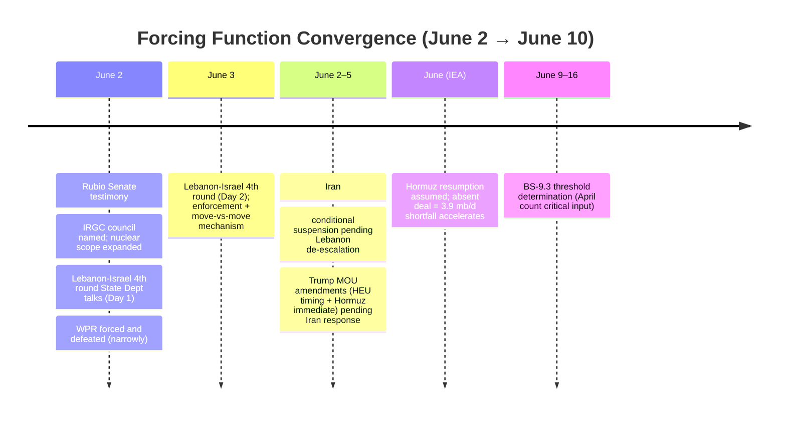
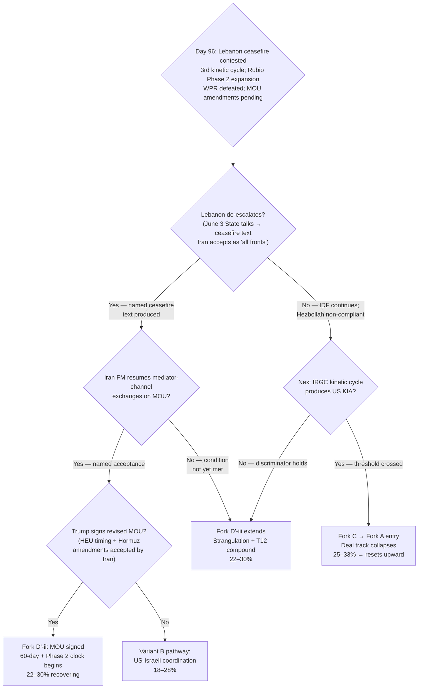

# Iran 2026 Operational SITREP — Daily Update
**Day 96 | Tuesday, June 2, 2026**
*Annex/Update to Iran 2026 Operational SITREP and Strategic Synthesis (base report v4.2)*

## Executive Summary

Secretary of State Rubio's Senate Foreign Relations Committee testimony (June 2, T1) delivered three framework-material findings in a single session: Mojtaba Khamenei is "alive and increasingly engaging" through writing and intermediaries; the IRGC council is the apex ratification authority ("what Araghchi and Ghalibaf take from us, they have to run back to this council"); and Iran has "agreed to negotiate aspects of their nuclear programme that just a month ago they were refusing to even mention" — Phase 2 now encompasses HEU disposition plus "severe and long-term limitations and/or cancellation of enrichment activity." Against this, Lebanon ceasefire implementation was immediately contested: the Israeli delegation at State Department June 2-3 talks confirmed Hezbollah non-compliance with Trump's announced halt; IDF operations continued past the Litani. A third US-IRGC kinetic exchange cycle materialized (US Hellfire on Iranian bulk carrier Lian Star → IRGC cruise missile on MSC Sariska V in Um-Qasr; all crew safe). The June 2 forced privileged WPR vote appears to have been held and defeated narrowly.

Supersedes `day-95` · A4 T1 validated · Fork D' HELD · Fork C upper range

| Vector | Direction | Driver |
|---|---|---|
| Rubio: IRGC council named | NEW | T1 US confirmation of ratification authority |
| Iran nuclear scope | EXPANDED | HEU + enrichment cancellation now Phase 2 topics (Rubio T1) |
| A4 Mojtaba status | UPDATED | Alive, increasingly engaging via writing/intermediaries (Rubio T1) |
| Lebanon ceasefire | CONTESTED | Israeli delegation: Hezbollah non-compliant; IDF continuing past Litani |
| 3rd kinetic cycle | NEW | Lian Star (Hellfire) → MSC Sariska V (cruise missile); crew safe |
| Qaani Bab al-Mandab | NAMED WARNING | Quds Force commander; T1 state media June 2 |
| Fork D' (30d) | 22–30% HELD | Lebanon clause blocking; Phase 2 scope positive but medium-term |
| Fork C (30d) | 25–33% HELD upper | 3rd cycle + Qaani named; KIA threshold not crossed |
| WPR June 2 | DEFEATED (M conf) | Forced privileged vote held and defeated; T9 disc-ratio 3:10 |
| Brent crude | ~$96.65 → ~$91 | Slipping on impasse signals; backwardation holds $29/bbl |

> Leading primitives: Fork D' 22–30% / 30d (held; highest-ranked primitive), Fork A 18–28% / 30d. Highest-delta this cycle: Phase 2 nuclear scope expansion (positive for Fork D' medium-term; not yet in 30d matrix). None-of-above floor: 5%.

---

## Section 1 — Operational Update

**Rubio Senate testimony (T1, June 2) is the cycle's dominant signal.** Testifying before the Senate Foreign Relations Committee in his first public appearance since the war began, Rubio stated Iran has agreed to negotiate "aspects of their nuclear programme that just a month ago, just a year ago, they were refusing to even mention"; Phase 2 encompasses HEU disposition AND "severe and long-term limitations and/or cancellation of enrichment activity"; technical talks would require expert teams for "30-, 60-, 90-day" periods. Rubio directly named the IRGC council as the apex ratification authority: "What Araghchi and Ghalibaf take from us, they then have to run back to this council" and "ultimately get guidance from them." He separately confirmed Mojtaba is "alive and increasingly engaging" via writing and intermediaries, characterizing negotiations as complicated by "the instability of Iran's leadership." Trump (Fox News, T1): deal is "not a simple thing."

**Source conflict on talks status: adjudicated.** Tasnim and Fars (T1 Iranian state, read against grain) reported Iran and the US "stopped exchanging messages several days ago." Rubio (T1): "talks ongoing despite state media claims." Trump (Truth Social, near-zero per discount): reports are "false and erroneous." Adjudication: Iran suspended formal mediator-channel exchanges (Day 95 confirmed); US characterizes direct/back-channel contact as continuing. Both claims are simultaneously true. The suspension is a conditional pause (Lebanon de-escalation condition), not a text rejection.

**Lebanon ceasefire implementation contested.** Trump announced June 1 that Israel-Hezbollah agreed to a full halt. At State Department June 2 talks (fourth Lebanon-Israel round), the Israeli delegation confirmed Hezbollah did not stop fighting and violated Trump's agreement. IDF June 2: warning Hezbollah members hiding in Tyre's Christian areas, signaling continuing operations north of the Litani. Lebanese Parliament Speaker Berri (Hezbollah ally): will guarantee Hezbollah adherence to a "global ceasefire" IF one is reached. Iran's talks-resumption condition (full Israeli withdrawal from Lebanon AND halt to all Lebanon and Gaza attacks) remains unmet. State Department talks continue June 3.

**Third kinetic cycle: commercial-vessel cross-targeting.** US forces struck Iranian bulk carrier M/V Lian Star with a Hellfire missile (Gulf of Oman; blockade enforcement after 20+ warnings). IRGC Navy retaliated with a cruise missile against MSC Sariska V (Panama-flagged container ship) in Um-Qasr port, Iraq; two projectiles hit; all crew safe. Qaani (IRGC Quds Force commander, Tasnim T1, June 2): Bab al-Mandab Strait will be treated "like the Strait of Hormuz" if Israeli Lebanon/Gaza operations continue. Iran separately announced "a retaliatory operation in the Sea of Oman." This is a new modality: commercial-vessel cross-targeting lies outside the existing PROBE-7 self-defense-vs-resumed-operations discriminator.

**Military / Maritime posture:**

| Asset / signal | Day 95 baseline | Day 96 read | Implication |
|---|---|---|---|
| CSG count in AOR | 3 (Lincoln, Bush, Ford) | 3 held | L1 stable |
| USS Eisenhower | Final preps, East Coast | No deployment order | L1 stable |
| 3rd kinetic cycle | Kuwait base strikes (June 1) | Lian Star Hellfire → MSC Sariska cruise missile | Commercial-vessel modality; no US KIA |
| Hormuz threat | Complete blockade vowed | Qaani: Bab al-Mandab named (June 2) | Quds Force commander; T1 state media |
| Lebanon: IDF | Past Litani; Beaufort Castle | Continuing past Litani; warning Tyre June 2 | Lebanon clause not bridged |
| Lebanon: bilateral | Talks scheduled June 2-3 | 4th round at State Dept; Hezbollah violations cited | Bridge candidate active |
| MOU text | Suspended exchange; Trump amendments sent | Iran reworking draft; Rubio: "talks ongoing" | Conditional suspension, not collapse |
| UK/France Hormuz | HMS Dragon + Charles de Gaulle | Unchanged | T11 multiplex indicator |

**Markets:**

| Asset | Pre-war (Feb 28) | Day 95 (June 1) | Day 96 (June 2) | Δ vs pre-war |
|---|---|---|---|---|
| Brent crude | $73 | ~$94.98 | ~$96.65 → ~$91 (slipping) | +25-30% |
| WTI crude | $70 | ~$89 est | ~$88 est | +26% |
| Brent backwardation (Jul26–Jul27) | flat | ~$29/bbl | ~$29/bbl | Tightness holds |
| Iranian rial parallel | ~960k/USD | ~1,709,000 | direction unclear | -44% |
| US gas / gallon | $3.27 | ~$4.20 est | ~$4.15 est | +27% |

Brent slipping toward $91 despite Rubio's optimistic framing — market weighting Lebanon suspension and impasse (PBS: "US-Iran talks at impasse over nuclear programme and Strait of Hormuz") over the Phase 2 scope expansion signal. Backwardation holds at $29/bbl: deal priced as possible, not certain.

**US domestic.** June 2 forced privileged WPR vote held and defeated narrowly (NBC: "fails by one vote"; PBS: "rejected in narrow vote"; The Hill: "resolution fails in House"; Time: "House Rejects War Powers Resolution"; M confidence pending roll-call confirmation). The forced-vote mechanism is dispositive: even compelled to a floor vote (cannot be canceled by GOP leadership under the privileged-resolution clock), the WPR failed. T9 disc-ratio 3:10. Democrats plan further forced votes ("poised to force repeated Iran war powers votes," The Hill).

**China.** No new banking cascade. NFRA private loan-freeze and MOFCOM blocking order dual-track unchanged. GL-V Hengli window live through approximately end of June; no OFAC action against major Chinese banks confirmed.

---

## Section 2 — Framework Validation

- **A4 (Iranian apex; T-anchor: T3):** Validated and refined. Rubio (T1, June 2) confirmed the IRGC council as apex ratification authority and Araghchi/Ghalibaf as mid-tier principals who carry proposals back to "this council." Mojtaba: confirmed alive, increasingly engaging through writing/intermediaries. This is the strongest external validation of the v4.2 A4 re-identification in the framework window.

- **A9 (constraints precede; actors select; T-anchor: T7):** IRGC executing cruise missile retaliation (MSC Sariska) while mid-tier simultaneously reworks MOU text. Deterrence-maintenance and deal-engagement remain simultaneously dominant strategies under separate constraint layers. The conjunction is not contradiction; it is the materialist prediction confirmed.

- **A22 (structured deferral as Trump dominant strategy; T-anchor: T3, T8):** Trump held deal-direction through Senate testimony; Lebanon dial-back instruction confirmed; "MOU within the next week" framing maintained.

- **A23 (diplomatic-spoiler as Netanyahu dominant strategy; T-anchor: T8):** IDF operations continuing past Litani on June 2; Israeli delegation at State Dept confirmed Hezbollah non-compliance — Netanyahu coalition using Lebanon theater to maintain leverage within the "limited without US permission" kinetic constraint.

---

## Section 3 — Framework Revisions Required

**TRIGGER FIRED — A4 language update required (PROBE-13, H, immediate).**

Prior: Mojtaba characterized as "incapacitated or nominal." Rubio (T1): "alive and increasingly engaging" through writing and intermediaries. Rubio separately confirmed IRGC council as ratification authority.

Revised: A4 updated at next `/revise` — Mojtaba: "nominally active through written communications via intermediaries; no visual/camera appearance." IRGC council: T1-confirmed ratification authority. The "incapacitated" characterization is too strong; replace with "incapacitation partially corrected: increasingly written-channel engagement within IRGC-council-mediated legitimacy-shield function." The v4-3 manifest consumes this update.

Trend cross-check: T3 ADVANCE. Rubio T1 naming of IRGC council as apex ratification authority is an external validation of the Fearon-Slantchev two-level structure the framework derived from T3 months earlier.

**TRIGGER FIRED — §5.26 Phase 2 scope update (PROBE-12', H, immediate).**

Prior: Phase 2 framed as HEU disposition negotiations. New signal: Rubio (T1, June 2) stated Phase 2 encompasses HEU disposition PLUS "severe and long-term limitations and/or cancellation of enrichment activity."

Revised: §5.26 updated at next `/revise` — Phase 2 is now a 30-90-day expert-team process covering: (a) HEU disposition, (b) enrichment-rate severe limitations, (c) enrichment cancellation as a negotiating item. The LOI's face-saving deferral function is larger than prior cycles recognized: Iran accepts enrichment cancellation as a negotiating topic (not a pre-commitment); the US can describe the Phase 2 scope as achieving its core objective. The binding signing obstacles (Lebanon clause; Trump HEU-timing and Hormuz-immediate amendments) are unchanged.

Trend cross-check: T3 ADVANCE; T8 HOLD.

**TRIGGER FIRED — Lebanon ceasefire contested; clause status: bridge candidate active (PROBE-9, H, immediate).**

Prior: §A23 confirmed; Lebanon clause executed through IDF operations; Iran talks suspended. New signal: Trump's June 1 ceasefire announcement partially operationalized (Beirut suburbs not struck as of June 2) but contested (Israeli delegation confirms Hezbollah non-compliance; IDF operations continuing). June 2-3 State Dept bilateral talks are the operative bridge candidate.

Revised: Lebanon clause status is now "contested ceasefire phase." The June 3 outcome is the next discriminating event: if bilateral talks produce a ceasefire text Iran can invoke as satisfying "all fronts," Fork D' recovers; if not, the suspension extends while strangulation and T12 clocks compound.

Trend cross-check: T8 ADVANCE; T4 ADVANCE (Trump-Netanyahu gap visible at delegation level).

**NOTED — Commercial-vessel modality (PROBE-7, H, next audit).**

The Lian Star → MSC Sariska V cycle is outside the PROBE-7 self-defense-vs-resumed-operations discriminator (designed for IRGC-strikes-on-US-military assets; not US-blockade-enforcement-on-Iranian-commercial-vessels). Flag for `/audit`: add commercial-vessel cross-targeting as a new PROBE-7 target signal and framework revision trigger category.

---

## Section 4 — Framework Additions

**Rubio's IRGC council naming as T1 discriminating evidence.** The Washington Examiner confirmed Rubio stated Araghchi and Ghalibaf "ultimately get guidance from" the IRGC council. This is the first T1 US Secretary of State characterization of the IRGC council as apex ratification authority. It does not name Vahidi specifically — the Vahidi-direct-HEU-statement criterion per the framework remains the discriminating signal for A4's HEU-specific attribution — but the council-as-ratification-authority is now T1-confirmed, not T3 analytical inference. Update required at next `/revise`.

**Phase 2 enrichment-cancellation scope.** Iran's willingness to negotiate enrichment cancellation as a Phase 2 topic (Rubio T1) raises the LOI's signing value: the text defers HEU and Hormuz collisions while Phase 2 encompasses the deepest possible nuclear limitation as the resolution target. Both sides can read a signed LOI as advancing their strategic objective without pre-committing to the outcome.

---

## Section 5 — Revised Probability Matrix

### 5a. 30-Day Matrix (cycle-Bayesian)

| Outcome | 30 days | vs. Day 95 | Driver |
|---|---|---|---|
| **Fork D': Structured deferral** | **22–30%** | HELD | Lebanon suspension ongoing; Trump MOU amendments pending; Phase 2 scope expansion positive but medium-term; June 3 bilateral talks are the near-term discriminating event |
| **Fork A: Kinetic resumption (composite)** | **18–28%** | HELD | Lebanon theater not nuclear; no Eisenhower deployment; deal-direction held |
| · Israeli pre-emption (14–21d) | 28–40% | HELD | Lebanon operations ongoing; nuclear pre-emption distinct; T8 maximum; Knesset pre-caretaker |
| · US Vahidi decapitation (standalone) | 5–12% | HELD | Target framing sharpened by A4 T1 validation |
| **Fork C: Miscalculation cascade** | **25–33%** | HELD upper | 3rd kinetic cycle; Qaani named Bab al-Mandab; commercial-vessel modality widens accident surface; KIA threshold not crossed |
| **Fork B-bilateral** | **8–13%** | HELD | Phase 2 scope expansion is positive medium-term; Lebanon + MOU amendments block near-term |
| **Fork B-multilateral via Gulf** | **8–12%** | HELD | Gulf brake silent on Lebanon; Pakistan active |
| **Combined Fork B** | **16–25%** | HELD | Phase 2 scope positive medium-term offset |
| **None of the above** | **5%** | HELD | Mandatory non-zero floor |

**Fork D' decomposition status.** Day 96 midpoint: ~26%, below 30%. Pre-staging candidates (carried from Day 93, updated):
- **D'-i:** Trump signs within 48h; Lebanon clause deferred via text ambiguity. Signal: Trump signing + Iranian FM named acceptance without Lebanon withdrawal condition.
- **D'-ii:** Lebanon bridged via June 3 State talks + Iran resumes exchanges. Signal: ceasefire text Iran invokes as "all fronts" + Araghchi named LOI acceptance.
- **D'-iii (current operative state):** Non-signing extends; back-channel contact ongoing; strangulation + T12 clocks compound. Signal: 72h+ without Iranian named acceptance.
- **D'-iv:** MOU signed with dual-reading text; competing US/Iran HEU characterizations. Signal: signed MOU + simultaneous contradictory statements on nuclear terms.
- **D'-v:** IRGC strike produces US KIA; Fork A entry from D' collapse. Signal: US KIA in next IRGC kinetic action.

> **KEC [DERIVED]:** ~46–63% (30d). Fork A 18–28% + Fork C 25–33% + tail (<2%). Held from Day 95. Primitives lead; composite is continuity footnote.

### 5b. 6/12-Month Matrix (structural-prior; no update this cycle)

| Outcome | 6 months | 12 months | Last updated | Driver |
|---|---|---|---|---|
| Fork A composite | 38–48% | 43–53% | v4.1 (Day 84) | Time arithmetic; T12 amplifier |
| Fork B-bilateral | 12–18% | 12–18% | v4.1 (Day 84) | Apex PA-gap constraint |
| Fork B-multilateral | 12–20% | 14–22% | v4.1 (Day 84) | Gulf pathway institutionalizing |
| Fork D' structured deferral | 18–24% | 12–18% | v4.1 (Day 84) | LOI expiration compresses |
| Fork C miscalculation cascade | 16–22% | 16–22% | v4.1 (Day 84) | Structural accident pathway |
| None-of-above | 10–15% | 10–15% | v4.2 (Day 88) | Mandatory non-zero floor |

---

## Section 6 — Probe Status Table

| PROBE | Status | Conf | Trigger | Variable Moved |
|---|---|---|---|---|
| 1 Mojtaba | partial | M | no | Alive, increasingly engaging (Rubio T1); writing/intermediaries only; no camera |
| 2 IRGC Factional | partial | M | no | Vahidi HEU-direct absent 9th+ cycle; Qaani named Bab al-Mandab |
| 6 Chinese Support | partial | M | no | NFRA/MOFCOM dual-track unchanged; no cascade |
| 7 CENTCOM Posture | fired | H | yes | 3rd kinetic cycle; commercial-vessel modality; Qaani named; no US KIA |
| 8 Oil Markets | partial | M | no | Brent ~$91 slipping; backwardation $29; impasse framing |
| 9 Israeli Internal | fired | H | yes | Lebanon ceasefire contested; IDF continuing; Lebanon clause not bridged |
| 10 War Powers | fired | M | yes | WPR forced and defeated (M conf); T9 disc-ratio 3:10 |
| 12' MOU Framework | fired | H | yes | Phase 2 scope expanded (Rubio T1); back-channel active; Fork D' held |
| 13 PA-Gap | fired | H | yes | A4 IRGC council T1 confirmed (Rubio); Mojtaba status updated; A2 8th+ cycle |
| 14 Iranian Residual | fired | H | yes | MSC Sariska cruise missile; Qaani named; T12 advance; no US KIA |
| 15 Dispositional | fired | M | yes | P-AIM moderating (nuclear scope expansion); Lebanon gap widening |
| 16 First-Mover | fired | H | yes | Joint distribution narrowing on kinetic/WPR axes; deal scope widening |
| 17 Russian Siloviki | partial | M | no | BS-9.3 approaching; May = 1; June = 0; April count unconfirmed |
| 20 Gulf Troika | partial | M | no | Gulf brake silent on Lebanon (2nd cycle confirmed); Rubio-Dar met |
| 21 Paine Death-Ground | partial | M | no | P-AIM positive (nuclear scope); P-DG not fired; P-OVEX advancing |

---

## Section 7 — Conclusion and Forking Analysis

### Central Thesis Check

The v4.0 central thesis holds at its sharpest external validation to date. The June 2 evidence cluster confirms the materialist bargaining model across all five constraint layers simultaneously: under L1 constraints, the IRGC can execute cruise missiles on commercial vessels while under L5 constraints, the IRGC council simultaneously reworks the MOU text; under L4 constraints, Netanyahu coalition continues Lebanon operations autonomous from US direction while under L4 constraints, Trump holds deal-direction through Senate testimony. No actor designed any of these combinations; each is the dominant strategy under its respective constraint layer, and each layer produces its outcome independently of the others. The Rubio T1 naming of the IRGC council as ratification authority is the most direct external validation of the v4.2 A4 re-identification in the framework window: the framework derived this structure from Fearon-Slantchev apparatus and T3 Iran International reporting months earlier; a T1 US Secretary of State has now confirmed it.

Trend-state lines: **T1 advance** (Gulf brake scope limit confirmed second cycle; Pakistan active). **T2 advance** (Mosaic-Octopus in commercial-maritime mode; Qaani named Bab al-Mandab). **T3 advance** (Rubio T1 confirms IRGC council as ratification authority; two-level structure externally validated at highest sourcing tier in the window). **T4 advance** (Trump-Netanyahu dispositional gap widening; deal-faction at Senate level; 8th+ cycle without §5.20 counter-mobilization). **T5 hold PENDING.** **T6 hold.** **T7 hold.** **T8 advance** (§A23 still operative; Lebanon operations continuing). **T9 advance** (WPR forced and defeated; disc-ratio 3:10). **T10 hold PENDING.** **T11 hold PENDING.** **T12 advance** (3rd kinetic cycle; commercial-vessel targeting; Qaani named Bab al-Mandab). No VALIDATED trend contradicted this cycle.

### Forking Tree (72-Hour Decision Path)

### Operative Judgment

The Rubio Senate testimony contains two independently important findings that the framework must track separately.

First: the IRGC council confirmation. Rubio's characterization — that Araghchi and Ghalibaf "run back to this council" for guidance — removes the last ambiguity about the v4.2 A4 re-identification. The framework derived the IRGC-council-as-functional-apex from Iran International T3 reporting and circumstantial inference; Rubio's T1 framing confirms the council structure at the US Secretary of State level. The practical implication is significant: a deal signed by Araghchi carries IRGC council authorization, not mere mid-tier credibility. This means the LOI architecture (§5.26) functions as designed — Ghalibaf and Araghchi can bind within the LOI framework on behalf of the council, deferring HEU and Hormuz details to Phase 2 expert talks, without requiring Vahidi or Mojtaba to make public concessions.

Second: Phase 2 enrichment-cancellation scope. Iran's willingness to negotiate enrichment cancellation as a Phase 2 topic changes the LOI's signing calculus for both sides. Under the dual-collision-deferral architecture, the LOI text needs to be genuinely ambiguous on both HEU and Hormuz; Phase 2 can then encompass enrichment cancellation as the substantive resolution target. Iran can sign the LOI claiming it preserved enrichment as a negotiating item; the US can claim it secured cancellation as a Phase 2 objective. The face-saving architecture is now more robust than prior weeks recognized. If Lebanon de-escalates and the MOU amendments are resolved, these two conditions — council authorization + enrichment cancellation as Phase 2 topic — provide the structural basis for a signed LOI that both sides can legitimately defend domestically.

The Lebanon clause is still the binding near-term obstacle. Iran's resumption condition (full Israeli withdrawal from Lebanon AND halt to all Lebanon and Gaza attacks) is specific, public, and not yet met. Trump's June 1 ceasefire announcement produced only a partial and contested de-escalation: Israeli delegation at State Department confirmed Hezbollah non-compliance; IDF operations north of Litani continued June 2. The June 3 bilateral talks are the discriminating event. Two bridge paths exist: (a) the bilateral produces a ceasefire enforcement text that Iran can invoke as satisfying "all fronts" without requiring a formal IDF stand-down — structurally weaker (Iran demanded withdrawal, not a mechanism), but possible if worded carefully; (b) the IDF-coalition asymmetry (Zamir: "if uranium removed diplomatically, we have done our part") surfaces and Netanyahu accepts a Lebanon halt before the caretaker threshold. Path (b) requires pre-caretaker Netanyahu to subordinate his coalition's Lebanon operational agenda to Trump's deal-direction — the framework prices this as low-probability without the Knesset dissolution reaching caretaker phase.

The commercial-vessel cross-targeting cycle (Lian Star → MSC Sariska V) introduces a potentially more destabilizing escalation modality than military-on-military exchange. Neutral commercial shipping is now a target, triggering insurance and underwriting pressure without requiring any additional IRGC operational decision. If Lloyd's suspends Gulf coverage or Hapag-Lloyd/Maersk reactivate their Gulf transit suspension, the market effect compounds the T12 strangulation clock independent of any named actor's choice.

### Signals That Force Immediate Revision

- Iran FM Araghchi issues named acceptance of MOU exchanges following Lebanese de-escalation: Fork D' recovers toward 28–36%
- Lebanon-Israel June 3 talks produce named ceasefire text Iran accepts as satisfying "all fronts": Lebanon clause bridged; Fork D'-ii opens
- IRGC executes a strike producing US KIA: Fork C resolves into Fork A entry; deal track collapses
- IDF halts operations past Litani + Beirut stand-down confirmed: Lebanon de-escalation signal; Iran resumption condition partially met
- Vahidi-direct named statement on HEU disposition: A4 apex attribution resolved on deal-determining axis; synthesis revision candidate
- Iran formally rejects the revised MOU text (named principal, not state media): Fork D' collapses to 10–18%; Fork A or C accelerates
- Bab al-Mandab operational closure confirmed: dual-chokepoint fires; Fork A repricing above $115; BS-7 step-function
- BS-9.3 threshold fires (April 2026 Putin appearances <2 confirmed): emergency synthesis review
- WPR passes a future House vote (forced or otherwise): T9 transitions to CONTESTED; Fork A foreclosed without new AUMF

---

*Compiled June 2, 2026 | Day 96 | Subject to revision as data updates*
*Next SITREP: Day 97 (June 3); monitoring: Lebanon-Israel talks Day 2 (June 3) ceasefire-text outcome; Iran talks-resumption condition; IDF Lebanon operational halt signal; Trump MOU signing decision; Vahidi-direct HEU statement; IRGC follow-on kinetic signal; Brent direction on deal signals; BS-9.3 April count retrieval (critical).*
*Companion: sweep-2026-06-02.json; synthesis-v4-2.md.*
