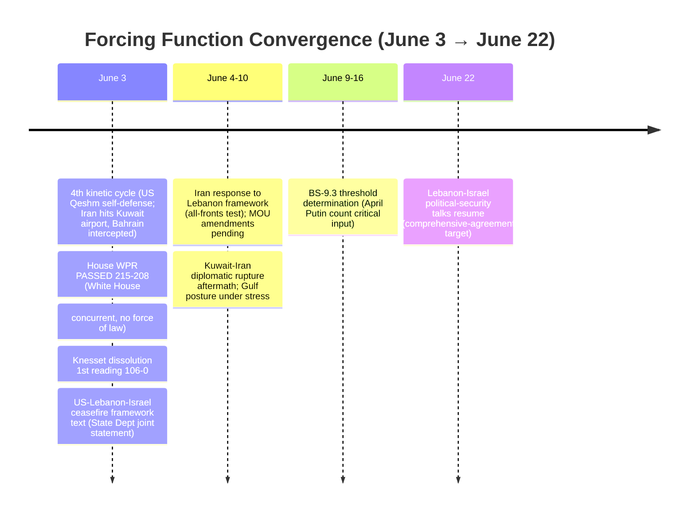
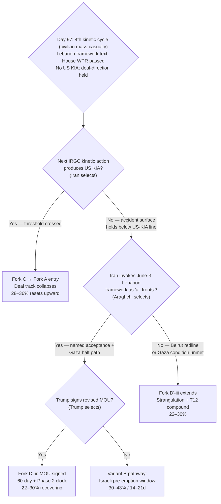

# Iran 2026 Operational SITREP — Daily Update
**Day 97 | Wednesday, June 3, 2026**
*Annex/Update to Iran 2026 Operational SITREP and Strategic Synthesis (base report v4.2)*

## Executive Summary

A fourth US-Iran kinetic cycle materialized June 3 and crossed a new threshold: the first civilian mass-casualty event of the conflict. After US forces downed three Iranian one-way attack drones said to be targeting civilian shipping, CENTCOM conducted self-defense strikes on an IRGC ground-control station and air-defense systems on Qeshm Island inside the Strait of Hormuz; the IRGC retaliated against the US Fifth Fleet at Bahrain (three missiles intercepted) and Iranian fire struck Kuwait International Airport's passenger terminal, killing one and wounding 63. Kuwait expelled two Iranian diplomats; the IRGC denied targeting the airport, attributing the damage to a malfunctioning US Patriot, a claim CENTCOM called false. Against this escalation, the diplomatic track produced its strongest single artifact to date: a US-Lebanon-Israel joint statement on a conditional Lebanon ceasefire framework, while the US House passed a War Powers Resolution 215-208 (first passage of the conflict) and the Knesset advanced dissolution on a 106-0 first reading. The two tracks diverged on separate constraint layers in the same cycle: Lebanon de-escalation via the State Department channel, Hormuz escalation via the maritime self-defense spiral.

Supersedes `day-96` · Fork C ↑ · 4th kinetic cycle (civilian mass-casualty) NEW · Lebanon framework text NEW · House WPR PASSED

| Vector | Direction | Driver |
|---|---|---|
| 4th kinetic cycle | NEW | US Qeshm self-defense strike → Iran hits Kuwait airport (1 dead, 63 wounded), Bahrain (intercepted) |
| Fork C (30d) | 25–33% → 28–36% | Civilian mass-casualty; Gulf-state victim; accident surface widens; no US KIA caps it |
| House WPR | PASSED 215-208 | First passage; 4 GOP; White House "concurrent, unconstitutional"; T9 disc-ratio 4:10 |
| Knesset dissolution | 1st reading 106-0 | Coalition collapse on Haredi draft; September elections; T8 maximum |
| Lebanon ceasefire | FRAMEWORK TEXT | US-Lebanon-Israel joint statement; Hezbollah-conditional; next talks June 22 |
| Iran talks status | SUSPENDED (conditional) | Araghchi: no formal process, messages continue; Beirut redline |
| BS-1b bazaar | NEW SIGNAL | Bazaar closures, rial collapse, oil 5% of budget (17+ null cycles broken) |
| Brent crude | ~$91 → $97.81 | Slip reversed on Netanyahu "ready to strike," kinetic cycle |
| Fork D' (30d) | 22–30% HELD | Lebanon framework (+) offsets kinetic escalation (−) |

> Leading primitives: Fork C 28–36% / 30d, Fork D' 22–30% / 30d. Highest-delta this cycle: Fork C ↑. None-of-above floor: 5%.

---

## Section 1 — Operational Update

**Diplomatic track produced a Lebanon ceasefire framework text while the Iran-US channel held in conditional suspension.** A US-Lebanon-Israel joint statement (T1, State Department) set a conditional framework: a "complete cessation of Hezbollah fire and the evacuation of all Hezbollah operatives from the South Litani Sector," plus "pilot zones" of exclusive Lebanese Armed Forces control excluding all non-state actors; next political-security talks the week of June 22. Araghchi (T1, June 3): "no significant progress" with the US over recent days; "There is no formal negotiation process underway between Iran and the United States. However, messages continue to be exchanged"; any Israeli attack on Beirut would trigger a "full-scale resumption." Iran's "all fronts" resumption condition (Lebanon withdrawal plus halt to Lebanon and Gaza attacks) is not yet named as satisfied; the Lebanon framework is a bridge candidate, not a bridge.

**Trump posture held deal-direction and rejected collapse reporting.** Trump (T1) reaffirmed an MOU to reopen Hormuz "within the next week" and pushed back on reports the US-Iran talks had collapsed. He separately warned of "a full scale return to military action" if necessary (relayed via Netanyahu, below). Per discount rule, the diplomatic optimism carries near-zero weight without tape action; the operative tape this cycle is kinetic, not diplomatic.

**A fourth kinetic cycle escalated the maritime theater into civilian mass-casualty for the first time.** US forces downed three Iranian one-way attack drones said to be targeting civilian shipping; CENTCOM then conducted self-defense strikes on Qeshm Island (air-defense systems, a drone ground-control station, two attack drones). The IRGC claimed retaliation against the US Fifth Fleet at Bahrain and a regional airbase; three missiles at Bahrain were intercepted by US and Bahraini air defense. Iranian fire struck Kuwait International Airport, killing one (an Indian national) and wounding 63. Attribution conflict: CENTCOM (T1) called it a "deliberate, calculated and unjustified attack"; the IRGC (T1) denied targeting the airport, blaming a malfunctioning US Patriot. Adjudication: Iranian fire caused the damage at H confidence (CENTCOM plus Kuwaiti FM attribution; Kuwait expelled two Iranian diplomats, an act it would not take over a US Patriot malfunction); the IRGC denial reads as an off-ramp narrative to avoid owning a Gulf-civilian massacre. Per the PROBE-7 Day-90 discriminator, the US Qeshm strike scores as self-defense (Fork C nudge), not a Fork A resumption: self-defense framing, reactive to a named provocation, no new operation name, no offensive ROE shift, deal-direction concurrent. No US KIA.

**Iranian internal stress surfaced as the first BS-1b transmission signal in 17-plus null cycles.** Iran International (T3, -50% discount) reported continuing bazaar merchant shutdowns ("vowed to continue"), nationwide strikes and demonstrations turning violent in several cities, driven by rial collapse and dollar surge. Structural corroboration: oil revenue fell to 5% of the 2026-2027 budget (from 32%), the lowest since the 1960s. Pezeshkian, having submitted then publicly denied a resignation (May 31-June 1), warned that "key parts of power were now under the control of a group of Revolutionary Guard commanders" and that state administration had "deviated from official channels." Vahidi (date uncertain, surfaced this window): "In wartime, the IRGC selects leadership, not the president." Confidence M; this is a provisional first signal, not a confirmed full Tehran Grand Bazaar closure.

**Israel advanced Knesset dissolution and signaled renewed strike readiness.** The dissolution bill passed committee 9-0 (June 1) and a first plenary reading 106-0 (June 3); the coalition collapsed over the Haredi conscription-exemption failure (UTJ initiated), with elections likely September 2026 and two more readings required. Netanyahu (T1, CNBC June 3): Iran is "playing with fire"; "Israel is ready and the U.S. forces are ready" to strike again, with the decision "up to President Donald Trump." No IDF air-refueling tempo escalation or F-35/F-15 forward-positioning reported; the signal is rhetorical, not operational.

**Lebanon proxy front stayed kinetically active during the ceasefire-framework talks.** A Hezbollah drone strike near Beaufort Castle killed one Israeli soldier and wounded three June 2 (IDF T1; Al Jazeera T2); the IDF said Hezbollah fire compelled it to "act forcefully." The Lebanese channel remains operationally alive even as the framework text was drafted, consistent with the predicted multi-channel behavior.

**Markets reversed the Day-96 slip on the kinetic cycle and Netanyahu strike-readiness signaling.**

| Asset | Pre-war (Feb 28) | Day 96 (June 2) | Day 97 (June 3) | Δ vs pre-war |
|---|---|---|---|---|
| Brent crude | $73 | ~$91 (slipping) | $97.81 (settle, +~2%) | +34% |
| WTI crude | $70 | ~$88 est | $96.02 (settle, +>2%) | +37% |
| Brent backwardation (Jul26–Jul27) | flat | ~$29/bbl | ~$29/bbl (carry) | Tightness holds |
| Iranian rial parallel | ~960k/USD | direction unclear | under pressure (bazaar unrest) | -44%+ |
| US gas / gallon | $3.27 | ~$4.15 est | ~$4.15 est | +27% |

Brent recovered $91 → $97.81 on the Qeshm/Kuwait/Bahrain cycle plus Netanyahu's CNBC strike-readiness remarks; the Day-96 deal-optimism slip reversed. Backwardation holds ~$29/bbl: physical tightness persists; Hormuz throughput remains near 5% of pre-war.

**US domestic: the House passed a War Powers Resolution for the first time in the conflict.** The House passed the WPR 215-208 (T2 multi-outlet: NPR, PBS, CNN, WaPo, Al Jazeera); four Republicans crossed (Barrett MI, Davidson OH, Fitzpatrick PA, Massie KY), up from the June-2 narrow failure (213-214) as Davidson was added. White House (T1 official): "This will not reach the president's desk for signature"; the measure (H.Con.Res, concurrent) has "no force of law" and concurrent resolutions are "unconstitutional"; Senate passage "highly unlikely." Democrats characterized the vote as "mostly symbolic."

**International: Gulf states absorbed an Iranian civilian strike; the Abraham Accords demand stayed unanswered.** Kuwait (GCC, outside the MBS-MBZ-Tamim troika) became the first Gulf state with civilian fatalities from Iranian fire and summoned/expelled Iranian diplomats. No named MBS, MBZ, or Tamim response to Trump's June-2 Abraham Accords "mandatory" demand through June 3; reporting (Axios, -50% on unnamed US-official cluster) describes Gulf leaders as "stunned." No OFAC action against major Chinese banks post-GL-V; MOFCOM blocking order in force; Putin BS-9.3 April/May appearance count unresolved (May 8 Lukashenko dinner plus May 9 Victory Parade place May at 1-2, not clearly below threshold).

---

## Section 2 — Framework Validation

- **A9 (constraints precede; actors select; T-anchor T7):** The Lebanon framework (State-Department/L4 faction channel) and the Hormuz escalation (L1/L2 maritime self-defense spiral) moved in opposite directions in the same cycle. Each is the dominant strategy under its own constraint layer; no actor designed the conjunction. Materialist multi-layer prediction confirmed at maximum resolution.
- **A4 (Iranian apex; T-anchor T3):** Vahidi's "the IRGC selects leadership, not the president" plus Pezeshkian's public IRGC-takeover warning add governance-axis discriminating evidence for the IRGC-council functional-apex reading. Holds the Day-96 Rubio T1 confirmation.
- **A23 (diplomatic-spoiler as Netanyahu dominant strategy; T-anchor T8):** Netanyahu's CNBC strike-readiness signaling, with the decision routed to Trump, sustains the spoiler posture within the "limited without US permission" kinetic constraint.
- **A2-class (Mosaic-Octopus calibration; T-anchor T2):** The IRGC denial of the Kuwait civilian hit is itself a calibration signal: even mid-escalation, Iran manages the Gulf relationship to keep the troika a brake rather than a belligerent.

---

## Section 3 — Framework Revisions Required

**TRIGGER FIRED — Fourth kinetic cycle; Fork C up; civilian mass-casualty threshold crossed (PROBE-7 / PROBE-14, H, immediate).** Prior (Day 96): Fork C 25–33% HELD upper; commercial-vessel modality flagged as outside the PROBE-7 discriminator. New: US Qeshm self-defense strike → Iran retaliation on Bahrain (intercepted) and Kuwait International Airport (1 dead, 63 wounded; attribution contested, adjudicated to Iranian fire at H). The civilian mass-casualty event widens the accident surface materially; the US-KIA threshold (Fork C → Fork A entry) was NOT crossed, so the deal track is stressed, not collapsed. Revised: Fork C 25–33% → 28–36% (30d). Trend cross-check: T2 ADVANCE (Iran denies civilian hit to manage Gulf relationship), T12 ADVANCE (reconstitution-speed amplifier demonstrated through continued use). Note: the SITREP-search finding supersedes the same-cycle sweep's PROBE-7/14 "no new strikes" read, which pre-dated the Qeshm/Kuwait cycle.

**TRIGGER FIRED — House WPR passage 215-208; T9 disc-ratio increments (PROBE-10, H, immediate).** Prior: WPR failing in both chambers; T9 disc-ratio 3:10. New: first House passage of the conflict (four GOP defectors). Revised: T9 disc-ratio 3:10 → 4:10, crossing the 1:3 threshold and firing a `/premortem` trend-rigidity review for T9. T9 holds VALIDATED: the White House "concurrent resolution, no force of law, unconstitutional" framing is itself a Stage-2-hysteresis assertion (the executive denies the resolution can bind), and T9 falsification requires both chambers plus veto-override. This is a single discounted-contradicting cycle, not a demotion. Trend cross-check: T9 ADVANCE on the executive-assertion dimension; contradict-single on the passage dimension. BS-15: WPR passage symbolically constrains the US Fork A path while raising the relative value of Israeli unilateral pre-emption.

**TRIGGER FIRED — Knesset dissolution first reading 106-0; Netanyahu strike-readiness (PROBE-9, H, immediate).** Prior: dissolution at preliminary reading only; Netanyahu pre-caretaker authority intact. New: committee 9-0 plus first plenary reading 106-0; Netanyahu CNBC strike-readiness with the decision routed to Trump. Revised: election horizon approaching lock (September 2026); Netanyahu's pre-caretaker operational-authority window compressing; two more readings required. Trend cross-check: T8 ADVANCE (Powell amplifier at maximum loading; pre-emption incentive rising as deal-direction holds and the election clock tightens).

**TRIGGER FIRED — Lebanon ceasefire framework text; Lebanon clause partially bridged (PROBE-9, H, immediate).** Prior (Day 96): "contested ceasefire phase"; IDF past Litani; Hezbollah non-compliant. New: US-Lebanon-Israel joint statement (T1) sets a conditional framework (Hezbollah cessation + south-Litani evacuation; LAF pilot zones; next talks June 22). Revised: Lebanon clause status → "conditional framework text exists, not yet operationalized; Iran has not named it as satisfying 'all fronts'." This is a Fork D' positive that offsets the kinetic-cycle negative; net Fork D' HELD 22–30%. Trend cross-check: T4 ADVANCE (deal-faction active at executive/State channel), T11 ADVANCE (multilateral framework).

**TRIGGER FIRED — BS-1b first transmission signal in 17-plus null cycles (PROBE-3, M, immediate).** Prior: BS-1b structurally opaque (10–15% visibility). New: bazaar shutdowns, nationwide unrest, rial collapse, oil at 5% of budget. Revised: BS-1b status from "structurally opaque" to "first provisional signal surfaced; M confidence; escalate monitoring." Strangulation transmission partially visible; BS-15 Iran-side first-mover threshold advancing, not breached (requires T1/T2 corroboration). Trend cross-check: holds the L3 time-arithmetic prediction; flagged for `/audit` BS-1b status update.

**FLAG (NEXT AUDIT) — BS-18 Gulf-state-as-victim pathway; attribution contested.** The Kuwait civilian-casualty event plus the Kuwait-Iran diplomatic rupture is a stressor on the Gulf-Iran accommodation logic, analogous to the MBZ Barakah-exposure pathway but realized for a non-troika GCC state and with contested attribution (IRGC denial). Do not over-read on single-cycle, attribution-contested evidence (canonical D77/D84 lesson). Flag for audit: whether the "Gulf infrastructure attack" trigger family extends to civilian-aviation targets, and whether the Iranian-denial de-escalation sub-pattern dampens or sharpens Gulf brake-decay.

**NOTED — A2 effectively archived; A4 governance-axis discrimination (PROBE-13, M, next cycle).** The Netanyahu-relayed Trump maximalist-assurance attribution (A2) reaches a 9th-plus cycle without White House corroboration while Trump's executive advanced a Lebanon framework; A2 is functionally contradicted and flagged for archival at next `/revise`. A4 governance-axis now partially discriminated by the Vahidi statement plus Pezeshkian corroboration; HEU-specific axis still requires a Vahidi-direct named statement.

---

## Section 4 — Framework Additions

**Neutral/civilian accident-surface expansion as a Fork C structural amplifier.** Across two consecutive cycles the maritime-and-Gulf theater has expanded the set of targets that produce escalation without requiring an additional principal decision: Day-96 commercial-vessel cross-targeting (Lian Star → MSC Sariska V) and Day-97 civilian-airport casualties (Kuwait). This is now a repeating mechanism, not a one-off, and it changes Fork C mechanics: insurance, underwriting, and third-state diplomatic reactions can compound the strangulation and escalation clocks independent of any named actor's choice.

| Property | Reading |
|---|---|
| Trigger threshold | Below principal-decision level; spirals from self-defense ROE and proxy/territorial fire, not a campaign order |
| Third-party drag | Neutral shippers, Gulf-state civilians, foreign nationals (Indian citizen killed) pull non-belligerents toward the conflict |
| Attribution ambiguity | Contested attribution (IRGC Patriot-malfunction denial) is now a standing feature; cluster-laundering and over-read risk both rise |
| De-escalation sub-pattern | Iranian denial of civilian hits signals intent to cap Gulf-relationship damage (T2 Mosaic-Octopus calibration), a partial brake inside the amplifier |

---

## Section 5 — Revised Probability Matrix

### 5a. 30-Day Matrix (cycle-Bayesian)

| Outcome | 30 days | vs. Day 96 | Driver |
|---|---|---|---|
| **Fork C: Miscalculation cascade** | **28–36%** | 25–33% → 28–36% ↑ | 4th kinetic cycle; civilian mass-casualty; Gulf-state victim; accident surface widens; no US KIA caps it |
| **Fork D': Structured deferral** | **22–30%** | HELD | Lebanon framework (+) offsets kinetic escalation (−); Araghchi messages-continue |
| **Fork A: Kinetic resumption (composite)** | **18–28%** | HELD | Qeshm = self-defense per discriminator, not resumption; deal-direction held |
| · Israeli pre-emption (14–21d) | 30–43% | HELD upper | Netanyahu CNBC strike-readiness; T8 maximum; Knesset compressing |
| · US Vahidi decapitation (standalone) | 5–12% | HELD | A4 target framing sharpened by governance-axis discrimination |
| **Fork B-bilateral** | **8–13%** | HELD | Phase 2 scope (+) medium-term; Lebanon + kinetic block near-term |
| **Fork B-multilateral via Gulf** | **8–12%** | HELD | Gulf brake stressed by Kuwait casualties |
| **Combined Fork B** | **16–25%** | HELD | Medium-term scope offset |
| **None of the above** | **5%** | HELD | Mandatory non-zero floor |

**Fork D' decomposition status.** Not triggered. Day-97 midpoint ~26% (below 30%); only 1 of the last 4 cycles (Day 93) crossed the 30% midpoint, so the 2-of-4 pre-staging condition is not met. Candidate variants (D'-i signing within 48h; D'-ii Lebanon-framework-invoked resumption; D'-iii non-signing extension; D'-iv dual-reading text; D'-v IRGC-strike-to-US-KIA collapse) carried from Day 96 without adoption.

> **KEC [DERIVED]:** ~48–66% (30d). Fork A 18–28% + Fork C 28–36% + tail (<2%). Up from ~46–63% on the Fork C up-move. Primitives lead; composite is a continuity footnote.

### 5b. 6/12-Month Matrix (structural-prior; no update this cycle)

| Outcome | 6 months | 12 months | Last updated | Driver |
|---|---|---|---|---|
| Fork A composite | 38–48% | 43–53% | v4.1 (Day 84) | Time arithmetic; T12 amplifier |
| Fork B-bilateral | 12–18% | 12–18% | v4.1 (Day 84) | Apex PA-gap constraint |
| Fork B-multilateral | 12–20% | 14–22% | v4.1 (Day 84) | Gulf pathway institutionalizing |
| Fork D' structured deferral | 18–24% | 12–18% | v4.1 (Day 84) | LOI expiration compresses |
| Fork C miscalculation cascade | 16–22% | 16–22% | v4.1 (Day 84) | Structural accident pathway |
| None-of-above | 10–15% | 10–15% | v4.2 (Day 88) | Mandatory non-zero floor |

---

## Section 6 — Probe Status Table

| PROBE | Status | Conf | Trigger | Variable Moved |
|---|---|---|---|---|
| 1 Mojtaba | partial | M | no | No visual/death confirmation; Pezeshkian drama corroborates nominal status |
| 2 IRGC Factional | fired | M | yes | Vahidi governance statement; A4 governance-axis discrimination |
| 3 Bazaari/Bonyad | fired | M | yes | BS-1b first signal in 17+ cycles; bazaar closures; oil 5% of budget |
| 6 Chinese Support | partial | M | no | No bank cascade; MOFCOM/OFAC dual-track unchanged |
| 7 CENTCOM Posture | fired | H | yes | 4th kinetic cycle; Qeshm self-defense; Kuwait civilian casualties; no US KIA |
| 8 Oil Markets | partial | M | no | Brent $97.81 (slip reversed); backwardation ~$29 |
| 9 Israeli Internal | fired | H | yes | Knesset dissolution 106-0; Lebanon framework text; Netanyahu strike-readiness |
| 10 War Powers | fired | H | yes | House WPR PASSED 215-208; T9 disc-ratio 4:10; /premortem flag |
| 12' MOU Framework | partial | M | no | No named Iranian LOI response; messages continue; conditional suspension |
| 13 PA-Gap | fired | M | yes | A4 governance-axis discriminated; A2 effectively archived |
| 14 Iranian Residual | fired | H | yes | Kuwait/Bahrain Iranian fire; Qaani threat standing; T12 advance |
| 15 Dispositional | fired | M | yes | WPR symbolic constraint + Netanyahu strike-readiness; T8 maximum |
| 16 First-Mover | fired | H | yes | 3 simultaneous threshold advances; most complex single-cycle state |
| 17 Russian Siloviki | partial | M | no | BS-9.3 April/May count unresolved (May 8 + May 9 = 1-2) |
| 18 Eschatological | partial | M | no | Temple Mount Tier-2 (prayer pages + draft legislation); no convergence |
| 20 Gulf Troika | partial | M | no | No named Accords response; Kuwait civilian-casualty stressor |
| 21 Paine Death-Ground | partial | M | no | P-INFO advancing (institutional exclusion of elected government) |

*Note: the same-cycle sweep (`sweep-2026-06-03.json`) scored PROBE-7 and PROBE-14 partial under a "no new June-3 strikes" read; the SITREP search surfaced the June-3 fourth kinetic cycle that post-dated the sweep. Both are corrected to fired/H here. PROBE-18 and PROBE-20 retain the sweep's numbering (the sweep ran 17 probes; PROBE-18 was logged as eschatological in this annex per Appendix B).*

---

## Section 7 — Conclusion and Forking Analysis

### Central Thesis Check

The v4.0 central thesis holds with structural elaboration. The defining feature of Day 97 is layer-divergence in a single cycle: Lebanon de-escalation through the L4 faction channel (State Department, Netanyahu government, Lebanese delegation) and Hormuz escalation through the L1/L2 maritime self-defense spiral (drone intercepts, Qeshm self-defense strikes, Iranian retaliation) moved in opposite directions simultaneously. No principal designed the conjunction; each is the dominant strategy under its own constraint layer. The civilian mass-casualty event adds a structural amplifier (the neutral/civilian accident surface) that compounds Fork C independent of any named actor's selection, while Iran's denial of the Kuwait hit shows the same actor calibrating to cap Gulf-relationship damage. Trend-state lines: **T1 advance** (Pakistan/Lebanon multilateral channels; Gulf brake stressed but intact), **T2 advance** (Mosaic-Octopus calibrated; Iran denies civilian hit; Hezbollah operational), **T3 advance** (A4 governance-axis discriminated via Vahidi + Pezeshkian), **T4 advance** (deal-faction at executive/State; WPR passage; no §5.20 counter-mobilization), **T5 hold PENDING** (Temple Mount Tier-2 only; no convergence), **T6 hold** (BS-9.3 unresolved), **T7 hold** (voice discipline maintained), **T8 advance** (Knesset dissolution + Netanyahu strike-readiness; Powell maximum), **T9 advance/contradict-single** (WPR passed House; disc-ratio 4:10; /premortem flag; VALIDATED holds), **T10 hold PENDING**, **T11 advance** (Lebanon multilateral framework), **T12 advance** (4th kinetic cycle; reconstitution amplifier used). No VALIDATED trend contradicted at the falsification level this cycle.

### Operative Judgment

The single most important read for the next 48-72 hours is that the conflict crossed a civilian mass-casualty threshold without crossing the US-KIA threshold, and those two facts pull in opposite directions. The Kuwait airport strike tightens the prior on Fork C: the accident surface now includes neutral shipping and Gulf-state civilians, and third-party drag (Kuwait's diplomatic rupture, an Indian national killed, insurance and underwriting pressure) compounds escalation without requiring any principal to order a campaign. Yet the absence of US fatalities, the CENTCOM self-defense classification, and Trump's held deal-direction keep Fork A from resetting: under the PROBE-7 discriminator, Qeshm is a self-defense node, not a resumption. The dominant near-term collapse mechanism remains the Israeli pre-emption variant, not US-initiated Fork A, and Netanyahu's CNBC signaling plus the 106-0 Knesset dissolution loaded the Powell amplifier further while routing the decision explicitly to Trump.

For Iran, two signal clusters tightened opposing priors. The IRGC's denial of the Kuwait civilian hit, against a contested-attribution backdrop, reads as calibration to keep the Gulf troika a brake rather than a belligerent, a T2 Mosaic-Octopus behavior that loosens the prior on a Gulf-pivot-to-belligerent. Against that, the bazaar-closure and rial-collapse signals (the first BS-1b transmission in 17-plus cycles) tighten the prior on internal strangulation pressure reaching the apex decision set, even discounted to M confidence. The governance-axis discrimination on A4 (Vahidi plus Pezeshkian) confirms the IRGC-council functional apex but leaves the HEU-specific axis open; an Araghchi LOI move, if it comes, would carry council authorization, not mere mid-tier credibility.

The binding observable is whether Araghchi names the June-3 Lebanon framework as satisfying the "all fronts" condition. The framework text exists but is Hezbollah-conditional and silent on Gaza; Araghchi's "messages continue, no formal process, Beirut redline" posture is consistent with a principal holding the suspension as leverage while keeping the channel open. If the Lebanon framework operationalizes and the Gaza condition is bridged, Fork D' recovers toward signing; if the next IRGC kinetic action produces a US fatality, the accident surface converts Fork C into Fork A entry and the deal track collapses. Both paths are live; selection by Araghchi, Trump, and the IRGC council remains contingent.

### Signals That Force Immediate Revision

- IRGC kinetic action producing US KIA: Fork C resolves into Fork A entry; deal track collapses; matrix resets upward.
- Araghchi names the June-3 Lebanon framework as satisfying "all fronts" plus a Gaza-halt path: Fork D' recovers toward 28–36%; D'-ii opens.
- A second Iranian strike with Gulf-state civilian casualties (Saudi, UAE, Qatar, Kuwait, Bahrain): BS-18 brake-fracture test fires; Fork A re-elevates on Gulf hardening.
- Trump signs revised MOU (HEU-timing + Hormuz amendments accepted by Iran): Fork D'-ii; 60-day + Phase 2 clock begins.
- Israeli IDF air-refueling tempo or F-35/F-15 forward-positioning escalation: Israeli pre-emption variant moves from rhetorical to operational; Variant B re-prices.
- Vahidi-direct named statement on HEU disposition: A4 HEU-axis resolved; synthesis revision candidate.
- Senate schedules a WPR on-merits vote (Fetterman pivot or 3+ GOP defectors): T9 transitions toward CONTESTED; Fork A foreclosed without new AUMF.
- Bab al-Mandab operational closure confirmed (Qaani threat executed): dual-chokepoint fires; Brent repricing above $115; BS-7 step-function.
- BS-9.3 fires (April 2026 Putin appearances <2 confirmed): emergency synthesis review.
- Tehran Grand Bazaar full closure confirmed at T1/T2: BS-1b activates; BS-15 Iran-side first-mover threshold breached; strangulation timeline compresses.

---

*Compiled June 3, 2026 | Day 97 | Subject to revision as data updates*
*Next SITREP: Day 98 (June 4); monitoring: Iran response to Lebanon framework (all-fronts test); follow-on IRGC kinetic signal and US-KIA line; Kuwait-Iran rupture aftermath and Gulf posture; Trump MOU signing decision; Senate WPR scheduling; Vahidi-direct HEU statement; BS-9.3 April count retrieval (critical); Brent direction.*
*Companion: sweep-2026-06-03.json; synthesis-v4-2.md.*
